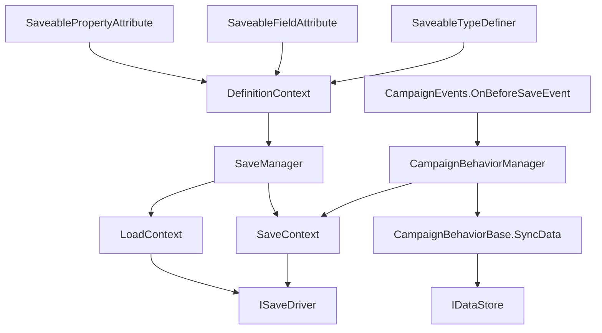

# SaveManager

**Namespace:** `TaleWorlds.SaveSystem`  
**Module:** `TaleWorlds.SaveSystem`  
**Type:** `public static class SaveManager`  
**Base:** `System.Object`  
**Source:** `bin/TaleWorlds.SaveSystem/TaleWorlds.SaveSystem/SaveManager.cs`

## Overview and one-sentence role

`SaveManager` coordinates one complete save or load: it collects save definitions from current assemblies, asks a context to traverse the root object graph, then lets an `ISaveDriver` persist or read the data. It is neither an inheritable mod service nor a per-Behavior save button.

## Mental model: ownership by layer

Separate the pipeline into four layers before deciding where code belongs:

1. **Definition layer.** `InitializeGlobalDefinitionContext()` creates the global `DefinitionContext` and calls `FillWithCurrentTypes()`. The scan instantiates non-abstract [SaveableTypeDefiner](../SaveableTypeDefiner) types in loaded assemblies, initializes each definer, then fills basic, class, struct, interface, enum, root-class, generic-struct, generic-class, and container definitions in order; conflict resolvers run **after** container definitions.
2. **Object-graph layer.** `Save(target, ...)` creates a `SaveContext` from validated definitions and collects saveable members and references from `target`; `Load(...)` creates a fresh definition context and `LoadContext` for that operation and restores the root.
3. **Storage layer.** `ISaveDriver` owns physical name, metadata, and byte-data I/O. `SaveManager` gives it version 1, `MetaData`, and `SaveData`, then exposes success, failure, or an in-progress result through `SaveOutput`.
4. **Campaign Behavior layer.** [CampaignBehaviorManager](../../campaign/CampaignBehaviorManager) clears transient records on `OnBeforeSave` and calls [CampaignBehaviorBase](../../campaign/CampaignBehaviorBase) `SyncData(IDataStore)` for every behavior; on load it restores data by the behavior's `StringId`. This is the normal persistence route for a campaign mod's private state.

So, **when a campaign feature needs a small amount of state**, register a `CampaignBehaviorBase` and use [IDataStore](../../campaign/IDataStore). **When a new reachable object type must participate in the object graph**, implement a `SaveableTypeDefiner`, mark members with `SaveableFieldAttribute` or `SaveablePropertyAttribute`, and preserve their IDs. **Do not use `SaveManager`** to read or write a campaign save from an event callback; the safe alternative is to let the game's campaign save flow call the behavior.

## Dependency map



- **Type definitions:** [SaveableTypeDefiner](../SaveableTypeDefiner) supplies type/container save IDs; [SaveableFieldAttribute](../SaveableFieldAttribute) and [SaveablePropertyAttribute](../SaveablePropertyAttribute) carry a member's `LocalSaveId`.
- **Campaign bridge:** [CampaignBehaviorBase](../../campaign/CampaignBehaviorBase), [CampaignBehaviorManager](../../campaign/CampaignBehaviorManager), [IDataStore](../../campaign/IDataStore), and [CampaignEvents](../../campaign/CampaignEvents) bring behavior state into the campaign root graph.
- **Same module:** [SaveContext](../SaveContext), [LoadContext](../LoadContext), [ISaveDriver](../ISaveDriver), [SaveOutput](../SaveOutput), and [LoadResult](../LoadResult) represent collection, restoration, I/O, and results.

## Key members and timing

### Initialization and checking: `InitializeGlobalDefinitionContext`, `CheckSaveableTypes`

`InitializeGlobalDefinitionContext()` replaces the global definition context and prints any definition errors it finds. `Save(...)` calls it when no context exists. If the context has errors, saving never starts object-graph traversal: every message becomes a `SaveError` in a failed `SaveOutput`.

`CheckSaveableTypes()` is a pre-release diagnostic, and its timing precondition is strict: call it only after `InitializeGlobalDefinitionContext()` (or the host's equivalent save-system initialization) has completed. It directly dereferences the global `_definitionContext` while inspecting instance fields and properties in loaded assemblies; calling it before that definition context exists can null-reference. `Save(...)` has a lazy initialization branch, but `CheckSaveableTypes()` does not, so do not use this diagnostic as an early-startup probe. Once the context is initialized, a type marked through `SaveableFieldAttribute` or `SaveablePropertyAttribute` is returned when it lacks a definition, is not an interface, and has a `FullName`, with duplicates removed by `Type`. It is **not limited to value types**: a custom reference type such as `LedgerState` in an annotated field is returned just like an `int` when the current definition context does not know it. The list identifies “this member says it is saveable, but the definition layer does not know its type.” It does not register anything or repair duplicate IDs.

A `SaveableTypeDefiner` combines its `saveBaseId` with each `saveId` to form type IDs, while fields and properties carry their own `LocalSaveId`. IDs, keys, and field types are long-lived data protocol. After release, they cannot be freely reordered as implementation details without changing how old saves are interpreted.

### Saving: `Save`

`Save` first clears its loading flag and records the application version from `MetaData`. With valid definitions it creates a `SaveContext`; only if `saveContext.Save(target, metaData, out errorMessage)` succeeds does it call `driver.Save(saveName, 1, metaData, saveContext.SaveData)`.

The driver returns `Task<SaveResultWithMessage>`. If the task is already complete, `Save` reads `task.Result` inside its own `try/catch`: a non-success result becomes a failed `SaveOutput`, while an exception from the synchronous `driver.Save(...)` call or that immediate `Result` access becomes `GeneralFailure`. If the task is incomplete, `Save` returns a continuing `SaveOutput`; its later `ContinueWith` reads `t.Result.SaveResult` with no additional fault handling. Therefore, **a task that faults after `Save` has returned is not converted to `GeneralFailure` by that `Save` catch**, and can leave a faulted continuation or fail to populate a normal result. Continuing means neither that the file is durable nor that an asynchronous failure has been safely recorded. Before the operation returns, `OperatingVersion` is reset to empty, so it is not a mod's version-migration storage slot.

### Loading: `LoadMetaData`, `Load`, `ShouldResolveConflicts`

`LoadMetaData` only asks the driver for metadata and does not construct a root object. Every `Load` call creates and fills a new `DefinitionContext`, reads `LoadData`, then executes `LoadContext.Load`. The default overload passes `loadAsLateInitialize: false`; with true, a successful result carries a `LoadCallbackInitializator` for the host to run deferred initialization callbacks at the appropriate phase.

From the beginning of loading until its result is returned, `ShouldResolveConflicts()` reflects the internal `_isLoading` flag. It is a phase signal for save-system conflict resolution, not proof that the world is stable or permission for a mod to cause side effects on partially restored objects.

## Real integration example: let the campaign flow persist a Behavior

This example does not call `SaveManager.Save` directly. It follows the game's real acquisition path: `MBSubModuleBase.InitializeGameStarter` receives a `CampaignGameStarter`, adds a behavior to it, then `CampaignBehaviorManager` registers events and calls `SyncData` before saving. The key is stable, namespaced, and versioned.

```csharp
using TaleWorlds.CampaignSystem;
using TaleWorlds.Core;
using TaleWorlds.MountAndBlade;

public sealed class DailyLedgerBehavior : CampaignBehaviorBase
{
    private int _observedDays;

    public override void RegisterEvents()
    {
        CampaignEvents.DailyTickEvent.AddNonSerializedListener(this, OnDailyTick);
    }

    public override void SyncData(IDataStore dataStore)
    {
        dataStore.SyncData("ExampleMod.DailyLedger.ObservedDays.v1", ref _observedDays);
    }

    private void OnDailyTick()
    {
        _observedDays++;
    }
}

public sealed class ExampleModSubModule : MBSubModuleBase
{
    protected override void InitializeGameStarter(Game game, IGameStarter gameStarterObject)
    {
        if (gameStarterObject is CampaignGameStarter campaignStarter)
        {
            campaignStarter.AddBehavior(new DailyLedgerBehavior());
        }
    }
}
```

On save, `CampaignBehaviorDataStore` puts each behavior's `SyncData` values in a record grouped by its `StringId`; on load it finds the same `StringId` and supplies the values back. Keep both the construction shape and storage keys stable, and do not invoke `RegisterEvents()` yourself more than once.

`SyncData` accepting a generic value does not make an arbitrary object graph serializable. The example only stores an `int`, for which a basic definition already exists. A custom class, a container with custom elements, or a runtime handle needs every reachable type/container defined, non-conflicting member IDs, and references that still have a valid owner after load. Delegates, UI objects, tasks, threads, transient caches, and objects that exist only during a Mission do not belong in a campaign save.

## Crash and corrupted-save boundaries

- **A missing definition is not a harmless warning.** Global definition errors make `Save` fail immediately; an Attribute identifies a member but cannot replace [SaveableTypeDefiner](../SaveableTypeDefiner) definitions for a new type or container.
- **IDs, keys, and types are compatibility contracts.** Reusing a `saveBaseId` or local ID, changing a released `LocalSaveId`, or changing a `SyncData` key/value type can make an old save read the wrong field or fail to restore.
- **An asynchronous failure is not always wrapped.** The internal catch protects a synchronous `driver.Save` call and `Result` access for an already-completed task; if a continuing task faults after return, `SaveOutput`'s continuation accesses `t.Result` outside that catch and does not turn it into `GeneralFailure`. Do not replace an older save, tear down dependent state, or report success merely because the output is continuing; the host must also handle the driver's task result.
- **Do not mutate the world before load callbacks.** Late initialization lets the host defer callbacks. Creating/deleting Heroes, Parties, or Settlements, or re-registering events while restoration is incomplete, mixes side effects with incomplete references.
- **Do not build an object graph in `OnBeforeSave`.** That event is suitable for preparing existing scalar state; actual persistence belongs in `SyncData`, and complex object definitions must be discoverable before saving starts.
- **Do not bypass the campaign save entry point.** An ad hoc `ISaveDriver`, hand-assembled `MetaData`, or direct saving of `Campaign.Current` from an event bypasses the game's sequencing and UI management, risking races or overlapping saves.

## Version note

This page is grounded in the v1.4.5 source. Its public flow includes global definition initialization, missing-type checking, asynchronous driver results, `LoadMetaData`, and optional late initialization. Recheck source and your own save protocol before a cross-version release; a same-named method alone does not prove compatible IDs, definitions, or load order.

## Navigation

- ↑ Parent: [save-system index](../)
- ↔ Siblings: [SaveableTypeDefiner](../SaveableTypeDefiner) · [SaveableFieldAttribute](../SaveableFieldAttribute) · [SaveablePropertyAttribute](../SaveablePropertyAttribute) · [SaveContext](../SaveContext) · [LoadContext](../LoadContext)
- Related: [CampaignBehaviorBase](../../campaign/CampaignBehaviorBase) · [CampaignBehaviorManager](../../campaign/CampaignBehaviorManager) · [IDataStore](../../campaign/IDataStore) · [CampaignEvents](../../campaign/CampaignEvents)
