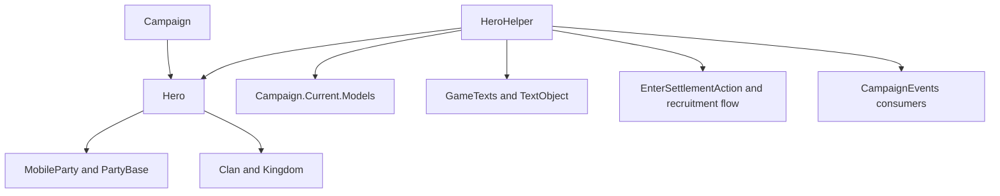

# HeroHelper

**Namespace:** `Helpers`  
**Module:** `TaleWorlds.CampaignSystem`  
**Type:** `public static class HeroHelper`  
**Base:** `System.Object`  
**Source:** `bin/TaleWorlds.CampaignSystem/Helpers/HeroHelper.cs`

## One-line responsibility

This static class centralizes Campaign-layer rules for a hero's location, localized text, recruitment, relationships, and a few creation-time operations used by campaign behaviors, Actions, and UI.

## Mental model

`HeroHelper` has no instance, no owned state, and no lifecycle of its own. It is a set of rules over registered [Hero](../../campaign/Hero) objects and the current [Campaign](../../campaign/Campaign): most entries read heroes, parties, factions, and Models, while a small set changes the world through an Action or roster operation.

The boundary matters:

- Use the query helpers for a hero's nearby settlement, last-seen text, profession text, default relation, or party ownership. Their results describe the Campaign at call time and are not saveable snapshots.
- `GetVolunteerTroopsOfHeroForRecruitment`, `HeroCanRecruitFromHero`, and `StartRecruitingMoneyLimit*` provide recruitment inputs. Adding heroes, troops, or gold still belongs to [AddHeroToPartyAction](../../campaign-ext/AddHeroToPartyAction), the recruitment workflow, or the appropriate Action.
- `SpawnHeroForTheFirstTime` is the exception: it sets the birth settlement, calls `EnterSettlementAction.ApplyForCharacterOnly`, and marks the hero Active. It is for a not-yet-entered campaign hero, not a teleport API for an existing hero.
- `SetPlayerSalutation`, `WillLordAttack`, and `LordWillConspireWithLord` require an active conversation or encounter context. They are not background-thread or main-menu predicates.

## Dependency graph



| Dependency | Role and timing |
| --- | --- |
| [Campaign](../../campaign/Campaign) | Supplies `Campaign.Current`, map distance, ConversationManager, Models, and object collections; most location, relation, and recruitment entries require an initialized Campaign. |
| [Hero](../../campaign/Hero) and [CharacterObject](../../campaign/CharacterObject) | Hero is the concrete campaign person; CharacterObject supplies the template, culture, and `StringId`. The helper does not create a replacement object. |
| [MobileParty](../../campaign/MobileParty), [PartyBase](../../campaign/PartyBase), and [Settlement](../../campaign/Settlement) | `GetClosestSettlement`, `UnderPlayerCommand`, recruitment, and player-party ordering read these live owners and hosts. |
| `Campaign.Current.Models` | `DefaultRelation` uses AgeModel, ordering uses EncounterModel, and recruitment limits use VolunteerModel. The helper is not a replacement for those Models. |
| [EnterSettlementAction](../../campaign-ext/EnterSettlementAction) | The world-changing part of `SpawnHeroForTheFirstTime` is performed by this Action; do not reproduce only half of that workflow. |
| [CampaignEvents](../../campaign/CampaignEvents) and behaviors | The helper does not publish a new public event family. Use the matching Action or Behavior when other systems need notifications or persistence. |

## Key entries and call boundaries

### Location, text, and profession

| Entry | Actual behavior | Timing |
| --- | --- | --- |
| `GetClosestSettlement(Hero)` | Prefers the current settlement, then derives a nearby village or fortification from the hero's party, captor, or player encounter. If the result is not a village/fortification it searches again. It may return `null`. | Use for map markers, AI, or UI that needs an approximate location; never treat it as the hero's permanent location. |
| `GetLastSeenText(Hero)` | Chooses the never-seen or last-seen text and sets the settlement and “still there” variables from `LastKnownClosestSettlement`. | Encyclopedia, notifications, and tooltips; requires the localization text system. |
| `GetTitleInIndefiniteCase(Hero)` and `GetCharacterTypeName(Hero)` | Resolve localized title/profession text from culture, gender, ruler status, occupation, and faction. Unknown professions return the unknown text. | Display only; do not infer Hero state from localized text. |
| `GetOccupiedEventReasonText(Hero)` | Distinguishes issue/quest occupation from general busyness using `CanHaveCampaignIssues()`. | Explain why a campaign event cannot start; the owning system must still perform the final eligibility check. |
| `SetPropertiesToTextObject(Hero/Settlement, TextObject, string)` | Fills character or settlement properties into the requested text tag; it does not mutate the Hero or Settlement. | Populate tags such as `OWNER` in an existing localized text object. |

### Relations, conversation, and the player side

| Entry | Actual behavior | Risk |
| --- | --- | --- |
| `UnderPlayerCommand(Hero)` and `IsCompanionInPlayerParty(Hero)` | Test direct player control and actual membership in `MobileParty.MainParty`; a null Hero returns false. | Being in the player faction is not the same as being in the main party. Do not replace `PartyBelongedTo` or Action preconditions with it. |
| `OrderHeroesOnPlayerSideByPriority(bool, bool)` | Collects leaders from the main-party encounter side, optionally includes army leaders and player companions, then sorts by `EncounterModel.GetCharacterSergeantScore` and returns CharacterObject StringIds. | Call only when the main party has a MapEvent and the Campaign/EncounterModel are ready; the result is not a Hero list. |
| `WillLordAttack()` | Combines a defending player encounter, conversation context, prisoner status, enemy factions, and `DoNotAttackMainPartyUntil`. | It reads `PlayerEncounter.Current`, `Hero.OneToOneConversationHero`, and `Campaign.Current`; it is not a general map hostility test. |
| `SetPlayerSalutation()` | Reads the current one-to-one conversation hero and player identity to set the `PLAYER_SALUTATION` text variable. | Call only after the conversation context exists; it changes a global text variable. |
| `LordWillConspireWithLord`, `NPCPoliticalDifferencesWithNPC`, `NPCPersonalityClashWithNPC`, and `TraitHarmony` | Apply faction, Honor, personality-trait, and conversation rules for conspiracy, political difference, personality clash, or trait harmony. The conspiracy entry also sets refusal text. | These are narrative/AI calculations, not diplomacy Actions; a return value does not mean a relation changed. |
| `DefaultRelation(Hero, Hero)` and `CalculateReliabilityConstant(Hero, float)` | Calculate initialization/default values from same-clan, culture, age, and traits; they do not write current relations. | Use as calculation inputs; actual relation changes belong to [ChangeRelationAction](../../campaign-ext/ChangeRelationAction). |

### Creation and recruitment

| Entry | Actual behavior | Correct boundary |
| --- | --- | --- |
| `SpawnHeroForTheFirstTime(Hero, Settlement)` | Sets `BornSettlement`, calls `EnterSettlementAction.ApplyForCharacterOnly`, and sets `Hero.CharacterStates.Active`. | Only the original first-spawn workflow should call it. Do not apply it to an existing Active, Prisoner, or Dead Hero. |
| `HeroCanRecruitFromHero` and `GetVolunteerTroopsOfHeroForRecruitment` | The first delegates the index limit to VolunteerModel; the second returns six `VolunteerTypes` when the Hero is alive. | These are read/calculation helpers. The recruitment workflow owns roster, gold, and event changes. |
| `StartRecruitingMoneyLimit` and `StartRecruitingMoneyLimitForClanLeader` | Calculate an initial money limit from the Hero/Clan's party size and wages, with a zero result for the player Clan. | This is a numeric input, not a gold mutation; use [GiveGoldAction](../../campaign-ext/GiveGoldAction) for transfers. |
| `GetRandomClanForNotable(Hero)` | With random probability, selects a Clan for a preacher or gang leader using supporter conflicts, culture, and settlement distance; otherwise returns `null`. | Call only for a valid notable-generation flow with `HomeSettlement` and campaign settlement data. |
| `GetRandomBirthDayForAge` and `GetRandomDeathDayAndBirthDay` | Generate time values from current CampaignTime and random days. | Suitable for initialization; not a way to change an existing hero's age or bypass a death Action. |
| `GetPersonalityTraitChangeName` | Accepts a trait from `DefaultTraits.Personality` and resolves localized text from its level and change direction; another trait triggers an assertion and returns empty text. | Validate the trait family first; this entry does not mutate traits. |

## Real example: inspect the player hero in an active Campaign

Place this in a registered Campaign behavior, event callback, or other Campaign-phase logic. It uses the real `Hero.MainHero` acquisition path and accepts that a nearby settlement may be absent:

```csharp
using TaleWorlds.CampaignSystem;
using TaleWorlds.CampaignSystem.Settlements;
using TaleWorlds.Localization;

public static class HeroInspection
{
    public static Settlement FindPlayerHeroLocation(out TextObject lastSeen)
    {
        lastSeen = TextObject.GetEmpty();
        if (Campaign.Current == null || Hero.MainHero == null)
        {
            return null;
        }

        Hero hero = Hero.MainHero;
        lastSeen = HeroHelper.GetLastSeenText(hero);
        return HeroHelper.GetClosestSettlement(hero);
    }
}
```

`GetClosestSettlement` is an immediate derived result. The caller must accept `null` and must not assume that the hero still belongs to the same party after the helper returns.

## Risks and save boundaries

- **Campaign phase:** `Campaign.Current`, map locatables, ConversationManager, and Models may be unavailable in the main menu, during Campaign construction/unload, or early in loading. Defer calls to a Campaign behavior event or a known Campaign tick.
- **Context requirements:** `SetPlayerSalutation`, `WillLordAttack`, and `LordWillConspireWithLord` read conversation/encounter statics. Calling them without context can dereference null state, contaminate the next conversation's text variable, or produce an answer unrelated to the current encounter.
- **World mutation:** `SpawnHeroForTheFirstTime` registers/activates a hero and enters a settlement. Repeating it can break birth, party, or object state; moving, recruiting, imprisoning, and killing an existing hero require the corresponding Actions.
- **Randomness and Models:** recruitment, relation, personality, and birth-date results depend on random state or the active Model. Do not cache one calculation as a cross-save fact or apply it repeatedly as a mutation.
- **Save references:** Hero, Clan, Settlement, and Party belong to the Campaign object graph. A custom Behavior should save stable IDs or supported saveable data, not temporary TextObjects, LINQ views, or static objects from a previous Campaign.

## Version note

This page follows the v1.4.5 `Helpers/HeroHelper.cs` implementation and its call sites in `Hero`, recruitment UI, StoryMode quests, and Campaign behaviors. Recheck VolunteerModel, EncounterModel, and the `SpawnHeroForTheFirstTime` Action boundary when targeting another version; do not infer semantics from names alone.

## Navigation

- ↑ Parent: [System API](../)
- ↔ Siblings: [Hero](../../campaign/Hero) · [CharacterObject](../../campaign/CharacterObject) · [MobileParty](../../campaign/MobileParty) · [Settlement](../../campaign/Settlement)
- Related: [Campaign](../../campaign/Campaign) · [PartyBase](../../campaign/PartyBase) · [ChangeRelationAction](../../campaign-ext/ChangeRelationAction) · [EnterSettlementAction](../../campaign-ext/EnterSettlementAction) · [AddHeroToPartyAction](../../campaign-ext/AddHeroToPartyAction) · [GiveGoldAction](../../campaign-ext/GiveGoldAction) · [Campaign roadmap](../../../architecture/roadmap)
