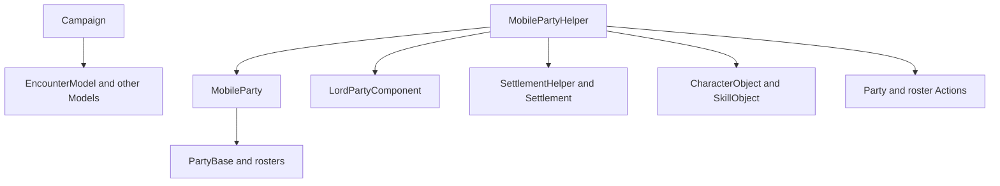

# MobilePartyHelper

**Namespace:** `Helpers`  
**Module:** `TaleWorlds.CampaignSystem`  
**Type:** `public static class MobilePartyHelper`  
**Base:** `System.Object`  
**Source:** `bin/TaleWorlds.CampaignSystem/Helpers/MobilePartyHelper.cs`

## One-line responsibility

This static class provides [MobileParty](../../campaign/MobileParty) helpers for lord-party creation, troop selection, XP and injury handling, speed adjustment, and AI location checks; it is not the owner or destruction API for a MobileParty.

## Mental model

`MobilePartyHelper` mixes queries with side-effecting party tools. Query entries read an existing [MobileParty](../../campaign/MobileParty), [PartyBase](../../campaign/PartyBase), `TroopRoster`, or Campaign Model. `SpawnLordParty`, `CreateNewClanMobileParty`, `PartyAddSharedXp`, `WoundNumberOfNonHeroTroopsRandomlyWithChanceOfDeath`, `TryMatchPartySpeedWithItemWeight`, and `FillPartyManuallyAfterCreation` write to the world or a roster.

Treat it as a low-level utility used by the original Campaign/AI/battle flows, not as a safe general-purpose world mutation surface:

- To add a hero to an existing party, use [AddHeroToPartyAction](../../campaign-ext/AddHeroToPartyAction); do not replace membership migration with a new-party helper.
- To destroy a party, change captivity, start an encounter, or preserve the full event cascade, use [DestroyPartyAction](../../campaign-ext/DestroyPartyAction), [TakePrisonerAction](../../campaign-ext/TakePrisonerAction), or the relevant battle Action.
- Party creation depends on `LordPartyComponent.CreateLordParty`, a navigable position, and the active Models; it cannot run in the main menu or before Campaign loading.

## Dependency graph



| Dependency | Role and timing |
| --- | --- |
| [MobileParty](../../campaign/MobileParty) and [PartyBase](../../campaign/PartyBase) | Supply position, main-party access, member/prisoner rosters, speed, morale, and host relations; queries require an active object. |
| [Campaign](../../campaign/Campaign) | Party creation reads EncounterModel, AI settlement checks read Campaign/map state, and `GetPlayerPrisonersPlayerCanSell` reads locked data from a Campaign behavior. |
| `LordPartyComponent` | The actual creator used by `SpawnLordParty` and `CreateNewClanMobileParty`; the helper does not perform every initialization step itself. |
| [Settlement](../../campaign/Settlement) and `SettlementHelper` | Settlement GatePosition is a spawn anchor; without a current position, `CreateNewClanMobileParty` searches the old party position or a suitable settlement. |
| [CharacterObject](../../campaign/CharacterObject), [Hero](../../campaign/Hero), and [TroopRoster](../../campaign/TroopRoster) | Leaders, skill selection, upgrade XP, non-Hero injuries, and manual filling operate on these objects. |
| [AddHeroToPartyAction](../../campaign-ext/AddHeroToPartyAction) and [DestroyPartyAction](../../campaign-ext/DestroyPartyAction) | Own complete membership migration, party termination, events, and lifetime; local roster edits cannot replace them. |

## Key entries and call boundaries

### Creation and spawning

| Entry | Actual behavior | Boundary |
| --- | --- | --- |
| `SpawnLordParty(Hero, Settlement)` | Uses the settlement GatePosition to call `LordPartyComponent.CreateLordParty` with the settlement as spawn context. | Use only when a Campaign flow truly needs a new lord party; it is not an existing-party membership API. |
| `SpawnLordParty(Hero, CampaignVec2, float)` | Calls the same lord-party creation flow at a position and radius, which may come from an old party or navigable settlement. | Validate position, radius, and Campaign phase first; invalid coordinates can create a party without a valid map location. |
| `CreateNewClanMobileParty(Hero, Clan)` | If the Hero is in a settlement it spawns there; if in the main or another party it removes the old member-roster entry; otherwise it finds a party position or nearby settlement and uses twice the EncounterModel joining radius. The v1.4.5 method body does not read the `clan` parameter. | This is the original “split into a new lord party” helper, not a normal add-to-party entry. Confirm Hero, old roster, and intended Clan semantics before calling. |
| `ResumePartyEscortBehaviorDelegate` | Declares a parameterless callback type for escort resumption; it is not a retrievable helper instance or initializer. | Use only at the same callback boundary as the original escort flow; do not invent a party service object. |

### Member selection and party capacity

| Entry | Actual behavior | Notes |
| --- | --- | --- |
| `GetHeroWithHighestSkill(MobileParty, SkillObject)` | Walks the member roster, considers entries with a HeroObject, and returns the strictly highest skill Hero; returns null when none qualifies. | A current-roster query; it does not apply role, injury, or full Model eligibility. |
| `GetStrongestAndPriorTroops(MobileParty, int, bool)` | Flattens the member roster, removes wounded units, and selects by descending Level; the overload accepts an existing `FlattenedTroopRoster`. It can keep the PlayerCharacter and prioritizes non-transferable Heroes. | Returns a new dummy TroopRoster and does not remove units from the source. Use a non-negative `maxTroopCount`. |
| `GetMaximumXpAmountPartyCanGet(MobileParty)` | Calls `CanTroopGainXp` for every member and sums the largest XP gap to any upgrade target. | A calculated ceiling, not an instruction to write XP; the caller still owns upgrade and roster policy. |
| `CanPartyAttackWithCurrentMorale(MobileParty)` | Only tests `party.Morale > 0f`. | It is not a complete encounter, injury, strength, or hostility check; start a battle through the Encounter/Action flow. |

### XP, injuries, and inventory side effects

| Entry | Actual behavior | Risk |
| --- | --- | --- |
| `CanTroopGainXp(PartyBase, CharacterObject, out int)` | Checks UpgradeTargets, reads the troop count/current XP from the owner roster, and calculates the largest missing amount across upgrade targets. | The owner must contain the troop and its template must have valid upgrade data; otherwise indexing/assertion behavior is unsafe. |
| `PartyAddSharedXp(MobileParty, float)` | Distributes XP approximately by upgrade gap and calls `AddXpToTroopAtIndex`; it stops for less than 1 XP or no eligible units. | Mutates saved member-roster XP. Call only where the Campaign flow owns that reward, never from a repeated preview/tick. |
| `WoundNumberOfNonHeroTroopsRandomlyWithChanceOfDeath(TroopRoster, int, float, out int)` | Uses global random values to decide deaths, removes the death count, and wounds the remainder. | Mutates the roster and is not the Hero death Action or the complete battle event cascade. |
| `TryMatchPartySpeedWithItemWeight(MobileParty, float, ItemObject)` | Clamps the target to at least 1, defaults to `DefaultItems.HardWood`, and adds/removes items for up to 200 iterations to approach the current speed. | It really changes the ItemRoster and does not guarantee an exact speed; it is not a read-only Model. |
| `FillPartyManuallyAfterCreation(MobileParty, PartyTemplateObject, int)` | Clears the member roster, fills from PartyTemplateStack min/max values with randomness, then adjusts until the desired count is reached. | Only for a new, not-yet-owned party. Calling it on an existing party deletes real members. |

### AI, prisoners, and settlement context

| Entry | Actual behavior | Timing |
| --- | --- | --- |
| `GetMainPartySkillCounsellor(SkillObject)` | Searches `PartyBase.MainParty` for the highest-skill non-wounded Hero and falls back to the main-party leader. | Call only when the Campaign has a main party; it selects a Hero and does not assign a role. |
| `GetCurrentSettlementOfMobilePartyForAICalculation(MobileParty)` | Returns CurrentSettlement first; otherwise returns LastVisitedSettlement only when its squared distance from the current position is below 1, and otherwise returns null. | An AI approximation, not a permanent location; callers must handle null. |
| `GetPlayerPrisonersPlayerCanSell()` | Creates a dummy roster, reads locked character StringIds from `IViewDataTracker`, and copies unlocked prisoners from the main party. | Requires Campaign, main party, and ViewDataTracker; the returned copy is not a sale. Use [SellPrisonersAction](../../campaign-ext/SellPrisonersAction) for the transaction. |

## Real example: inspect main-party Campaign context

This obtains a registered party through `MobileParty.MainParty` and uses the real AI approximation helper without changing a roster:

```csharp
using TaleWorlds.CampaignSystem;
using TaleWorlds.CampaignSystem.Party;
using TaleWorlds.CampaignSystem.Settlements;
using TaleWorlds.Core;

public static class MainPartyContext
{
    public static bool CanUseMainPartyForAttack(out Settlement nearbySettlement, out Hero bestTactician)
    {
        nearbySettlement = null;
        bestTactician = null;
        if (Campaign.Current == null || MobileParty.MainParty == null || !MobileParty.MainParty.IsActive)
        {
            return false;
        }

        MobileParty party = MobileParty.MainParty;
        nearbySettlement = MobilePartyHelper.GetCurrentSettlementOfMobilePartyForAICalculation(party);
        bestTactician = MobilePartyHelper.GetHeroWithHighestSkill(party, DefaultSkills.Tactics);
        return MobilePartyHelper.CanPartyAttackWithCurrentMorale(party);
    }
}
```

`nearbySettlement` may still be null, and `CanPartyAttackWithCurrentMorale` only means morale is positive; it does not make a battle unconditionally valid.

## Risks and save boundaries

- **Campaign phase:** Party creation, main-party access, Models, ViewDataTracker, and settlement lookup require an active Campaign. Do not call them in the main menu, during Campaign construction/unload, or early in loading.
- **Party creation:** `SpawnLordParty` and `CreateNewClanMobileParty` register map entities, change Hero membership, and require a valid position. Repeating them or calling before old-party cleanup can create duplicate lords, lost members, or invalid map positions.
- **Roster mutation:** `FillPartyManuallyAfterCreation` clears the roster; shared XP, random injury, and speed adjustment change saved member/item data. Never call these from a UI preview or repeated tick.
- **Action boundary:** Local helper writes do not complete hero membership, captivity, battle, disbanding, destruction, or event cascades. Prefer [AddHeroToPartyAction](../../campaign-ext/AddHeroToPartyAction), [TakePrisonerAction](../../campaign-ext/TakePrisonerAction), and [DestroyPartyAction](../../campaign-ext/DestroyPartyAction) for world relationships.
- **Calculated results:** Nearby settlement, highest-skill Hero, positive morale, and maximum XP are call-time calculations. Do not treat them as permanent state across ticks or saves.
- **Save objects:** Do not save old MobileParty, PartyBase, or roster enumerations. Save stable StringIds and reacquire/validate `IsActive`, rosters, and ownership after Campaign loading.

## Version note

This page follows v1.4.5 `Helpers/MobilePartyHelper.cs` and call sites in `HeroSpawnCampaignBehavior`, recruitment, hideout, AI, prisoner-sale, and companion-role behaviors. In particular, the `Clan` parameter of `CreateNewClanMobileParty` is not read by this version's method body; do not assume it performs Clan-joining events for the caller.

## Navigation

- ↑ Parent: [System API](../)
- ↔ Siblings: [MobileParty](../../campaign/MobileParty) · [PartyBase](../../campaign/PartyBase) · [Hero](../../campaign/Hero) · [Settlement](../../campaign/Settlement)
- Related: [TroopRoster](../../campaign/TroopRoster) · [PartyComponent](../../campaign/PartyComponent) · [AddHeroToPartyAction](../../campaign-ext/AddHeroToPartyAction) · [DestroyPartyAction](../../campaign-ext/DestroyPartyAction) · [TakePrisonerAction](../../campaign-ext/TakePrisonerAction) · [Campaign roadmap](../../../architecture/roadmap)
