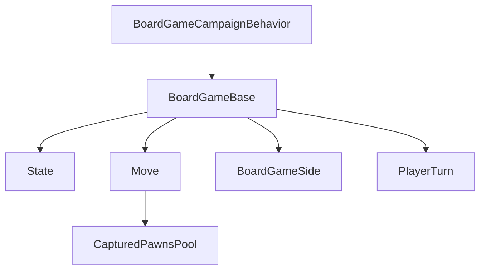

# BoardGames 家族手册

**一句话职责：** `SandBox.BoardGames` 是 Bannerlord 内嵌的「棋类小游戏」系统。基类 `BoardGameBase` 定义棋盘状态、回合切换与胜负判定的统一契约；六种具体棋（Bagh-Chal、Konane、Mu-Torere、Puluc、Seega、Tablut）各自实现规则；`State`/`Move`/`PawnInformation` 等数据类承载局面与走法，由 [CampaignBehaviorBase](../campaign-ext/CampaignBehaviorBase) 的 `BoardGameCampaignBehavior` 在城镇摆盘时驱动。

## 心智模型

把一次下棋想成「一张棋盘状态（State）+ 一系列走法（Move）+ 双方（BoardGameSide）+ 回合（PlayerTurn）」。`BoardGameBase` 持有 `State`，每步 `Move` 经过规则校验后更新 `State` 并切换 `PlayerTurn`，直到 `GameOverEnum` 判定结束；被吃棋子进入 `CapturedPawnsPool`。阅读顺序：先看 [CampaignBehaviorBase](../campaign-ext/CampaignBehaviorBase) 了解棋局如何被战役行为启动，再看 [GUI 总索引](../gui/_index) 了解棋盘 UI，最后回到本页按「基类 / 具体棋 / 数据」三类找类型。

## 何时使用

- 你要新增一种棋类或定制现有棋规则——继承 `BoardGameBase` 并重写规则校验与胜负判定。
- 你要读取/展示当前局面——消费 `State`/`PawnInformation`/`Move`，不要直接改 `State` 内部而不走规则校验（会破坏不变量）。
- 不要在棋类逻辑里写战役字段；棋局是独立的微型对局，结果只通过 `BoardGameCampaignBehavior` 回写（如奖励）。

## 依赖关系

- 上游：[CampaignBehaviorBase](../campaign-ext/CampaignBehaviorBase) 的棋局行为启动对局；[GUI 总索引](../gui/_index) 提供棋盘界面。
- 下游：棋局结果由战役行为消费（奖励/剧情）；棋盘渲染由 UI 读取 `State`。
- 邻接模块：[mission-ext 总索引](../_index)。

## Board Game 类型（SandBox.BoardGames）

| Type | Namespace | Purpose | Timing |
| --- | --- | --- | --- |
| `BarrierInfo` | SandBox.BoardGames | 棋盘障碍格信息（不可落子/阻挡移动的位置），供规则判定。 | 规则校验 |
| `BoardGameBase` | SandBox.BoardGames | 棋类小游戏基类，定义棋盘状态、回合切换与胜负判定的统一契约。 | 对局全程 |
| `BoardGameBaghChal` | SandBox.BoardGames | 「虎棋/Bagh-Chal」具体实现（守卫围捕老虎的棋）。 | 对局全程 |
| `BoardGameKonane` | SandBox.BoardGames | 「夏威夷跳棋/Konane」具体实现（跳吃棋子）。 | 对局全程 |
| `BoardGameMuTorere` | SandBox.BoardGames | 「毛利棋/Mu-Torere」具体实现（星形盘绕圈走子）。 | 对局全程 |
| `BoardGamePuluc` | SandBox.BoardGames | 「Puluc」具体实现（玛雅掷骰捕获棋）。 | 对局全程 |
| `BoardGameSeega` | SandBox.BoardGames | 「Seega」具体实现（占位吃子的棋）。 | 对局全程 |
| `BoardGameSide` | SandBox.BoardGames | 对局双方（玩家/AI）的抽象侧，承载持子与走子权。 | 回合切换 |
| `BoardGameTablut` | SandBox.BoardGames | 「Tablut（北欧战棋）」具体实现（国王逃脱）。 | 对局全程 |
| `BoardInformation` | SandBox.BoardGames | 单局对局信息（当前盘态、回合、胜负），聚合状态。 | 对局状态 |
| `CapturedPawnsPool` | SandBox.BoardGames | 被吃棋子池，管理被捕获棋子的归属与计数。 | 吃子时 |
| `GameOverEnum` | SandBox.BoardGames | 对局结束原因枚举（胜/负/和/退出）。 | 终局判定 |
| `Move` | SandBox.BoardGames | 一步走法的数据（起点/终点/吃子），供规则校验与回放。 | 走子时 |
| `PawnInformation` | SandBox.BoardGames | 单个棋子的数据（位置、归属方、类型）。 | 局面读取 |
| `PlayerTurn` | SandBox.BoardGames | 回合信息（当前该哪一方走、剩余时间），驱动回合切换。 | 回合切换 |
| `State` | SandBox.BoardGames | 棋盘整体状态（格子占用、当前局面），规则计算的核心。 | 规则校验 |
| `TileBaseInformation` | SandBox.BoardGames | 单个棋格的基础信息（坐标、是否可用），棋盘的原子单元。 | 布局/校验 |

## 风险与边界

- **走法必须经规则校验**：直接改 `State` 而不走 `BoardGameBase` 的走法流程会破坏不变量，导致非法局面或卡死。
- **回合所有权**：切换 `PlayerTurn` 时必须校验走子方，否则会出现一方连走或 AI/玩家权限错乱。
- **表现层分离**：棋类逻辑不要写战役字段；结果只通过 `BoardGameCampaignBehavior` 回写（奖励/剧情）。
- **存档**：对局中途退出若需保留，应通过对应 `CampaignBehavior` 的 `SyncData` 持久化，而非手写序列化。

## 参见

- 棋局启动：[CampaignBehaviorBase](../campaign-ext/CampaignBehaviorBase)
- 棋盘界面：[GUI 总索引](../gui/_index)
- 任务行为上层：[mission-ext 总索引](../_index)
