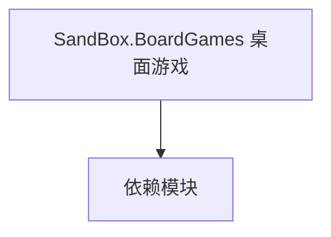

# SandBox.BoardGames 桌面游戏

**一句话职责：** 本页以家族索引形式覆盖 `SandBox.BoardGames 桌面游戏` 下全部 26 个业务类型，逐类给出命名空间、职责与典型时机，便于按模块而不是按字母表查阅。

## 心智模型

SandBox.BoardGames 实现游戏内的桌面/棋类小游戏（如 siege chess）：AI 决策、棋子（Pawns）、棋盘格子（Tiles）等。AI 层决定对手走法，Pawns 描述棋子属性与移动，Tiles 描述棋盘拓扑。整簇以自包含的小游戏循环运行，与战役主循环通过行为桥接。

## 何时使用

扩展桌面游戏（新棋子/新规则/更强 AI）时，从对应基类派生；AI 实现要可中断、可序列化以支持存档与悔棋。

## 依赖关系

`SandBox.BoardGames 桌面游戏` 的类型依赖以下模块；缺其中任一都会导致编译或运行期失败。

- [BoardGames 总览](../_index)
- [MBSubModuleBase](../../core/MBSubModuleBase)

## 类型清单

| Type | Namespace | Purpose | Timing |
| --- | --- | --- | --- |
| `AIState` | SandBox.BoardGames.AI | 桌面游戏相关类型，参与棋类/骰子玩法 | 战役初始化期 |
| `BoardGameAIBaghChal` | SandBox.BoardGames.AI | 桌面游戏相关类型，参与棋类/骰子玩法 | 战役初始化期 |
| `BoardGameAIBase` | SandBox.BoardGames.AI | 桌面游戏相关类型，参与棋类/骰子玩法 | 战役初始化期 |
| `BoardGameAIKonane` | SandBox.BoardGames.AI | 桌面游戏相关类型，参与棋类/骰子玩法 | 战役初始化期 |
| `BoardGameAIMuTorere` | SandBox.BoardGames.AI | 桌面游戏相关类型，参与棋类/骰子玩法 | 战役初始化期 |
| `BoardGameAIPuluc` | SandBox.BoardGames.AI | 桌面游戏相关类型，参与棋类/骰子玩法 | 战役初始化期 |
| `BoardGameAISeega` | SandBox.BoardGames.AI | 桌面游戏相关类型，参与棋类/骰子玩法 | 战役初始化期 |
| `BoardGameAITablut` | SandBox.BoardGames.AI | 桌面游戏相关类型，参与棋类/骰子玩法 | 战役初始化期 |
| `TreeNodeTablut` | SandBox.BoardGames.AI | 桌面游戏相关类型，参与棋类/骰子玩法 | 战役初始化期 |
| `MissionBoardGameDebugHandler` | SandBox.BoardGames.MissionLogics | 任务逻辑，定义该任务的流程与胜负条件 | 战斗/任务加载时 |
| `MissionBoardGameLogic` | SandBox.BoardGames.MissionLogics | 任务逻辑，定义该任务的流程与胜负条件 | 战斗/任务加载时 |
| `BoardGameDecal` | SandBox.BoardGames.Objects | 场景脚本组件，挂载到 GameObject 提供可重写逻辑 | 战役初始化期 |
| `Tile` | SandBox.BoardGames.Objects | 场景脚本组件，挂载到 GameObject 提供可重写逻辑 | 战役初始化期 |
| `MovementState` | SandBox.BoardGames.Pawns | 桌面游戏相关类型，参与棋类/骰子玩法 | 战役初始化期 |
| `PawnBaghChal` | SandBox.BoardGames.Pawns | 桌面游戏相关类型，参与棋类/骰子玩法 | 战役初始化期 |
| `PawnBase` | SandBox.BoardGames.Pawns | 桌面游戏相关类型，参与棋类/骰子玩法 | 战役初始化期 |
| `PawnKonane` | SandBox.BoardGames.Pawns | 桌面游戏相关类型，参与棋类/骰子玩法 | 战役初始化期 |
| `PawnMuTorere` | SandBox.BoardGames.Pawns | 桌面游戏相关类型，参与棋类/骰子玩法 | 战役初始化期 |
| `PawnPuluc` | SandBox.BoardGames.Pawns | 桌面游戏相关类型，参与棋类/骰子玩法 | 战役初始化期 |
| `PawnSeega` | SandBox.BoardGames.Pawns | 桌面游戏相关类型，参与棋类/骰子玩法 | 战役初始化期 |
| `PawnTablut` | SandBox.BoardGames.Pawns | 桌面游戏相关类型，参与棋类/骰子玩法 | 战役初始化期 |
| `Tile1D` | SandBox.BoardGames.Tiles | 桌面游戏相关类型，参与棋类/骰子玩法 | 战役初始化期 |
| `Tile2D` | SandBox.BoardGames.Tiles | 桌面游戏相关类型，参与棋类/骰子玩法 | 战役初始化期 |
| `TileBase` | SandBox.BoardGames.Tiles | 桌面游戏相关类型，参与棋类/骰子玩法 | 战役初始化期 |
| `TileMuTorere` | SandBox.BoardGames.Tiles | 桌面游戏相关类型，参与棋类/骰子玩法 | 战役初始化期 |
| `TilePuluc` | SandBox.BoardGames.Tiles | 桌面游戏相关类型，参与棋类/骰子玩法 | 战役初始化期 |

## 风险与边界

AI 搜索要限制深度/超时，避免卡顿；棋盘状态必须可完整序列化，否则存档后无法复原对局。多人/单人共享规则时留意分支差异。

## 参见

- [BoardGames 总览](../_index)
- [MBSubModuleBase](../../core/MBSubModuleBase)
