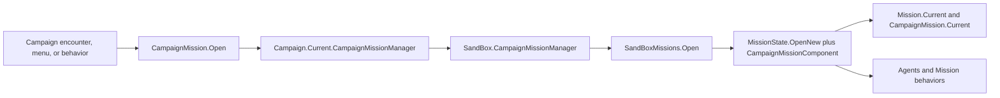

# CampaignMission

**Namespace:** `TaleWorlds.CampaignSystem`  
**Module:** `TaleWorlds.CampaignSystem`  
**Type:** `public static class CampaignMission`  
**Base:** none  
**1.3.15 source:** `R:\Bannerlord\bannerlord-1.3.15\TaleWorlds.CampaignSystem\CampaignMission.cs`  
**1.4.5 comparison:** `R:\Bannerlord\bannerlord-1.4.5\Bannerlord.Source\bin\TaleWorlds.CampaignSystem\TaleWorlds.CampaignSystem\CampaignMission.cs`

## 一句话职责

它把战役遭遇、地点和战斗输入交给当前 `Campaign` 的 Mission 管理器，打开相应的场景 Mission；同时通过 `Current` 暴露当前场景里的 `ICampaignMission` 战役适配状态。

## 心智模型

`CampaignMission` 不是 `Mission` 的构造函数，也不是保存战役数据的对象。它包含两条不同方向的 API：

- `CampaignMission.Open...` 是 **Campaign -> Mission 的创建请求**。1.3.15 的每个公开 `Open...` 方法都直接调用 `Campaign.Current.CampaignMissionManager` 的同名方法并返回 `IMission`；它不会在这个静态类里直接创建场景、Agent 或行为。
- `CampaignMission.Current` 是 **当前 Mission -> Campaign 的适配状态**，类型为 `ICampaignMission`。1.4.5 的 `CampaignMissionComponent` 实现这个接口，在 `OnCreated` 设置它，在 Mission 结束时清空它；它不是 `Mission.Current` 的别名。

三个全局入口的边界如下：

| 入口 | 所属层 | 实际含义 | 可用时机 |
|---|---|---|---|
| `Campaign.Current` | Campaign | 当前战役实例；它持有 `CampaignMissionManager` 属性 | 战役已建立、未销毁时 |
| `CampaignMission.Current` | Campaign/Mission 适配层 | 当前场景的 `State`、`Location`、`Mode`、对话和跟随逻辑 | `CampaignMissionComponent` 已创建且 Mission 尚未结束时 |
| `Mission.Current` | `TaleWorlds.MountAndBlade` | 当前场景的原生资源、Agent、Team、MissionBehavior 和清理状态 | Mission 初始化到结束流程之间；读取前检查 `CurrentState` |

因此，想“打开一场城镇、伏击或对话场景”使用 `CampaignMission.Open...`；想“读取当前场景的 Agent、Team、Scene 或行为”使用 [Mission](../../mission/Mission)；想“让 Campaign 的地点/对话适配当前场景”才读取 `CampaignMission.Current`。把其中一个 `Current` 当成另一个，会把 Campaign 阶段和 Mission 阶段混在一起。

## 生命周期、创建者与阶段边界

### 1. Campaign 准备输入

`Campaign` 公开持有 `CampaignMission.ICampaignMissionManager CampaignMissionManager`。实际调用点通常在 encounter、菜单或战役行为中：

- `VillageEncounter.CreateAndOpenMissionController` 从 `Location` 取得场景名后调用 `CampaignMission.OpenVillageMission`（1.3.15 `VillageEncounter.cs:18-24`）。
- `TownEncounter.CreateAndOpenMissionController` 按 `center`、`arena` 或室内地点分别调用 `OpenTownCenterMission`、`OpenArenaStartMission`、`OpenIndoorMission`（`TownEncounter.cs:18-43`）。
- `PlayerEncounter` 从攻城墙等级、攻城器械、地点和对话角色构造输入，再调用 `OpenSiegeMissionWithDeployment`、`OpenBattleMission` 或 `OpenCombatMissionWithDialogue`（`PlayerEncounter.cs:2060-2093`）。

这些调用者拥有战役语义：遭遇为何发生、哪个 `Location`、哪些 `TroopRoster` 或 `CharacterObject` 进入场景。`CampaignMission` 不替调用者推导这些业务输入。

### 2. 管理器转为具体 Mission

1.3.15 的 `CampaignMission.Open...` 只做一层转发，并且没有 `Campaign.Current` 空保护；在没有活动 Campaign 时调用会因 `Campaign.Current` 为空而失败。

1.4.5 的对照源码明确了模块边界：`SandBox.CampaignMissionManager` 实现嵌套的 `ICampaignMissionManager`，再把各入口转给 `SandBoxMissions.Open...`。`SandBoxMissions.OpenTownCenterMission`、`OpenVillageMission`、对话、攻城和战斗入口都用 `MissionState.OpenNew`，并通过 `InitializeMissionBehaviorsDelegate` 把 `CampaignMissionComponent` 放入新 Mission 的行为集合。

所以 `CampaignMission` 是标准创建入口，`CampaignMissionManager` 是实现选择点，`SandBoxMissions` 才是具体场景与行为组合者；mod 不应把三者混为一个可长期持有的服务。

### 3. Mission 初始化与 Campaign 适配器建立

`Mission.AddMissionBehavior` 会把行为的 `Mission` 设置为当前实例并调用 `OnCreated`；`InitializeStartingBehaviors` 按工厂返回的集合加入行为。1.4.5 `CampaignMissionComponent.OnCreated` 在这个阶段执行 `CampaignMission.Current = this`。

随后 `Mission.AfterStart` 依次触发行为的 `OnBehaviorInitialize`、`EarlyStart` 和 `AfterStart`，最后把 `CurrentState` 设为 `Continuing`。`CampaignMissionComponent` 在 `OnBehaviorInitialize` 触发 `CampaignEventDispatcher.OnMissionStarted`，在 `AfterStart` 触发 `OnAfterMissionStarted`。需要场景已可用的代码应放在相应 Mission/ Campaign 事件阶段，而不是在调用 `Open...` 后立即假设 Agent 已生成。

### 4. 运行与结束

运行期间，`CampaignMissionComponent.OnMissionTick` 在有 `Campaign.Current` 时把 Mission tick 转给 `CampaignEventDispatcher.MissionTick`；它还通过 `ICampaignMission` 处理地点切换、对话、跟随、模式切换和战役结束联动。1.3.15 的真实消费者包括：

- `LocationEncounter.OnCharacterLocationChanged` 在匹配当前地点时调用 `CampaignMission.Current.OnCharacterLocationChanged`（`LocationEncounter.cs:85-90`）。
- `ConversationManager` 在对话开始、句子处理、播放、继续和结束时调用 `CampaignMission.Current` 的对应方法（例如 `ConversationManager.cs:114-176`、`:853-1034`）。
- `BarterManager.BeginPlayerBarter` 和 `Close` 在存在适配器时调用 `SetMissionMode`，在谈判和对话之间切换 Mission 模式（`BarterManager.cs:39-50`、`:146-155`）。

结束不是立即销毁。`Mission.EndMission` 先把状态推进到结束流程；1.4.5 `CampaignMissionComponent.OnEndMission` 先向 Campaign 事件接收器发送 `OnMissionEnded`，再执行 `CampaignMission.Current = null`。之后 Mission 清理 Agent、Team、MissionObject 和原生资源。结束回调里不要继续使用旧的 `CampaignMission.Current`、`Mission.Current` 或 `Agent`。

## 何时使用，何时不要使用

### 适合使用

- 战役 encounter 已经决定场景、地点、升级等级、对话角色或部队输入，需要沿用原版 SandBox Mission 行为时，调用对应的 `CampaignMission.Open...`。
- 已确认在当前 Campaign Mission 内，需要读取战役适配状态时读取 `CampaignMission.Current.Location`、`Mode` 或 `State`，并先判空。
- 已确认在当前 Mission 内，需要访问 `Agent`、`Team`、`Scene`、`MissionBehavior` 或运行状态时读取 `Mission.Current`，并检查 `CurrentState == Mission.State.Continuing`。
- 需要自定义 Mission 行为时，在正式的 `MissionState.OpenNew` 行为工厂中注册 `MissionBehavior`；只有确实需要运行时插拔时才使用 `Mission.AddMissionBehavior`。

### 不适合使用

- 不要手动写 `CampaignMission.Current = myObject`。这个 setter 虽然在 1.3.15 是公开的，但原版组件负责建立和清空它；手动覆盖会让地点、对话和结束回调指向错误 Mission。
- 不要用 `CampaignMission.Current` 获取 Agent、Team 或 Scene，也不要把它当成 `Mission.Current` 的替代品；它只提供 `ICampaignMission` 的 Campaign 适配契约。
- 不要在模块加载、Campaign 为空、Mission 正在结束或场景尚未初始化时调用 `Open...`。不要把返回的 `IMission` 当成已经启动并已生成 Agent 的证明。
- 不要把 `CampaignMission` 当作 `Action` 或 `Model`。它不会执行领地、关系、金钱等 Campaign 状态转换，也不会计算模型结果；应使用对应的战役 Action/Model 页面和正式事件链。
- 不要把 `CampaignMission.Current`、`Mission`、`Agent`、`Scene` 或 `IMission` 引用长期缓存到 Campaign tick 或存档对象中。跨场景业务应保存可重建的战役 ID/字符串或数值状态。

## 公开契约与关键成员

### `Current`

```csharp
public static ICampaignMission Current { get; set; }
```

读取它只能说明“当前是否有 Campaign Mission 适配器”。它的写入属于原版 `CampaignMissionComponent` 生命周期，不是 mod 的初始化入口。1.3.15 的代码本身没有在 getter 或 setter 中做活动 Mission 校验，任何阶段保护都必须由调用者完成。

### `ICampaignMission` 状态契约

| 成员 | 用途与调用时机 | 副作用/边界 |
|---|---|---|
| `State` | 取得当前 `MissionState` 对应的 `GameState`，用于确认 Campaign 游戏状态 | 只读快照；不负责打开或结束 Mission |
| `AgentSupplier` | 让战役 Mission 提供生成部队所需的 `IMissionTroopSupplier` | 由创建流程设置；不要在场景结束后继续使用 |
| `Location` | 标记当前战役地点，例如城镇中心、酒馆或巷道 | 可读写；改变它会改变地点相关行为，必须在地点切换流程中做 |
| `LastVisitedAlley` | 保存巷道场景切换所需的上一条巷道 | 可读写；只属于当前场景适配状态 |
| `Mode` | 读取当前 `MissionMode`，例如对话、交易或潜行 | 只读；由 `SetMissionMode` 转交给底层 Mission |
| `SetMissionMode` | 在已存在的 Mission 中切换对话、交易等模式 | 调用底层 `Mission.SetMissionMode`；不要在 Mission 不存在时调用 |
| `OnCharacterLocationChanged` | 地点中的角色进出当前地点时同步 Campaign 适配逻辑 | 依赖有效 `Location` 和当前 Mission |
| `OnConversationStart/End/Continue`、`OnProcessSentence`、`OnConversationPlay` | 由 `ConversationManager` 在对应对话阶段驱动 | 会改变 Agent 动作、镜头或对话状态；不能在对话结束后重放 |
| `CheckIfAgentCanFollow`、`AddAgentFollowing`、`CheckIfAgentCanUnFollow`、`RemoveAgentFollowing` | 处理当前 Mission 中 Agent 的跟随关系 | Agent 必须仍属于当前 Mission；不能跨场景保存跟随 Agent |
| `AgentLookingAtAgent` | 判断两个 Mission Agent 的视线关系 | 参数是运行时 `IAgent`；只在场景有效期内使用 |
| `OnCloseEncounterMenu`、`OnGameStateChanged` | 让战役适配器响应菜单/游戏状态变化 | 时机由游戏状态机驱动，不应由 mod 伪造结束顺序 |
| `EndMission`、`FadeOutCharacter` | 从 Campaign 语义结束 Mission 或淡出角色 | 会进入结束/资源清理链；不要把它当作普通状态 setter |

### `Open...` 创建入口的选择

所有这些入口都返回 `IMission`，并把创建责任交给 `Campaign.Current.CampaignMissionManager`。参数不是随意占位值，而是对应调用者已经准备好的场景和战役状态。

| 场景目的 | 1.3.15 入口 | 关键输入 |
|---|---|---|
| 普通战斗、进入城镇战斗、对话战斗 | `OpenBattleMission(string, bool)`、`OpenBattleMissionWhileEnteringSettlement(...)`、`OpenCombatMissionWithDialogue(...)` | scene、城镇 decal、升级等级、对话角色和双方人数 |
| 城镇/城堡/村庄/室内 | `OpenTownCenterMission(...)`、`OpenCastleCourtyardMission(...)`、`OpenVillageMission(...)`、`OpenIndoorMission(...)` | `Location`、scene、升级等级、角色和出生点标签 |
| 竞技场 | `OpenArenaStartMission(...)`、`OpenArenaDuelMission(...)` | `Location`、角色、装备/马匹选项、结束回调和生命值 |
| 巷战、藏身处 | `OpenAlleyFightMission(...)`、`OpenHideoutBattleMission(...)`、`OpenHideoutAmbushMission(...)` | roster、地点、scene 和教程/升级选项 |
| 攻城 | `OpenSiegeMissionWithDeployment(...)`、`OpenSiegeMissionNoDeployment(...)`、`OpenSiegeLordsHallFightMission(...)` | 墙体耐久、攻城器械、攻守方和优先部队 |
| 初始化记录战斗 | `OpenBattleMission(MissionInitializerRecord)`、`OpenCaravanBattleMission(...)`、`OpenNavalBattleMission(...)`、`OpenNavalSetPieceBattleMission(...)` | `MissionInitializerRecord`、商队/船只和舰队来源 |
| 对话、退休、伪装 | `OpenConversationMission(...)`、`OpenRetirementMission(...)`、`OpenDisguiseMission(...)` | `ConversationCharacterData`、scene、地点、scene levels 和结束菜单 |

其中 `OpenNavalBattleMission`、`OpenNavalSetPieceBattleMission` 等在 1.3.15 只是 Campaign 层契约入口；具体实现仍由安装的 Mission manager 决定。调用后应检查返回值，并在 `Mission.Current` 的有效阶段使用结果。

## 真实调用示例

### 从地点 encounter 打开 Mission

下面保持 1.3.15 `TownEncounter.CreateAndOpenMissionController` 的真实获取路径：`LocationEncounter` 已经提供 `nextLocation`、上一地点、对话角色和出生点标签，城镇等级来自 `Settlement.Town`。

```csharp
using TaleWorlds.CampaignSystem.Encounters;
using TaleWorlds.CampaignSystem.Settlements;
using TaleWorlds.CampaignSystem.Settlements.Locations;
using TaleWorlds.Core;
using TaleWorlds.MountAndBlade;

public sealed class MyTownEncounter : LocationEncounter
{
    public MyTownEncounter(Settlement settlement) : base(settlement)
    {
    }

    public override IMission CreateAndOpenMissionController(
        Location nextLocation,
        Location previousLocation = null,
        CharacterObject talkToChar = null,
        string playerSpecialSpawnTag = null)
    {
        int wallLevel = base.Settlement.Town.GetWallLevel();
        string sceneName = nextLocation.GetSceneName(wallLevel);

        if (nextLocation.StringId == "center")
        {
            return CampaignMission.OpenTownCenterMission(
                sceneName,
                nextLocation,
                talkToChar,
                wallLevel,
                playerSpecialSpawnTag);
        }

        return null;
    }
}
```

这里的 `CampaignMission.OpenTownCenterMission` 只发出创建请求；返回的 `IMission` 不代表 `CampaignMission.Current` 或 Agent 已经可用。实际游戏的 `TownEncounter` 正是在 `Campaign.Current` 已建立、地点和角色参数已经由 encounter 准备好后这样调用的。

### 在有效场景中分别读取 Campaign 与 Mission 状态

```csharp
using TaleWorlds.CampaignSystem;
using TaleWorlds.CampaignSystem.Settlements.Locations;
using TaleWorlds.Core;
using TaleWorlds.MountAndBlade;

Campaign campaign = Campaign.Current;
ICampaignMission campaignMission = CampaignMission.Current;
Mission mission = Mission.Current;

if (campaign == null || campaign.CampaignMissionManager == null ||
    campaignMission == null || mission == null ||
    mission.CurrentState != Mission.State.Continuing)
{
    return;
}

Location location = campaignMission.Location;
MissionMode mode = campaignMission.Mode;
Agent mainAgent = mission.MainAgent;
if (location == null || mainAgent == null || !mainAgent.IsActive())
{
    return;
}

MissionLogic behavior = mission.GetMissionBehavior<MissionLogic>();
```

这个例子把战役地点/模式和 Mission Agent/行为分开取得。`Mission.Current` 或 Agent 在下一次场景切换后可能已经失效，因此只在单次 Mission 回调或已确认的 Mission 阶段内使用这些局部引用。

## 依赖

### 真实依赖链



- Campaign 上游决定 `Location`、`CharacterObject`、`TroopRoster`、`MissionInitializerRecord` 和战役遭遇结果；不要从 Mission 临时状态反推并写回持久战役事实。
- [CampaignEvents](../CampaignEvents) 和 [CampaignEventReceiver](../CampaignEventReceiver) 接收 `OnMissionStarted`、`OnAfterMissionStarted`、`MissionTick`、`OnMissionEnded` 等 Campaign/Mission 桥接事件；[CampaignEventDispatcher](../CampaignEventDispatcher) 负责按 receiver 顺序转发。
- [Mission](../../mission/Mission) 持有 `MissionBehavior`、Agent、Team 和场景；[MissionBehavior](../../mission/MissionBehavior) 是自定义 Mission 逻辑的回调边界，Agent 页面说明单个运行时单位的生命周期。
- [CampaignBehaviorBase](../CampaignBehaviorBase) 适合持有可保存的 Campaign 业务状态；[Campaign](../../campaign/Campaign) 是 Campaign 层的上游持有者。

### Agent、Mission 与 Save 的风险

1. **空阶段：** `CampaignMission.Open...` 直接触碰 `Campaign.Current`；`CampaignMission.Current` 在 Mission 外可能为 `null`；`Mission.Current` 在菜单、加载和结束阶段可能为 `null` 或非 `Continuing`。所有读取和返回值都要在正确阶段检查。
2. **过期引用：** Mission 结束会移除/清理 Agent、Team、MissionObject 和原生场景。结束回调中应先读取必要的 Agent 身份或战斗结果，再丢弃 Agent、Scene、Mission 和 `CampaignMission.Current` 引用。
3. **行为时机：** 运行时 `AddMissionBehavior` 会立刻调用 `OnCreated`，但不会重放已经过去的整个初始化阶段。依赖 `OnBehaviorInitialize`、`EarlyStart` 或 `AfterStart` 的行为应进入 `MissionState.OpenNew` 工厂。
4. **存档边界：** `CampaignMission.Current`、`ICampaignMission`、`Mission`、`Agent`、`Scene` 和 Mission behavior 都是运行时对象，不是 Campaign `SyncData` 的持久化值。把它们写入 Campaign 存档会得到无法恢复的对象图或读档后的悬挂引用。
5. **可重建状态：** 跨场景或跨读档只保存 Hero/Settlement/Party 的稳定 ID、地点字符串、数值和阶段标志；在 `OnSessionLaunchedEvent`、新 Mission 创建回调或对应的 Campaign 生命周期阶段重新取得 `Campaign.Current` 和 `Mission.Current`。
6. **模块版本：** `CampaignMissionManager` 是嵌套接口的模块实现，不是 Core 保证所有版本都提供同一行为的全局服务。尤其 1.4.5 对照实现中的部分 Naval manager 方法返回 `null`；不要只根据方法存在就假设 Mission 一定创建成功。

## 版本差异（1.3.15 -> 1.4.5）

- 1.3.15 的 `OpenBattleMission(string scene, bool usesTownDecalAtlas)` 只有两个参数；1.4.5 增加可选 `sceneLevels`，调用 1.3.15 模组 API 时不能照抄这个新签名。
- 1.4.5 的 `CampaignMission` / `ICampaignMissionManager` 增加 `OpenNavalRaidMission`，并扩充 manager 的 `OpenMeetingMission` 等契约；这些不是 1.3.15 `CampaignMission.cs` 的可用静态入口。
- 两版本都保留 `Current` 和“静态 wrapper -> CampaignMissionManager -> 具体 Mission 创建器”的核心结构。1.4.5 的 `CampaignMissionComponent` 源码把 `OnCreated`、`OnBehaviorInitialize`、`AfterStart`、`OnMissionTick` 和 `OnEndMission` 的桥接时机写得更明确；按短寿命运行时处理 1.3.15 引用仍是兼容做法。
- 1.4.5 `SandBox.CampaignMissionManager` 位于 SandBox 模块，不能把它的实现类型或新增方法当成 `TaleWorlds.CampaignSystem` Core API。

## 导航（双向）

### ↑ Parent

- [Campaign-Ext API index](../)
- [Campaign](../../campaign/Campaign)

### ↔ Sibling

- [CampaignEventDispatcher](../CampaignEventDispatcher)：向 Campaign receivers 扇出 Mission/战役回调
- [CampaignEvents](../CampaignEvents)：mod 通常订阅的事件表
- [CampaignBehaviorBase](../CampaignBehaviorBase)：持有 Campaign 业务状态并注册事件
- [CampaignPeriodicEventManager](../CampaignPeriodicEventManager)：Campaign tick 调度器，不是 Mission 创建器

### Related

- [Mission](../../mission/Mission) · [Agent](../../mission/Agent) · [MissionBehavior](../../mission/MissionBehavior)
- [MissionLogic](../../mission-ext/MissionLogic) · [IMission](../../core-extra/IMission)
- [CampaignEventReceiver](../CampaignEventReceiver) · [CampaignGameStarter](../CampaignGameStarter)
- [Campaign](../../campaign/Campaign) · [CampaignEvents](../CampaignEvents)
