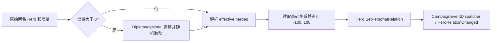

# ChangeRelationAction

**命名空间：** `TaleWorlds.CampaignSystem.Actions`  
**模块：** `TaleWorlds.CampaignSystem`  
**类型：** `public static class ChangeRelationAction`  
**基类：** 无  
**源文件：** `bin/TaleWorlds.CampaignSystem/TaleWorlds.CampaignSystem.Actions/ChangeRelationAction.cs`

## 一句话职责

在活动战役中把一次有明确来源的英雄关系增量结算为可保存的基础关系，先尊重当前外交模型对正向奖励和有效对象的决定，再发布让 UI、Behavior 和技能系统能够观察到的关系变化事件，避免调用者只改数据却遗漏战役反应。

## 概述

`ChangeRelationAction` 是英雄关系的战役写入边界，而不是 `Hero` 上可随意赋值的数字接口。它把调用者给出的原始双方和增量交给当前 Campaign 的外交模型处理，随后写入实际应承载关系的一对英雄，并发送关系变化事件。因此，一次正确调用不仅改变可保存的基础关系，也使订阅事件的任务、界面与角色成长逻辑看见同一笔业务结果。

## 心智模型：查询、计算与写入是三件事

`Hero.GetRelation`、[CharacterRelationManager](../../campaign/CharacterRelationManager/) 和 [DiplomacyModel](../../campaign/DiplomacyModel/) 都能帮助回答“现在关系是多少”或“这次应变多少”；它们不是世界变更的入口。已经决定要奖励、惩罚或反映谈判结果时，才使用 `ChangeRelationAction`。它同时保留原始双方与实际写入双方，因而下游能区分叙事来源和外交结算对象。

公开入口全部进入私有的 `ApplyInternal`：



正增量会先经过 `DiplomacyModel.GetRelationIncreaseFactor`，再以 `MBRandom.RoundRandomized` 取整；负数不走该倍率。若结果为零，Action 不写关系、也不发送事件。随后模型的 `GetHeroesForEffectiveRelation` 先把有 Clan 的原始英雄映射到 Clan Leader；若两边映射成同一个 Leader（例如同 Clan 的两名成员），它会恢复原始输入 pair，而不是尝试写一名 Leader 对自己的关系。玩家同伴与玩家的组合也是恢复原始 pair 的额外条件。真正读写的是该最终 effective pair。Action 先夹到 `-100..100`，`Hero.SetPersonalRelation` 又会按当前 DiplomacyModel 的最小/最大关系限制夹一次，再交给关系管理器保存。

## 何时使用，何时不要使用

- 对话、任务结算、选举结果或战后规则已经计算出“甲对乙增加/减少 N 点关系”时使用。
- `ApplyPlayerRelation` 是固定以 `Hero.MainHero` 为首个原始输入的便捷入口；`ApplyRelationChangeBetweenHeroes` 接受任意两名 Hero，包含 `Hero.MainHero`，适合调用方必须明确提供双方的关系结果；原生使节系统的周期性外交成果使用 `ApplyEmissaryRelation`。
- 不要用关系增量代替战争、媾和、王国归属或处决。它们分别属于 [DeclareWarAction](../DeclareWarAction/)、[MakePeaceAction](../MakePeaceAction/)、[ChangeKingdomAction](../ChangeKingdomAction/) 和 [KillCharacterAction](../KillCharacterAction/) 的完整状态机。
- 不要直接调用 `Hero.SetPersonalRelation` 或 `CharacterRelationManager.SetHeroRelation` 来实现游戏事件。虽然能改字典，但不会执行本 Action 的有效对象解析、正向倍率或关系变化事件，下游监听器和技能奖励会脱节。

## 依赖与反应链

| 位置 | 关联 | 为什么重要 |
| --- | --- | --- |
| 上游 | [Hero](../../campaign/Hero/) | 输入必须是当前 Campaign 已注册、仍可用于该业务流程的 Hero；玩家专属逻辑从 `Hero.MainHero` 获取。 |
| 计算 | [DiplomacyModel](../../campaign/DiplomacyModel/) | 决定正向关系的倍率、有效英雄映射和关系上下限；替换模型会改变实际结算，而不只是 UI 显示。 |
| 持久化 | [CharacterRelationManager](../../campaign/CharacterRelationManager/) | 以无向的 hero-id 对保存基础关系；存档加载与英雄注销也由它管理。 |
| 事件 | [CampaignEventDispatcher](../../campaign/CampaignEventDispatcher/) -> [CampaignEvents](../../campaign/CampaignEvents/) | 写入后广播 effective heroes、实际 delta、通知开关、detail 和原始 heroes。Behavior 应订阅公共 `CampaignEvents.HeroRelationChanged`。 |
| 后续行为 | [CharacterRelationCampaignBehavior](../../campaign/CharacterRelationCampaignBehavior/) | 监听事件；只在实际 delta 为正时调用 `SkillLevelingManager.OnGainRelation`。 |
| 保存 | [IDataStore](../../campaign/IDataStore/) | 关系本体已在 Campaign 的保存图中；mod 自己保存关系原因或待处理队列时必须遵守 Behavior 的 `SyncData` 生命周期。 |

## 三个公开入口

### `ApplyPlayerRelation`

```csharp
public static void ApplyPlayerRelation(
    Hero gainedRelationWith, int relation,
    bool affectRelatives = true, bool showQuickNotification = true)
```

固定以 `Hero.MainHero` 作为原始来源，适合玩家完成任务、得罪要人等结果。`showQuickNotification` 原样传入关系事件，允许监听者决定是否显示快速反馈。

`affectRelatives` 是必须注意的 1.4.5 兼容性陷阱：签名保留该参数，但当前 `ChangeRelationAction.cs` 没有读取它，传入 `true` 或 `false` 都不会在这个 Action 内传播亲属关系。不要据此承诺或依赖亲属扩散；如业务确实要逐人改变，应明确选取每名目标并分别应用正确的 Action。

### `ApplyRelationChangeBetweenHeroes`

```csharp
public static void ApplyRelationChangeBetweenHeroes(
    Hero hero, Hero gainedRelationWith, int relationChange,
    bool showQuickNotification = true)
```

用于任意两名 Hero 之间的因果关系，包含 `Hero.MainHero`。原生王国选举会用模型算出的支持/反对结果调用它，战后 perk 会把领队和适格要人传入；`BarterManager.ApplyOverpayBonus` 则以 `Hero.MainHero` 和交易对象调用它，结算玩家多付金钱的关系奖励。参数是原始叙事双方：不同 Clan 的成员通常以各自 Clan Leader 的基础关系结算；若两边解析为同一个 Leader，或输入为玩家同伴与玩家的组合，模型会恢复并持久化原始 pair。

### `ApplyEmissaryRelation`

```csharp
public static void ApplyEmissaryRelation(
    Hero emissary, Hero gainedRelationWith, int relationChange,
    bool showQuickNotification = true)
```

与普通双英雄入口的写入步骤相同，但事件 detail 为 `ChangeRelationDetail.Emissary`。原生 `EmissarySystemCampaignBehavior` 用它结算使节带来的关系收益；这个 detail 继续传给技能系统，使 `DiplomacyModel.GetCharmExperienceFromRelationGain` 能按使节来源处理奖励。不要为了获得不同经验语义而把普通任务奖励伪装成使节成果。

## 事件载荷与可观察副作用

成功的非零变更会经 dispatcher 触发 `CampaignEvents.HeroRelationChanged`：

```csharp
HeroRelationChanged(
    Hero effectiveHero, Hero effectiveTarget, int appliedChange,
    bool showQuickNotification, ChangeRelationDetail detail,
    Hero originalHero, Hero originalTarget)
```

`effectiveHero` 和 `effectiveTarget` 是实际保存关系的对象；`originalHero` 和 `originalTarget` 是调用者提供的对象。effective pair 往往是两位 Clan Leader，但若初始映射会让两端成为同一 Leader，或是玩家同伴与玩家的组合，它就是恢复后的原始 pair。监听器若为 UI 文案或任务归因服务，通常应保留原始双方；若为关系缓存、AI 或规则计算服务，则应理解已写入的是 effective pair。`appliedChange` 是正向倍率、随机取整和零短路之后的值，但它不表示最终存储值变化必然同样大，因为已处于边界时夹取可能吞掉部分增量。

关系增加还会被 `CharacterRelationCampaignBehavior` 接住，向技能等级管理器报告原始来源、effective target、实际增量和 detail。负增量没有这条 `OnGainRelation` 技能路径。`showQuickNotification` 也不是“静默模式”：它只是一项随事件交付的显示提示，事件仍会发送、Behavior 仍可运行。

## 有效 Hero、零值与边界

- 使用注册对象：在已启动的 Campaign Behavior、对话、任务或战役事件内从 `Hero.MainHero`、`Clan.Leader`、`Settlement.Notables`、`MobileParty.LeaderHero` 等真实来源取得 Hero。不要在 Campaign 未创建、读档尚未完成或对象注销后缓存/构造英雄来调用。
- 同 Clan 的两个成员不会被压缩成“Leader 对 Leader”的自关系：模型检测到相同的解析 Leader 后，最终持久化 pair 回退为调用者传入的两名 Hero。不要根据“有 Clan 就一定写 Leader”这一简化规则推断事件载荷或存档值。
- 传入 `0` 不会产生写入或事件；正数可能被模型倍率和随机取整变成 `0`，因此不能把一次调用当成“必定触发奖励”的保证。
- 负数直接进入有效对象解析和写入，仍会夹取。若当前关系已在下限，事件的 delta 仍是请求后的非零值，而底层值可能没有继续下降；监听器不应仅靠 delta 推导最终数值。
- 关系是无向的基础存储。不要试图分别给 A->B 与 B->A 写两套数值，也不要把有效关系、基础关系和 UI 中的派生结果混为一谈。

## 真实示例：玩家完成一次已结算的任务

下面的代码应在已运行的 Campaign Behavior 或任务完成回调中执行。目标来自已注册据点要人，且只在确定存在活动玩家和目标时应用一次：

```csharp
using System.Linq;
using TaleWorlds.CampaignSystem;
using TaleWorlds.CampaignSystem.Actions;

public static class VillageReward
{
    public static void RewardFirstNotable(Settlement settlement)
    {
        Hero target = settlement?.Notables.FirstOrDefault(hero => hero.IsAlive);
        if (Campaign.Current == null || Hero.MainHero == null || target == null)
        {
            return;
        }

        ChangeRelationAction.ApplyPlayerRelation(
            target, relation: 3, affectRelatives: false,
            showQuickNotification: true);
    }
}
```

这里的 `affectRelatives: false` 只是向读者声明业务意图；在 1.4.5 当前实现中它不改变结果。不要在 `DailyTick` 中无条件运行这种奖励，否则每个 tick 都会产生新的 Action、事件和潜在技能收益。

## 生命周期、存档与崩溃风险

- **阶段风险：** `ApplyInternal` 无 null 防护，且立即访问 `Campaign.Current.Models`、关系管理器和 dispatcher。只能在活动 Campaign 建立完成后调用，不要在 `OnSubModuleLoad`、菜单、Campaign 销毁或加载尚未重建模型/对象管理器时调用。
- **对象风险：** Action 不替你验证 `Hero` 是否为有效的已注册业务对象。英雄死亡、注销、换 Clan、读档重建后，之前缓存的引用可能不再适合作为新操作输入；在触发时重新从 Campaign 状态获取。
- **保存风险：** 关系字典本身会保存，直接写字典不仅漏事件，也可能把不应长期存在的对象对留进保存图。自定义 Behavior 若要保存“尚未兑现的关系奖励”，只保存稳定标识和数值，并在读档后的合适事件重新定位 Hero；不要在 `SyncData` 内立即补发 Action。
- **重入风险：** `HeroRelationChanged` 的监听器可能继续改变战役状态。避免监听该事件后无条件再调用本 Action，必须以明确的原因、守卫条件或一次性标记防止递归和双重奖励。

## 版本注记

本页以 1.4.5 源码为准。与 1.3.15 页面不同，不能假设 `affectRelatives` 会由这个 Action 执行亲属传播：1.4.5 的私有流程没有消费该参数。两个版本都应将关系变更视为 Action 边界，而不是 Hero 字典写入。

## 导航

- ↑ Parent: [Campaign extension API](../)
- ↔ Siblings: [DeclareWarAction](../DeclareWarAction/) · [MakePeaceAction](../MakePeaceAction/) · [ChangeKingdomAction](../ChangeKingdomAction/) · [KillCharacterAction](../KillCharacterAction/)
- Related: [Hero](../../campaign/Hero/) · [DiplomacyModel](../../campaign/DiplomacyModel/) · [CharacterRelationManager](../../campaign/CharacterRelationManager/) · [CampaignEvents](../../campaign/CampaignEvents/) · [CharacterRelationCampaignBehavior](../../campaign/CharacterRelationCampaignBehavior/) · [IDataStore](../../campaign/IDataStore/)
