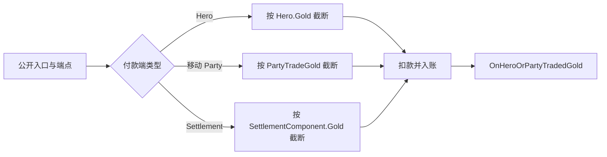

# GiveGoldAction

**命名空间：** `TaleWorlds.CampaignSystem.Actions`  
**模块：** `TaleWorlds.CampaignSystem`  
**类型：** `public static class GiveGoldAction`  
**源文件：** `bin/TaleWorlds.CampaignSystem/TaleWorlds.CampaignSystem.Actions/GiveGoldAction.cs`

## 职责

当一条战役规则已经决定要移动金币时，用这个 Action 结算。它更新一个受支持的付款端余额、更新一个受支持的收款端余额，并始终发布 `CampaignEvents.HeroOrPartyTradedGold`。它是交易的状态写入边界，不是查询余额的 API，也不是任意钱包。

## 心智模型：端点类型决定实际账户

所有公开入口都会进入私有的 `ApplyInternal`。端点元组要么是 `(Hero, null)`，要么是 `(null, PartyBase)`。Hero 端点使用 `Hero.Gold`；移动 Party 端点使用 `MobileParty.PartyTradeGold`；Settlement 端点则经其 `PartyBase` 使用 `Settlement.SettlementComponent.Gold`。

`PartyTradeGold` 并不总是独立的队伍钱包。1.4.5 中，只要领主队伍有 Leader，它的读取和写入就实际落到该 Leader 的 `Hero.Gold`；其他队伍使用私有的 party-trade 余额。Settlement 使用的是其经济组件余额，而不是拥有者 Hero 的钱包。因此传入某个 `PartyBase` 就是在选择一个真实但不同的战役账户。

这里没有 `Clan` 重载。`Clan.Gold` 只是 `Clan.Leader?.Gold` 的便利投影（没有 Leader 时为零）；它不是独立的 Clan 国库，也不能作为交易端点传给本 Action。当业务意图是“使用 Clan Leader 的钱”时，应取得当前的 `Clan.Leader` 并选择 Hero 入口。不要读取 `Clan.Gold` 后再额外修改 Leader，也不要把 Clan 建模成第四种账户。

普通入口中，私有方法先把正数请求金额按**付款端**余额截断，再给收款端入账；事件里也传递截断后的实际金额，而非请求金额：



## 依赖与反应链

Action 从活动 Campaign 接收已注册的 [Hero](../../campaign/Hero/)、[PartyBase](../../campaign/PartyBase/) 与 [Settlement](../../campaign/Settlement/) 对象。`PartyBase` 区分移动与据点分支，[MobileParty](../../campaign/MobileParty/) 则持有 `PartyTradeGold` 外观。写入后，[CampaignEventDispatcher](../../campaign/CampaignEventDispatcher/) 会把原始端点元组分发给 [CampaignEvents](../../campaign/CampaignEvents/) 及其接收者。因此一次付款同时关联可保存的战役状态和可观察的战役行为；绕开这个 Action 会让经济监听器没有交易可观察。

## 在业务决定之后使用，而不是用它作决定

- 在任务、交易、赎金、队伍开销或据点规则已经算出明确付款后调用。原生 Issue 奖励使用 `null` 付款端创造奖励；`SellItemsAction` 则在物品结算中使用据点到 Party、据点到 Hero、Party 到据点和 Party 到 Party 等入口。
- 从当前战役对象获取端点，例如 `Hero.MainHero`、`Hero.OneToOneConversationHero`、`PartyBase.MainParty`、`MobileParty.Party` 与 `Settlement.CurrentSettlement`。传入 Settlement 时，Action 使用的是它的 `Party` 端点。
- 不要拿它预览购买能力、设置经济预算、转移所有权或增加关系。先计算，再自行检查是否必须全额支付，只有确定结算时才调用一次。
- 不要为了正常转账直接拼接 `Hero.ChangeHeroGold`、`MobileParty.PartyTradeGold` 或 `SettlementComponent.ChangeGold`。这些辅助入口各自会维持本地非负逻辑，却不会选出配对端点、执行本 Action 的付款端截断、选择通知，或发布金币交易事件。

## 公开入口与可观察方向

应传入正数 `amount`。除 `ApplyForSettlementToCharacter` 外，每个入口的命名付款端就是私有方法的付款端；该入口是例外，1.4.5 的实现方式见后文。

| 入口 | 业务方向 | 底层账户与原生用例 |
| --- | --- | --- |
| `ApplyBetweenCharacters(giverHero, recipientHero, amount, disableNotification)` | 角色 -> 角色 | `Hero.Gold` 到 `Hero.Gold`；`null` 端点可用于奖励或销毁金币。原生 Issue 奖励使用 `null -> Hero.MainHero`。 |
| `ApplyForCharacterToSettlement(giverHero, settlement, amount, disableNotification)` | 角色 -> 据点 | Hero 金币到 `settlement.SettlementComponent.Gold`；锦标赛下注使用 `null` 付款端，把注金加入 `Settlement.CurrentSettlement`。 |
| `ApplyForSettlementToCharacter(giverSettlement, recipientHero, amount, disableNotification)` | 据点 -> 角色 | 业务意图如此；其内部元组和事件金额反向，见兼容性说明。`SellItemsAction` 在据点支付队长时使用它。 |
| `ApplyForSettlementToParty(giverSettlement, recipientParty, amount, disableNotification)` | 据点 -> Party | 据点组件金币到 Party 的 `PartyTradeGold`；`SellItemsAction` 据此支付卖方 Party。 |
| `ApplyForPartyToSettlement(giverParty, settlement, amount, disableNotification)` | Party -> 据点 | Party 交易金币到据点组件金币；原生售卖和修船流程使用它。 |
| `ApplyForPartyToCharacter(giverParty, recipientHero, amount, disableNotification)` | Party -> 角色 | Party 交易金币到 Hero 金币。 |
| `ApplyForCharacterToParty(giverHero, recipientParty, amount, disableNotification)` | 角色 -> Party | Hero 金币到 Party 交易金币；Issue Behavior 用 `Hero.MainHero -> IssueSettlement.Party` 支付替代方案费用。 |
| `ApplyForPartyToParty(giverParty, recipientParty, amount, disableNotification)` | Party -> Party | 两个 `PartyBase` 分别提供其移动或据点底层账户；商队物品售卖是原生 Party 到 Party 的例子。 |

这些接受 `PartyBase` 的入口不会验证该对象是否真是可用的移动 Party。内部代码只有在 `IsMobile` 或 `IsSettlement` 时才会修改 Party 端点。不能因为类型匹配，就传入未初始化、脱离战役或业务上无关的 Party。

## 金额校验、截断与据点到角色例外

普通正数交易以 `MathF.Min(sourceBalance, amount)` 截断付款端。Hero 和移动 Party 不会超过其当前暴露余额；据点付款端不超过 `SettlementComponent.Gold`。该 Action 没有返回实际金额，因此要求“必须全额付款”的规则必须在调用前检查预期付款账户，不能依据请求金额直接完成任务或购买。

`ApplyForSettlementToCharacter` 是 1.4.5 中必须注意的实现细节。它实际调用私有方法：

```csharp
ApplyInternal(recipientHero, null, null, giverSettlement.Party, -amount, showQuickInformation);
```

当公开金额为正数时，角色会增加 `amount`，Settlement 会减少 `amount`，而 `SettlementComponent.ChangeGold` 会把据点余额夹到零。因此这一入口**不会**执行普通的据点付款端截断。它发布的事件也是内部表示：`(recipientHero, null)` 被报告为 giver，`(null, giverSettlement.Party)` 被报告为 recipient，金额为负数。若监听器关心业务方向，不能假定每个事件元组都与公开方法名一致。

编译后的签名接受任意 `int`，但受支持的契约是 `amount > 0`；模组代码应拒绝 `amount <= 0`，若要真实反向付款，请显式交换端点。对于从 `-1` 到 `int.MinValue + 1` 的普通负数，普通入口会让命名付款端增加金币、命名收款端减少金币，且收款端仍受非负夹取。`ApplyForSettlementToCharacter` 会先计算 `-amount` 再进入私有方法，因此这些普通负数会变为正的内部角色到据点扣款，事件也呈现该反向方向。`int.MinValue` 是不受支持的边界：二进制补码取负可能仍为负数，不能据此段文字推断该值的方向或事件载荷。金额为零也会到达 dispatcher，不能把零金额调用当作无害探测。

## 事件与通知契约

余额更新后，每个入口都会调用：

```csharp
CampaignEventDispatcher.Instance.OnHeroOrPartyTradedGold(
    (giverHero, giverParty),
    (recipientHero, recipientParty),
    (actualAmount, transactionStringId),
    showQuickInformation);
```

dispatcher 会把它交给 `CampaignEventReceiver` 实现，并发布到 [CampaignEvents](../../campaign/CampaignEvents/) 的 `HeroOrPartyTradedGold`。公开入口没有暴露 `transactionStringId`，因此通过这些入口调用时该字符串为默认空值。

`disableNotification` 只决定最终的 `showQuickInformation`。仅当入口检查到相关 Hero 或 Party leader 为 `Hero.MainHero` 且该标志为 `false` 时才请求通知：角色到角色检查双方；角色到据点检查付款方；据点到角色检查公开收款方；据点到 Party、Party 到据点和 Party 到 Party 检查相关 Party leader；角色到 Party 检查两个相应玩家端点。`ApplyForPartyToCharacter` 还额外硬性要求 `giverParty != null`，并且 Party leader 为玩家或 `recipientHero == Hero.MainHero`。因此原生 `SiegeAftermathCampaignBehavior` 的 `ApplyForPartyToCharacter(null, key.LeaderHero, amount)` 奖励，即使 `key.LeaderHero` 是玩家也不会请求 quick information。它不会停止余额修改、dispatcher 或事件订阅者。各入口的 null 检查不同，只有源代码明确防护的可选端点才安全。

## 生命周期、存档与重入风险

- 只在 Campaign 和真实端点对象已经存在后调用。Action 会立刻访问端点图和 `CampaignEventDispatcher.Instance`，不适用于模块加载、主菜单、战役销毁，或读档中对象和事件接收器尚未重建的阶段。
- 金币属于 Campaign 序列化的 Hero、Party 和 Settlement 对象。自定义 Behavior 应通过 [IDataStore](../../campaign/IDataStore/) 保存奖励的稳定 ID、金额和一次性状态；读档后重新解析对象，并在合适的玩法时机结算。不要在 `SyncData` 中盲目重放付款，否则会重复扣款或奖励。
- `HeroOrPartyTradedGold` 订阅者还能继续改变战役状态。订阅者若再次调用 `GiveGoldAction`，必须有明确的业务守卫或一次性 key，否则一次付款可递归地产生更多付款。
- `null` giver 是原生奖励代码有意使用的铸币路径，`null` recipient 是销毁路径；它们不是临时钱包，也不能替代暂时不可用的真实付款人。

## 真实示例

### 向玩家结算一次 Issue 奖励

这遵循原生 `IssueBase` 的奖励方式。应在已完成的 Campaign 任务或 Behavior 结果中执行，而不是在重复 tick 中执行：

```csharp
using TaleWorlds.CampaignSystem;
using TaleWorlds.CampaignSystem.Actions;

if (Campaign.Current != null && Hero.MainHero != null && Hero.MainHero.IsAlive)
{
    GiveGoldAction.ApplyBetweenCharacters(
        giverHero: null,
        recipientHero: Hero.MainHero,
        amount: 250,
        disableNotification: false);
}
```

这里没有扣款账户，因为 `null` giver 就是明确选择的奖励来源。玩家获得 250 金币，订阅者也会收到正常交易事件。

### 从主 Party 支付当前据点

下面使用真实的 Party 和 Settlement 获取路径，并在提交 500 金币的全额港口修理费用前检查有效 Party 账户：

```csharp
using TaleWorlds.CampaignSystem;
using TaleWorlds.CampaignSystem.Actions;

Settlement settlement = Settlement.CurrentSettlement;
PartyBase payer = PartyBase.MainParty;

if (Campaign.Current != null && settlement != null && payer != null &&
    payer.IsMobile && payer.MobileParty.PartyTradeGold >= 500)
{
    GiveGoldAction.ApplyForPartyToSettlement(payer, settlement, 500);
}
```

若主 Party 是有 Leader 的领主 Party，上例检查的 `PartyTradeGold` 实际就是 Leader 的金币。因此调用 Action 后不能再额外扣一次 `Hero.MainHero.Gold`。

### 将 Clan Leader 作为真正的 Hero 端点

下面遵循源码中的 `Clan.Gold => Leader?.Gold ?? 0` 关系。交易两端仍然都是 Hero，Clan 只是获取对象的路径：

```csharp
Clan clan = Hero.MainHero?.Clan;
Hero clanLeader = clan?.Leader;

if (Campaign.Current != null && Hero.MainHero != null &&
    clanLeader != null && clanLeader != Hero.MainHero && clanLeader.Gold >= 500)
{
    GiveGoldAction.ApplyBetweenCharacters(clanLeader, Hero.MainHero, 500);
}
```

这不会创建 Clan 国库，也不会触发 Clan 专属事件。转账实际来自 Leader 的 `Hero.Gold`，因此应在结算时重新获取当前 Leader，并使用正常的 Hero 到 Hero 入口。

## 版本说明

本页描述 v1.4.5 实现。若目标是其他 Bannerlord 版本，请重新确认 `PartyTradeGold` 的底层规则、据点到角色的负内部调用，以及 `HeroOrPartyTradedGold` 的载荷。公开方法名表达业务意图；但凡事件监听器依赖元组方向，都应先检查目标版本源码。

## 导航

- ↑ 父级：[Campaign extension API](../)
- ↔ 同级：[ChangeRelationAction](../ChangeRelationAction/) · [ChangeKingdomAction](../ChangeKingdomAction/) · [DeclareWarAction](../DeclareWarAction/) · [KillCharacterAction](../KillCharacterAction/)
- 相关：[Hero](../../campaign/Hero/) · [PartyBase](../../campaign/PartyBase/) · [MobileParty](../../campaign/MobileParty/) · [Settlement](../../campaign/Settlement/) · [CampaignEventDispatcher](../../campaign/CampaignEventDispatcher/) · [CampaignEvents](../../campaign/CampaignEvents/) · [IDataStore](../../campaign/IDataStore/)
