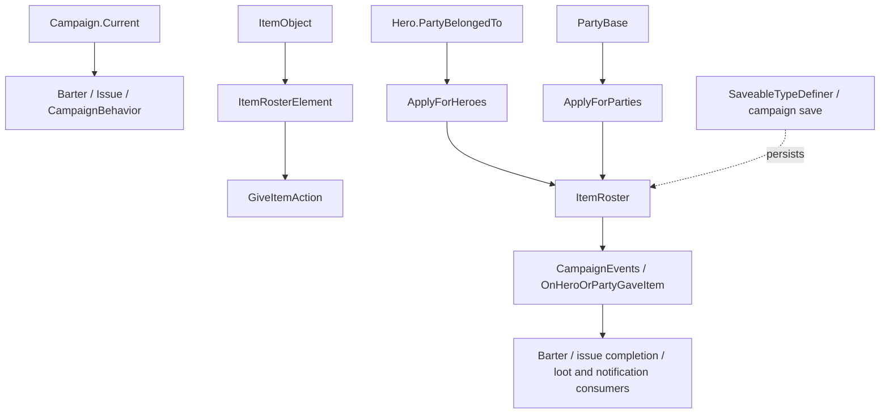

# GiveItemAction

**命名空间：** `TaleWorlds.CampaignSystem.Actions`  
**模块：** `TaleWorlds.CampaignSystem`  
**类型：** `public static class GiveItemAction`  
**基类：** 无（静态类）  
**源文件：** `TaleWorlds.CampaignSystem/TaleWorlds.CampaignSystem.Actions/GiveItemAction.cs`

## 一句话职责

把一笔已经确定收发双方、物品种类和数量的交付提交为战役状态变更：从交出方的 `ItemRoster` 扣除物品，向接收方名册写入结果，并以 `OnHeroOrPartyGaveItem` 同步通知依赖这笔交付的交易、任务和战役行为系统。

## 心智模型

这是一个无持久实例、调用即执行的 Campaign 层 Action。调用者先准备一个描述本次转移的 [`ItemRosterElement`](../../core-extra/ItemRosterElement)，再根据两端是 Hero 还是 Party 选择公开入口；`ItemRosterElement.Amount` 是要处理的数量，不是设置后的总数。Action 不创建物品、不寻找收发双方，也不替调用者确认数量和所有权。

英雄入口最终仍然通过各自 `Hero.PartyBelongedTo.Party.ItemRoster` 工作，所以“给英雄物品”并不代表英雄拥有一个独立于 Party 的物品名册。Party 入口直接改传入的 [`PartyBase`](../../campaign/PartyBase) 名册。成功路径同步改 roster，并立即广播事件；它不是一个排队到下个 Campaign tick 的请求。

## 何时用 / 何时不要用

- 用于 barter、任务奖励、村庄交换物资、劫掠交付等已经确定为“从一方拿出物品并交给另一方”的战役事务。
- 两个 Hero 都有有效 `PartyBelongedTo` 时用 `ApplyForHeroes`；两个明确的 Party 时用 `ApplyForParties`。不要把 Hero 和 Party 混入同一个入口。
- 不要直接对 `ItemRoster` 做两次算术来替代正式动作；至少要先验证交出方有足够数量，并让事件监听器看到同一笔交付。
- 不要用它改变 [`ItemObject`](../../core/ItemObject) 的定义、价格或物品模板；那是物品注册/配置问题，不是名册转移。
- 不要在存档加载、名册正在被 Party Screen 修改或同一事件回调重入时盲目调用。它没有幂等键，重复调用就是重复扣减/增加。

## 公开入口与时机

| 入口 | 参与方与实际副作用 | 正确时机 |
|---|---|---|
| `ApplyForHeroes(Hero giver, Hero receiver, in ItemRosterElement itemRosterElement)` | 要求两名 Hero 都属于 Party；从双方所属 Party 取得 roster。1.3.0、1.3.15 及权威 1.4.5 源码的反编译实现都对 giver 扣除数量，并对 receiver 所属 Party 再调用一次 `AddToCounts(..., -Amount)`；因此不能把它未经核验地当成安全的“增加接收方物品”接口。成功后广播 `OnHeroOrPartyGaveItem`。 | barter 把英雄物品交给另一英雄等，且调用前已验证双方归属、物品和数量；发布前应在目标游戏版本实测 roster 结果。 |
| `ApplyForParties(PartyBase giverParty, PartyBase receiverParty, in ItemRosterElement itemRosterElement)` | 从 giver 的 [`ItemRoster`](../ItemRoster) 扣除 `Amount`，向 receiver 的 roster 增加 `Amount`，随后广播 `CampaignEventDispatcher.Instance.OnHeroOrPartyGaveItem`；源码未替调用者做 null、所有权或库存数量校验。 | 任务交换、Party 间交易和战役行为已经拿到双方 Party，并确认交出方库存足够时。 |

两条入口都会把原因参数编码在事件携带的 giver/receiver 元组中：Party 入口传入 Hero 为 `null`，Hero 入口传入 Party 为 `null`。监听器应按实际非空对象处理，而不是假定事件永远同时带有 Hero 和 Party。

## 依赖



- **上游状态：** [`Campaign`](../../campaign/Campaign) 已启动后，调用者从 [`Hero`](../../campaign/Hero)、[`MobileParty`](../../campaign/MobileParty) 或 [`Settlement`](../../campaign/Settlement) 的真实 Party 路径获得参与方；物品本身由 [`ItemObject`](../../core/ItemObject) 和 [`ItemRosterElement`](../../core-extra/ItemRosterElement) 描述。
- **状态变更：** [`PartyBase`](../../campaign/PartyBase) 持有被修改的 [`ItemRoster`](../ItemRoster)。Hero 入口只是从 Hero 的 `PartyBelongedTo` 找到这个 Party。
- **下游事件：** `CampaignEventDispatcher.Instance.OnHeroOrPartyGaveItem` 同步触发 `CampaignEvents` 监听者；交易、Issue/Quest 行为和通知逻辑可据此继续结算。
- **存档关系：** roster 属于战役状态，最终由存档系统持久化；Action 本身没有 `SyncData`，也不会在读档后自动重放。需要保存模组额外的“为何交付”时，使用自己的 [`SaveableTypeDefiner`](../../save-system/SaveableTypeDefiner) 数据，而不要保存一个旧的 `ItemRosterElement` 再次 Apply。

## 风险边界

1. **接收方扣减是硬风险。** 权威 1.4.5 `GiveItemAction.cs` 的 Hero 分支具体执行 `giver.PartyBelongedTo.Party.ItemRoster.AddToCounts(..., -itemRosterElement.Amount)`，随后对 `receiver.PartyBelongedTo.Party.ItemRoster` 也执行负数。1.3.15 和 1.3.0 反编译源码相同。若这是游戏实际实现而非反编译误差，调用会减少接收方名册；因此发布 mod 前必须在目标版本用受控物品数量验证双方 roster，不能仅凭方法名推断“转移成功”。
2. Party 分支的正向增加只发生在 receiver roster；但实现没有检查 giver/receiver 是否为 `null`、是否为同一 Party、`Amount` 是否为正、giver 是否拥有足够物品。负数或超库存数量可能反向增加交出方、制造负库存或触发后续经济异常。
3. `ApplyForHeroes` 若任一 Hero 为 null，或任一 Hero 没有 `PartyBelongedTo`，不会进入安全的 Party 分支；公开方法仍会解引用 Hero。调用前必须确认两名 Hero 和所属 Party 都存在且处于有效战役生命周期。
4. 事件在 roster 写入后同步派发。监听器不要再次对同一清单调用 GiveItemAction，也不要假设回调期间双方名册仍是调用前快照；否则会重复转移或把事件级联变成递归。
5. 该 Action 不负责保存事务原因、交易价格、任务进度或技能经验。调用它替代官方 barter/issue 结算可能只改变名册，漏掉上游/下游的金币、关系和任务完成逻辑。

## 真实调用路径

下面保留 `VillageNeedsToolsIssueBehavior.GiveTradeOrExchangeRewardToMainParty` 的关键调用顺序：Issue 从 `questGiver.CurrentSettlement` 取得村庄，先把交换物品放进该 Settlement 的物品名册，再把 Settlement Party 交给主 Party。这里的 `AddToCounts` 是游戏原代码在 Action 前准备 giver 名册的步骤，不是把 Action 的内部校验补出来。

```csharp
using TaleWorlds.CampaignSystem;
using TaleWorlds.CampaignSystem.Actions;
using TaleWorlds.CampaignSystem.Party;
using TaleWorlds.Core;

public static void GiveTradeOrExchangeRewardToMainParty(
    Hero questGiver, int gold, ItemObject exchangeItem, int exchangeItemCount)
{
    if (exchangeItem != null)
    {
        questGiver.CurrentSettlement.ItemRoster.AddToCounts(exchangeItem, exchangeItemCount);
        ItemRosterElement element = new ItemRosterElement(exchangeItem, exchangeItemCount);
        GiveItemAction.ApplyForParties(questGiver.CurrentSettlement.Party, PartyBase.MainParty, in element);
    }
    else
    {
        GiveGoldAction.ApplyBetweenCharacters(null, Hero.MainHero, gold);
    }
}
```

这段路径对应源码中的 `VillageNeedsToolsIssueBehavior`：真实的 `Settlement.Party` 是 giver，`PartyBase.MainParty` 是 receiver。调用前必须确认 `CurrentSettlement`、物品和数量来自有效的 Issue 结算状态；原方法本身没有 null、数量或库存校验。

其他指定的真实调用点形成四条可复用路径：`ItemBarterable.Apply` 在 `_otherParty` 为空、交易对象是另一名 Hero 时构造 `ItemRosterElement` 并调用 `ApplyForHeroes`；`VillageNeedsCraftingMaterialsIssueBehavior.Success` 把 `PartyBase.MainParty` 的任务材料交给 `Settlement.CurrentSettlement.Party`；`VillagerCampaignBehavior` 和 `CaravansCampaignBehavior` 在离开劫掠/投降对话时，把 `MobileParty.ConversationParty.Party` 的每个物品元素交给 `Hero.MainHero.PartyBelongedTo.Party`。这些都是已建立 Campaign 交互上下文后的结算动作，不是每帧更新入口。

## 版本注记

本页放在 v1.3.15 文档树中，但语义核对以 v1.4.5 `TaleWorlds.CampaignSystem.Actions.GiveItemAction.cs` 为主。对照 1.3.0 和 1.3.15 源码，两个公开入口和内部 Hero/Party 分支保持一致，包括 Hero 分支的 receiver 负数 `AddToCounts`；因此不能把 v1.3.15 当成已修正版本。该页记录的是反编译源码可观察到的契约，实际发布前仍应对目标游戏二进制做最小库存测试。

## 导航

- **Parent：** [战役扩展 API](../)
- **Sibling：** [GiveGoldAction](../GiveGoldAction) · [ItemBarterable](../ItemBarterable) · [ChangeRelationAction](../ChangeRelationAction)
- **Children：** 无独立子页；两个公开入口已在本页分别说明
- **Related：** [Hero](../../campaign/Hero) · [MobileParty](../../campaign/MobileParty) · [PartyBase](../../campaign/PartyBase) · [Settlement](../../campaign/Settlement) · [ItemRoster](../ItemRoster) · [CampaignEvents](../CampaignEvents) · [存档类型定义](../../save-system/SaveableTypeDefiner)
