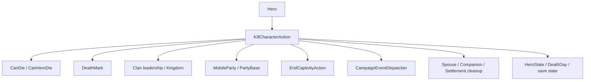

# KillCharacterAction

**命名空间:** `TaleWorlds.CampaignSystem.Actions`  
**模块:** `TaleWorlds.CampaignSystem`  
**类型:** `public static class KillCharacterAction`  
**基类:** 无（静态类）  
**源文件:** `bin/TaleWorlds.CampaignSystem/TaleWorlds.CampaignSystem.Actions/KillCharacterAction.cs`

## 一句话职责

它把一次英雄死亡从“允许死亡”推进到完整的世界清理、家族/派对级联、死亡事件和可存档状态，同时处理地图事件中的 DeathMark 延迟、主角保护与任务约束；调用者必须让 Action 统一完成这些关联对象的更新，而不是只改一个死亡标志。

## 心智模型

`KillCharacterAction` 不是把 `Hero.IsDead` 设为 `true` 的快捷函数，而是 Campaign 世界变更 Action。每个公开 `Apply*` 方法选择一个 `KillCharacterActionDetail` 和通知策略，再进入同一个内部流程。内部流程会先询问 [Hero](../../campaign/Hero/) 的 `CanDie`，然后根据英雄是否在地图事件/围城中决定立即死亡还是先写入 `DeathMark`。

正常死亡会触发 `OnBeforeHeroKilled`，给英雄写入死因和讣告，处理家族领袖、王国统治家族、金币、派对领导、囚禁、总督、配偶、Companion 和 Settlement 关系，再调用 `OnHeroKilled`。这条链会改变多个世界对象，因此不能用 `Hero.ChangeState(CharacterStates.Dead)` 代替。

### 何时用，何时不用

- **使用：** mod 确实要表达旧疾、战斗、谋杀、处决、难产、移除或已经记录的 DeathMark 导致的英雄死亡，并且当前处于 Campaign 世界逻辑阶段。
- **使用：** 调用前先过滤 `null`、`IsAlive` 和业务条件；对非强制死因可用 `victim.CanDie(detail)` 预先询问，但最终 Action 仍会再次检查。
- **不要直接改 `HeroState`、`DeathDay` 或 `DeathMark`：** 这会跳过派对 roster、俘虏、Clan 领导、王国继承、配偶/Companion 清理和死亡事件。
- **不要用 `ApplyByWounds` 表达“只受伤”：** 这个入口最终使用 `WoundedInBattle` 死因并完成死亡；只想让英雄受伤时使用 [Hero.MakeWounded](../../campaign/Hero/) 的明确受伤语义。
- **不要随意使用 `isForced`：** 强制入口可以绕过 `CanDie`，也可以绕过非强制的主角保护；它只适合原生已确定的移除、处决或疾病流程。

## 依赖图



### 上游

- [Hero](../../campaign/Hero/) 提供 `CanDie`、当前状态、Clan、Party、Governor、Spouse、Companion、DeathMark 和杀手引用。
- [CampaignEvents](../../campaign/CampaignEvents/) 的 `CanHeroDieEvent`/`HeroKilledEvent` 通过 [CampaignEventDispatcher](../../campaign/CampaignEventDispatcher/) 参与许可和通知链。
- 战斗、年龄、怀孕、叛乱、俘虏和派对流程会调用不同的 `Apply*` 入口；真实调用点包括 `AgingCampaignBehavior`、`PregnancyCampaignBehavior`、`MapEventSide`、`PartyScreenLogic` 和 `RebellionsCampaignBehavior`。

### 下游

- [ChangeClanLeaderAction](../ChangeClanLeaderAction/)、[ChangeRulingClanAction](../ChangeRulingClanAction/)、[DestroyKingdomAction](../DestroyKingdomAction/) 和 [DestroyClanAction](../DestroyClanAction/) 可能因领袖死亡触发政治级联。
- [DisbandArmyAction](../DisbandArmyAction/)、[DestroyPartyAction](../DestroyPartyAction/)、[EndCaptivityAction](../EndCaptivityAction/)、[RemoveCompanionAction](../RemoveCompanionAction/) 和 [ChangeGovernorAction](../ChangeGovernorAction/) 处理派对、囚禁、Companion 与总督关系。
- [SaveManager](../../save-system/SaveManager/) 保存最终的 Hero 状态和关联引用；自定义 Behavior 应监听事件并保存自己的稳定数据，不应复制死亡清理逻辑。

## DeathMark 与事件时机

死亡 Action 的“申请死亡”和“完成死亡”可能是两个时刻：

1. `ApplyInternal` 先调用 `victim.CanDie(actionDetail)`，除非 `isForced`。如果英雄已死亡则直接停止；有未完成 Issue Quest 的 Notable 也会触发断言保护。
2. 如果英雄仍在 MapEvent/SiegeEvent 中，或死因是 `ExecutionAfterMapEvent`，Action 会调用 `victim.AddDeathMark(killer, detail)` 并返回。此时英雄仍然活着，之后由地图事件或 [ApplyByDeathMark](#apply-入口) 再完成死亡。
3. 非强制主角死亡先调用 `OnBeforeMainCharacterDied` 并返回；它不是立即把主角标记为 Dead 的入口。
4. 普通路径先调用 `OnBeforeHeroKilled`，记录 DeathMark 和讣告，再更新 Clan、Party、囚禁和 Settlement 关系。
5. `MakeDead` 把状态改为 `Dead`、写入 `CampaignTime.Now`，结束囚禁、移除派对 roster，必要时更换派对领袖、解散或销毁派对。
6. 完成领导、配偶、Companion 和据点清理后，分发 `OnHeroKilled`；最后对非主角调用内部 `Hero.OnDeath`，清理技能、特质、HeroDeveloper 和部分运行时对象。

## Apply 入口

| 入口 | 死因/行为 | 典型时机与注意点 |
| --- | --- | --- |
| `ApplyByOldAge(Hero victim, bool showNotification = true)` | `DiedOfOldAge` | 年龄系统确定寿命结束时；仍会经过 `CanDie`，除非强制路径。 |
| `ApplyByWounds(Hero victim, bool showNotification = true)` | `WoundedInBattle` | 战斗伤势最终导致死亡时；名称不是“只造成伤口”。 |
| `ApplyByBattle(Hero victim, Hero killer, bool showNotification = true)` | `DiedInBattle` | 地图战斗结算时，killer 可以为 `null`。 |
| `ApplyByMurder(Hero victim, Hero killer = null, bool showNotification = true)` | `Murdered` | 已确定是谋杀的 Campaign 逻辑；killer 可选。 |
| `ApplyInLabor(Hero lostMother, bool showNotification = true)` | `DiedInLabor` | 怀孕/生产流程确认母亲死亡时。 |
| `ApplyByExecution(Hero victim, Hero executer, bool showNotification = true, bool isForced = false)` | `Executed` | 处决场景或地图结果；`isForced` 会绕过死亡许可和主角非强制保护。 |
| `ApplyByExecutionAfterMapEvent(Hero victim, Hero executer, bool showNotification = true, bool isForced = false)` | `ExecutionAfterMapEvent` | 地图事件结束后处理执行；普通调用会优先写 DeathMark。 |
| `ApplyByRemove(Hero victim, bool showNotification = false, bool isForced = true)` | `Lost` | 原生从派对/系统移除英雄；默认强制，不能当成无副作用的“删除记录”。 |
| `ApplyByDeathMark(Hero victim, bool showNotification = false)` | 使用英雄已保存的 `DeathMark` 与 `DeathMarkKillerHero` | 地图事件或年龄系统已经记录 DeathMark 后完成死亡；仍受 `CanDie` 影响。 |
| `ApplyByDeathMarkForced(Hero victim, bool showNotification = false)` | 使用已保存 DeathMark | 需要无视 `CanDie` 完成已确认的死亡标记时；风险高。 |
| `ApplyByPlayerIllness()` | 对 `Hero.MainHero` 使用 `DiedOfOldAge` | 原生玩家疾病流程；内部强制执行并显示通知，不应作为普通 NPC API。 |

## 风险边界

- **许可不是装饰：** `CanDie` 会受 `CampaignOptions.IsLifeDeathCycleDisabled` 和 `CanHeroDie` 事件影响。普通入口被拒绝时不会死亡；不要把“调用过 Action”当成“死亡已完成”。
- **强制路径：** `ApplyByExecution(..., isForced: true)`、`ApplyByExecutionAfterMapEvent(..., isForced: true)`、`ApplyByDeathMarkForced`、`ApplyByRemove` 默认路径和 `ApplyByPlayerIllness` 可以绕过 `CanDie`。只在原生流程已确认并且能承担世界级联时使用。
- **地图阶段：** MapEvent 或 SiegeEvent 中调用某些入口只会写 DeathMark 并返回。若 mod 在此时立刻假定 `IsDead`、删除派对成员或访问死亡日期，会和后续结算产生重复清理或错误状态。
- **主角保护：** 非强制调用主角时只触发 `OnBeforeMainCharacterDied`；不要在该回调里再次无条件调用同一 Action，否则可能递归或重复处理主角结局。
- **任务与 Notable：** 有 `IssueQuest` 的 Notable 不能随意杀死；源码会断言。这类内容应先结束或转移任务流程，而不是用 `isForced` 压过去。
- **政治和派对级联：** 领袖死亡可能选新 Clan/Kingdom 领袖、毁灭 Kingdom/Clan、解散 Army/Party、移除总督或把英雄金币转给 Clan 领袖。不要在仍遍历 Clan/Party 集合时并行修改这些对象。
- **死亡后的对象：** `Hero.OnDeath` 会把技能、特质、perk、开发者对象和战斗/日常装备等运行时数据清掉。`HeroKilledEvent` 监听器应只读取仍有意义的稳定数据，不能继续使用已清理的 `HeroDeveloper` 或装备引用。
- **存档一致性：** Action 更新 `HeroState`、`DeathDay`、DeathMark、派对 roster、囚禁和家族关系，这些会一起进入存档。不要只写 `DeathDay` 或直接把 Hero 从集合删除，否则可能形成坏档或读档时出现幽灵成员。
- **事件副作用：** `OnBeforeHeroKilled` 和 `OnHeroKilled` 监听器可以触发其它 Action。监听器应避免对同一 victim 重复执行死亡，并在读写自定义存档状态时使用稳定 StringId。

## 真实示例

### 从当前对话对象发起有条件的谋杀

```csharp
using TaleWorlds.CampaignSystem;
using TaleWorlds.CampaignSystem.Actions;

Hero victim = Hero.OneToOneConversationHero;
Hero killer = Hero.MainHero;
var detail = KillCharacterAction.KillCharacterActionDetail.Murdered;

if (victim != null && killer != null && victim != killer && victim.IsAlive && victim.CanDie(detail))
{
    KillCharacterAction.ApplyByMurder(victim, killer, showNotification: false);
}
```

这里的 victim 和 killer 都来自当前 Campaign 的真实静态入口。`CanDie` 只是提前检查；Action 内部仍会再次检查，并可能因为地图事件、主角保护或其它监听器而延迟或拒绝死亡。

### 对活跃领主使用处决入口

```csharp
using System.Linq;
using TaleWorlds.CampaignSystem;
using TaleWorlds.CampaignSystem.Actions;

Hero victim = Hero.AllAliveHeroes.FirstOrDefault(
    hero => hero.IsLord && hero.IsActive && hero != Hero.MainHero);

if (victim != null && victim.CanDie(KillCharacterAction.KillCharacterActionDetail.Executed))
{
    KillCharacterAction.ApplyByExecution(victim, Hero.MainHero, showNotification: false);
}
```

调用者必须准备好 Clan、Party、配偶和 Companion 级联，而不是只期待一个 `IsDead` 标志；如果目标正在地图事件中，Action 可能只留下 DeathMark，之后再由结算流程完成。

## 版本注记

本页依据 v1.4.5 `KillCharacterAction.cs` 的 `ApplyInternal`、`MakeDead`、死亡细节枚举和全部公开入口。跨版本 mod 应重新确认 `KillCharacterActionDetail`、主角保护、DeathMark 时机和死亡后的清理成员。

## Navigation

- ↑ Parent: [Campaign-Ext API](../)
- ↔ Siblings: [GiveGoldAction](../GiveGoldAction/) · [ChangeClanLeaderAction](../ChangeClanLeaderAction/) · [DestroyClanAction](../DestroyClanAction/) · [EndCaptivityAction](../EndCaptivityAction/)
- Related: [Hero](../../campaign/Hero/) · [CampaignEvents](../../campaign/CampaignEvents/) · [CampaignEventDispatcher](../../campaign/CampaignEventDispatcher/) · [ChangeRulingClanAction](../ChangeRulingClanAction/) · [DestroyKingdomAction](../DestroyKingdomAction/) · [DestroyPartyAction](../DestroyPartyAction/) · [RemoveCompanionAction](../RemoveCompanionAction/) · [SaveManager](../../save-system/SaveManager/)
