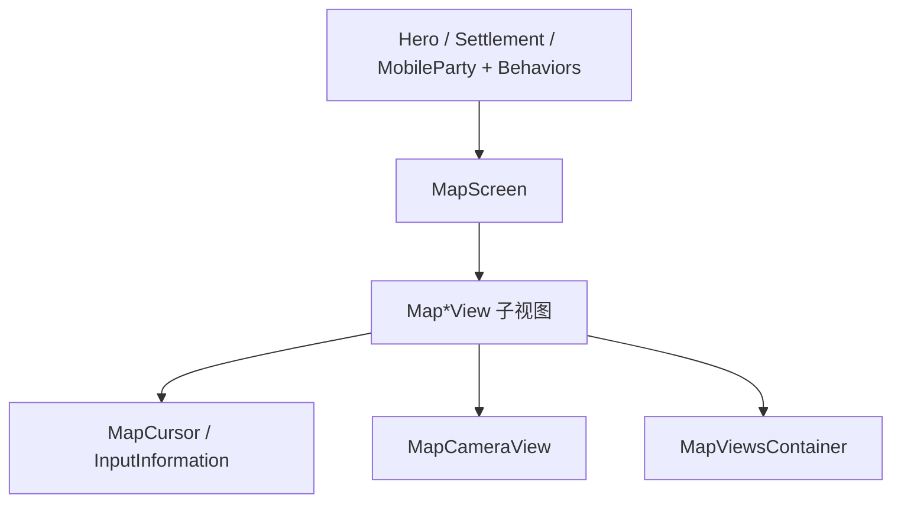

# 地图视图家族手册（SandBox.View.Map）

**一句话职责：** `SandBox.View.Map` 收纳战役地图（Campaign Map）的渲染与交互视图：从 `MapScreen` 总控制器到相机、光标、名牌、覆盖层、事件与天气等子视图。它们是把战役世界状态「画到地图上并让玩家点得动」的 UI 层。

## 心智模型

战役地图是一棵视图树：根节点 `MapScreen` 装配相机（`MapCameraView`）、基础渲染（`MapBasicView`）与一组可插拔子视图（`MapViewsContainer` 统一管理）。每个 `Map*View` 只负责一块可见/可交互区域（名牌、通知、覆盖层、对话），通过 `MapCursor`/`InputInformation` 拿到输入，并把点击结果交回战役层（通常触发 `CampaignMission`、Behaviour 或对话）。视图是 **纯表现 + 输入**，不应保存权威状态——权威状态在 `Hero`/`Settlement`/`MobileParty` 与 Behaviour 中。阅读顺序先看 [MapScreen](../../campaign-ext/MapScreen) 与 [MapView](../../campaign-ext/MapView) 基类，再按需查具体子视图；想接战役逻辑跳 [Behaviors](../behaviors/)。

## 何时使用

- 你要改的是「地图上看得见、点得动」的部分（高亮、名牌、弹窗、覆盖图形），而不是底层数据。
- 新加地图交互时优先继承 `MapView` 并在 `MapViewsContainer` 注册，复用既有相机与输入，不要自己另起渲染循环。
- 视图只读取战役状态并回发意图；不要在视图里直接写战役字段或自行持久化。

## 依赖关系

- 上游：[CampaignMission](../../campaign-ext/CampaignMission) 与战役 Behaviour 提供要呈现的状态。
- 下游：点击/输入经视图回发，驱动对话、菜单与 `*Action`。
- 邻接模块：[campaign-ext 总索引](../_index)、[Behaviors](../behaviors/)、[ViewModel 层](../../viewmodel/)。

## 地图视图类型（SandBox.View.Map）

| Type | Namespace | Purpose | Timing |
| --- | --- | --- | --- |
| `BattleSimulationMapView` | SandBox.View.Map | 战役地图上战斗模拟的视觉呈现：叠加战斗推演图标与进度 | 战斗推演时 |
| `BlockadePositionScript` | SandBox.View.Map | 封锁位置脚本：标记地图上可封锁/控制的位置并驱动其视觉与判定 | 封锁点配置 |
| `CameraFollowMode` | SandBox.View.Map | 地图相机跟随模式：定义相机锁定某实体（部队/英雄）时的移动与缩放 | 跟随目标时 |
| `CampaignEntityVisualComponent` | SandBox.View.Map | 战役实体在地图上的视觉组件：把 Hero/Party/Settlement 数据绑到地图可见对象 | 实体上图时 |
| `ConversationPlayArgs` | SandBox.View.Map | 对话播放参数：携带地图对话（求亲、谈判）所需的上下文与回调 | 对话启动前 |
| `DecalEntity` | SandBox.View.Map | 贴花实体：在地图地表绘制临时标记（路线、区域高亮）的可视对象 | 标记绘制时 |
| `DefaultMapConversationDataProvider` | SandBox.View.Map | 默认地图对话数据提供者：为地图对话界面供给选项与文本来源 | 对话数据装配 |
| `HeirSelectionPopupView` | SandBox.View.Map | 继承人选择弹窗视图：领主死亡后弹出并绑定继承流程的 UI | 继承触发 |
| `IMapConversationDataProvider` | SandBox.View.Map | 地图对话数据提供者接口：供不同对话场景注入各自的文本与分支 | 对话数据抽象 |
| `InputInformation` | SandBox.View.Map | 地图输入信息：汇总鼠标/手柄在地图上的指向与拾取结果供视图消费 | 每帧输入 |
| `MainMapCameraMoveEvent` | SandBox.View.Map | 主地图相机移动事件：相机平移/缩放时广播，供视图同步装饰层 | 相机移动时 |
| `MapBarView` | SandBox.View.Map | 地图底部信息条视图：显示选中实体的关键数值与快捷操作 | 实体选中 |
| `MapBasicView` | SandBox.View.Map | 地图基础视图：承载地图渲染、相机与基本交互的最小视图实现 | 视图树基件 |
| `MapCameraView` | SandBox.View.Map | 地图相机视图：专门管理地图相机的视角、边界与过渡 | 相机更新 |
| `MapCampaignOptionsView` | SandBox.View.Map | 地图战役选项视图：在地图界面提供存档/退出/设置等菜单入口 | 选项菜单 |
| `MapCheatsView` | SandBox.View.Map | 地图作弊视图：开发/调试用，在地图上提供加金、加经验等作弊按钮 | 调试开启 |
| `MapConversationMission` | SandBox.View.Map | 地图对话任务：把一段对话作为可在地图上触发的任务来驱动 | 对话任务 |
| `MapConversationTableau` | SandBox.View.Map | 地图对话立体像（tableau）：在对话界面渲染 3D 立绘/场景缩略 | 对话渲染 |
| `MapConversationTableauData` | SandBox.View.Map | 地图对话 tableau 数据：描述对话立绘所用的模型与角度参数 | 立绘配置 |
| `MapConversationView` | SandBox.View.Map | 地图对话视图：渲染地图上的对话面板与分支选项 | 对话进行 |
| `MapCursor` | SandBox.View.Map | 地图光标：处理鼠标在地图上的悬停、拾取与高亮反馈 | 指针移动 |
| `MapEncyclopediaView` | SandBox.View.Map | 地图百科视图：从地图入口打开实体百科条目的界面 | 打开百科 |
| `MapEscapeMenuView` | SandBox.View.Map | 地图 Esc 菜单视图：地图界面暂停时显示的退出/设置菜单 | 暂停时 |
| `MapEventVisualsView` | SandBox.View.Map | 地图事件视觉视图：把战役事件（战斗、决斗）呈现为地图图标与动画 | 事件广播 |
| `MapGamepadEffectsView` | SandBox.View.Map | 地图手柄特效视图：为手柄操作提供震动/光效等反馈层 | 手柄反馈 |
| `MapIncidentView` | SandBox.View.Map | 地图突发事件视图：渲染巡逻/盗匪等地图偶发事件标记与提示 | 事件出现 |
| `MapNotificationView` | SandBox.View.Map | 地图通知视图：在地图角落弹出任务/外交/系统通知气泡 | 通知到达 |
| `MapOverlayType` | SandBox.View.Map | 地图覆盖层类型枚举：区分不同叠加层（围城、旗帜、路径）的渲染类别 | 覆盖层分类 |
| `MapOverlayView` | SandBox.View.Map | 地图覆盖层视图：绘制并管理各类地图叠加图形（圈选、连线） | 覆盖层更新 |
| `MapParleyAnimationView` | SandBox.View.Map | 地图议和动画视图：在谈判/议和时播放双方代表的过场动画 | 议和演出 |
| `MapPartyNameplateView` | SandBox.View.Map | 地图部队名牌视图：在部队图标上绘制名称/领袖/人数名牌 | 部队渲染 |
| `MapReadyView` | SandBox.View.Map | 地图就绪视图：地图场景加载完成前的等待/过场界面 | 加载完成前 |
| `MapSaveView` | SandBox.View.Map | 地图存档视图：在地图界面提供手动存档与读档入口 | 存档菜单 |
| `MapScreen` | SandBox.View.Map | 地图主屏幕：战役地图总控制器，装配相机、视图与各叠加层 | 进入地图 |
| `MapSettlementNameplateView` | SandBox.View.Map | 地图据点名牌视图：在据点图标上绘制名称/归属/等级名牌 | 据点渲染 |
| `MapSiegeOverlayView` | SandBox.View.Map | 地图围城覆盖层视图：在地图上突出显示围城范围与攻防状态 | 围城时 |
| `MapTrackersView` | SandBox.View.Map | 地图追踪器视图：显示任务目标箭头与追踪标记层 | 任务追踪 |
| `MapView` | SandBox.View.Map | 地图视图基类：定义地图渲染循环的通用生命周期与可重写钩子 | 视图基类 |
| `MapViewsContainer` | SandBox.View.Map | 地图视图容器：统一管理所有地图子视图的注册、更新与释放 | 视图注册 |
| `MarriageOfferPopupView` | SandBox.View.Map | 求亲弹窗视图：联姻提议时弹出的接受/拒绝确认界面 | 求亲触发 |
| `SettlementPositionScript` | SandBox.View.Map | 据点位置脚本：定义据点在地图坐标系中的锚点与相关判定 | 据点布置 |
| `SnowAndRainTextureDefiner` | SandBox.View.Map | 雪雨纹理定义器：为地图天气效果提供雪/雨地表纹理的加载与切换 | 天气切换 |

## 风险与边界

- **视图不是数据源**：在 `Map*View` 里缓存或改写战役状态会造成地图与底层不一致；权威状态只由 Behaviour/`*Action` 维护。
- **注册与释放**：新视图必须经 `MapViewsContainer` 注册并在离开地图时释放，否则旧视图残留会导致空引用或重复渲染。
- **输入竞态**：`MapCursor` 与 `InputInformation` 每帧刷新，处理逻辑要避免在回调里直接触发重型战役写操作，应回发事件由 Behaviour 结算。
- **相机边界**：`MapCameraView` 的跟随/边界计算错误会导致相机飞出地图或卡死，需约束在地图范围内。

## 参见

- 总控制器与基类：[MapScreen](../../campaign-ext/MapScreen)、[MapView](../../campaign-ext/MapView)
- 上层驱动：[CampaignMission](../../campaign-ext/CampaignMission)
- 战役逻辑承接：[Behaviors](../behaviors/)、[ViewModel 层](../../viewmodel/)
