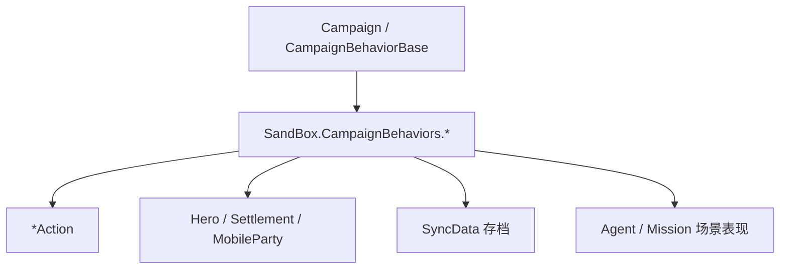

# SandBox CampaignBehaviors 家族手册

**一句话职责：** `SandBox.CampaignBehaviors` 是 SandBox 模块里「让战役世界有 NPC 与日常事件」的行为集合。它们继承 [CampaignBehaviorBase](../../campaign-ext/CampaignBehaviorBase)，在战役加载时注册、按事件订阅驱动世界状态：生成城镇市民/村民/卫兵/招募官、管理后巷与检查点、处理继承人选择与退役、驱动巢穴对话与潜行角色、收集统计。每个行为都通过 `*Action`/事件改世界，自身持有 `SyncData` 存档字段。

## 心智模型

把战役想成「一组 Behavior 各自负责一块世界内容」。每个 `XxxCampaignBehavior` 在 `RegisterEvents` 里订阅关注的战役事件，在回调中通过 `*Action` 或 `Campaign.Current` 改状态，并用 `SyncData` 持久化自己的字段。它们不直接互相调用，而是通过事件总线与共享实体（Hero/Settlement/MobileParty）协作。阅读顺序：先看 [CampaignBehaviorBase](../../campaign-ext/CampaignBehaviorBase) 了解行为契约与 `SyncData`，再看 [Agent](../../mission/Agent) 与 [Mission](../../mission/Mission) 了解 NPC 如何在场景中表现，最后回到本页按「人口生成 / 场景系统 / 剧情流程」找具体行为。

## 何时使用

- 你要新增一类「自动运转的世界内容」（定期生成某 NPC、响应某事件）——继承 `CampaignBehaviorBase` 并只订阅自己关心的事件。
- 改世界状态必须走 `*Action`（如 `GiveGoldAction`/`KillCharacterAction`），不要直接改 `Hero`/`Settlement`/`MobileParty` 字段，否则绕过事件、缓存与存档不变量。
- 行为必须实现 `SyncData` 持久化需要跨存档保留的字段，否则读档后世界状态错乱。

## 依赖关系

- 上游：[CampaignBehaviorBase](../../campaign-ext/CampaignBehaviorBase) 定义行为契约；[Campaign](../../campaign/Campaign) 提供当前战役上下文。
- 下游：通过 `*Action`/事件改 `Hero`/`Settlement`/`MobileParty`；NPC 在场景中由 [Agent](../../mission/Agent) 表现。
- 邻接模块：[mission-ext 总索引](../_index)、[Actions 总索引](../actions/)。

## SandBox Campaign Behavior 类型（SandBox.CampaignBehaviors）

| Type | Namespace | Purpose | Timing |
| --- | --- | --- | --- |
| `AlleyCampaignBehavior` | SandBox.CampaignBehaviors | 城镇后巷系统：生成后巷可交互物与 alley 数据，供潜行/支线使用。 | 城镇加载/进入 |
| `AlleyCampaignBehaviorTypeDefiner` | SandBox.CampaignBehaviors | 后巷行为的存档类型定义器（SaveableTypeDefiner），序列化后巷数据。 | 存档读写 |
| `BoardGameCampaignBehavior` | SandBox.CampaignBehaviors | 在城镇摆棋盘供玩家下棋（棋类小游戏入口）的战役行为。 | 城镇交互 |
| `CheckpointCampaignBehavior` | SandBox.CampaignBehaviors | 检查点系统：记录玩家在任务/场景中的检查点，支持重载与复活。 | 场景进出 |
| `ClanMemberRolesCampaignBehavior` | SandBox.CampaignBehaviors | 家族成员角色分配（族长/继承人/管理者）的管理行为。 | 家族变更 |
| `CommonTownsfolkCampaignBehavior` | SandBox.CampaignBehaviors | 城镇普通市民 NPC 的生成与日常管理（杂耍/闲逛市民）。 | 城镇加载 |
| `CommonVillagersCampaignBehavior` | SandBox.CampaignBehaviors | 村庄村民 NPC 的生成与日常管理（农夫/村民）。 | 村庄加载 |
| `ConversationAnimationToolCampaignBehavior` | SandBox.CampaignBehaviors | 对话动画工具：驱动对话中的角色动画与表情切换。 | 对话中 |
| `DefaultCutscenesCampaignBehavior` | SandBox.CampaignBehaviors | 默认过场动画的触发与管理（入场/胜利等通用演出）。 | 剧情触发 |
| `DefaultNotificationsCampaignBehavior` | SandBox.CampaignBehaviors | 默认系统通知（提示/事件播报）的战役行为。 | 事件播报 |
| `DumpIntegrityCampaignBehavior` | SandBox.CampaignBehaviors | 调试用完整性转储行为，校验/导出战役状态快照。 | 调试时 |
| `GuardsCampaignBehavior` | SandBox.CampaignBehaviors | 城镇卫兵 NPC 生成与巡逻调度。 | 城镇加载 |
| `HeirSelectionCampaignBehavior` | SandBox.CampaignBehaviors | 继承人选择流程（家族绝嗣/指定继承人）的战役行为。 | 家族事件 |
| `HideoutConversationsCampaignBehavior` | SandBox.CampaignBehaviors | 盗匪巢穴（Hideout）对话与支线入口的战役行为。 | 巢穴交互 |
| `PlayerAlleyData` | SandBox.CampaignBehaviors | 玩家后巷进度数据（记录已解锁的后巷内容），随存档保留。 | 读档/进度 |
| `RecruitmentAgentSpawnBehavior` | SandBox.CampaignBehaviors | 招募代理（招募官）NPC 的生成行为。 | 城镇加载 |
| `RetirementCampaignBehavior` | SandBox.CampaignBehaviors | 退役/养老系统：老兵退隐剧情的触发与状态管理。 | 退休事件 |
| `StatisticsCampaignBehavior` | SandBox.CampaignBehaviors | 战役统计收集（击杀/战损/经济）的战役行为。 | 每周期 |
| `StealthCharactersCampaignBehavior` | SandBox.CampaignBehaviors | 潜行角色（间谍/密探）生成与状态管理的战役行为。 | 城镇加载 |

## 风险与边界

- **必须走 \*Action**：在这些行为里直接改 `Hero`/`Settlement`/`MobileParty` 会绕过事件、缓存与存档不变量，可能导致坏档或地图状态不一致。
- **SyncData 缺失**：需要跨存档保留的字段若未放进 `SyncData`，读档后世界状态会错乱（NPC 重复生成或数据丢失）。
- **重复注册**：再次进入战役时若行为重复注册事件，会出现重复触发；`RegisterEvents` 需幂等。
- **Agent 引用失效**：由行为生成、在场景中表现的 NPC，任务结束/撤离后 `Agent` 引用失效，订阅必须及时退订。

## 参见

- 行为契约：[CampaignBehaviorBase](../../campaign-ext/CampaignBehaviorBase)
- 世界变更手段：[Actions 总索引](../actions/)
- 场景表现：[Agent](../../mission/Agent)、[Mission](../../mission/Mission)
