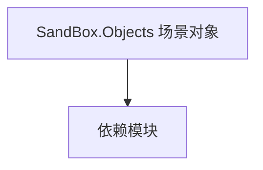

# SandBox.Objects 场景对象

**一句话职责：** 本页以家族索引形式覆盖 `SandBox.Objects 场景对象` 下全部 37 个业务类型，逐类给出命名空间、职责与典型时机，便于按模块而不是按字母表查阅。

## 心智模型

SandBox.Objects 是沙盒模块的场景实体与装置类型：可用机器（Usables）、动画锚点、区域标记等。它们挂载在场景 GameObject 上，由 MissionBehavior/AgentBehavior 在交互或触发时读取，是「场景表现」与「游戏逻辑」的连接点。多数对象只暴露状态与触发点，不持有规则。

## 何时使用

新增可交互场景物件或标记区域时，从对应 Usable/标记基类派生，并在逻辑层监听其触发事件。

## 依赖关系

`SandBox.Objects 场景对象` 的类型依赖以下模块；缺其中任一都会导致编译或运行期失败。

- [Mission 战斗场景](../../mission/Mission)
- [CampaignBehaviorBase](../../campaign-ext/CampaignBehaviorBase)
- [Campaign 扩展总览](../_index)

## 类型清单

| Type | Namespace | Purpose | Timing |
| --- | --- | --- | --- |
| `CheckpointArea` | SandBox.Objects | 场景对象相关类型，承载实体或装置 | 战役初始化期 |
| `DefaultMusicInstrumentData` | SandBox.Objects | 场景对象相关类型，承载实体或装置 | 战役初始化期 |
| `DynamicPatrolAreaParent` | SandBox.Objects | 场景对象相关类型，承载实体或装置 | 战役初始化期 |
| `GenericMissionEventBox` | SandBox.Objects | 场景对象相关类型，承载实体或装置 | 战役初始化期 |
| `GroupSpawnPoint` | SandBox.Objects | 场景可用装置，玩家交互时触发对应动作或菜单 | 战役初始化期 |
| `InstrumentData` | SandBox.Objects | 场景对象相关类型，承载实体或装置 | 战役初始化期 |
| `PassageUsePoint` | SandBox.Objects | 场景对象相关类型，承载实体或装置 | 战役初始化期 |
| `PatrolPoint` | SandBox.Objects | 场景对象相关类型，承载实体或装置 | 战役初始化期 |
| `SettlementMusicData` | SandBox.Objects | 场景对象相关类型，承载实体或装置 | 战役初始化期 |
| `StealthIndoorLightingArea` | SandBox.Objects | 场景对象相关类型，承载实体或装置 | 战役初始化期 |
| `StealthZone` | SandBox.Objects | 场景对象相关类型，承载实体或装置 | 战役初始化期 |
| `TeleportType` | SandBox.Objects | 场景对象相关类型，承载实体或装置 | 战役初始化期 |
| `TeleportUsePoint` | SandBox.Objects | 场景对象相关类型，承载实体或装置 | 战役初始化期 |
| `AnimationPoint` | SandBox.Objects.AnimationPoints | 场景对象相关类型，承载实体或装置 | 战役初始化期 |
| `ChairUsePoint` | SandBox.Objects.AnimationPoints | 场景对象相关类型，承载实体或装置 | 战役初始化期 |
| `DynamicObjectAnimationPoint` | SandBox.Objects.AnimationPoints | 场景对象相关类型，承载实体或装置 | 战役初始化期 |
| `ItemForBone` | SandBox.Objects.AnimationPoints | 场景对象相关类型，承载实体或装置 | 战役初始化期 |
| `PlayMusicPoint` | SandBox.Objects.AnimationPoints | 场景对象相关类型，承载实体或装置 | 战役初始化期 |
| `AnimatedBasicAreaIndicator` | SandBox.Objects.AreaMarkers | 场景对象相关类型，承载实体或装置 | 战役初始化期 |
| `BasicAreaIndicator` | SandBox.Objects.AreaMarkers | 场景对象相关类型，承载实体或装置 | 战役初始化期 |
| `CommonAreaMarker` | SandBox.Objects.AreaMarkers | 场景对象相关类型，承载实体或装置 | 战役初始化期 |
| `StealthAreaMarker` | SandBox.Objects.AreaMarkers | 场景对象相关类型，承载实体或装置 | 战役初始化期 |
| `WorkshopAreaMarker` | SandBox.Objects.AreaMarkers | 场景对象相关类型，承载实体或装置 | 战役初始化期 |
| `CinematicBurningArrow` | SandBox.Objects.Cinematics | 场景脚本组件，挂载到 GameObject 提供可重写逻辑 | 战役初始化期 |
| `HideoutBossFightBehavior` | SandBox.Objects.Cinematics | 场景脚本组件，挂载到 GameObject 提供可重写逻辑 | 战役初始化期 |
| `SkeletonAnimatedCamera` | SandBox.Objects.Cinematics | 场景脚本组件，挂载到 GameObject 提供可重写逻辑 | 战役初始化期 |
| `Chair` | SandBox.Objects.Usables | 场景可用装置，玩家交互时触发对应动作或菜单 | 战役初始化期 |
| `CheckpointUsePoint` | SandBox.Objects.Usables | 场景可用装置，玩家交互时触发对应动作或菜单 | 战役初始化期 |
| `DisguiseMissionUsePoint` | SandBox.Objects.Usables | 场景可用装置，玩家交互时触发对应动作或菜单 | 战役初始化期 |
| `MusicianGroup` | SandBox.Objects.Usables | 场景可用装置，玩家交互时触发对应动作或菜单 | 战役初始化期 |
| `Passage` | SandBox.Objects.Usables | 场景可用装置，玩家交互时触发对应动作或菜单 | 战役初始化期 |
| `PatrolArea` | SandBox.Objects.Usables | 场景可用装置，玩家交互时触发对应动作或菜单 | 战役初始化期 |
| `ShadowingSecureZoneUsePoint` | SandBox.Objects.Usables | 场景可用装置，玩家交互时触发对应动作或菜单 | 战役初始化期 |
| `SittableType` | SandBox.Objects.Usables | 场景对象相关类型，承载实体或装置 | 战役初始化期 |
| `SmithingMachine` | SandBox.Objects.Usables | 场景可用装置，玩家交互时触发对应动作或菜单 | 战役初始化期 |
| `StealthAreaUsePoint` | SandBox.Objects.Usables | 场景可用装置，玩家交互时触发对应动作或菜单 | 战役初始化期 |
| `UsablePlace` | SandBox.Objects.Usables | 场景可用装置，玩家交互时触发对应动作或菜单 | 战役初始化期 |

## 风险与边界

对象触发依赖场景加载与监听注册顺序，未就绪时事件会丢失；交互逻辑应幂等，重复触发不重复结算。可用机器状态需序列化以支持存档。

## 参见

- [Mission 战斗场景](../../mission/Mission)
- [CampaignBehaviorBase](../../campaign-ext/CampaignBehaviorBase)
- [Campaign 扩展总览](../_index)
