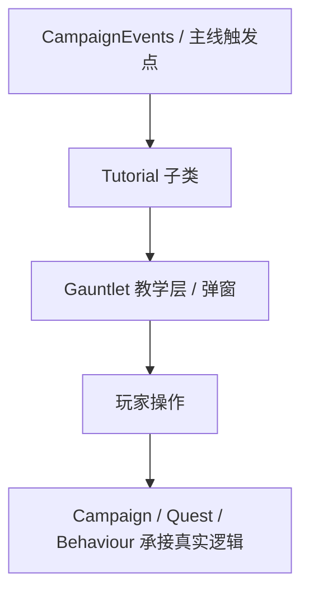

# 教学提示家族手册（StoryMode.GauntletUI.Tutorial）

**一句话职责：** `StoryMode.GauntletUI.Tutorial` 收纳主线战役为新玩家准备的「情境化教学弹窗」：每个 `XxxTutorial` 子类负责在玩家第一次遇到某机制时，弹出一个高亮/遮罩式提示，讲解一个具体操作（移动、征兵、布阵、潜行……）。它们是「教玩家怎么玩」的 UI 层，不是游戏逻辑本身。

## 心智模型

教学系统是一组**自描述、可激活、可结束**的步骤对象：基类 `Tutorial` 定义激活/结束生命周期与是否在满足条件时自动弹出；每个子类用自身类型名作为唯一键，由 StoryMode 在对应游戏事件（进入村庄、打开百科、第一次布阵……）触发时实例化并推到 Gauntlet 教学层。阅读顺序：先理解「教学是情境触发的一次性提示，不持有权威状态」，再按功能分组查具体子类；想接主线剧情跳 [Campaign](../../campaign/Campaign) 与 [CampaignEvents](../CampaignEvents)。不要把教学逻辑塞进 Behaviour 或 Quest——教学只负责「告诉玩家」，真正的状态变更仍由 Action/Behaviour 完成。

## 何时使用

- 你在主线里想为某个首次出现的机制（战斗命令、劫掠、锻造、潜行）加一段引导提示：继承 `Tutorial` 写一个子类即可。
- 教学只做「说明 + 高亮」，不要在教学里直接改写战役字段或启动重型流程；需要副作用时发事件交给 Behaviour。
- 同一机制拆成多步时，用 `Step1/Step2/Step3` 命名同一族，按顺序激活，避免一次性堆太长。

## 依赖关系

- 上游：[CampaignEvents](../CampaignEvents) 与主线各 Behaviour 在首次情境出现时激活对应 Tutorial。
- 下游：Gauntlet 教学弹窗把提示呈现给玩家，玩家操作回发到真实游戏系统。
- 邻接模块：[campaign-ext 总索引](../_index)、[Campaign](../../campaign/Campaign)、[Quest 体系](../../campaign-ext/quests/)。

## 教学提示类型（StoryMode.GauntletUI.Tutorial）

| Type | Namespace | Purpose | Timing |
| --- | --- | --- | --- |
| `ArmyCohesionStep1Tutorial` | StoryMode.GauntletUI.Tutorial | 教学（第1步）：向玩家解释军队凝聚力（cohesion）概念及其对士气的影响。 | 首次组建军队 |
| `ArmyCohesionStep2Tutorial` | StoryMode.GauntletUI.Tutorial | 教学（第2步）：演示如何维持/提升凝聚力（避免部队过度分散）。 | 凝聚力下降时 |
| `AssignRolesTutorial` | StoryMode.GauntletUI.Tutorial | 教学：在军队中分配单位角色（如前锋/弓手/医护），影响编队行为。 | 编队界面打开 |
| `BombardmentStep1Tutorial` | StoryMode.GauntletUI.Tutorial | 教学（第1步）：攻城时指挥投石机/火炮对城墙与防御工事进行轰炸。 | 首次攻城 |
| `BuyingFoodStep1Tutorial` | StoryMode.GauntletUI.Tutorial | 教学（第1步）：在城镇或村庄的面包房/集市购买粮食以补充部队补给。 | 进入补给商贩 |
| `BuyingFoodStep2Tutorial` | StoryMode.GauntletUI.Tutorial | 教学（第2步）：说明粮食价格随供需波动，囤粮时机影响成本。 | 打开交易界面 |
| `BuyingFoodStep3Tutorial` | StoryMode.GauntletUI.Tutorial | 教学（第3步）：演示将购买的粮食装入部队补给并影响行军持续力。 | 完成一次购买 |
| `ChoosingPerkUpgradesStep1Tutorial` | StoryMode.GauntletUI.Tutorial | 教学（第1步）：打开专长（perk）升级界面，介绍 perk 树结构。 | 首次可升级专长 |
| `ChoosingPerkUpgradesStep2Tutorial` | StoryMode.GauntletUI.Tutorial | 教学（第2步）：选择某个专长节点及其前置条件。 | 选择 perk 节点 |
| `ChoosingPerkUpgradesStep3Tutorial` | StoryMode.GauntletUI.Tutorial | 教学（第3步）：确认 perk 升级并查看对技能/战斗的影响。 | 确认升级 |
| `ChoosingSkillFocusStep1Tutorial` | StoryMode.GauntletUI.Tutorial | 教学（第1步）：选择技能专注点（skill focus），分配属性点。 | 升级后分配专注 |
| `ChoosingSkillFocusStep2Tutorial` | StoryMode.GauntletUI.Tutorial | 教学（第2步）：说明专注点如何提升对应技能上限与成长速度。 | 专注点说明 |
| `CraftingOrdersTutorial` | StoryMode.GauntletUI.Tutorial | 教学：向铁匠下达锻造订单，批量生产武器/部件。 | 打开铁匠菜单 |
| `CraftingStep1Tutorial` | StoryMode.GauntletUI.Tutorial | 教学（第1步）：进入锻造界面，选择部件组合打造自定义武器。 | 首次锻造 |
| `CreateArmyStep1Tutorial` | StoryMode.GauntletUI.Tutorial | 教学（第1步）：将多支部队合并为一支军队（army）并指定统帅。 | 首次合并部队 |
| `CreateArmyStep2Tutorial` | StoryMode.GauntletUI.Tutorial | 教学（第2步）：设置军队的 cohesive 行为与自动跟随。 | 军队编成 |
| `CreateArmyStep3Tutorial` | StoryMode.GauntletUI.Tutorial | 教学（第3步）：演示军队的维护消耗（食物/工资）与解散方式。 | 查看军队面板 |
| `CrimeTutorial` | StoryMode.GauntletUI.Tutorial | 教学：解释犯罪（偷窃/攻击平民）对声望、治安与法律后果的影响。 | 首次犯罪行为 |
| `EncyclopediaClansTutorial` | StoryMode.GauntletUI.Tutorial | 教学：使用百科查看家族（clan）信息与关系网。 | 打开百科家族页 |
| `EncyclopediaConceptsTutorial` | StoryMode.GauntletUI.Tutorial | 教学：百科中的概念（concepts）词条解释游戏机制。 | 打开概念词条 |
| `EncyclopediaFiltersTutorial` | StoryMode.GauntletUI.Tutorial | 教学：百科列表的筛选器用法。 | 百科列表界面 |
| `EncyclopediaFogOfWarTutorial` | StoryMode.GauntletUI.Tutorial | 教学：百科条目的战争迷雾（未探索区域信息隐藏）。 | 查看未探索条目 |
| `EncyclopediaHomeTutorial` | StoryMode.GauntletUI.Tutorial | 教学：百科主页导航与搜索入口。 | 首次打开百科 |
| `EncyclopediaKingdomsTutorial` | StoryMode.GauntletUI.Tutorial | 教学：查看王国（kingdom）条目与成员/外交信息。 | 打开王国页 |
| `EncyclopediaPageTutorialBase` | StoryMode.GauntletUI.Tutorial | 百科单页教学基类：定义百科教学弹窗的通用生命周期与触发条件。 | 百科教学框架 |
| `EncyclopediaSearchTutorial` | StoryMode.GauntletUI.Tutorial | 教学：百科的搜索功能。 | 百科搜索框 |
| `EncyclopediaSettlementsTutorial` | StoryMode.GauntletUI.Tutorial | 教学：查看据点（settlement）百科条目。 | 打开据点页 |
| `EncyclopediaSortTutorial` | StoryMode.GauntletUI.Tutorial | 教学：百科列表的排序功能。 | 百科列表界面 |
| `EncyclopediaTrackTutorial` | StoryMode.GauntletUI.Tutorial | 教学：将百科条目加入追踪（track）列表。 | 追踪按钮 |
| `EncyclopediaTroopsTutorial` | StoryMode.GauntletUI.Tutorial | 教学：查看部队/兵种（troops）百科条目。 | 打开兵种页 |
| `EnterVillageTutorial` | StoryMode.GauntletUI.Tutorial | 教学：进入村庄（village）并与村民/村长交互。 | 首次进村 |
| `EquipmentSetsTutorial` | StoryMode.GauntletUI.Tutorial | 教学：保存与切换装备方案（equipment sets），快速换装部队。 | 打开装备界面 |
| `GettingCompanionsStep1Tutorial` | StoryMode.GauntletUI.Tutorial | 教学（第1步）：在酒馆/城镇结识并邀请同伴（companion）。 | 首次招同伴 |
| `GettingCompanionsStep2Tutorial` | StoryMode.GauntletUI.Tutorial | 教学（第2步）：同伴的属性/技能与编入队伍。 | 同伴入队 |
| `GettingCompanionsStep3Tutorial` | StoryMode.GauntletUI.Tutorial | 教学（第3步）：同伴晋升为指挥官（party leader）。 | 委任指挥官 |
| `InventoryBannerItemTutorial` | StoryMode.GauntletUI.Tutorial | 教学：物品栏中的旗帜（banner）物品及其自定义。 | 获得旗帜物品 |
| `KingdomDecisionVotingTutorial` | StoryMode.GauntletUI.Tutorial | 教学：作为王国成员对决策（kingdom decision）投票。 | 王国决策开启 |
| `MovementInMissionTutorial` | StoryMode.GauntletUI.Tutorial | 教学：战斗中移动单位（WASD/手柄）与镜头控制。 | 首次进入战斗 |
| `NavigateOnMapTutorialStep1` | StoryMode.GauntletUI.Tutorial | 教学（第1步）：在战役地图上移动部队与缩放/平移相机。 | 首次上地图 |
| `NavigateOnMapTutorialStep2` | StoryMode.GauntletUI.Tutorial | 教学（第2步）：地图路径点设置与规避危险区域。 | 地图移动中 |
| `OrderHideoutTutorial` | StoryMode.GauntletUI.Tutorial | 教学：对藏匿点（hideout）下达清剿命令。 | 接近藏匿点 |
| `OrderOfBattleTutorialStep1Tutorial` | StoryMode.GauntletUI.Tutorial | 教学（第1步）：战前布阵（order of battle）界面入门。 | 首次布阵 |
| `OrderOfBattleTutorialStep2Tutorial` | StoryMode.GauntletUI.Tutorial | 教学（第2步）：拖拽部队到阵位并分配战线。 | 布阵编辑 |
| `OrderOfBattleTutorialStep3Tutorial` | StoryMode.GauntletUI.Tutorial | 教学（第3步）：保存阵型预设并应用。 | 保存阵型 |
| `OrderTutorialStep1` | StoryMode.GauntletUI.Tutorial | 教学（第1步）：对选中部队下达移动/冲锋/驻扎等命令。 | 选中部队 |
| `OrderTutorialStep2` | StoryMode.GauntletUI.Tutorial | 教学（第2步）：编队（formation）与阵型命令。 | 编队命令 |
| `PartySpeedTutorial` | StoryMode.GauntletUI.Tutorial | 教学：部队移动速度的影响因素（地形/负重/士气/马匹）。 | 查看部队速度 |
| `PressLeaveToReturnFromMissionTutorial1` | StoryMode.GauntletUI.Tutorial | 教学（第1步）：战斗中按离开键返回/退出任务菜单。 | 战斗中按离开 |
| `PressLeaveToReturnFromMissionTutorial2` | StoryMode.GauntletUI.Tutorial | 教学（第2步）：确认退出战斗后的结算与存档。 | 退出确认 |
| `QuestScreenTutorial` | StoryMode.GauntletUI.Tutorial | 教学：任务（quest）界面导航与追踪目标。 | 打开任务界面 |
| `RaidVillageStep1Tutorial` | StoryMode.GauntletUI.Tutorial | 教学（第1步）：劫掠村庄（raid）的操作与后果（关系/声望）。 | 首次劫掠 |
| `RansomingPrisonersStep1Tutorial` | StoryMode.GauntletUI.Tutorial | 教学（第1步）：在俘虏界面选择赎回（ransom）俘虏。 | 打开俘虏界面 |
| `RansomingPrisonersStep2Tutorial` | StoryMode.GauntletUI.Tutorial | 教学（第2步）：赎回成本与俘虏归属（释放/加入队伍）。 | 确认赎回 |
| `RecruitmentStep1Tutorial` | StoryMode.GauntletUI.Tutorial | 教学（第1步）：在村庄/城镇征兵（recruit）平民为部队。 | 首次征兵 |
| `RecruitmentStep2Tutorial` | StoryMode.GauntletUI.Tutorial | 教学（第2步）：征兵上限与耗时随声望/繁荣变化。 | 征兵进行中 |
| `SeeMarkersInMissionTutorial` | StoryMode.GauntletUI.Tutorial | 教学：战斗中查看目标/友军/敌军标记（markers）。 | 进入战斗 |
| `StealthCrouchTutorial` | StoryMode.GauntletUI.Tutorial | 教学：潜行时下蹲（crouch）降低被发现概率。 | 潜行中下蹲 |
| `StealthDarkZoneTutorial` | StoryMode.GauntletUI.Tutorial | 教学：利用黑暗区域（dark zone）隐蔽移动。 | 进入暗区 |
| `StealthDistractionTutorial` | StoryMode.GauntletUI.Tutorial | 教学：制造分心（distraction）引开守卫。 | 潜行干扰 |
| `StealthHideCorpseTutorial` | StoryMode.GauntletUI.Tutorial | 教学：藏匿尸体（hide corpse）避免暴露行踪。 | 击杀后 |
| `StealthHideInBushesTutorial` | StoryMode.GauntletUI.Tutorial | 教学：躲入灌木丛（bushes）隐蔽。 | 潜入灌木 |
| `StealthStealthKillTutorial` | StoryMode.GauntletUI.Tutorial | 教学：潜行击杀（stealth kill）无声消灭目标。 | 背后接近 |
| `StealthWalkSlowTutorial` | StoryMode.GauntletUI.Tutorial | 教学：潜行时慢走（walk slow）减少脚步声。 | 潜行移动 |
| `TakingPrisonersTutorial` | StoryMode.GauntletUI.Tutorial | 教学：战斗中俘虏（take prisoners）敌人单位。 | 击溃敌军 |
| `TalkToNotableTutorialStep1` | StoryMode.GauntletUI.Tutorial | 教学（第1步）：与城镇名流（notable）对话开启任务/贸易。 | 首次对话名流 |
| `TalkToNotableTutorialStep2` | StoryMode.GauntletUI.Tutorial | 教学（第2步）：名流好感度与解锁的选项。 | 名流选项 |
| `UpgradingTroopsStep1Tutorial` | StoryMode.GauntletUI.Tutorial | 教学（第1步）：将低阶兵种升级（upgrade）为高阶。 | 首次升级 |
| `UpgradingTroopsStep2Tutorial` | StoryMode.GauntletUI.Tutorial | 教学（第2步）：升级所需经验/资源与耗时。 | 升级条件 |
| `UpgradingTroopsStep3Tutorial` | StoryMode.GauntletUI.Tutorial | 教学（第3步）：批量升级与编队维持。 | 批量升级 |

## 风险与边界

- **教学不是逻辑**：在 `XxxTutorial` 里直接改写战役状态、启动任务或调用 Action 会破坏「教学只提示」的边界，并可能在读档后重复触发；需要副作用时发事件交给 Behaviour/Quest。
- **重复触发**：教学按类型名做一次性/条件激活，若触发条件写得过宽会在每次进入情境时反复弹窗，干扰玩家；用 `CanBeShown` 之类守卫控制。
- **顺序族**：`Step1/2/3` 必须按预期顺序激活，跳步会让玩家缺失前置知识；激活逻辑要显式管理进度。
- **UI 生命周期**：教学弹窗由 Gauntlet 教学层管理，关闭/重开战役时要正确结束（End），避免残留遮罩挡住正常交互。

## 参见

- 总索引：[campaign-ext](../_index)
- 上层驱动：[Campaign](../../campaign/Campaign)、[CampaignEvents](../CampaignEvents)
- 承接任务逻辑：[Quest 体系](../../campaign-ext/quests/)
