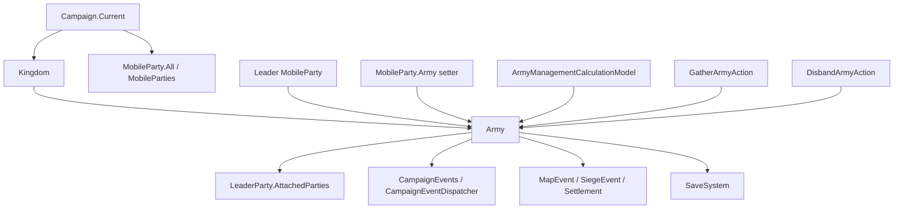

# Army

**命名空间:** TaleWorlds.CampaignSystem
**模块:** TaleWorlds.CampaignSystem
**类型:** public class Army : ITrackableCampaignObject, ITrackableBase
**基类:** ITrackableCampaignObject、ITrackableBase
**源文件:** bin/TaleWorlds.CampaignSystem/TaleWorlds.CampaignSystem/Army.cs

## 一句话职责

Army 是王国为一个领袖 MobileParty 组织的地图军团状态机。它把“哪些队伍属于军团”“谁带队”“要去哪个据点”“军团还能维持多久”连接起来，并在周期 tick、地图事件和成员变化中决定继续集结、完成目标还是通过解散 Action 清理关系。

## 心智模型

### 它不是独立的编制表

一个可用的军团至少依赖三条互相同步的关系：

1. Kingdom.Armies 持有军团，Army.Kingdom 的 setter 会调用王国的内部添加/移除逻辑。
2. LeaderParty.Army 指向军团。MobileParty.Army 的 setter 会回调 Army.OnAddPartyInternal 或 Army.OnRemovePartyInternal，所以不能只改 Army.Parties 来“加入”或“退出”。
3. Army.Parties 保存所有 Army 引用指向该军团的队伍；LeaderParty.AttachedParties 只表示已经通过 AttachedTo 合并跟随的队伍。队伍可以已经是军团成员、但暂时还没有合并到领袖的运行时队形。

因此，Army 是一个带有地图行为的短期关系对象，不是玩家可以随意 new 出来后手工填几个属性的永久容器。正常创建由 Kingdom.CreateArmy 负责，它调用构造函数、Gather 和 OnArmyCreated；构造函数又立即把领袖的 Army 设为当前对象，进而建立第一条成员关系。

### 生命周期

```text
Kingdom.CreateArmy
  -> new Army(kingdom, leaderParty, type)
  -> LeaderParty.Army = this，注册领袖并订阅周期事件
  -> Gather，选择集结点并发出 OnArmyGathered
  -> 等待成员 / 移动 / 战斗目标
  -> FinishArmyObjective，清目标并让领袖 Hold
     或选择对应原因的 DisbandArmyAction.ApplyBy 方法 -> 清空关系并停止周期事件
```

- **创建者与持有者：** Kingdom.CreateArmy 是游戏流程使用的入口；王国持有 Armies，每个成员 MobileParty 反向持有 Army。
- **运行时驱动：** Army 自己注册每小时 HourlyTick 和每 0.1 小时的 Tick，同时监听据点所有权变化与围城开始。MobileParty 的 AI 行为还会在 AiArmyMemberBehavior 中根据领袖重新计算护送目标。
- **何时使用：** 读取正在运行的军团状态、判断一个队伍是否是领袖、读取总兵力/凝聚力/士气、创建玩家军团，或在确实需要外部解散时调用有明确原因的 DisbandArmyAction。
- **何时不要使用：** 不要直接 new Army、直接清空 Parties、直接把 AttachedTo 或 Army 的一侧置空，也不要把 FinishArmyObjective 当作解散。需要改变世界关系时让 Kingdom.CreateArmy、GatherArmyAction、DisbandArmyAction 和 MobileParty.Army 的既有级联完成工作。

## 父级与依赖

### 依赖关系



### 上游

- [Campaign](../Campaign) 提供 Campaign.Current、Kingdoms、MobileParties、地图模型和读档后重新连接对象的流程。
- [Kingdom](../Kingdom) 的 Armies 是军团的父级集合；Kingdom.CreateArmy 才是正常的创建路径。
- [MobileParty](../MobileParty) 的 Army setter 维护队伍到军团的双向关系；[PartyBase](../PartyBase) 提供队伍的兵员和战斗统计。
- Hero 作为 ArmyOwner 和 LeaderParty.LeaderHero 提供领袖、家族和影响力上下文，详见 [Hero](../Hero)。

### 下游

- [CampaignEvents](../CampaignEvents) 接收军团创建、集结、加入、移除和解散等生命周期通知；Army 内部也通过 CampaignEventDispatcher 更新军团覆盖层。
- [MapEvent](../MapEvent) 与 [SiegeEvent](../SiegeEvent) 会暂停或改变军团的周期处理、集结目标和解散判断。
- [ArmyManagementCalculationModel](../ArmyManagementCalculationModel) 决定呼叫队伍、影响力成本、每日凝聚力变化和等待时长等规则。
- [GatherArmyAction](../../campaign-ext/GatherArmyAction) 负责集结事件入口；[DisbandArmyAction](../../campaign-ext/DisbandArmyAction) 负责带原因的解散入口。
- [SaveManager](../../save-system/SaveManager) 负责存档体系；军团的引擎周期事件是缓存数据，不能当成自定义存档字段。

## 获取与创建

### 从当前战役和队伍反查军团

MobileParty.All 是 Campaign.Current.MobileParties 的静态代理。下面的路径只读取当前战役中仍然注册的队伍，再从真实的 party.Army 反查军团；通过领袖和非空成员表过滤掉解散后的残留引用。

```csharp
using System.Linq;
using TaleWorlds.CampaignSystem;
using TaleWorlds.CampaignSystem.Party;

public static Army FindLiveArmy()
{
    if (Campaign.Current == null)
    {
        return null;
    }

    MobileParty party = MobileParty.All.FirstOrDefault(candidate => candidate.Army != null);
    Army army = party?.Army;
    if (army == null || army.LeaderParty == null || army.Parties.Count == 0)
    {
        return null;
    }

    return army;
}
```

遍历王国军团时也可以沿父级走 Campaign.Current.Kingdoms -> kingdom.Armies。不要把上一次战役或上一次读档得到的 Army 引用缓存成永久句柄；读档后应重新从当前 Campaign 和 MobileParty 集合获取。

### 通过王国创建玩家军团

创建前先让当前 ArmyManagementCalculationModel 判断玩家是否可以创建，再从当前战役选一个未被围攻的要塞作为真实目标，最后交给 Kingdom.CreateArmy。这个入口会建立领袖关系、初始化凝聚力、订阅事件并调用 Gather。

```csharp
using System.Linq;
using TaleWorlds.CampaignSystem;
using TaleWorlds.CampaignSystem.ComponentInterfaces;
using TaleWorlds.CampaignSystem.Party;
using TaleWorlds.CampaignSystem.Settlements;
using TaleWorlds.Localization;

public static Army TryCreatePlayerArmy()
{
    if (Campaign.Current == null)
    {
        return null;
    }

    ArmyManagementCalculationModel model = Campaign.Current.Models.ArmyManagementCalculationModel;
    TextObject disabledReason;
    if (!model.CanPlayerCreateArmy(out disabledReason))
    {
        return null;
    }

    Kingdom kingdom = Clan.PlayerClan?.Kingdom;
    MobileParty mainParty = MobileParty.MainParty;
    Settlement target = Campaign.Current.Settlements.FirstOrDefault(
        settlement => settlement.IsFortification && !settlement.IsUnderSiege);

    if (kingdom == null || mainParty == null || mainParty.LeaderHero == null || target == null)
    {
        return null;
    }

    kingdom.CreateArmy(mainParty.LeaderHero, target, Army.ArmyTypes.Besieger);
    return mainParty.Army;
}
```

这段代码必须运行在已经有 Campaign.Current 的战役阶段。CanPlayerCreateArmy 会拒绝王国为空、佣兵、已是自己军团领袖、在海上、被俘、在 Mission、地图事件或围城等状态；如果模组还要创建 AI 军团，应使用同一个 Model 的 CanLordCreateArmy，不要复制其资格判断。

## 核心状态

### 成员与领袖

| 成员 | 真实语义、时机与副作用 |
| --- | --- |
| Parties | `MBReadOnlyList<MobileParty>` 只读视图，来自内部 _parties。构造时领袖通过 LeaderParty.Army = this 进入列表；之后任何 party.Army = this 都会追加。它包含军团登记成员，不等于已经合并的 AttachedParties。 |
| LeaderParty | 军团的移动、目标和许多计算都以此队伍为中心。EstimatedStrength、总人数、目标文本和解散判断都直接访问它；活跃军团中不要假设它可以为 null，解散或领袖移除后不要继续调用实例方法。 |
| ArmyOwner | 构造时取 LeaderParty.LeaderHero，用于名称、百科链接和影响力上下文；领袖英雄可能在后续失效，因此 UI/日志读取时仍应判空。 |
| LeaderPartyAndAttachedPartiesCount | 领袖加已附属队伍的数量；食物问题的“过半队伍饥饿”判断使用这个运行时队形，而不是 Parties.Count。 |
| DoesLeaderPartyAndAttachedPartiesContain(MobileParty) | 检查给定队伍是领袖还是当前已附属队伍。它不检查“只登记但尚未 AttachedTo 的成员”，需要这种检查时直接查 Parties。 |

### 归属、目标与显示

| 成员 | 真实语义、时机与副作用 |
| --- | --- |
| Kingdom | setter 先从旧王国移除，再加入新王国的内部 _armies；不要自己同时编辑 Kingdom.Armies。解散时它被置为 null。 |
| ArmyType | Besieger、Raider、Defender、Patrolling 四种工作类型，NumberOfArmyTypes 只是枚举计数。SetPartyAiAction 在领袖改为防守、袭击或围城时同步更新它。 |
| AiBehaviorObject | 当前 AI 目标的 IMapPoint。当玩家是成员但不是领袖时，setter 会注册/取消注册目标聚落的视觉跟踪；许多长周期文本和集结代码按 Settlement 使用它，所以不要把不匹配的地图点塞进正在执行据点行为的军团。 |
| Name、EncyclopediaLinkWithName | UpdateName 按领袖英雄或领袖主人生成“领袖 Army”文本；百科链接来自 ArmyOwner。名称是显示状态，不是稳定存档 ID。 |
| GatheringPositionMinDistanceToTheSettlement、GatheringPositionMaxDistanceToTheSettlement | 根据 Campaign.Current.GetAverageDistanceBetweenClosestTwoTownsWithNavigationType(LeaderParty.NavigationCapability) 计算集结半径，分别是 0.1 和 0.2 倍；导航能力不同，结果也不同。 |

### 凝聚力、士气与聚合统计

| 成员 | 真实语义、时机与副作用 |
| --- | --- |
| Cohesion | 当前军团凝聚力，构造时为 100。每小时加上 DailyCohesionChange / CampaignTime.HoursInDay；低于 50 时可能考虑用领袖家族影响力补充，低于 30 且不在战斗/围城时会触发凝聚力解散。直接写 setter 会绕过成本和模型，除非是在明确实现自己的受控规则，否则不要改。 |
| DailyCohesionChange、DailyCohesionChangeExplanation | 通过 Campaign.Current.Models.ArmyManagementCalculationModel.CalculateDailyCohesionChange 得到当前规则结果；后者带解释项，适合 UI 和诊断。它们不是固定配置，换 Model 后会变化。 |
| CohesionThresholdForDispersion | 从 Model 读取的公开阈值，默认模型返回 10。它与 Army 内部每小时使用的 50、30 和 0.1 分支不是同一个常量，模组不能把它误读成所有解散判断的唯一阈值。 |
| Morale、RecalculateArmyMorale() | Morale 是 Parties 中各队伍 Morale 的平均值，私有 setter 只由重算方法写入。军团为空时不应调用重算；解散清空 _parties 后，旧引用不再是有效运行时对象。 |
| EstimatedStrength、CalculateCurrentStrength() | 前者汇总领袖和 AttachedParties 的 Party.EstimatedStrength，后者汇总对应 Party.CalculateCurrentStrength()。一个是估算值，一个是当前计算值；二者都依赖有效的 LeaderParty 和队形。 |
| GetCustomStrength(BattleSideEnum, MapEvent.PowerCalculationContext) | 对领袖和附属队伍调用 Party.GetCustomStrength 并求和，必须使用真实的战斗方向和 MapEvent.PowerCalculationContext，不要用它代替军团生命周期操作。 |
| TotalHealthyMembers、TotalManCount、TotalRegularCount | 汇总领袖与附属队伍的健康人数、总人数和正规兵人数；它们反映当前附属队形，不是对所有 Parties 登记成员的无条件求和。 |
| IsReady | 当前 1.4.5 源码直接返回 true，是 ITrackableCampaignObject 相关读取的就绪标志，不代表军团已经集结完成。是否等待成员应调用 IsWaitingForArmyMembers()。 |

## 构造与引擎事件订阅

### 构造函数做了什么

Army(Kingdom kingdom, MobileParty leaderParty, ArmyTypes armyType) 的顺序决定了很多不变量：

1. 先通过 Kingdom = kingdom 把军团放入王国的 Armies。
2. 创建 _parties，记录创建时间并保存领袖。
3. 执行 LeaderParty.Army = this。MobileParty.Army setter 会回调 OnAddPartyInternal，因此领袖进入 Parties，并发出加入军团事件。
4. 从领袖取得 ArmyOwner，生成 Name，设置 ArmyType，注册周期事件，最后把 Cohesion 设为 100。

这也是为什么不应在构造函数外部自行拼装 Army：只赋 Kingdom、只填 LeaderParty 或只把队伍加入列表，都会跳过另一侧的同步和事件。

### 事件与周期任务

AddEventHandlers 使用非存档的引擎缓存事件：

- _hourlyTickEvent 每 1 个 Campaign 小时调用 HourlyTick；首次等待时间按 _creationTime 对齐到下一个小时。
- _tickEvent 每 0.1 个 Campaign 小时调用 Tick，首次等待为 1 小时。它负责把满足距离、目标和海陆条件的成员通过 AddPartyToMergedParties 变成附属队伍。
- CampaignEvents.OnSettlementOwnerChangedEvent 和 CampaignEvents.OnSiegeEventStartedEvent 监听目标据点变化；军团正在等待成员、目标相同且领袖没有地图事件/围城时，会重新选择集结点。

这些 handler 被 CachedData 标记，OnAfterLoad() 会在 Campaign.InitializeCampaignObjectsOnAfterLoad() 遍历 Kingdoms 和 Armies 时重新调用 AddEventHandlers。事件引用不会随存档保存，不能在 SyncData 中自行序列化，也不要在自己的 Behavior 中重复为同一个 Army 注册这些内部 handler。

## 集结、移动与目标完成

### Gather

Gather(Settlement initialHostileSettlement, MBReadOnlyList<MobileParty> partiesToCallToArmy = null) 不是“把所有附近队伍瞬移到领袖身边”的方法：

- AI 领袖会以 initialHostileSettlement 为焦点，在王国要塞中选择一个未被围攻且适合的集结点；没有候选时退回到离领袖最近的要塞。它随后设置 AiBehaviorObject，把领袖移动到据点门口附近的可达点。
- 玩家领袖不会使用这个参数选敌对目标，而是从玩家队伍附近寻找要塞或村庄作为集结点，找不到时退回最近地图点。
- 对非玩家领袖，如果传入 partiesToCallToArmy，方法会逐个执行 item.Army = this。这走的是 MobileParty.Army 的双向回调，不应在外部复制成对列表操作。
- 最后调用 GatherArmyAction.Apply(LeaderParty, gatheringPoint)。在 1.4.5 的 Action 实现中，它的核心工作是向 CampaignEventDispatcher 发出 OnArmyGathered；候选队伍登记和集结位置选择仍由 Army.Gather 完成。

### 等待成员与 0.1 小时 Tick

IsWaitingForArmyMembers() 只有在 _armyGatheringStartTime 已设置时才计算强度比：

```text
军团当前强度 / Parties 中所有队伍估算强度之和
```

在 Model 的 MaximumWaitTime 之前，比例必须超过 0.9 才算不再等待；超过等待时长后，门槛从 0.75 随时间继续下降。默认 DefaultArmyManagementCalculationModel.MaximumWaitTime 是 3 个 Campaign 日，但这是可替换 Model 的结果，不是 Army API 的固定保证。

每 0.1 小时的 Tick 只合并满足以下条件的成员：仍有 Army、没有 AttachedTo、短期目标是领袖、没有地图事件、且海陆状态与领袖一致，并且在当前陆地/海上遭遇距离内。AddPartyToMergedParties 只设置 mobileParty.AttachedTo = LeaderParty，同时在主队加入军团时通知 MapState；它不会再次把队伍加入 Parties。

### FinishArmyObjective

FinishArmyObjective() 只做两件事：让领袖 SetMoveModeHold()，并把 AiBehaviorObject 置为 null。它适合表达“当前围城/袭击/防守目标完成，军团停止追逐目标”，不等于 Disperse。领袖被移除时，OnRemovePartyInternal 会先完成目标，再根据领袖是否还有英雄选择 ApplyByArmyLeaderIsDead 或 ApplyByObjectiveFinished。

## HourlyTick 与自动解散边界

每小时处理遵循以下顺序：

1. 如果领袖正在 MapEvent，或领袖所在据点正在围城，立即返回；这一小时不重算士气/凝聚力，也不做自动解散。
2. 重算平均士气，按当前 Model 增加每日凝聚力的小时份额。
3. AI 领袖（不是玩家主队）检查集结计时、移动集结点、低凝聚力补充；当凝聚力低于 30 且不在地图事件/围城时，调用 DisbandArmyAction.ApplyByCohesionDepleted。
4. 如果军团是围城者且另一个敌军正在围攻同一目标，调用 FinishArmyObjective，而不是立即解散。
5. 检查饥饿、无有效战争、凝聚力、领袖活跃度和不活跃计数，再发放袭击村庄/围攻要塞的影响力奖励。

CheckArmyDispersion 对玩家领袖和 AI 领袖有不同边界：

| 条件 | 源码行为 |
| --- | --- |
| 玩家领袖 | 只有凝聚力不高于 0.1 时触发凝聚力解散；它不会走 AI 的食物、无战争和不活跃分支。 |
| AI 领袖：过半队伍饥饿 | 统计领袖加 AttachedParties，饥饿数量超过一半时 ApplyByFoodProblem。 |
| AI 领袖：无有效战争 | 以 25% 随机机会检查所属派系是否没有正在交战且拥有领地的敌人；满足时 ApplyByNoActiveWar。 |
| AI 领袖：凝聚力耗尽或领袖失活 | 凝聚力不高于 0.1 用 ApplyByCohesionDepleted；领袖不活跃用 ApplyByUnknownReason。 |
| AI 领袖：不活跃 | 不在等待成员时，Hold、对非敌对据点 GoToSettlement、PatrolAroundPoint 增加计数；攻击、袭击、围城、防守和 EngageParty 减少计数。计数达到 CampaignTime.HoursInDay * 2 后用 ApplyByInactivity。 |

这些判断不是模组应该通过直接设置 Cohesion、IsActive 或 Parties 来绕过的开关。若要改变规则，优先替换 ArmyManagementCalculationModel；若要表达一次明确的世界变化，调用带具体原因的 DisbandArmyAction.ApplyBy 方法。

## Action、Model 与事件的边界

### ArmyManagementCalculationModel

通过 Campaign.Current.Models.ArmyManagementCalculationModel 读取当前装配的规则实现。抽象契约包含：

- AIMobilePartySizeRatioToCallToArmy、PlayerMobilePartySizeRatioToCallToArmy：AI/玩家候选队伍的规模门槛。
- MinimumNeededFoodInDaysToCallToArmy、MaximumDistanceToCallToArmy：候选队伍的食物和距离门槛。
- AverageCallToArmyCost、InfluenceValuePerGold、CalculatePartyInfluenceCost、CalculateTotalInfluenceCost：呼叫成员和补凝聚力的影响力成本。
- CohesionThresholdForDispersion、MaximumWaitTime：对外暴露的凝聚力/等待规则。
- CalculateDailyCohesionChange、CalculateNewCohesion、GetCohesionBoostInfluenceCost：凝聚力计算和解释。
- CanPlayerCreateArmy、CanLordCreateArmy、CheckPartyEligibility：创建和邀请前置条件。

Army 直接依赖其中的每日凝聚力、总影响力成本、单队伍影响力成本和等待时长。Model 返回的是规则结果，不会自动创建军团、加入队伍或解散军团；这些状态变化仍由 Kingdom.CreateArmy、MobileParty.Army 和 Action 完成。替换 Model 时必须保留非空、可用的实现，不能让 Campaign.Current.Models.ArmyManagementCalculationModel 解析为 null。

### Action 与内部方法

| 目标 | 应使用的入口 | 不能混淆的边界 |
| --- | --- | --- |
| 创建军团 | Kingdom.CreateArmy | 不要把公开构造函数当成完整创建流程；创建还需要 Gather 和 OnArmyCreated。 |
| 发起集结 | Army.Gather，内部调用 GatherArmyAction.Apply | GatherArmyAction.Apply 在当前源中主要广播 OnArmyGathered，不是通用的候选队伍筛选器。 |
| 明确解散 | DisbandArmyAction.ApplyByObjectiveFinished、ApplyByCohesionDepleted、ApplyByFoodProblem 等 | DisperseInternal 是 internal，负责清理底层关系和周期事件；mod 不应直接调用。 |
| 影响力补凝聚力 | BoostCohesionWithInfluence 由内部决策调用 | 方法会扣除领袖家族影响力并递增内部 boost 次数；不要传入未按 Model 计算的成本。 |
| 改变领袖 AI 目标 | 使用队伍的移动/AI Action，让领袖状态和 ArmyType/AiBehaviorObject 一起更新 | 只写 AiBehaviorObject 可能使目标类型与 DefaultBehavior 不一致。 |

解散 Action 会先按原因处理玩家影响力和对成员领袖的关系成本（玩家战后释放的原因），再进入 DisperseInternal。解散时 CampaignEventDispatcher 先发出 OnArmyDispersed，随后逐个把成员的 Army 置空、清 _parties、从王国移除，并停止两个周期事件。

## 成员变更与地图同步

### 加入、合并与移除

- OnAddPartyInternal 把队伍加入 _parties，让 AI 在下一个每小时 tick 重新思考，发出 OnPartyJoinedArmy；非玩家领袖军团还会按 Model 扣除呼叫该队伍的家族影响力。
- OnRemovePartyInternal 先从 _parties 移除、恢复队伍 AI 倡议、发出 OnPartyRemovedFromArmy，再清除 AttachedTo。领袖被移除、玩家被俘、成员不足或领袖死亡都可能进入对应解散 Action。
- 当成员是玩家主队时，加入/离开会同步地图状态和相机；玩家作为非领袖加入 AI 军团时，AiBehaviorObject 还会注册视觉跟踪。
- GetRelativePositionForParty 计算队伍在军团队形中的相对位置，使用领袖朝向、海陆导航网格和地图寻路结果。它不是一个可以在战役对象尚未进入地图时调用的纯数学 helper。

### 地图改变后的恢复

Campaign.CheckMapUpdate 会遍历 Campaign.Current.Kingdoms 和每个 kingdom.Armies，调用 CheckPositionsForMapChangeAndUpdateIfNeeded()。该方法在领袖位置不适合当前导航类型时，把领袖移到可达导航网格，并把附属队伍同步到新位置；SetPositionAfterMapChange 也会同步领袖与附属队伍。

调用这些方法前必须确保地图场景、Campaign.Current.Models.PartyNavigationModel 和 LeaderParty 都仍然有效。解散事件之后不要继续用旧 Army 调整位置。

## 存档、读档与崩溃风险

### 存档重建

源码把 _parties、创建时间、集结时间、解散标志、boost 次数、Kingdom、AiBehaviorObject、不活跃计数以及 ArmyType、ArmyOwner、Cohesion、Morale、LeaderParty、Name 标记为可存档成员。_hourlyTickEvent 和 _tickEvent 是 CachedData，不能保存。

读档后 Campaign.InitializeCampaignObjectsOnAfterLoad 先初始化 Campaign 对象，再遍历每个王国的 Armies 调用 army.OnAfterLoad() 重新订阅事件。自定义 Behavior 不要保存 Army、CampaignEvent 或 MobileParty 的对象引用；保存稳定的 StringId/英雄或队伍标识，在读档完成事件之后重新从当前 Campaign 查找。

### 必须守住的运行时不变量

- **LeaderParty 非空：** 强度、文本、地图位置、集结和多数 tick 分支都直接解引用它。领袖被移除后会进入解散路径；不要在 OnArmyDispersed 中继续调用这些成员。
- **Parties 在活跃军团中非空：** 构造时领袖会先加入；但解散会清空列表。不要在成员移除事件里假设列表仍可用于重算平均士气或总强度。
- **AiBehaviorObject 与 AI 行为匹配：** 围城、袭击、防守和巡逻文本会把它当作 Settlement 使用；错误地图点或在完成目标后继续调用长周期文本可能导致转换/空引用风险。
- **Campaign.Current 与地图场景必须存在：** DailyCohesionChange、集结距离、寻路、视觉跟踪和相对队形都依赖当前战役和地图。不要在主菜单、模块加载早期、读档尚未完成或 OnDestroy 后访问。
- **不要绕过 MobileParty.Army setter：** 直接改底层关系会漏掉 OnPartyJoinedArmy、OnPartyLeftArmy、影响力、AI 重算、地图覆盖层和相机同步，造成状态不一致或坏档。
- **不要把完成目标当解散：** FinishArmyObjective 只清目标；解散必须走 DisbandArmyAction，否则周期事件和王国/队伍关系仍然存活。
- **不要缓存跨读档实例：** 存档会重建 Army、MobileParty、Kingdom 和缓存事件。跨读档保留旧对象引用，可能读到已脱离世界的队伍或触发空引用。

## 公开入口速查

| 入口 | 调用时机 |
| --- | --- |
| ToString() | 日志或 UI 需要军团显示名称时使用；结果来自 Name。 |
| UpdateName() | 领袖名称/主人变化后刷新显示；它不改变领袖或王国关系。 |
| GetNotificationText() | 活跃的 AI 领袖军团需要“正在集结”通知时使用；玩家领袖返回 null，且目标应仍然有效。 |
| GetLongTermBehaviorText(bool setWithLink = false) | UI 读取玩家或 AI 当前长期行为文本；它会检查目标、据点、地图事件和围城状态，不能当作纯持久字段。 |
| Gather(Settlement, `MBReadOnlyList<MobileParty>`) | 创建军团或重新组织集结流程；先确认目标、领袖和候选队伍处于 Campaign 合法阶段。 |
| IsWaitingForArmyMembers() | 判断是否仍在按 Model 等待成员；不能用 Parties.Count 单独替代。 |
| FinishArmyObjective() | 结束当前目标并 Hold；不释放成员、不清王国列表。 |
| GetRelativePositionForParty(MobileParty, Vec2) | 地图队形布局需要领袖朝向和有效导航场景时使用。 |
| AddPartyToMergedParties(MobileParty) | 引擎把已经满足跟随条件的成员合并到领袖队形时使用；它只改变 AttachedTo。 |
| SetPositionAfterMapChange(CampaignVec2)、CheckPositionsForMapChangeAndUpdateIfNeeded() | 地图导航网格变化后同步领袖与附属队伍；不要用于绕过正常移动 Action。 |

## 版本注记

本页以 v1.4.5 Army.cs、Kingdom.CreateArmy、MobileParty.Army、DefaultArmyManagementCalculationModel、GatherArmyAction 和 DisbandArmyAction 的源码为准。跨版本使用时重新确认 ArmyManagementCalculationModel 的阈值、海上导航分支、CampaignEvents 参数和解散原因；不要把本页的默认 Model 数值当成所有版本或所有自定义 Model 的保证。

## 导航

- ↑ 父级：[Campaign API](./)
- ↔ 同级：[Campaign](../Campaign) · [Kingdom](../Kingdom) · [MobileParty](../MobileParty) · [PartyBase](../PartyBase) · [Hero](../Hero)
- 子级/相关：[ArmyManagementCalculationModel](../ArmyManagementCalculationModel) · [CampaignEvents](../CampaignEvents) · [MapEvent](../MapEvent) · [SiegeEvent](../SiegeEvent) · [GatherArmyAction](../../campaign-ext/GatherArmyAction) · [DisbandArmyAction](../../campaign-ext/DisbandArmyAction) · [SaveManager](../../save-system/SaveManager)
