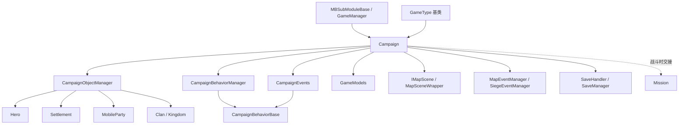

# Campaign

**Namespace:** TaleWorlds.CampaignSystem
**Module:** TaleWorlds.CampaignSystem（位于 Core 之上的游戏逻辑层）
**Type:** `public class Campaign : GameType`
**Base:** `GameType`（TaleWorlds.Core）
**Source:** `bin/TaleWorlds.CampaignSystem/TaleWorlds.CampaignSystem/Campaign.cs`

## 一句话职责

`Campaign` 是**单次战役（一场存档游戏）的战略层总控**：它持有整张世界的所有可变状态，并通过每帧 tick 推进时间、调用各 `CampaignBehavior`、派发 `CampaignEvents`、查询 `GameModels` 平衡规则。

## 心智模型

- **它是什么**：一场战役的“世界容器 + 主循环”。你的 `Hero`、`Settlement`、`MobileParty`、`Clan`、`Kingdom` 这些实体都活在 `Campaign` 持有的 `CampaignObjectManager` 里（经 `AliveHeroes` / `Settlements` / `MobileParties` / `Clans` / `Kingdoms` 等只读集合暴露）。
- **谁来创建 / 持有**：你**永远不要** `new Campaign()`。引擎在加载 `GameType` 时构造它，并在 `SetLoadingParameters` 里执行 `Current = this`；之后全程通过静态单例 `Campaign.Current` 访问。`Campaign` 由 `MBSubModuleBase` / `GameManager` 的加载流程拉起，生命周期覆盖从新游戏、读档到 `OnDestroy`。
- **所在层**：`Core → CampaignSystem`。它位于 Mission（战斗场景）之上——大地图与所有非战斗逻辑都在 `Campaign` 内；进入战斗时由 `Mission` 临时接管，战斗结束回写 `Campaign` 状态。
- **什么时候用**：需要读取世界状态（`Campaign.Current.Settlements`、`AliveHeroes`、`MainParty`）、查询平衡数值（`Campaign.Current.Models.<Xxx>Model`）、订阅周期事件（`CampaignEvents.DailyTickEvent`）、或拿到某个 `CampaignBehavior`（`GetCampaignBehavior<T>()`）时使用。
- **什么时候**不要**用**：**绝不要**在 `Action.Apply` / `CampaignBehavior` 的 tick 之外直接写世界状态字段（改 `Hero.Gold`、`MobileParty.Position` 等）。世界变更必须走 `Actions`（如 `GiveGoldAction.ApplyBetweenCharacters`、`ChangeClanInfluenceAction.Apply`）或 Behavior 的周期回调，否则事件不派发、存档不一致。也不要缓存 `Campaign.Current` 的引用跨过读档——读档后对象是新的。
- **时间如何推进**：每帧 `RealTick(realDt)` → `TickMapTime` 计算本帧游戏时增量 `_dt`（基础为 `0.25f * realDt`，快进时乘 `SpeedUpMultiplier`），随后遍历 `CampaignEntityComponent` 的 `OnTick`、`SiegeEventManager.Tick`；同帧 `Tick()` 派发 `CampaignEventDispatcher.Tick`、周期事件、`MapEventManager.Tick`、`EncounterManager.Tick`。AI 思考在 `LateAITick` → `PartiesThink` 里跑。`_dt == 0` 时（时间暂停）周期事件不触发。

## 依赖关系



- **上游（谁创建它 / 它继承谁）**
  - [MBSubModuleBase](../../core/MBSubModuleBase) — 模块加载入口，`GameManager` 经它启动战役。
  - `GameType`（基类，TaleWorlds.Core）— `Campaign` 通过 `GameType` 的加载状态机 `DoLoadingForGameType` 完成初始化。
- **下游（它持有 / 驱动的世界实体）**
  - [Hero](../Hero) — 经 `AliveHeroes` / `DeadOrDisabledHeroes`。
  - [Settlement](../Settlement) — 经 `Settlements`。
  - [MobileParty](../MobileParty) — 经 `MobileParties` 及各分类集合（`LordParties` / `CaravanParties` / `BanditParties` 等）。
  - [Clan](../Clan) / `Kingdom` — 经 `Clans` / `Kingdoms`。
- **事件与行为**
  - `CampaignEvents` — 静态事件总线（`DailyTickEvent`、`HourlyTickEvent`、`DailyTickHeroEvent` 等），Behavior 在 `RegisterEvents()` 里订阅。
  - `CampaignEventDispatcher` — 内部派发器，`Campaign` 在 `OnInitialize` 把它初始化为 `new CampaignEventDispatcher(...)` 并把 `CampaignEvents` / `IssueManager` / `QuestManager` 注册为接收器。
  - `CampaignBehaviorManager` / `CampaignBehaviorBase` — 所有周期逻辑挂在 Behavior 上，由 `Campaign` 在加载阶段 `RegisterEvents()` / `LoadBehaviorData()`。
- **模型与地图**
  - `GameModels` — 全部平衡模型（`AgeModel`、`CombatXpModel`、`MapDistanceModel`、`PartyWageModel` 等），经 `Models` 暴露。
  - `IMapScene`（`MapSceneWrapper`）— 大地图场景包装，提供寻路网格与边界（`LoadMapScene`）。
  - `MapEventManager` / `SiegeEventManager` / `MapMarkerManager` — 地图战斗、围城、标记管理。
- **存档点**
  - `SaveHandler` / `SupportsSaving`（仅 `CampaignGameMode.Campaign`）— 由 [SaveManager](../../save-system/SaveManager) 体系序列化；`OnGameOver` 在铁人模式触发 `QuickSaveCurrentGame`。

## 风险

- **在 Action / Behavior 之外改写世界状态**：直接改 `Hero.Gold`、`MobileParty.MemberRoster`、`Settlement` 字段会绕过事件与 Action 的副作用，造成**存档不一致、关系/影响力不更新**。一律走 `Actions.*` 或在 Behavior 的 tick 回调里改。
- **错相位写状态**：周期事件只在 `_dt > 0`（时间未暂停）时触发；在 `OnMissionIsStarting`、菜单态或加载中途写世界状态可能和 tick 交错，引发竞态或被下一次 tick 覆盖。把变更放进正确的 `CampaignEvents` 回调。
- **Behavior 生命周期错配**：订阅必须在 `RegisterEvents()` 中进行，持久字段必须在 `SyncData(IDataStore)` 里读/写；否则读档后事件丢失或数据为空。`OnDestroy` 会 `ClearBehaviors()`，订阅随之失效。
- **`Campaign.Current` 为空**：在模块加载早期、读档完成前、或 `OnDestroy` 之后 `Campaign.Current` 可能为 `null`（读档流程里 `Current` 在 `SetLoadingParameters` 才赋值；`OnDestroy` 末尾 `Current = null`）。访问前判空或仅在 Behavior 内访问。
- **存档损坏**：`Campaign` 与其子对象用 `[SaveableField(n)]` / `[SaveableProperty(n)]` 编号序列化；新增可存档成员必须**保持编号唯一且不复用**，否则旧档反序列化错位。未通过 `MBObjectManager.RegisterType` 注册的类型无法进存档。
- **LateAITick 跨线程**：`CampaignLateAITickTask` 是异步任务（`WaitAsyncTasks` 在 `RealTick` 开头等待），AI 思考与 tick 存在时序边界，不要在 Behavior 外假设 AI 已更新。
- **铁人模式自动存档**：`OnGameOver` 在 `IsIronmanMode` 时调用 `QuickSaveCurrentGame`，异常会被吞掉；调试时注意存档点异常不抛到上层。

## 成员笔记（按用途分组）

### 世界状态集合（只读，来自 CampaignObjectManager）
- `MBReadOnlyList<Hero> AliveHeroes` / `DeadOrDisabledHeroes`：所有存活 / 死亡或失效英雄。**用途**：枚举英雄、找 `Hero.MainHero`。**副作用**：无（只读视图）。**何时调用**：需要遍历世界英雄时，例如每日结算。
- `MBReadOnlyList<MobileParty> MobileParties`（及 `LordParties` / `CaravanParties` / `VillagerParties` / `BanditParties` / `GarrisonParties` / `CustomParties` 等分类）：所有移动 party。**用途**：AI、寻路、战斗判定。**何时调用**：在 `PartiesThink` / 周期事件里遍历。
- `MBReadOnlyList<Settlement> Settlements`：所有聚落。**用途**：地图逻辑、经济结算。**何时调用**：遍历聚落做每日 tick。
- `MBReadOnlyList<Kingdom> Kingdoms` / `MBReadOnlyList<Clan> Clans`：派系与家族。**用途**：外交、战争判定。
- `MobileParty MainParty`：玩家主队。**用途**：相机跟随、主队行为。**注意**：换主角（`OnPlayerCharacterChanged`）时会被重建，缓存引用会失效。

### 子系统与入口
- `GameModels Models`：全部平衡模型入口。**用途**：查询规则数值（`Campaign.Current.Models.AgeModel.HeroComesOfAge`）。**何时调用**：任何需要平衡数据的时刻，尤其是 Behavior 与 Helper 中。
- `ICampaignBehaviorManager CampaignBehaviorManager` 与 `T GetCampaignBehavior<T>()` / `IEnumerable<T> GetCampaignBehaviors<T>()`：**用途**：拿到某个 Behavior 实例（如 `Campaign.Current.GetCampaignBehavior<ICraftingCampaignBehavior>()`）。**副作用**：无。**何时调用**：跨 Behavior 协作时。
- `internal CampaignEvents CampaignEvents` 与静态事件总线 `CampaignEvents.DailyTickEvent` 等：**用途**：订阅周期事件。**何时调用**：在 Behavior 的 `RegisterEvents()` 里 `AddNonSerializedListener`。
- `IMapScene MapSceneWrapper`：**用途**：地图场景查询（寻路、边界）。**何时调用**：寻路 / 地图逻辑；加载阶段由 `LoadMapScene` 创建。
- `MapEventManager` / `SiegeEventManager` / `MapMarkerManager`：地图战斗 / 围城 / 标记。**何时调用**：战斗与围城相关逻辑；`Tick()` 中自动推进。
- `CampaignObjectManager CampaignObjectManager`：底层世界对象容器，**不要**直接拿它来绕过 Action 改状态。

### 时间控制
- `CampaignTimeControlMode TimeControlMode`：当前时间流速（Stop / StoppablePlay / UnstoppablePlay / *FastForward）。`TimeControlModeLock` 锁定后写无效。**用途**：判断 / 控制是否推进。**何时调用**：Behavior 需要暂停或检测暂停时（如 `AgingCampaignBehavior` 在主角生病时设 `Stop`）。
- `float CampaignDt` / `CurrentTickCount`：`_dt`（本帧游戏时增量）与帧计数。**用途**：在 tick 里判断时间是否真正推进（`_dt > 0`）。

### 生命周期
- `void SetLoadingParameters(GameLoadingType)`：设置 `Current = this` 并标记加载类型（NewCampaign / SavedCampaign / Tutorial / Editor）。**副作用**：绑定静态单例。**何时调用**：引擎加载时，mod 不应调用。
- `override void OnInitialize()` / `DoLoadingForGameType(...)`：构造管理器、`CampaignEvents`、`CampaignEventDispatcher`、Models，并注册 Behavior。**何时调用**：引擎内部。
- `void RealTick(float realDt)` / `void Tick()`：主循环每帧推进。**何时调用**：引擎内部；mod 逻辑应挂到 Behavior / 事件，而非覆写。
- `override void OnDestroy()`：等待异步任务、销毁地图场景、清空 Behavior、`MBSaveLoad.OnGameDestroy()`，最后 `Current = null`。**何时调用**：战役结束时。

## 真实示例

### 示例 1：在 CampaignBehavior 中订阅每日 tick（真实获取路径）

`CampaignEvents` 是静态事件总线；在派生自 `CampaignBehaviorBase` 的 Behavior 的 `RegisterEvents()` 里订阅，回调签名与 `IMbEvent` 匹配（此处每日事件无参）：

```csharp
using TaleWorlds.CampaignSystem;
using TaleWorlds.CampaignSystem.CampaignBehaviors;

public class MyDailyGoldBehavior : CampaignBehaviorBase
{
    public override void RegisterEvents()
    {
        // 真实 API：静态事件总线，参数为 (owner, 无参回调)
        CampaignEvents.DailyTickEvent.AddNonSerializedListener(this, OnDailyTick);
    }

    private void OnDailyTick()
    {
        // 真实数据采集：通过 Campaign.Current 读取世界状态与模型
        int ageOfAdulthood = (int)Campaign.Current.Models.AgeModel.HeroComesOfAge;
        foreach (Hero hero in Campaign.Current.AliveHeroes)
        {
            if (hero.IsAlive && hero.Age >= ageOfAdulthood)
            {
                // 正确做法：走 Action 改写金币，而非直接写 hero.Gold
                GiveGoldAction.ApplyBetweenCharacters(null, hero, 10, disableNotification: true);
            }
        }
    }

    public override void SyncData(IDataStore dataStore)
    {
        // 持久字段在此读 / 写，保证读档后行为正常
    }
}
```

### 示例 2：在任意 Behavior / Helper 中查询平衡模型

`Models` 暴露全部平衡规则；下面读取“成年年龄”用于判定（取自 `FactionHelper` / `AgingCampaignBehavior` 的真实用法）：

```csharp
float comesOfAge = Campaign.Current.Models.AgeModel.HeroComesOfAge;
float maxAge     = Campaign.Current.Models.AgeModel.MaxAge;

// 查询两聚落间陆地距离（真实模型调用）
float dist = Campaign.Current.Models.MapDistanceModel.GetDistance(
    fromSettlement, toSettlement,
    isFromPort: false, isTargetingPort: false, MobileParty.NavigationType.Default);
```

> 获取 `Campaign` 本身的唯一正确方式就是静态单例 `Campaign.Current`；不要在 SubModule 或静态字段里缓存它，读档后引用会失效。

## 导航

- ↑ 上级：[模块索引](./) · [MBSubModuleBase（生命周期入口）](../../core/MBSubModuleBase)
- ↔ 同级：[Hero](../Hero) · [Settlement](../Settlement) · [MobileParty](../MobileParty) · [Clan](../Clan)
- 相关：[Mission（战斗层）](../../mission/Mission) · [SaveManager（存档体系）](../../save-system/SaveManager) · [文档契约](../../../architecture/doc-contract) · [崩溃边界](../../../architecture/crash-boundary)

## 参见

- 上游枢纽：[MBSubModuleBase](../../core/MBSubModuleBase) — 模块与 Behavior 生命周期的入口，理解 `Campaign` 何时被拉起。
- 下游 / 相关：[Hero](../Hero) 与 [Settlement](../Settlement) — `Campaign` 持有的核心世界实体，二者状态变更都必须经 Action / Behavior。
- 规范：[文档契约](../../../architecture/doc-contract) 与 [崩溃边界](../../../architecture/crash-boundary) — 写世界状态与存档时的硬性约束。
