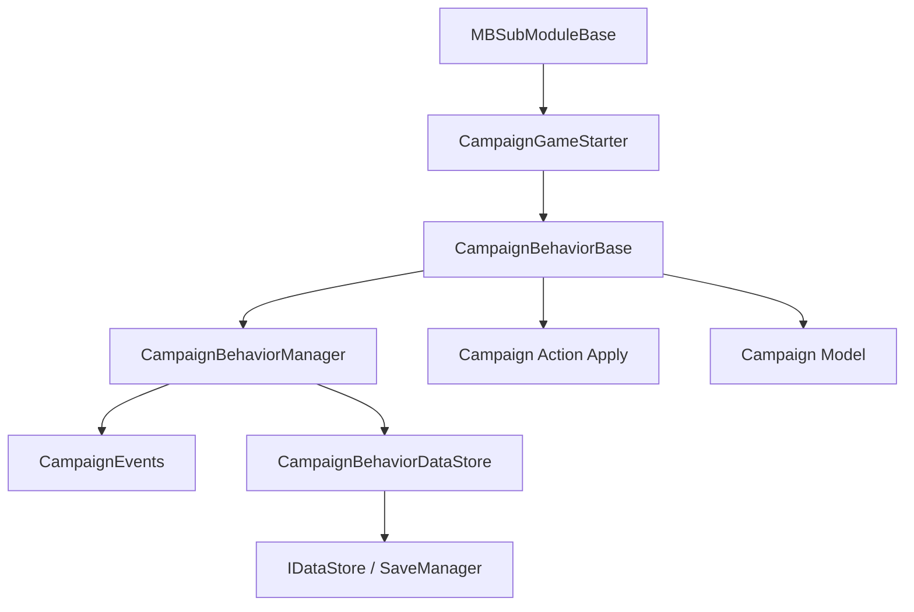

# CampaignBehaviorBase

**Namespace:** `TaleWorlds.CampaignSystem`  
**Module:** `TaleWorlds.CampaignSystem`  
**Type:** `public abstract class CampaignBehaviorBase : ICampaignBehavior`  
**Base:** `ICampaignBehavior`  
**Source:** `bin/TaleWorlds.CampaignSystem/TaleWorlds.CampaignSystem/CampaignBehaviorBase.cs`

## 一句话职责

它是战役 mod 的长期逻辑单元：由 `CampaignGameStarter` 收集、由 `CampaignBehaviorManager` 注册事件并管理存档，而不是一个可以在任意时刻临时调用的服务对象。

## 心智模型

### 生命周期与持有者

行为实例通常在 `CampaignGameStarter` 的启动窗口内创建并加入 `CampaignBehaviors`。战役初始化后，`CampaignBehaviorManager.RegisterEvents()` 逐个调用 `RegisterEvents()`。对于读档，管理器会先执行 `LoadBehaviorData()`，再执行 `RegisterEvents()`，所以行为第一次收到事件时，其持久化字段已经恢复。保存前，管理器为每个行为创建独立的 `IDataStore`，调用 `SyncData()` 收集状态；加载时先按精确的 `StringId` 查找，找不到时还可能按包含行为类型名的旧键重映射记录，然后调用 `SyncData()` 恢复。

因此它处在 **Campaign 层**，寿命跨越许多地图 tick，但不等于进程级的 `MBSubModuleBase`。`RegisterEvents()` 负责建立非序列化的监听关系，`SyncData()` 负责序列化自己的状态；两者不是同一件事。

### 何时用，何时不用

- 用它保存一个战役功能的状态，并响应 `CampaignEvents` 的每日、每小时、英雄、据点或战斗生命周期。
- 用 `CampaignBehaviorBase.GetCampaignBehavior<T>()` 从已经运行的 `Campaign.Current` 找到已注册行为；找不到时必须接受 `null`。
- 不要在 `RegisterEvents()` 之前读取依赖战役的全局状态，也不要在 `OnSubModuleLoad()` 阶段直接访问 `Campaign.Current`。先在 [MBSubModuleBase](../../core/MBSubModuleBase) 的游戏启动钩子里注册行为。
- 不要在行为里直接写 `Hero`、`MobileParty` 或 `Settlement` 的底层字段。行为负责时机和协调，世界变更交给相应的 `*Action.Apply`；计算数值交给 `*Model`。
- 不要把 Mission 内的临时战斗逻辑塞进它。进入战斗时使用 [MissionBehavior](../../mission/MissionBehavior)；Campaign 行为只订阅跨战斗的战役结果。

## 依赖图



- **上游：** [CampaignGameStarter](../CampaignGameStarter) 在初始化阶段收集行为；[Campaign](../Campaign) 持有战役世界和行为管理器。
- **事件下游：** [CampaignEvents](../CampaignEvents) 发布事件；`RegisterEvents()` 里的监听器在事件发生时运行。
- **存档下游：** [CampaignBehaviorManager](../CampaignBehaviorManager) 通过内部 `CampaignBehaviorDataStore` 按 `StringId` 保存每个行为的 `SyncData()` 记录；[SaveManager](../../save-system/SaveManager) 持久化这个对象图。
- **世界变更下游：** 行为通常调用 `*Action.Apply`，这些 Action 再更新实体并触发相关事件；行为本身不应伪装成状态写入器。

## 关键成员与调用时机

### `StringId`

只读字符串。无参构造函数把它设为运行时类型名，带参数构造函数使用你提供的值。它是行为存档分桶的身份：同一个战役里出现两个相同 `StringId` 的行为会触发断言并覆盖其中一份行为数据。

如果行为需要长期兼容旧存档，不要随意改变显式 `StringId`；如果重命名类型，显式保留旧 ID 比让默认构造函数自动改 ID 更安全。

显式固定 ID 的写法（用于旧存档兼容）：

```csharp
public sealed class MyBehavior : CampaignBehaviorBase
{
    // 用固定字符串而不是默认类型名，跨版本升级时旧存档仍能按 ID 找到这份行为数据
    public MyBehavior() : base("MyMod.MyBehavior.StableId") { }
}
```

### `RegisterEvents()`

抽象注册钩子。这里订阅 `CampaignEvents`，例如 `DailyTickEvent` 或 `HeroKilledEvent`。管理器在战役初始化后调用它；运行中通过管理器添加行为时，`CampaignBehaviorManager.AddBehavior` 也会立即调用它。

事件监听器是运行时对象关系，不会因为你在 `SyncData()` 中保存一个字段就自动恢复。注册逻辑必须是幂等的，避免同一行为实例被重复注册后每天执行两次。

```csharp
public override void RegisterEvents()
{
    CampaignEvents.HeroPrisonerTakenEvent.AddNonSerializedListener(this, OnPrisonerTaken);
}
```

### `SyncData(IDataStore dataStore)`

抽象存档钩子。保存时调用 `dataStore.SyncData(key, ref value)` 写入，读档时用同一个 key 和兼容的类型读回。`IDataStore` 同时代表保存和加载上下文；不要用一个只在保存分支可用的临时对象作为状态来源。

行为字段使用 `SyncData` 时不需要再用 `[SaveableField]` 标注同一字段。`[SaveableField]` 属于 SaveSystem 对象图契约，而 `CampaignBehaviorBase.SyncData` 是行为数据容器的键值契约；重复建立两套身份会让加载顺序和迁移更难判断。

```csharp
public override void SyncData(IDataStore dataStore)
{
    dataStore.SyncData("MyMod.MyBehavior.Count", ref _count);
}
```

### `static T GetCampaignBehavior<T>()`

把查找转发给 `Campaign.Current.GetCampaignBehavior<T>()`。它只适用于战役已经建立且目标行为已经注册的阶段，例如地图运行、战役事件回调或 `OnGameLoaded` 之后。主菜单、模块装载期和行为注册之前调用可能得到 `null`，不能无条件解引用。

```csharp
var behavior = CampaignBehaviorBase.GetCampaignBehavior<MyBehavior>();
if (behavior != null)
{
    // 读取其只读查询方法；不要从外部改行为的存档字段
}
```

## 真实示例：注册、事件与存档

下面的行为在每天 tick 时累计观察天数，并把计数写进自己的行为存档。`CampaignEvents.DailyTickEvent.AddNonSerializedListener` 与 `IDataStore.SyncData` 都是 v1.4.5 源码中实际使用的入口。

```csharp
using TaleWorlds.CampaignSystem;

namespace MyMod
{
    public sealed class DailyReportBehavior : CampaignBehaviorBase
    {
        private int _daysObserved;

        public override void RegisterEvents()
        {
            CampaignEvents.DailyTickEvent.AddNonSerializedListener(this, OnDailyTick);
        }

        private void OnDailyTick()
        {
            _daysObserved++;
        }

        public override void SyncData(IDataStore dataStore)
        {
            dataStore.SyncData("MyMod.DailyReport.DaysObserved", ref _daysObserved);
        }
    }
}
```

在自己的 [MBSubModuleBase](../../core/MBSubModuleBase) 游戏启动钩子中注册它：

```csharp
using TaleWorlds.CampaignSystem;
using TaleWorlds.Core;
using TaleWorlds.MountAndBlade;

namespace MyMod
{
    public sealed class MySubModule : MBSubModuleBase
    {
        protected override void OnGameStart(Game game, IGameStarter gameStarterObject)
        {
            if (game.GameType is Campaign && gameStarterObject is CampaignGameStarter starter)
            {
                starter.AddBehavior(new DailyReportBehavior());
            }
        }
    }
}
```

如果其他战役代码需要调用它，应在战役存在之后查找，并处理行为不存在的情况：

```csharp
DailyReportBehavior report = CampaignBehaviorBase.GetCampaignBehavior<DailyReportBehavior>();
if (report != null)
{
    // 读取你自己暴露的只读查询方法；不要从外部改行为的存档字段。
}
```

## 风险与存档边界

- **重复身份会覆盖存档。** 两个行为使用同一 `StringId` 时，`CampaignBehaviorDataStore` 会报告重复并以最后保存的数据替换前一份；这不是可接受的多实例方案。
- **改变 key 或类型会丢失旧值。** `SyncData` 的 key 是行为数据记录的字段名。升级 mod 时保持 key 和类型稳定；类型确实变化时，在 `IsLoading` 分支做可验证的迁移，而不是强制把旧对象转换成新类型。
- **错过注册窗口不会自动补救。** 在 `OnSubModuleLoad` 中 `new DailyReportBehavior()` 但没有加入 `CampaignGameStarter`，管理器不会调用它的 `RegisterEvents()`，它也不会进入行为存档。
- **重复订阅会放大副作用。** 同一实例重复执行 `RegisterEvents()` 会让每个 tick 触发多次。不要在 `OnApplicationTick` 里反复注册，也不要把注册钩子当作状态刷新函数。
- **移除和清空不是一回事。** `CampaignBehaviorManager.RemoveBehavior<T>()` 会同时移除行为及其事件监听器；`ClearBehaviors()` 只清空行为列表。战役运行中移除单个行为时应使用泛型移除入口；在事件分发器之外额外订阅的监听器仍需自行管理。
- **行为回调与世界 Action 的时机必须匹配。** 事件可能发生在地图遭遇或 Mission 结束的边界，回调中不要缓存已经死亡的 `Agent` 或已经销毁的 `MobileParty`；需要改变战役实体时使用对应 Action，并让事件链完成清理。
- **存档状态必须是可持久化数据。** 不要把引擎句柄、UI 控件、`Agent`、`Mission` 或委托实例写进 `SyncData`。只保存稳定的 ID、数值、布尔值和明确支持的对象引用，并在加载后重新获取运行时对象。

## 版本注记

v1.3.0、v1.3.15 与 v1.4.5 都保留 `RegisterEvents()`、`SyncData(IDataStore)`、`StringId` 和静态行为查找这组核心契约。v1.4.5 的行为管理器仍按 `StringId` 建立存档记录；跨版本 mod 应把行为 ID 和 `SyncData` key 当作存档接口，而不是普通实现细节。

## 导航

- ↑ Parent：[Campaign API](./)
- ↔ Sibling：[CampaignGameStarter](../CampaignGameStarter) · [CampaignBehaviorManager](../CampaignBehaviorManager) · [CampaignEvents](../CampaignEvents)
- Related：[Campaign](../Campaign) · [MBSubModuleBase](../../core/MBSubModuleBase) · [SaveManager](../../save-system/SaveManager) · [MissionBehavior](../../mission/MissionBehavior)
