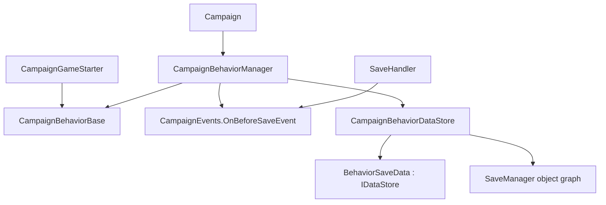

# CampaignBehaviorDataStore

**命名空间：** `TaleWorlds.CampaignSystem`  
**模块：** `TaleWorlds.CampaignSystem`  
**类型：** `internal class CampaignBehaviorDataStore`  
**基类：** 无  
**源文件：** `bin/TaleWorlds.CampaignSystem/TaleWorlds.CampaignSystem/CampaignBehaviorDataStore.cs`

## 一句话职责

`CampaignBehaviorDataStore` 是 Campaign 持有的内部中转层：它把每个已注册 Behavior 的 `SyncData(IDataStore)` 调用收集成独立存档记录，并在读档期间把记录交还给该 Behavior。

## 心智模型

它不是供 mod 获取的公开服务，也不是可以随时读写的数据库。一个 [CampaignBehaviorManager](../CampaignBehaviorManager) 持有一个 store，并把它放进可序列化对象图。保存前，manager 为每个 [CampaignBehaviorBase](../CampaignBehaviorBase) 新建 `BehaviorSaveData`，调用该 Behavior 的 `SyncData`，再用 Behavior 的 `StringId` 保存整份记录。读入已保存战役时，manager 将匹配的记录再传给 `SyncData`，随后清空这批暂存记录。

可以把它理解为两层存档模式：

1. `StringId` 选择 `_behaviorDict` 中的**行为分区**。
2. 每个 `SyncData` key 选择该行为 `BehaviorSaveData._records` 内的一个值。
3. 该 key 使用的泛型类型 `T` 也是模式的一部分，因为加载时会把保存的 `object` 直接转换回 `T`。

Behavior 自己拥有字段并决定哪些稳定 key 要同步；store 只负责路由和暂存，不知道这些字段的游戏语义、迁移规则或世界变更何时安全。

## 生命周期与所有权

1. mod 在 `CampaignGameStarter` 中加入长期存在的 [CampaignBehaviorBase](../CampaignBehaviorBase)，[Campaign](../Campaign) 把该集合交给 [CampaignBehaviorManager](../CampaignBehaviorManager)。
2. manager 把私有 `OnBeforeSave` 回调订阅到 [CampaignEvents](../CampaignEvents) 的 `OnBeforeSaveEvent`。
3. [SaveHandler](../SaveHandler) 进入保存阶段后，dispatcher 触发该事件。manager 先调用 `ClearBehaviorData()`，再对每个已注册 Behavior 调用一次 `SaveBehaviorData()`。
4. `SaveBehaviorData()` 创建 `BehaviorSaveData(isSaving: true)`；每次 `dataStore.SyncData(key, ref field)` 都把当前字段写进该记录。
5. 已保存战役在 `Campaign.OnInitialize()` 中先建立 starter 的 Behavior 集合，接着调用 `LoadBehaviorData()`，最后才调用 `RegisterEvents()`；因此第一个事件回调已经能看到恢复后的字段。
6. `LoadBehaviorData()` 把每个匹配记录交给 `SyncData()`，完成全量尝试后 manager 立即调用 `ClearBehaviorData()`。Behavior 必须把恢复的数据留在自己的字段中，不能把内部记录当运行时缓存。

## 何时使用，何时不要使用

- **使用 Behavior 契约，不要使用这个 internal 类型。** 通过 `CampaignGameStarter` 加入 `CampaignBehaviorBase`，在 `RegisterEvents()` 中订阅，在 `SyncData(IDataStore)` 中保存 Behavior 自己的字段。
- **只在 Campaign 初始化之后查找 Behavior。** `Campaign.Current.GetCampaignBehavior<T>()` 或 `Campaign.Current.CampaignBehaviorManager.GetBehavior<T>()` 返回已注册行为，不会返回其内部 store。
- **不要构造、保存引用或查询 `CampaignBehaviorDataStore` / `BehaviorSaveData`。** manager 在战役行为管理器构造时创建 store；引擎只在保存和加载阶段使用其中的临时 `BehaviorSaveData` 记录。它们都是 `internal`，不是 mod 的生命周期或缓存 API。
- **不要把它当公开的 mod 获取 API。** 没有受支持的实例获取方式、存档槽选择 API 或“加载后记录仍在”的承诺。公开扩展点是注册到 `CampaignGameStarter` 的 Behavior。
- **不要用 Saveable 特性替代 `SyncData`。** 引擎给 `_behaviorDict` 和 `_records` 标注 `[SaveableField]`，是为了让内部对象图可序列化。Behavior 要参与这条桥接链，必须调用 `IDataStore.SyncData`；给任意 Behavior 字段添加特性不能替代这次调用。自定义类型若需要 SaveSystem 类型定义，仍应按该类型自己的序列化契约单独处理。

## 依赖关系



- [CampaignBehaviorBase](../CampaignBehaviorBase) 提供 `StringId`、`RegisterEvents()` 与 `SyncData(IDataStore)` 契约，store 调用的正是这些入口。
- [CampaignBehaviorManager](../CampaignBehaviorManager) 是正常情况下唯一的持有者：保存前收集全部 Behavior，读档时恢复全部 Behavior 记录。
- [IDataStore](../IDataStore) 是传入 `SyncData` 的方向相关接口；`BehaviorSaveData` 是本页所述的私有引擎实现。
- [CampaignEvents](../CampaignEvents) 提供 `OnBeforeSaveEvent`；[SaveHandler](../SaveHandler) 进入 dispatcher 保存边界，继而触发这个事件。
- [Campaign](../Campaign) 保证已保存战役先加载 Behavior 数据再注册事件；[SaveManager](../../save-system/SaveManager) 则是序列化 manager 对象图的上层存档系统。

## 关键成员与调用时机

| 成员 | 调用时机与副作用 |
| --- | --- |
| `BehaviorSaveData(bool isSaving)` | 每个 Behavior 一份的私有适配器。`isSaving: true` 时 `IsSaving` 为真，`SyncData` 向 `_records` 添加值；反序列化得到的记录在加载模式下使用，`IsLoading` 为真。 |
| `BehaviorSaveData.SyncData<T>(string key, ref T data)` | 保存时执行 `_records.Add(key, data)` 并返回 true；加载时查找 key，存在则执行 `data = (T)value`，不存在返回 false 并保留字段的初始化值。 |
| `SaveBehaviorData(CampaignBehaviorBase)` | manager 私有的保存前监听器在清空旧记录后调用它。它捕获完整的新记录，并按 `campaignBehavior.StringId` 保存。 |
| `LoadBehaviorData(CampaignBehaviorBase)` | 已保存战役初始化时逐个 Behavior 调用。它优先回放精确 ID 的记录，找不到才尝试下述旧类型名回退。 |
| `ClearBehaviorData()` | 清除所有暂存的行为记录。manager 在收集新存档前和完整读档后各调用一次；它不是 mod 的清理或重置数据 API。 |

### `StringId` 划分行为数据

外层字典是 `Dictionary<string, BehaviorSaveData>`。例如通过 `base("MyMod.CaravanLedger")` 提供显式 ID，可以让 Behavior 的分区在未来 C# 类重命名后仍然稳定。无参 `CampaignBehaviorBase()` 会把 `GetType().Name` 用作 ID，方便但会让类改名变成存档模式变更。

如果两个当前 Behavior 使用同一个 `StringId`，`SaveBehaviorData` 会触发 debug assertion，并用后一个记录替换前一个记录。这表示该分区最终只保留后一个 Behavior 的字段。重复 ID 是存档兼容性缺陷，不能把它当作可利用的覆盖顺序。

### `BehaviorSaveData` 的保存/加载模式与字段 key

保存与加载都使用同一个 `SyncData`，但模式不同：保存模式写入每个值，加载模式仅在 key 存在时读回值。因此新增字段可以兼容旧存档，前提是 Behavior 保留有意义的初始化默认值，并能在加载时接受 `SyncData` 返回 false。

同一个 Behavior 的一次保存中，不能对同一个 key 调用两次 `SyncData`：底层字典使用 `Add`，第二次写入就是重复 key 失败。也不要随意重命名 key、让它指向另一个字段或改变其泛型类型。加载实现会从保存的 `object` 直接转换为 `T`；key/type 漂移可能抛出异常、丢失状态，或使存档无法安全加载。

### 精确 ID、名称回退与加载后清空

`LoadBehaviorData` 先用当前 `StringId` 精确查找。没有找到时，它复制字典条目，寻找旧 key 中包含 `campaignBehavior.GetType().Name` 的第一项；命中后删除旧 key，以当前 `StringId` 重新加入同一记录，然后调用 `SyncData`。

这只是引擎提供的狭窄兼容便利，不是可靠的迁移系统：它做的是子串匹配，不是精确的旧 ID 注册表。多个旧 key 都可能包含类型名，字典枚举顺序并不表达迁移优先级，而重命名后的类型也无法通过旧名称找到记录。应保持唯一、显式的 `StringId` 和稳定字段 key，而不要依赖这条回退。

manager 尝试完全部 Behavior 后会清空 `_behaviorDict`。记录的职责到读档为止；需要读档后工作的 Behavior 应使用已恢复的字段和合适的事件（如 `OnGameLoadedEvent`），而不是试图再次读取 store。

## 真实 C# 示例：使用受 manager 管理的存档桥

下面是 mod 应走的入口。`CampaignGameStarter` 注册后，`CampaignBehaviorManager` 持有这个 Behavior；保存监听器随后会经由内部 `IDataStore` 调用这里的 `SyncData`。Behavior 自己从不创建 `CampaignBehaviorDataStore`。

```csharp
using TaleWorlds.CampaignSystem;
using TaleWorlds.CampaignSystem.Settlements;

namespace MyMod
{
    public sealed class CaravanLedgerBehavior : CampaignBehaviorBase
    {
        private int _observedSettlementTicks;

        public CaravanLedgerBehavior() : base("MyMod.CaravanLedger")
        {
        }

        public override void RegisterEvents()
        {
            CampaignEvents.DailyTickSettlementEvent.AddNonSerializedListener(
                this,
                OnDailySettlementTick);
        }

        private void OnDailySettlementTick(Settlement settlement)
        {
            _observedSettlementTicks++;
        }

        public override void SyncData(IDataStore dataStore)
        {
            dataStore.SyncData(
                "MyMod.CaravanLedger.ObservedSettlementTicks",
                ref _observedSettlementTicks);
        }
    }
}
```

在战役启动阶段加入它，manager 才能让新战役注册事件并让已保存战役恢复它：

```csharp
using TaleWorlds.CampaignSystem;
using TaleWorlds.Core;
using TaleWorlds.MountAndBlade;

public override void OnGameStart(Game game, IGameStarter gameStarter)
{
    if (game.GameType is Campaign)
    {
        CampaignGameStarter campaignStarter = (CampaignGameStarter)gameStarter;
        campaignStarter.AddBehavior(new CaravanLedgerBehavior());
    }
}
```

引擎的 `TournamentCampaignBehavior` 也遵循同一 `IDataStore` 形状：它以 `dataStore.SyncData("_lastCreatedTournamentTimesInTowns", ref _lastCreatedTournamentDatesInTowns)` 保存自己的 `Dictionary<Town, CampaignTime>`。状态属于 Behavior，内部 bridge 只负责捕获和回放。

## 风险边界

- **重复 `StringId` 会让一个 Behavior 覆盖另一个的存档分区。** 每个持久 Behavior 都应使用全局唯一且稳定的显式 ID。
- **key 或类型漂移就是存档模式破坏。** 缺少 key 仅在 Behavior 明确保留安全默认值时可恢复；类型不匹配会在加载时转换，可能直接失败。字段版本化和迁移必须谨慎。
- **`SyncData` 不是游戏逻辑回调。** 不要在其中创建派对、调用 Action、改变所有权或触发事件链。保存/加载处于敏感边界，副作用可能重复世界变更或损坏存档。
- **不要序列化短寿命引擎对象。** `Mission`、`Agent`、UI 控件、delegate 与短寿命事件参数跨 Mission 或读档后都会失效。保存受支持的稳定状态，加载后重新获取运行时对象。
- **加载完成后才注册事件。** 事件回调必须容忍恢复后的默认值和缺失字段；派生缓存应在合适的读档后事件建立，不要保存 `IDataStore` 引用。
- **名称回退不是迁移保证。** 宽松的 `Contains` 匹配可能绑定到错误旧 key；稳定 ID 比期待名称匹配恢复重命名 Behavior 更可靠。

## 版本注记

v1.4.5 中 store 仍为 internal，manager 仍通过 `CampaignEvents.OnBeforeSaveEvent` 收集 Behavior 数据，已保存战役仍在事件注册之前加载 Behavior 数据。尽管存储实现不是公开 API，`StringId`、每个 `SyncData` key 及其值类型都应被视为跨版本存档接口。

## 导航

- ↑ 父级：[Campaign API](../)
- ↔ 同级：[CampaignBehaviorBase](../CampaignBehaviorBase) · [CampaignBehaviorManager](../CampaignBehaviorManager) · [IDataStore](../IDataStore) · [CampaignEvents](../CampaignEvents)
- 相关：[Campaign](../Campaign) · [SaveHandler](../SaveHandler) · [SaveManager](../../save-system/SaveManager) · [CampaignGameStarter](../CampaignGameStarter)
