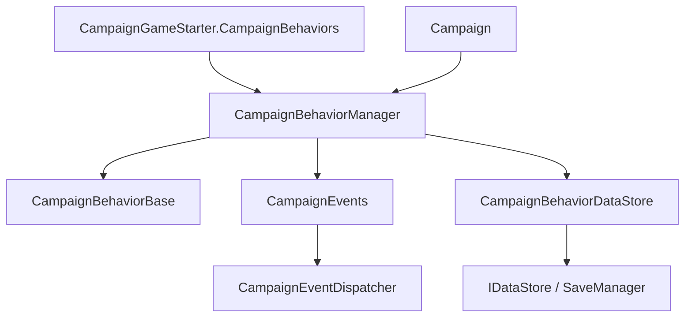

# CampaignBehaviorManager

**Namespace:** `TaleWorlds.CampaignSystem.CampaignBehaviors`  
**Module:** `TaleWorlds.CampaignSystem`  
**Type:** `public class CampaignBehaviorManager : ICampaignBehaviorManager`  
**Base:** `ICampaignBehaviorManager`  
**Source:** `bin/TaleWorlds.CampaignSystem/TaleWorlds.CampaignSystem.CampaignBehaviors/CampaignBehaviorManager.cs`

## 一句话职责

`CampaignBehaviorManager` 接管 `CampaignGameStarter` 收集的行为，按战役生命周期注册事件，并通过 `CampaignBehaviorDataStore` 在保存和加载边界收集行为状态。

## 心智模型

### 创建、持有和生命周期

它位于 **Campaign 运行时和存档桥接层**，不是 mod 应该自行 `new` 的服务。`Campaign` 在新战役中用 `campaignGameStarter.CampaignBehaviors` 构造它，并通过 `Campaign.AddCampaignBehaviorManager` 持有接口引用；读档时则先调用 `InitializeCampaignBehaviors` 换入 starter 集合。

`Campaign.OnInitialize()` 的读档顺序是：建立行为集合，调用 `InitializeCampaignBehaviors`，调用 `LoadBehaviorData`，再调用 `RegisterEvents`。新战役路径在 starter 行为集合交给管理器后进入后续初始化。管理器构造时建立 `CampaignBehaviorDataStore`，并订阅 `CampaignEvents.OnBeforeSaveEvent`；保存前它先清空旧行为数据，再逐个调用行为的 `SyncData`。

### 什么时候用、什么时候不要用

- **使用它**：在现有 `Campaign.Current` 存在后查询行为、在运行中明确加入或移除一个行为，或理解行为事件/存档何时生效。
- **使用它**：通过 `GetBehavior<T>` / `GetBehaviors<T>` 获取已注册行为，而不是扫描内部集合。
- **不要使用它**：在 `OnSubModuleLoad` 或没有 `Campaign.Current` 的菜单阶段访问它；那时战役管理器还不存在。
- **不要使用它**：用 `ClearBehaviors()` 做正常卸载。它只清空列表，不像 `RemoveBehavior<T>()` 那样移除事件监听器。
- **不要使用它**：把 `RegisterEvents` 或 `LoadBehaviorData` 当作 mod 的重复刷新入口；这两个方法属于 `Campaign` 的生命周期编排。

## 依赖图



- **上游：** [CampaignGameStarter](../CampaignGameStarter) 提供初始行为集合；[Campaign](../Campaign) 创建、持有并决定加载时序。
- **行为下游：** [CampaignBehaviorBase](../CampaignBehaviorBase) 提供 `RegisterEvents`、`SyncData` 和 `StringId` 契约。
- **事件下游：** [CampaignEvents](../CampaignEvents) 和 `CampaignEventDispatcher` 接收行为注册的监听器；移除时管理器会请求 dispatcher 清理目标行为的监听器。
- **存档下游：** `CampaignBehaviorDataStore` 保存每个行为的 `SyncData`，并作为管理器的 `[SaveableField]` 成员进入 [SaveManager](../../save-system/SaveManager) 对象图。

## 关键成员与调用时机

### 初始化与事件：`InitializeCampaignBehaviors`、`LoadBehaviorData`、`RegisterEvents`

`InitializeCampaignBehaviors(IEnumerable<CampaignBehaviorBase>)` 替换管理器当前行为列表，并重新建立保存前监听；它是读档路径把 starter 集合交给运行时管理器的入口。

`LoadBehaviorData()` 逐个让数据存储恢复行为字段，并在完成后清空临时数据。`RegisterEvents()` 随后逐个调用每个行为的 `RegisterEvents()`。这个先加载、后注册的顺序使首次事件回调看到已恢复状态；mod 不应自行颠倒顺序。

### 查询：`GetBehavior<T>` 与 `GetBehaviors<T>`

`GetBehavior<T>` 返回集合中第一个匹配的行为，不存在时返回 `default(T)`；引用类型因此是 `null`。`GetBehaviors<T>` 返回按当前集合筛选的 `IEnumerable<T>`，适合一个接口有多个实现的场景。

它们是运行时查询入口，不保证行为已安装。查询结果必须判空，并且要在战役初始化完成后调用。使用接口类型查询可以减少对某个 SandBox 实现类的耦合，例如游戏内代码常从 `Campaign.Current.CampaignBehaviorManager.GetBehavior<IStatisticsCampaignBehavior>()` 获取功能接口。

### 动态变更：`AddBehavior`、`RemoveBehavior<T>`、`ClearBehaviors`

`AddBehavior` 把非空行为加入列表，并立即调用该实例的 `RegisterEvents()`。它适合确实需要在战役运行中启用新行为的场景；新加入行为没有旧存档数据的加载阶段，初始化状态应由 mod 自己定义。

`RemoveBehavior<T>` 从列表末端向前找一个匹配行为，移除它，并调用 `CampaignEventDispatcher.Instance.RemoveListeners` 清理该实例的事件监听器。`ClearBehaviors()` 只清空列表，不清理 dispatcher 监听器，因此只适合引擎明确知道没有残留监听器的重建边界，不能作为普通卸载 API。

### 保存边界：`OnBeforeSave` 与 `CampaignBehaviorDataStore`

`OnBeforeSave` 是管理器的私有回调，由构造函数或重新初始化路径注册到 `CampaignEvents.OnBeforeSaveEvent`。它先清空 `CampaignBehaviorDataStore`，再对当前每个行为调用 `SaveBehaviorData`，最终由行为的 `SyncData(IDataStore)` 写入自己的键值。

这意味着行为的持久状态边界在 `CampaignBehaviorBase.SyncData`，不是在 manager 的公开集合里。行为 ID、SyncData key 和类型必须稳定；引擎句柄、Mission/Agent、委托和 UI 对象不能作为存档字段。

## 真实接入示例

### 从当前战役查询行为

`Campaign` 公开的是 `ICampaignBehaviorManager` 接口。下面的获取路径与引擎代码从 `Campaign.Current.CampaignBehaviorManager` 查询行为的形状一致；不存在行为时按 `null` 处理。

```csharp
using TaleWorlds.CampaignSystem;

ICampaignBehaviorManager manager = Campaign.Current.CampaignBehaviorManager;
DailyReportBehavior report = manager.GetBehavior<DailyReportBehavior>();
if (report != null)
{
    report.RecordObservation();
}
```

### 运行中启用并移除临时行为

这是管理器提供的运行时入口；`AddBehavior` 会立即注册事件，`RemoveBehavior<T>` 才会同时清理该实例的事件监听器。

```csharp
ICampaignBehaviorManager manager = Campaign.Current.CampaignBehaviorManager;
var temporary = new TemporaryCampaignBehavior();
manager.AddBehavior(temporary);

// 当功能结束时，按类型移除并让事件 dispatcher 清理监听器。
manager.RemoveBehavior<TemporaryCampaignBehavior>();
```

长期行为仍应在 [CampaignGameStarter](../CampaignGameStarter) 阶段加入，这样新战役、读档和存档路径都能一致地看到它。

## 风险与存档边界

- **没有战役就没有管理器。** `Campaign.Current` 在菜单、模块加载或某些 Mission 外阶段可能为空；不要无条件解引用 `Campaign.Current.CampaignBehaviorManager`。
- **读档顺序不能颠倒。** 先 `RegisterEvents` 再 `LoadBehaviorData` 会让首个事件看到默认字段，可能重复应用世界变更或覆盖旧状态。
- **动态添加不等于读档恢复。** `AddBehavior` 会注册事件但不会为新实例回放旧行为数据；需要持久化的行为应在 starter 集合中注册，并保持稳定的 `StringId` 和 `SyncData` key。
- **清空会留下监听器。** `ClearBehaviors()` 只清空 `_campaignBehaviors`；继续触发的 listener 可能引用已经不可用的行为。逐个卸载应使用 `RemoveBehavior<T>()`。
- **重复注册会放大副作用。** 手动重复调用 `RegisterEvents` 或重复 `AddBehavior` 会让每天 tick、战斗结果等回调执行多次。
- **保存数据必须是行为状态。** manager 的存档字段是内部 `CampaignBehaviorDataStore`；不要把 `Agent`、`Mission`、UI 控件或委托交给 `SyncData`，加载后应通过稳定 ID 重新获取运行时对象。

## 版本注记

v1.3.15 与 v1.4.5 都保留 `ICampaignBehaviorManager` 的查询、动态增删、加载和事件注册契约。v1.4.5 的 `Campaign` 明确在保存战役路径执行 `InitializeCampaignBehaviors`、`LoadBehaviorData`、`RegisterEvents`；跨版本 mod 应把这个顺序和行为存档 ID 当作兼容边界。

## 导航

- ↑ Parent：[Campaign API](./)
- ↔ Siblings：[CampaignGameStarter](../CampaignGameStarter) · [CampaignBehaviorBase](../CampaignBehaviorBase) · [CampaignEvents](../CampaignEvents)
- Related：[Campaign](../Campaign) · [SaveManager](../../save-system/SaveManager) · [MBSubModuleBase](../../core/MBSubModuleBase)
