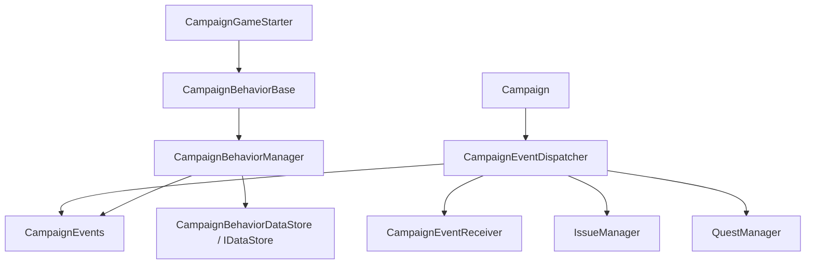

# CampaignEventReceiver

**Namespace:** `TaleWorlds.CampaignSystem`  
**Module:** `TaleWorlds.CampaignSystem`  
**Type:** `public abstract class CampaignEventReceiver`  
**Base:** 无  
**Source:** `bin/TaleWorlds.CampaignSystem/TaleWorlds.CampaignSystem/CampaignEventReceiver.cs`

## 一句话职责

`CampaignEventReceiver` 是 Campaign 内部事件分发器调用的空实现回调基类；它定义回调形状，但普通 mod 不应把它当作 `CampaignBehaviorBase` 的替代品。

## 心智模型

### 它是什么

这是一个没有状态、没有抽象必实现方法的 `abstract class`。绝大多数方法都是空的 `virtual`，包括 `OnNewGameCreated`、`OnGameLoaded`、`Tick`、`MissionTick`、`OnBeforeSave` 和一组 `Can...(..., ref bool result)` 结果回调。它的价值在于给 dispatcher 一个统一的接收者契约，而不是为 mod 提供一个独立的事件总线。

[CampaignEventDispatcher](../CampaignEventDispatcher) 内部保存 `CampaignEventReceiver[]`，逐个把引擎事件转发给数组成员。战役初始化时，数组至少包含 `CampaignEvents`、[IssueManager](../IssueManager) 和 [QuestManager](../QuestManager)；dispatcher 还可以在内部追加接收者。`CampaignEvents` 本身继承这个基类，所以它既是静态 `IMbEvent` 门面，也是 dispatcher 的一个 receiver。

### 何时用，何时不用

- **阅读它**来理解一个 Campaign 事件从引擎、dispatcher 到 `CampaignEvents` 或 manager 的传播边界，尤其是启动、Mission tick 和存档顺序。
- **普通 mod 不要直接继承它来接收事件。** `AddCampaignEventReceiver` 是 dispatcher 的 `internal` 组装入口；仅仅 `new` 一个子类不会让它自动进入分发数组。
- **普通 mod 应继承 [CampaignBehaviorBase](../CampaignBehaviorBase)**，在 `RegisterEvents()` 中订阅 [CampaignEvents](../CampaignEvents) 的静态 `IMbEvent`，并在 `SyncData(IDataStore)` 中保存自己的字段。
- **不要手动调用** `OnGameLoaded`、`Tick` 或 `OnBeforeSave` 来模拟游戏流程。它们是 dispatcher 的回调方法；模拟事件应使用真实的测试边界或调用对应的公开业务入口。
- **不要把 `CampaignEventReceiver` 当成存档模型。** 继承它不会自动让字段进入 SaveSystem；Behavior 的持久状态仍需由 `SyncData` 管理。

## 依赖图



- **上游：** [Campaign](../Campaign) 建立战役生命周期并驱动 dispatcher；[CampaignEventDispatcher](../CampaignEventDispatcher) 保存接收者数组并负责逐个转发。
- **同层接收者：** [CampaignEvents](../CampaignEvents) 发布 mod 常用的静态事件；`IssueManager` 和 `QuestManager` 也通过此回调契约接收世界变化。
- **mod 下游：** [CampaignGameStarter](../CampaignGameStarter) 收集 [CampaignBehaviorBase](../CampaignBehaviorBase)，[CampaignBehaviorManager](../CampaignBehaviorManager) 负责注册 Behavior 的事件并在保存前调用其存档桥。
- **保存边界：** receiver 的 `OnBeforeSave` / `OnSaveStarted` / `OnSaveOver` 是生命周期通知；真正的 Behavior 字段由 [IDataStore](../IDataStore) 和 [CampaignBehaviorManager](../CampaignBehaviorManager) 管理，最终进入 [SaveManager](../../save-system/SaveManager) 的对象图。

## 回调分组与调用时机

### 战役启动和读档

`OnSessionStart`、`OnAfterSessionStart`、`OnNewGameCreated`、`OnGameEarlyLoaded`、`OnGameLoaded` 和 `OnGameLoadFinished` 描述不同的 Campaign 建立阶段。新战役回调与读档回调不能混用：`OnNewGameCreated` 适合初始世界设置，`OnGameLoaded` 适合等待读档实体，`OnGameLoadFinished` 适合在加载流程完全结束后再查询依赖对象。

### 时间与 Mission

`Tick(float dt)` 是 Campaign 层的连续 tick，`MissionTick(float dt)` 是 Mission 内的 tick；`TickPartialHourlyAi(MobileParty party)` 是更窄的 AI 时间边界。不要把 Mission 内 Agent 逻辑塞进 Campaign tick，也不要在 `MissionTick` 结束后继续缓存 Mission 对象。

### 世界与内容回调

英雄、派对、据点、王国、战争、围城、任务、Issue、菜单和对话都有对应 `On...` 回调，例如 `OnHeroKilled`、`OnSettlementOwnerChanged`、`OnMissionStarted`、`OnMissionEnded`、`OnQuestCompleted` 和 `OnSiegeEventEnded`。这些方法只说明 dispatcher 传递的参数，不替代 [Action](../../campaign-ext/ChangeRelationAction) 或 [GameModelsManager](../../core-extra/GameModelsManager/) 的职责。

### 存档回调

`OnBeforeSave` 在保存前触发，`OnSaveStarted` 表示保存流程开始，`OnSaveOver(bool isSuccessful, string saveName)` 提供保存结果。它们适合刷新 Behavior 自己的标量状态或记录元数据，不适合创建/删除英雄、派对或据点。Behavior 的持久字段仍应通过 `SyncData(IDataStore)`，而不是给 receiver 随意加字段。

### 结果型回调：`ref bool`

`CanMoveToSettlement`、`CanHeroDie`、`CanPlayerMeetWithHeroAfterConversation`、`CanHeroBecomePrisoner`、`CanBeGovernorOrHavePartyRole` 和 `CanHeroMarry` 等方法接收 `ref bool result`。dispatcher 会把同一个决策交给多个接收者；实现者必须把它当作已有规则的累计结果，只有在自己负责的条件成立时才收紧或放行。无条件写 `result = true` 会绕过原版和其他模块的限制。

## 关键成员

| 回调组 | 代表成员 | 典型用途 | 不应做什么 |
| --- | --- | --- | --- |
| 清理 | `RemoveListeners(object owner)` | 按 owner 清理非序列化监听器 | 不要把它当作通用 Behavior 卸载 API |
| 启动/加载 | `OnSessionStart`、`OnGameLoaded`、`OnGameLoadFinished` | 在正确阶段建立或查询依赖 | 不要在读档前假设 Hero、Party 已恢复 |
| Campaign tick | `Tick`、`TickPartialHourlyAi` | 战役级时间推进 | 不要每帧扫描能用窄事件处理的集合 |
| Mission tick | `MissionTick`、`OnMissionStarted`、`OnMissionEnded` | 处理临时场景的边界 | 不要把 `Agent` 引用跨 Mission 保存 |
| 存档 | `OnBeforeSave`、`OnSaveStarted`、`OnSaveOver` | 准备状态、观察结果 | 不要在保存回调里触发世界 Action |
| 决策 | `CanHeroDie`、`CanHeroBecomePrisoner`、`CanHeroMarry` | 对已有结果施加窄条件 | 不要无条件覆盖 `ref bool` |

## 真实示例：普通 mod 的正确接入点

下面的示例故意继承 `CampaignBehaviorBase` 而不是 `CampaignEventReceiver`。这是 mod 可控的公开路径：Behavior 在启动阶段加入集合，随后通过 `CampaignEvents` 订阅 Mission 结束通知，并把自己的计数写入行为存档。

```csharp
using TaleWorlds.CampaignSystem;
using TaleWorlds.Core;

namespace MyMod
{
    public sealed class MissionAuditBehavior : CampaignBehaviorBase
    {
        private int _completedMissions;

        public override void RegisterEvents()
        {
            CampaignEvents.OnMissionEndedEvent.AddNonSerializedListener(this, OnMissionEnded);
        }

        private void OnMissionEnded(IMission mission)
        {
            _completedMissions++;
        }

        public override void SyncData(IDataStore dataStore)
        {
            dataStore.SyncData("MyMod.MissionAudit.CompletedMissions", ref _completedMissions);
        }
    }
}
```

把 `MissionAuditBehavior` 加到 [CampaignGameStarter](../CampaignGameStarter) 的行为集合；不要只实例化一个 `CampaignEventReceiver` 子类，也不要把 `CampaignEventDispatcher.AddCampaignEventReceiver` 当作 mod API，因为该组装方法是 `internal`。

## 风险与边界

- **空实现不会自动注册。** `CampaignEventReceiver` 的 virtual 方法默认什么也不做；继承它不代表 dispatcher 已经持有该对象。普通 mod 若没有进入 starter/manager 的生命周期，事件和存档都不会发生。
- **接收者顺序是引擎组合的一部分。** dispatcher 会逐个遍历接收者；结果型 `ref bool` 回调受到其他接收者的先后影响。不要假定自己总是第一个或最后一个执行。
- **生命周期不能混层。** `Tick` 属于 Campaign 连续循环，`MissionTick` 属于临时 Mission；在错误阶段访问 `Campaign.Current`、`Mission.Current`、`Agent` 或 `MobileParty` 可能空引用、读到旧对象或触发 native 错误。
- **存档回调不是 Action 入口。** `OnBeforeSave` 中创建实体、结束战斗、改变所有权或触发连锁事件可能改变正在序列化的对象图，造成不一致甚至坏档。
- **结果回调必须保留已有答案。** 直接把 `result` 改成固定值会绕过原版死亡、囚禁、婚姻或移动限制；只在有明确条件时修改，并在文档中写明下游影响。
- **清理必须沿 owner 走。** `CampaignEvents` 的 listener 是非序列化关系；Behavior 移除应使用 [CampaignBehaviorManager](../CampaignBehaviorManager) 的 `RemoveBehavior<T>()`，不要用 `ClearBehaviors()` 代替清理。
- **不要跨读档持有运行时对象。** receiver 回调参数中的 `Hero`、`MobileParty`、`IMission` 等可能在加载后被替换；持久字段保存稳定 ID、数字或布尔值，加载后再解析。

## 版本注记

v1.3.0、v1.3.15 与 v1.4.5 都有此抽象 receiver 契约，但具体回调数量和事件参数会随版本增加。尤其是 Mission、围城、海战和保存事件，跨版本实现必须重新核对目标版本源码，不能把旧签名当作稳定 ABI。

## Navigation

- ↑ Parent: [Campaign API](./)
- ↔ Siblings: [CampaignEvents](../CampaignEvents) · [CampaignEventDispatcher](../CampaignEventDispatcher) · [CampaignBehaviorBase](../CampaignBehaviorBase) · [CampaignBehaviorManager](../CampaignBehaviorManager)
- Related / children: [CampaignGameStarter](../CampaignGameStarter) · [Campaign](../Campaign) · [IMbEvent](../IMbEvent) · [ReferenceIMBEvent](../ReferenceIMBEvent) · [IDataStore](../IDataStore) · [MissionBehavior](../../mission/MissionBehavior)
