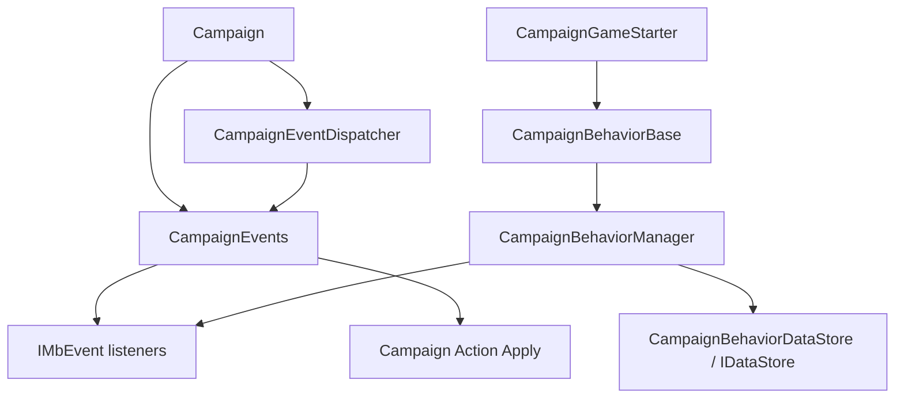

# CampaignEvents

**Namespace:** `TaleWorlds.CampaignSystem`  
**Module:** `TaleWorlds.CampaignSystem`  
**Type:** `public class CampaignEvents : CampaignEventReceiver`  
**Base:** [CampaignEventReceiver](../CampaignEventReceiver)  
**Source:** `bin/TaleWorlds.CampaignSystem/TaleWorlds.CampaignSystem/CampaignEvents.cs`

## 一句话职责

`CampaignEvents` 把战役内部的生命周期和世界变更发布成 mod 可以订阅的静态事件入口；它负责通知，不负责替代 `*Action.Apply` 改写世界状态。

## 心智模型

### 它是什么

这是一个 **Campaign 层事件门面**，不是应由 mod 自己创建的服务对象。源码中的静态属性通过当前战役内部的 `CampaignEvents` 实例返回 `IMbEvent<T...>` 或 `ReferenceIMBEvent<T...>`。因此 mod 使用 `CampaignEvents.DailyTickEvent`、`CampaignEvents.HeroKilledEvent` 这类静态入口即可，不需要也不应该写 `new CampaignEvents()`。

`Campaign` 建立 `CampaignEvents`、`IssueManager` 和 `QuestManager` 后，把它们交给 [CampaignEventDispatcher](../CampaignEventDispatcher)。dispatcher 收到引擎事件时，会按顺序转发给这些接收者；`CampaignEvents` 再把对应通知交给它自己的监听器。监听器由 owner 标记，通常 owner 就是一个 [CampaignBehaviorBase](../CampaignBehaviorBase) 实例。

### 何时用，何时不用

- **使用它**观察英雄、派对、据点、王国、战斗、每日/每小时 tick、Mission 开始/结束或存档边界，并让一个已注册的 Behavior 维护自己的状态。
- **在 `CampaignBehaviorBase.RegisterEvents()` 中订阅。** 这个阶段由 [CampaignBehaviorManager](../CampaignBehaviorManager) 管理，owner 的清理路径才和 Behavior 生命周期一致。
- **不要**在 `OnSubModuleLoad()`、主菜单或没有 `Campaign.Current` 的阶段读取静态事件；`CampaignEvents` 的静态实例解析依赖活动战役。
- **不要**直接调用 `OnHeroKilled`、`OnBeforeSave` 等 receiver 方法来“模拟”事件。事件应由游戏流程或对应的 [Action](../../campaign-ext/ChangeRelationAction) 触发，mod 需要改变世界时应调用相应 Action，让正常事件链完成。
- **不要**把 `CampaignEvents` 当存档容器。监听器关系不会由 `SyncData` 自动保存；可持久化的字段放在 Behavior 中，并通过 [IDataStore](../IDataStore) 同步。

## 依赖图



- **上游：** [Campaign](../Campaign) 创建并持有本次战役的事件对象；[CampaignGameStarter](../CampaignGameStarter) 收集会订阅事件的 Behavior。
- **订阅下游：** [CampaignBehaviorManager](../CampaignBehaviorManager) 调用 Behavior 的 `RegisterEvents()`，并在运行时移除 Behavior 时请求 dispatcher 清理 owner 的监听器。
- **分发下游：** [CampaignEventDispatcher](../CampaignEventDispatcher) 将地图、Mission、保存和时间流程转发给接收者；[CampaignEventReceiver](../CampaignEventReceiver) 是它使用的回调契约。
- **状态下游：** 监听器通常调用具体 [Action](../../campaign-ext/ChangeRelationAction) 改变战役实体，或把自己的持久字段交给 `SyncData`；事件本身不保证任何对象仍可在下一 tick 使用。

## 事件表面与调用时机

### 订阅契约：`IMbEvent<T...>`

`CampaignEvents` 的绝大多数公开属性是泛型 `IMbEvent<T...>`。泛型参数就是 handler 收到的真实参数，例如 `DailyTickSettlementEvent` 传入 `Settlement`，`OnMissionEndedEvent` 传入 `IMission`。使用 `AddNonSerializedListener(owner, handler)` 注册运行时监听器；它不是保存字段，也不是 C# 普通 `event` 的 `+=` 语法。

常用入口按任务分组：

| 任务 | 入口 | 适合处理的时机 |
| --- | --- | --- |
| 战役启动/读档 | `OnSessionLaunchedEvent`、`OnAfterSessionLaunchedEvent`、`OnNewGameCreatedEvent`、`OnGameEarlyLoadedEvent`、`OnGameLoadedEvent`、`OnGameLoadFinishedEvent` | 建立依赖、区分新战役与读档、等待世界对象可用 |
| 战役时间 | `TickEvent`、`HourlyTickEvent`、`QuarterHourlyTickEvent`、`DailyTickEvent`、`WeeklyTickEvent` | 运行周期逻辑；优先使用带对象参数的 `DailyTickPartyEvent`、`DailyTickSettlementEvent` 等 |
| 世界状态 | `HeroCreated`、`HeroKilledEvent`、`OnSettlementOwnerChangedEvent`、`MobilePartyCreated`、`MobilePartyDestroyed`、`WarDeclared`、`MakePeace` | 在实体生命周期变化之后读取结果，必要时调用配套 Action |
| Mission 边界 | `BeforeMissionOpenedEvent`、`OnMissionStartedEvent`、`AfterMissionStarted`、`MissionTickEvent`、`OnMissionEndedEvent` | 连接战役与临时 Mission；Mission 对象只在对应边界内有效 |
| 存档边界 | `OnBeforeSaveEvent`、`OnSaveStartedEvent`、`OnSaveOverEvent`、`CollectMetadataEntriesEvent` | 让 Behavior 在保存前整理自己的持久状态，保存完成后处理结果 |
| 任务与内容 | `OnQuestStartedEvent`、`OnQuestCompletedEvent`、`OnIssueUpdatedEvent`、`GameMenuOpened`、`ConversationEnded` | 任务、Issue、菜单和对话的战役层协调 |

事件名字和参数以 1.4.5 源码为准；大型家族不应被当作一个可以逐个手写业务逻辑的方法列表。选入口时先确定生命周期层，再确认参数是否仍属于当前 Campaign 或 Mission。

### 结果型事件：`ReferenceIMBEvent<T...>`

少数入口允许监听器修改一个由 dispatcher 汇总的结果，例如 `CanKingdomBeDiscontinuedEvent`、`CanHeroDieEvent` 和 `BeforePlayerAgentSpawnEvent`。这类入口不是普通“通知已经发生”的事件：handler 可能影响王国是否可解散、英雄是否可死亡，或玩家 Agent 的生成矩阵。

只有在确实需要施加可解释的约束时才接入结果型事件。保留已有 `result`，只在自己的条件明确成立时修改它；不要把它当作绕过 [Action](../../campaign-ext/ChangeKingdomAction) 或模型契约的全局开关。

### 监听器清理：`RemoveListeners`

`CampaignEvents` 覆盖 `CampaignEventReceiver.RemoveListeners(object)`，内部会按 owner 清理各个 `MbEvent` 的非序列化监听器。普通 mod 不应直接取得内部 `CampaignEvents` 实例来清理，而应让 [CampaignBehaviorManager](../CampaignBehaviorManager) 通过 `RemoveBehavior<T>()` 管理 Behavior；`ClearBehaviors()` 只清空列表，不等价于清理监听器。

## 真实示例：注册事件并保存 Behavior 状态

下面的代码使用真实的静态事件入口和真实的 `CampaignBehaviorBase` 生命周期。它在据点每日 tick 与据点所有权变化时累计自己的计数，保存时只同步稳定的整数。

```csharp
using TaleWorlds.CampaignSystem;
using TaleWorlds.CampaignSystem.Actions;

namespace MyMod
{
    public sealed class SettlementPulseBehavior : CampaignBehaviorBase
    {
        private int _settlementTicks;
        private int _ownerChanges;

        public override void RegisterEvents()
        {
            CampaignEvents.DailyTickSettlementEvent.AddNonSerializedListener(this, OnSettlementTick);
            CampaignEvents.OnSettlementOwnerChangedEvent.AddNonSerializedListener(this, OnSettlementOwnerChanged);
        }

        private void OnSettlementTick(Settlement settlement)
        {
            _settlementTicks++;
        }

        private void OnSettlementOwnerChanged(
            Settlement settlement,
            bool openToClaim,
            Hero newOwner,
            Hero oldOwner,
            Hero capturerHero,
            ChangeOwnerOfSettlementAction.ChangeOwnerOfSettlementDetail detail)
        {
            _ownerChanges++;
        }

        public override void SyncData(IDataStore dataStore)
        {
            dataStore.SyncData("MyMod.SettlementPulse.SettlementTicks", ref _settlementTicks);
            dataStore.SyncData("MyMod.SettlementPulse.OwnerChanges", ref _ownerChanges);
        }
    }
}
```

在 [CampaignGameStarter](../CampaignGameStarter) 阶段把该 Behavior 加入启动集合；不要在 `OnApplicationTick()` 中反复调用 `RegisterEvents()`。如果功能需要改变据点所有者，应在回调中调用对应的 `ChangeOwnerOfSettlementAction.Apply`，而不是直接写 `Settlement.OwnerClan`。

## 风险与边界

- **战役不存在会导致静态入口失效。** `CampaignEvents` 内部通过 `Campaign.Current` 解析实例；在模块加载、主菜单或战役销毁后访问它可能得到空引用或触发错误路径。
- **重复注册会重复执行副作用。** 同一 Behavior 实例多次运行 `RegisterEvents()` 会使每日 tick、战斗结果等回调多次执行。把注册限定在生命周期钩子，必要时在 Behavior 内保持幂等。
- **监听器 owner 必须稳定。** 传给 `AddNonSerializedListener` 的 owner 是清理依据；不要把临时 lambda 或已经结束的 Mission 对象作为长期 owner。
- **事件参数不等于永久对象。** `Agent`、`IMission`、`MobileParty` 和 `MapEvent` 可能在回调后结束或被销毁；不要跨 Mission、跨读档缓存它们。存档只保存稳定 ID 或标量，加载后重新获取运行时对象。
- **不要在通知回调里绕过 Action。** 直接改实体字段会跳过事件级联、关系更新、对象注册和存档边界，可能产生世界状态不一致或坏档；使用对应 `*Action.Apply`。
- **错用 tick 会放大性能与状态问题。** 能用 `DailyTickSettlementEvent` 就不要在每帧 `TickEvent` 扫描全部据点；`MissionTickEvent` 只应处理 Mission 内短寿命逻辑。
- **保存回调不是世界变更窗口。** `OnBeforeSaveEvent` 适合整理自己要写入的字段；不要在此时创建/销毁战役实体、触发连锁 Action 或保存引擎句柄。
- **结果型事件可能改变原版决策。** `ReferenceIMBEvent` 的 `ref` 结果会影响死亡、解散或生成；任何修改都必须是窄条件，并与已有结果组合，而不是无条件覆盖。

## 版本注记

v1.3.15 与 v1.4.5 都保留 `CampaignEvents` 的静态事件订阅模式；v1.4.5 的事件数量和 `ReferenceIMBEvent` 覆盖面更大。跨版本 mod 应以当前目标版本的事件名称和参数为准，不要仅凭旧版本签名推断 Mission、保存或海战事件仍然存在。

## Navigation

- ↑ Parent: [Campaign API](./)
- ↔ Siblings: [CampaignEventReceiver](../CampaignEventReceiver) · [CampaignEventDispatcher](../CampaignEventDispatcher) · [CampaignBehaviorBase](../CampaignBehaviorBase) · [CampaignBehaviorManager](../CampaignBehaviorManager)
- Related / children: [CampaignGameStarter](../CampaignGameStarter) · [Campaign](../Campaign) · [IMbEvent](../IMbEvent) · [ReferenceIMBEvent](../ReferenceIMBEvent) · [IDataStore](../IDataStore) · [SaveManager](../../save-system/SaveManager)
