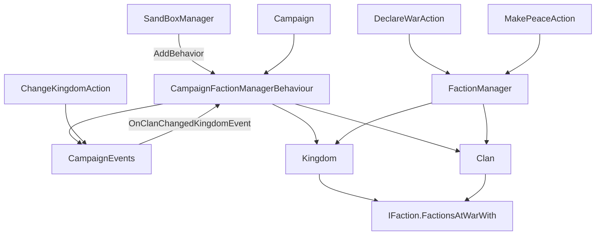

# CampaignFactionManagerBehaviour

**命名空间：** `TaleWorlds.CampaignSystem.CampaignBehaviors`  
**模块：** `TaleWorlds.CampaignSystem`  
**类型：** `public class CampaignFactionManagerBehaviour : CampaignBehaviorBase`  
**基类：** [CampaignBehaviorBase](../CampaignBehaviorBase)  
**源文件：** `bin/TaleWorlds.CampaignSystem/TaleWorlds.CampaignSystem.CampaignBehaviors/CampaignFactionManagerBehaviour.cs`

## 概述

`CampaignFactionManagerBehaviour` 是常驻于战役层的「派系敌对缓存维护器」。每个 `Kingdom` 与 `Clan` 都持有一份派生缓存 `_factionsAtWarWith`（通过 `IFaction.FactionsAtWarWith` 只读暴露），用于在不反复遍历全部派系的情况下快速回答「我和谁处于交战」。当派系结构发生增减性变化——开局、读档、新王国诞生、新家族诞生、家族从一个王国易主到另一个王国——既有的姿态（Stance）级重算不会覆盖这些「成员变了」的场景，于是本行为在相应事件触发时，对 `Kingdom.All` 与 `Clan.All` 中每一个未被消灭的派系重新调用 `UpdateFactionsAtWarWith()`，把整张敌对缓存表刷回与 `FactionManager` 的实际姿态一致的状态。它自身不做任何外交决策，也不持有需持久化的字段。

## 心智模型

把它想成战役里一张「谁在和谁交战」的索引表的管理员，活动完全在**战役层**，不碰任何 Mission / UI。

- **所处层与注册**：它只在 Campaign 层运行。战役启动时由 Sandbox 模块的 `SandBoxManager.InitializeGameStarter` 经 `gameStarter.AddBehavior(new CampaignFactionManagerBehaviour())`（`SandBoxManager.cs:156`）注册，随战役常驻；它不是 Model，不能用 `Campaign.Current.Models` 取，要用 `Campaign.Current.GetCampaignBehavior<CampaignFactionManagerBehaviour>()` 拿当前战役实例（跨战役保存该引用会失效，因为每个战役有独立实例）。
- **驱动方式（事件，而非每 tick）**：`RegisterEvents` 中订阅了五个非序列化事件——`OnNewGameCreatedEvent`、`OnGameLoadedEvent`、`KingdomCreatedEvent`、`OnClanCreatedEvent`、`OnClanChangedKingdomEvent`。任一事件触发即调用私有静态 `RefreshFactionsAtWarWith()`，遍历 `Kingdom.All` 与 `Clan.All` 对每个 `!IsEliminated` 的派系调用 `UpdateFactionsAtWarWith()`。它不每帧轮询，只在结构变动那一刻刷新。
- **维护的外交状态**：它维护的是**由 `FactionManager` 的姿态派生出来的敌对索引**。`Kingdom.UpdateFactionsAtWarWith()`（`Kingdom.cs:502`）与 `Clan.UpdateFactionsAtWarWith()`（`Clan.cs:677`）先 `Clear()` 内部 `_factionsAtWarWith`，再遍历全部王国/家族、把 `IsAtWarWith(item)` 为真且未消灭者加入缓存。换句话说，本行为把「谁和谁交战」的派生索引整体重算一遍。
- **序列化**：`SyncData(IDataStore)` 是空实现——因为它维护的全是可由 `UpdateFactionsAtWarWith()` 完全重算的派生缓存，无需 `[SaveableField]`，读档后由 `OnGameLoaded` 自动重建。真正的姿态数据在 `FactionManager`（其 `[SaveableField(20)] _stances` 随存档序列化）。
- **与 *Action 的级联关系（关键认知）**：**宣战/媾和落定走 `*Action`，本行为只在「成员增减」这种 *Action / FactionManager 覆盖不到的场景补一层刷新。** 具体链路：`DeclareWarAction.Apply*` → `FactionManager.DeclareWar` → `SetStance` → 直接对交战双方调用 `UpdateFactionsAtWarWith()`；`MakePeaceAction.Apply` → `FactionManager.SetNeutral` → 同样直接刷新双方。而 `ChangeKingdomAction.Apply` 改变家族归属后，派发 `CampaignEvents.OnClanChangedKingdomEvent`，本行为监听该事件并因此把**所有**派系的敌对索引全量刷新——因为新归属会让「已有派系要不要反查包含这个新成员」发生改变。`FactionManager` 负责两点之间的姿态级重算，本行为是成员增减时的安全网，两者互补。

## 何时使用 / 何时不要使用

- **用**：排查「为什么 AI 还把刚并入我王国的家族当敌人打」这类敌对缓存陈旧的 bug；在 `OnClanChangedKingdomEvent` 等结构性事件上挂你自己的派生刷新（本行为已先把全表刷好，你的回调拿到的是一致状态）；确认本行为已随战役正确注册。
- **不要用**：想改变外交关系——永远走 `DeclareWarAction` / `MakePeaceAction` / `ChangeKingdomAction` / `FactionManager`，让缓存由官方路径自动重建，不要手动改 `IFaction` 的姿态或私有 `_factionsAtWarWith` 字段；不要读私有 `_factionsAtWarWith`，请读公开只读的 `IFaction.FactionsAtWarWith`；不要在 Mission 层调用（它依赖 `Kingdom.All` / `Clan.All` 这种战役全局集合）；不要在做高频事件里再叠一层同样的全量 `RefreshFactionsAtWarWith()`（见风险）。

## 依赖图



### 上游（注册方 / 输入方）

- [CampaignBehaviorBase](../CampaignBehaviorBase)：提供 `RegisterEvents` / `SyncData` 的契约，本行为重写这两个钩子。
- [CampaignGameStarter](../CampaignGameStarter)：`AddBehavior` 是战役启动时的注册入口（`SandBoxManager` 在此注册本行为）。
- [CampaignEvents](../CampaignEvents)：本行为订阅的五个事件（`OnNewGameCreatedEvent`、`OnGameLoadedEvent`、`KingdomCreatedEvent`、`OnClanCreatedEvent`、`OnClanChangedKingdomEvent`）的来源；其中 `OnClanChangedKingdomEvent` 正由 [ChangeKingdomAction](../../campaign-ext/ChangeKingdomAction) 在家族易主时派发。
- [Campaign](../Campaign)：提供 `GetCampaignBehavior<T>()` 取本行为实例，以及 `Kingdom.All` / `Clan.All` 这两个全局派系集合。

### 下游（被维护 / 被消费方）

- [Kingdom](../Kingdom) 与 [Clan](../Clan)：`UpdateFactionsAtWarWith()` 的实现方，缓存就挂在它们身上。
- [IFaction](../IFaction)：公开只读的 `FactionsAtWarWith`，AI 与目标选择据此快速查敌。
- [FactionManager](../FactionManager)：外交姿态级重算引擎（`DeclareWar` / `SetNeutral` / `IsAtWarAgainstFaction`），与本行为是互补的两层缓存维护。
- [DeclareWarAction](../../campaign-ext/DeclareWarAction) 与 [MakePeaceAction](../../campaign-ext/MakePeaceAction)：宣战/媾和落定的入口，经 `FactionManager` 直接刷新交战双方缓存，是本行为之外另一路刷新来源。
- [DiplomacyModel](../DiplomacyModel)：决定常战（`IsAtConstantWar`）、默认姿态与浅层外交姿态，影响 `FactionManager` 重算结果，进而决定本行为刷出的缓存内容。

## 风险

- **刷新是全量 O(王国数 × 派系数) 重建**：`RefreshFactionsAtWarWith()` 遍历 `Kingdom.All` 与 `Clan.All`，对每个再做 `IsAtWarWith` 判定。派系很多（含强盗家族）时，每一次结构性事件都付出整表重算成本——不要在高频事件里再叠一层同样的全量刷新，也不要 fork 后把它接到更频繁的事件上。
- **缓存可能陈旧**：本行为只在「新建/易主」这类事件触发刷新。若你绕过 `FactionManager` 与这些事件直接改派系关系，敌对缓存不会自动更新，下游 AI / 目标选择会基于过期列表决策，造成「还把友军当敌人打」之类的坏行为。修改外交务必走官方通道。
- **`SyncData` 为空：无坏档字段，也不容你随意加状态**：它不持久化任何字段，派生缓存每次可重算。若你 fork 它并加了需存档的字段，必须补 `SyncData` 登记，否则读档后状态丢失或错位（尽管本行为自身空实现不会坏档）。
- **事件订阅时机**：注册发生在 `InitializeGameStarter`，从新局/读档那一刻起监听即生效。任何 mod 若替换或移除了本行为，`FactionsAtWarWith` 将不再随派系增减刷新——务必保留其 `AddBehavior`，或自行补等价刷新。
- **跨战役实例失效**：`GetCampaignBehavior<CampaignFactionManagerBehaviour>()` 返回的是「当前」战役实例；把它存成静态字段跨战役复用会得到旧局对象，应在每次需要时现取。
- **读档早期集合可能未齐**：`OnGameLoaded` 里已调刷新，但若你的代码早于 `Kingdom.All` / `Clan.All` 建好之前就读 `FactionsAtWarWith`，可能拿到空或局部缓存。

## 成员说明

### 生命周期钩子

- **`RegisterEvents()`**：战役启动时由框架调用，登记五个非序列化监听（`OnNewGameCreatedEvent`→`OnNewGameCreated`、`OnGameLoadedEvent`→`OnGameLoaded`、`KingdomCreatedEvent`→`OnKingdomCreated`、`OnClanCreatedEvent`→`OnClanCreated`、`OnClanChangedKingdomEvent`→`OnClanChangedKingdomEvent`）。派生或 fork 时漏掉任一监听，对应场景下的敌对缓存就会陈旧。
- **`SyncData(IDataStore)`**：空实现。因为它维护的是纯派生缓存，无需持久化；真正的姿态由 `FactionManager` 序列化。扩展时若引入需跨档保留的状态，必须在此登记，否则读档后错位。

### 公开查询与外交方法

本行为不暴露供 modder 直接调用的「宣战/媾和」方法——那是 `FactionManager` 与 `*Action` 的职责。它对外真正的价值是**维护并刷新** `IFaction.FactionsAtWarWith`。

- **`RefreshFactionsAtWarWith()`（私有静态）**：真正的「重算」逻辑。遍历 `Kingdom.All` 与 `Clan.All` 中每个 `!IsEliminated` 的派系，调用其 `UpdateFactionsAtWarWith()`，把 `_factionsAtWarWith` 这一派生索引整体重算一遍。
- **`OnNewGameCreated(CampaignGameStarter)` / `OnGameLoaded(CampaignGameStarter)`**：分别在开新局、读档完成后调 `RefreshFactionsAtWarWith()`，保证第一帧起敌对缓存即一致。
- **`OnKingdomCreated(Kingdom)` / `OnClanCreated(Clan, bool)`**：新王国或新家族加入世界时调 `RefreshFactionsAtWarWith()`。仅新增成员本身不会让 `FactionManager` 的姿态级重算覆盖「已有派系要反查包含新成员」，所以必须全表刷新。
- **`OnClanChangedKingdomEvent(Clan, Kingdom oldKingdom, Kingdom newKingdom, ChangeKingdomAction.ChangeKingdomActionDetail, bool)`**：家族从 `oldKingdom` 转入 `newKingdom`（由 `ChangeKingdomAction.Apply` 触发）时调 `RefreshFactionsAtWarWith()`。`ChangeKingdomActionDetail` 与最后的 `bool arg5` 本行为未使用——它只关心「成员归属变了」这一事实，需要重算所有派系的敌对索引。

### 事件（供 modder 订阅以同步派生数据）

- 本行为在 `RegisterEvents` 内监听的五个事件都来自 [CampaignEvents](../CampaignEvents)。如果你也想在「家族易主导致全表刷新」之后同步自己的 mod 状态，应在自己的 Behavior 里挂同一个 `OnClanChangedKingdomEvent`（本行为已先把全表刷好，你的回调拿到的是一致状态）。注意事件监听器用 `AddNonSerializedListener` 登记，不随存档序列化。

## 示例

读取本行为所维护的「交战缓存」——它才是 mod 应消费的公开接口（不要碰私有 `_factionsAtWarWith`）：

```csharp
CampaignFactionManagerBehaviour factionManager =
    Campaign.Current.GetCampaignBehavior<CampaignFactionManagerBehaviour>();
if (factionManager != null)
{
    // 玩家家族当前的敌对派系列表，已由本行为在派系结构变动时刷新
    foreach (IFaction enemy in Clan.PlayerClan.FactionsAtWarWith)
    {
        // 用刷新后的敌对列表做提示 / AI 目标评估
    }
}
```

改变外交关系必须走 `*Action`，让缓存由官方路径自动重建——不要直接改 `IFaction` 姿态：

```csharp
// 宣战：经 DeclareWarAction -> FactionManager.DeclareWar -> 直接刷新交战双方缓存
DeclareWarAction.ApplyByDefault(clanA.MapFaction, clanB.MapFaction);

// 媾和：经 MakePeaceAction -> FactionManager.SetNeutral -> 同样刷新双方缓存
MakePeaceAction.Apply(clanA.MapFaction, clanB.MapFaction);
```

在同样的「家族易主」事件上挂你自己的派生刷新（本行为已先把全表刷好）：

```csharp
CampaignEvents.OnClanChangedKingdomEvent.AddNonSerializedListener(
    this, (Clan clan, Kingdom oldKingdom, Kingdom newKingdom,
           ChangeKingdomAction.ChangeKingdomActionDetail detail, bool arg5) =>
    {
        // 此时 CampaignFactionManagerBehaviour 已重建所有王国/家族的 FactionsAtWarWith
        Kingdom playerKingdom = Clan.PlayerClan.Kingdom;
        if (playerKingdom != null)
        {
            foreach (IFaction enemy in playerKingdom.FactionsAtWarWith)
            {
                // 基于最新敌对索引同步你自己的 mod 状态
            }
        }
    });
```

自定义 Behavior 的注册（modder 在 Campaign 启动时加入自己的行为，与 `SandBoxManager` 注册本行为同理）：

```csharp
// 在你的 SubModule 中
protected override void InitializeGameStarter(Game game, IGameStarter starter)
{
    var campaignStarter = (CampaignGameStarter)starter;
    campaignStarter.AddBehavior(new MyFactionAuditBehavior());
}
```

## 参见

- ↑ 父级/基类：[CampaignBehaviorBase](../CampaignBehaviorBase)（所有 CampaignBehavior 的注册与存读档契约范本）
- ↔ 相关系统：[FactionManager](../FactionManager)（外交姿态级重算引擎，与本行为互补的两层缓存维护）、[Kingdom](../Kingdom) 与 [Clan](../Clan)（`UpdateFactionsAtWarWith()` 的实现方）、[IFaction](../IFaction)（公开只读的 `FactionsAtWarWith`）、[CampaignEvents](../CampaignEvents)（本行为订阅的五个事件）、[CampaignGameStarter](../CampaignGameStarter)（`AddBehavior` 注册入口）、[DeclareWarAction](../../campaign-ext/DeclareWarAction) 与 [MakePeaceAction](../../campaign-ext/MakePeaceAction)（宣战/媾和落定入口）、[ChangeKingdomAction](../../campaign-ext/ChangeKingdomAction)（家族易主，触发 `OnClanChangedKingdomEvent`）
