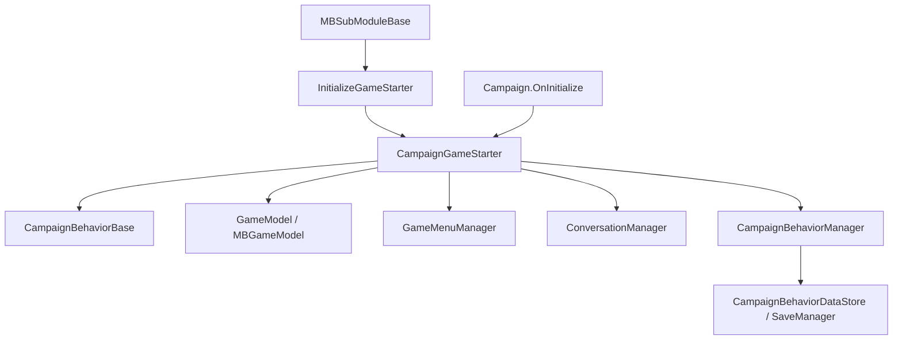

# CampaignGameStarter

**Namespace:** `TaleWorlds.CampaignSystem`  
**Module:** `TaleWorlds.CampaignSystem`  
**Type:** `public class CampaignGameStarter : IGameStarter`  
**Base:** `IGameStarter`  
**Source:** `bin/TaleWorlds.CampaignSystem/TaleWorlds.CampaignSystem/CampaignGameStarter.cs`

## 一句话职责

`CampaignGameStarter` 是战役启动期的组装容器：它接收各模块要加入的行为、模型、菜单和对话，随后由 `Campaign` 把这些集合交给正式的战役管理器。

## 心智模型

### 它在哪里、由谁创建

它属于 **Campaign 启动层**，不是一个全局服务，也不是运行中随时可取的状态对象。`Campaign.OnInitialize()` 创建它，并把它交给 `SandBoxManager.Initialize` 以及 `MBGameManager.InitializeGameStarter`。因此 `SandBoxSubModule.InitializeGameStarter`、`StoryModeSubModule.InitializeGameStarter` 和 mod 自己的同名钩子都能拿到同一个启动器。

新战役中，启动器收集的 `CampaignBehaviors` 会被 `CampaignBehaviorManager` 接管；模型集合会进入 `GameModels`。读档时，`Campaign` 先用新的 starter 集合初始化行为管理器，再按 `LoadBehaviorData()`、`RegisterEvents()` 的顺序恢复和注册行为。starter 自己不会在读档后继续承担事件分发。

### 什么时候用、什么时候不用

- **使用它**：在 `InitializeGameStarter(Game, IGameStarter)` 或等价的游戏启动窗口中注册自定义 `CampaignBehaviorBase`、模型、GameMenu 和对话流程。
- **使用它**：需要删除自己在启动阶段刚加入的行为或替换一个尚未交给运行时的模型时。
- **不要使用它**：在 `OnApplicationTick`、地图事件或 Mission 回调中把它当作运行时管理器；这些阶段应使用 [Campaign](../Campaign)、[CampaignBehaviorManager](../CampaignBehaviorManager)、`CampaignEvents` 或相应的 Action/Model。
- **不要使用它**：用 `GetModel` 代替运行中的 `Campaign.Models` 查询，或用 starter 直接修改 `Hero`、`MobileParty` 等世界实体。

## 依赖图



- **上游：** [MBSubModuleBase](../../core/MBSubModuleBase) 的启动钩子拿到 `IGameStarter`；`Campaign` 负责创建并持有本次启动器。
- **行为下游：** [CampaignBehaviorBase](../CampaignBehaviorBase) 实例进入 `CampaignBehaviors`，再由 [CampaignBehaviorManager](../CampaignBehaviorManager) 注册事件和保存数据。
- **模型下游：** `Models` 被交给 `GameModels`；`AddModel<T>` 会先把当前同类型模型传给包装模型的 `Initialize`。
- **内容下游：** `GameMenuManager` 和 `ConversationManager` 接收 starter 注册的菜单、选项、对话句子和对话流。

## 关键成员与时机

### 行为集合：`CampaignBehaviors`、`AddBehavior`、移除方法

`CampaignBehaviors` 是启动期集合。`AddBehavior` 忽略 `null`，只把实例追加到集合，并不会在这一刻调用 `RegisterEvents()`。常见做法是在 starter 阶段创建自己的行为并添加；后续由 `CampaignBehaviorManager` 统一注册和接管存档。

`RemoveBehaviors<T>()` 会从 starter 集合删除所有指定类型，`RemoveBehavior<T>(T behavior)` 删除指定实例并返回是否成功。它们只影响尚未交给运行时的 starter 列表；如果行为已经进入战役，必须看 [CampaignBehaviorManager](../CampaignBehaviorManager) 的移除语义，不能把两组方法混用。

### 模型集合：`Models`、`GetModel<T>`、`AddModel`

`Models` 返回启动期模型序列。`GetModel<T>` 从后往前找最近加入的匹配模型，所以后加入的替换模型会遮蔽旧模型。`AddModel(GameModel)` 直接加入对象；`AddModel<T>(MBGameModel<T>)` 先调用 `gameModel.Initialize(GetModel<T>())`，再把包装模型加入列表。

这组方法的调用顺序是契约的一部分：如果包装模型依赖已有默认模型，必须先让默认模型进入列表；如果没有匹配项，`Initialize` 会收到 `null`。安装模型应在 starter 阶段完成，不要在战役运行中反复追加相同模型。

### 菜单：`GetPresumedGameMenu` 与三个注册入口

`GetPresumedGameMenu(string)` 先向 `GameMenuManager` 查找菜单，找不到就创建并注册一个同 ID 的 `GameMenu`。`AddGameMenu` 初始化普通菜单，`AddWaitGameMenu` 还接收条件、结果和等待 tick，`AddGameMenuOption` 把选项追加到指定菜单。菜单 ID 是全局命名空间的一部分，第三方 mod 应使用稳定且带 mod 前缀的 ID。

`UnregisterNonReadyObjects()` 是启动收尾步骤，用于让 `Game.Current.ObjectManager` 和菜单管理器移除未准备对象。它应由战役初始化流程在所有注册完成后调用，mod 不应在注册前主动调用。

### 对话：`AddDialogFlow` 与 `Add*Line`

`AddDialogFlow` 把一个完整的 `DialogFlow` 交给 `ConversationManager`。`AddPlayerLine`、`AddRepeatablePlayerLine`、`AddDialogLine`、`AddDialogLineWithVariation` 和 `AddDialogLineMultiAgent` 是便于建立 `ConversationSentence` 的入口；它们共享输入 token、输出 token、条件委托和 consequence 委托的状态机契约。

重复对话入口会额外创建继续列出选项的句子；多 Agent 入口还要给出 agent index。不要只复制一个文本 ID 就跨模块注册，输入/输出 token 与优先级共同决定句子是否可达。

## 真实接入示例

### 在模块启动期注册行为

这是 `SandBoxSubModule` / `StoryModeSubModule` 使用的真实接入形状：先从 `IGameStarter` 类型检查为 `CampaignGameStarter`，再加入派生自 `CampaignBehaviorBase` 的 mod 行为。

```csharp
using TaleWorlds.Core;
using TaleWorlds.CampaignSystem;
using TaleWorlds.MountAndBlade;

public sealed class MySubModule : MBSubModuleBase
{
    protected override void InitializeGameStarter(Game game, IGameStarter gameStarterObject)
    {
        if (gameStarterObject is CampaignGameStarter starter)
        {
            starter.AddBehavior(new DailyReportBehavior());
        }
    }
}
```

`DailyReportBehavior` 的 `RegisterEvents` 和 `SyncData` 由 [CampaignBehaviorBase](../CampaignBehaviorBase) 页面定义；不要在 `OnSubModuleLoad` 中创建实例后遗忘 `AddBehavior`。

### 用已有模型初始化替换模型

`AddModel<T>` 的泛型重载用于包装一个已有类型的模型。下面的 `MyPartySpeedModel` 是 mod 自己实现的 `MBGameModel<PartySpeedModel>`，starter 会把当前默认模型交给它，而不是让替换模型自行猜测依赖。

```csharp
protected override void InitializeGameStarter(Game game, IGameStarter gameStarterObject)
{
    if (gameStarterObject is CampaignGameStarter starter)
    {
        starter.AddModel(new MyPartySpeedModel());
    }
}
```

## 风险与崩溃边界

- **启动阶段之外为空。** starter 不是 `Campaign.Current` 的替代品；把它缓存到 tick 或 Mission 生命周期后继续使用，可能读到已完成组装的短生命周期对象。
- **模型顺序会改变计算链。** `AddModel<T>` 初始化时可能收到 `null` 或一个已被后加入对象遮蔽的模型。替换模型必须处理这个前置条件，不能无条件解引用默认模型。
- **移除 starter 行为不会清理运行时监听器。** 一旦 `CampaignBehaviorManager` 接管行为，使用 starter 的 `RemoveBehavior` 不会撤销 `CampaignEventDispatcher` 监听器；运行时移除应走管理器的泛型移除入口。
- **菜单与对话 ID 会发生跨 mod 冲突。** 重复的菜单 ID、句子 ID 或 token 可能覆盖/串接别人的流程，造成菜单不可达或对话循环。
- **过早清理对象会破坏后续初始化。** `UnregisterNonReadyObjects` 是战役初始化末尾的清理，不要在所有模块完成注册前调用。
- **starter 不负责存档。** 行为的持久状态由 `CampaignBehaviorBase.SyncData` 和 `CampaignBehaviorDataStore` 管理；不要把 starter、菜单管理器、委托或引擎句柄写入行为存档。

## 版本注记

v1.3.15 与 v1.4.5 都保留 starter 的行为、模型、菜单和对话职责。v1.4.5 的 `AddModel<T>(MBGameModel<T>)` 初始化替换模型的顺序尤其重要；跨版本 mod 应重新核对泛型约束和对应的 `GameModel` 类型，不要只按方法名判断兼容性。

## 导航

- ↑ Parent：[Campaign API](./)
- ↔ Siblings：[Campaign](../Campaign) · [CampaignBehaviorBase](../CampaignBehaviorBase) · [CampaignBehaviorManager](../CampaignBehaviorManager) · [CampaignEvents](../CampaignEvents)
- Related：[MBSubModuleBase](../../core/MBSubModuleBase) · [GameModels](../GameModels) · [MissionBehavior](../../mission/MissionBehavior)
