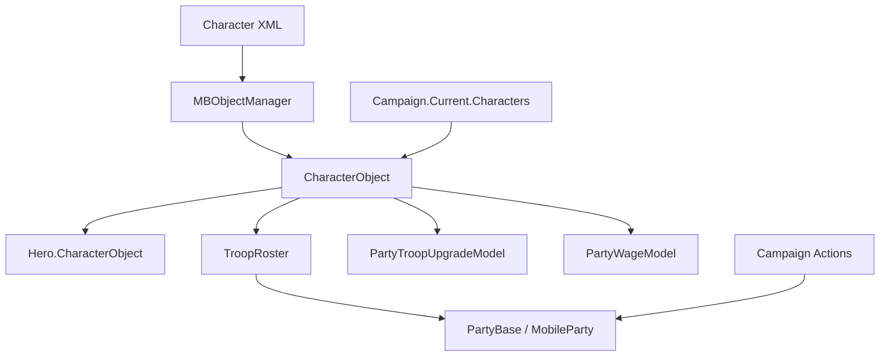

# CharacterObject

**命名空间：** `TaleWorlds.CampaignSystem`  
**模块：** `TaleWorlds.CampaignSystem`  
**类型：** `public sealed class CharacterObject : BasicCharacterObject, ICharacterData`  
**基类：** `BasicCharacterObject`  
**源文件：** `bin/TaleWorlds.CampaignSystem/TaleWorlds.CampaignSystem/CharacterObject.cs`  
**身份层：** 已注册的角色/兵种定义；`StringId` 和 ObjectManager 注册使 XML 定义、roster 与存档引用能指向同一对象。

## 一句话职责

它是战役规则识别“哪一种兵、哪一个角色模板”的稳定对象：升级、工资、装备、文化和 roster 条目都持有它，而不是复制一份数值。它把静态角色定义接到当前 Campaign 的对象注册表和派对消费链上，却不拥有某个人的战役经历或任何世界变更流程。

## 心智模型：模板、个人与数量是三件事

`CharacterObject` 不是“某位英雄”，也不是“给队伍加兵”的服务。普通兵时，它是从角色 XML 读入、由对象管理器注册的模板；`TroopRoster` 用它作为一个条目的类型键，再额外保存数量、伤兵数和经验。英雄时，它仍是该英雄的角色面：`IsHero` 由非空 `HeroObject` 决定，名称、年龄、文化、性别、生命和装备等读取会转交给 Hero 的个人状态。

因此要先问自己在处理哪一层：

- 查兵种 ID、文化、阶级、升级目标、战斗装备或模型输入时，使用 `CharacterObject`。
- 查某位人的家族、金币、关系、囚禁、死亡和长期健康时，使用 [Hero](../Hero/)；`Hero.CharacterObject` 是两层之间的显式桥梁。
- 查队伍里有多少该类型、是否受伤或怎样移动成员时，读取 [PartyBase](../PartyBase/) / [MobileParty](../MobileParty/) 的 roster。修改归属应走对应 Action 或 Party Screen 流程，不能因为已经拿到 CharacterObject 就直接拼装世界状态。
- Mission 的 `Agent` 是短命的场景实例。不要用它替代模板，也不要跨 Mission 缓存 Agent 再把它当作 CharacterObject 的持久身份。

## 取得、注册与生命周期

Campaign 可用后，`CharacterObject.All` 就是 `Campaign.Current.Characters` 的只读视图。它适合枚举已加载的角色定义；在主菜单、`OnSubModuleLoad`、Campaign 结束后和读档尚未完成时，`Campaign.Current` 都不是可靠入口。

`Find(stringId)` 直接调用 `MBObjectManager.Instance.GetObject<CharacterObject>(stringId)`，按已注册的 `StringId` 返回对象或 `null`。`FindFirst` 在 `All` 上执行 `FirstOrDefault`，`FindAll` 返回针对 `All` 的 LINQ `Where` 枚举。后两者适合筛选当前集合；若接下来要执行会改变 roster、英雄归类或世界状态的 Action，先把候选项复制到列表，避免在枚举期间改变所依赖的战役集合。

角色 XML 反序列化时，`Deserialize` 读取职业、模板/百科标记、特质、升级目标、等级和升级物品类别；注册完成后的 `AfterRegister` 会把战斗与平民装备标记为同步。读档初始化会重建内部默认值；英雄角色还会在 `InitializeHeroCharacterOnAfterLoad` 中从原始模板恢复升级、装备模板、特质和默认技能。它们是加载管线钩子，不是给 Behavior 手动调用的初始化 API。

## 真实查询示例

下面的代码只读取已注册模板；它应在 Campaign 已经运行的 Behavior 回调或战役事件内执行。

```csharp
CharacterObject imperialRecruit = CharacterObject.Find("imperial_recruit");

if (imperialRecruit != null && imperialRecruit.IsRegular)
{
    int dailyWage = imperialRecruit.TroopWage;
    int tier = imperialRecruit.Tier;
}

CharacterObject mountedImperialRegular = CharacterObject.FindFirst(character =>
    character.IsRegular &&
    character.Culture.StringId == "empire" &&
    character.IsMounted);

IEnumerable<CharacterObject> imperialUpgradeRoots = CharacterObject.FindAll(character =>
    character.IsRegular &&
    character.Culture.StringId == "empire" &&
    character.UpgradeTargets.Length > 0);
```

使用 `Campaign.Current.Characters` 的等价路径适合把查询范围写得更明确：

```csharp
foreach (CharacterObject character in Campaign.Current.Characters)
{
    if (character.IsRegular && character.Occupation == Occupation.Mercenary)
    {
        int currentWage = character.TroopWage;
    }
}
```

两个片段只读取对象。它们没有把兵加入任何 roster，也没有创建或移动 Hero。

## 依赖和下游消费者



| 关系 | 为什么重要 |
| --- | --- |
| [Campaign](../Campaign/) | `Campaign.Current.Characters` 是已加载角色定义的战役级枚举入口。 |
| [MBObjectBase](../../core/MBObjectBase/) 与 [BasicCharacterObject](../../core-extra/BasicCharacterObject/) | 前者提供注册/身份生命周期，后者提供基础身体、装备、技能和战斗属性；不要跳过它们手工伪造对象。 |
| [Hero](../Hero/) | Hero 在构造和读档时绑定 `CharacterObject`；模板属性会在英雄分支中转发到 Hero。 |
| [PartyBase](../PartyBase/) 与 [MobileParty](../MobileParty/) | `TroopRosterElement.Character` 是一个 CharacterObject；数量、伤兵、队伍位置和所有权属于 roster 或派对。 |
| [GameModels](../GameModels/) | `CharacterStatsModel` 计算 tier/生命，`PartyWageModel` 计算普通兵工资，`PartyTroopUpgradeModel` 计算升级资格与成本。 |
| [AddHeroToPartyAction](../../campaign-ext/AddHeroToPartyAction/)、[TakePrisonerAction](../../campaign-ext/TakePrisonerAction/) 与 [KillCharacterAction](../../campaign-ext/KillCharacterAction/) | 世界变更的拥有者。CharacterObject 只能作为参数或 roster 键，不能替代 Action 的迁移、事件和清理。 |
| [SaveManager](../../save-system/SaveManager/) | Hero 与来源模板的引用是存档对象图的一部分；稳定注册身份和加载顺序决定引用能否复原。 |

## 关键成员：按用途和副作用读取

| 成员组 | 使用时机 | 语义与边界 |
| --- | --- | --- |
| `All`、`Find`、`FindFirst`、`FindAll` | 已进入 Campaign 后按 ID 或条件选模板 | `Find` 走 `MBObjectManager`；三者都可能得不到结果。不要把 `FindAll` 的延迟枚举跨世界变更保存。 |
| `IsHero`、`IsRegular`、`HeroObject`、`OriginalCharacter` | 需要区分普通兵、英雄面与派生角色时 | 英雄分支的多个读取会转发给 Hero；`HeroObject` 的 setter 是内部的，关联由 Hero 创建/加载流程维护。 |
| `Name`、`Culture`、`Age`、`Level`、`Equipment`、`HitPoints` | UI、战斗预览或模型计算 | 英雄时会从 Hero 读取，普通兵则使用模板/基础角色数据；这些 getter 不等于可安全直接写回的编辑入口。 |
| `UpgradeTargets`、`UpgradeRequiresItemFromCategory`、`GetUpgradeXpCost`、`GetUpgradeGoldCost` | 显示或评估一个具体派对中的升级 | 成本委托给 `PartyTroopUpgradeModel`。XP 方法会保护非法索引并传入 `null` 目标；金币方法直接索引数组，调用前必须确认索引有效。模型还会检查物品和 perk。 |
| `TroopWage`、`Tier`、`ConformityNeededToRecruitPrisoner` | 招募、工资预算、囚犯转化预览 | 普通兵工资由 `PartyWageModel.GetCharacterWage` 决定；英雄工资是 `2 + Level * 2`。这些都是当前模型的结果，模组替换 Model 后可改变。 |
| `IsMounted`、`IsRanged`、`GetPower`、`GetBattlePower`、`GetFormationClass` | 编队、AI 或战斗强度读取 | 依赖装备、Hero 与基础角色数据。它们是派生判断，不应缓存到跨装备变更或读档之后。 |
| `CreateFrom`、`Deserialize`、`AfterRegister`、`InitializeHeroCharacterOnAfterLoad` | 引擎创建、XML/读档生命周期 | `CreateFrom` 会经 `MBObjectManager` 创建并复制模板数据，其他几个是框架钩子。不要用它们作为“生成一名可正常入队英雄/兵”的快捷方式。 |

## roster、升级和工资为何消费它

源中的 `TroopRoster.AddToCounts(CharacterObject, ...)` 以该对象作为 roster 键；Party Screen 的升级流程从原条目的 `UpgradeTargets` 选目标，扣减原兵种计数、加入目标兵种并记录升级历史。这里的数量变更属于 roster 流程，不属于 `CharacterObject`。

升级模型只允许非 Hero 且拥有目标的角色升级，并进一步检查所需物品和 perk。`GetUpgradeGoldCost` 又会从目标与原兵的招募成本推导价格。工资模型按 `Tier` 给普通兵基础工资，对雇佣兵应用倍率；完整派对工资还会按成员数量、英雄、perk、文化、建筑和政策修正。因而 `TroopWage` 是方便的读取入口，不是最终派对账单的替代品。

## 世界变更、崩溃与存档边界

- **不要把模板当作队伍突变 API。** 给英雄入队使用 `AddHeroToPartyAction.Apply`；其源实现会从旧 roster 移除英雄、清空驻留据点、处理总督，再加入新队伍并发送加入事件。对普通兵或囚犯的移动使用 Party Screen/roster 的受控流程以及 [TakePrisonerAction](../../campaign-ext/TakePrisonerAction/) 等相应 Action，而不是只改一个计数或 Hero 字段。
- **不要用 CharacterObject 杀人。** 真正死亡使用 `KillCharacterAction`：它先检查死亡资格和战斗延后标记，再处理继承、军团/队伍、囚禁、配偶、同伴、据点角色与事件。直接删 roster 条目或改 Hero 状态会留下不一致引用。
- **不要 `new CharacterObject` 或改已注册对象的身份。** XML/对象管理器注册、`StringId`、英雄链接和 `[SaveableField]` 的 `_heroObject` / `_originCharacter` 一起构成可加载图。未注册对象查不到；在注册后改 ID、解除仍被引用的对象，或在反序列化期间改写关联，都可能导致加载失败或坏档。
- **尊重阶段和空值。** `Campaign.Current`、`Culture` 的装备 roster、Hero 关联和升级数组在错误时机可能不可用；尤其 `FirstStealthEquipment` 会从 `Culture.DefaultStealthEquipmentRoster.AllEquipments` 取首项。只在战役已就绪的回调读取，并为查询失败和数组索引做保护。

## 导航

- ↑ 父级：[Campaign 模块索引](../)
- ↔ 同级：[Campaign](../Campaign/)、[Hero](../Hero/)、[MobileParty](../MobileParty/)、[PartyBase](../PartyBase/)、[GameModels](../GameModels/)
- 相关基础：[MBObjectBase](../../core/MBObjectBase/)、[BasicCharacterObject](../../core-extra/BasicCharacterObject/)
- 变更边界：[AddHeroToPartyAction](../../campaign-ext/AddHeroToPartyAction/)、[TakePrisonerAction](../../campaign-ext/TakePrisonerAction/)、[KillCharacterAction](../../campaign-ext/KillCharacterAction/)
- 架构：[崩溃边界](../../../architecture/crash-boundary/)、[文档契约](../../../architecture/doc-contract/)
