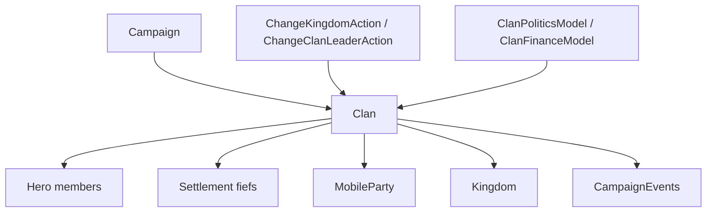

# Clan

**命名空间:** `TaleWorlds.CampaignSystem`  
**模块:** `TaleWorlds.CampaignSystem`  
**类型:** `public sealed class Clan : MBObjectBase, IFaction`  
**基类:** [MBObjectBase](../../core/MBObjectBase)  
**源文件:** `bin/TaleWorlds.CampaignSystem/TaleWorlds.CampaignSystem/Clan.cs`

## 一句话职责

`Clan` 是战役中把一组 `Hero`、领地、派对和政治资源组织在一起的最小政治单元；它可以独立存在，也可以加入一个 `Kingdom`。它适合用来读取家族的成员、领地、经济和政治关系；改变王国归属、领袖或影响力时，应让对应的 Action 维护对象图和事件，而不是只改一个属性。

## 心智模型

### 它是什么

把 `Clan` 看作“家族账本和政治边界”，不要把它当作单个领主的别名。`Leader` 是当前家族领袖，`Heroes` 和 `Companions` 是家族成员，`Settlements` 是家族直接持有的领地，`Kingdom` 是家族加入的王国。家族的 `Influence`、`Renown`、`Tier`、`DebtToKingdom` 和 `CurrentTotalStrength` 会被决策、战争、募兵和财政流程使用。

`Clan.PlayerClan` 和 `Clan.All` 都从当前 [Campaign](../Campaign) 读取；它们不是跨存档稳定的静态缓存。家族与英雄、王国和领地互相持有引用，所以一个 setter 的局部变化并不等于完成一次政治操作。

### 生命周期与持有关系

- **创建/注册：** `Clan.CreateClan(stringID)` 生成唯一 ID 并交给 Campaign 对象管理器；原生的叛军、同伴领主和王国创建流程还会继续补充领袖、领地和事件。
- **运行中：** `Hero.Clan`、`Settlement.OwnerClan`、`Kingdom.Clans` 和 `MobileParty.ActualClan` 共同构成家族的对象图。成员或领地改变时，缓存列表和地图显示也要同步。
- **归属变化：** `Clan.Kingdom` setter 会维护旧/新王国的成员缓存、英雄、领地和队伍，但宣誓效忠、叛变、离开王国和佣兵服务必须走 [ChangeKingdomAction](../../campaign-ext/ChangeKingdomAction)。
- **领袖变化/销毁：** 领袖死亡会触发继承或换领袖流程；家族销毁会连带处理英雄和派对。不要把 `SetLeader` 当成完整的换领袖 API。

### 何时用，何时不用

- **使用：** 查找玩家家族、领袖、成员、领地、王国、影响力、声望和战争关系；计算家族在某个决策中的上下文。
- **使用：** 从 `Clan.PlayerClan`、`Clan.All` 或其他实体的 `Hero.Clan` / `Settlement.OwnerClan` 获取已注册对象。
- **不要直接写政治归属：** 改王国归属用 `ChangeKingdomAction`；改领袖用 `ChangeClanLeaderAction`；改领地用 `ChangeOwnerOfSettlementAction`。直接写 `Clan.Kingdom` 只完成部分缓存维护。
- **不要直接写影响力来伪造交易：** `Influence` setter 不会代替 [ChangeClanInfluenceAction](../../campaign-ext/ChangeClanInfluenceAction) 发出影响力事件。
- **不要把 `Clan` 当作 `Kingdom`：** 家族可以没有王国，也可以是佣兵、土匪或叛军；先检查 `Kingdom`、`IsBanditFaction`、`IsRebelClan` 和 `IsEliminated`。

## 依赖图



### 上游

- [Campaign](../Campaign) 提供 `Clans` 集合、模型和当前时间；`Clan.All` 和 `Clan.PlayerClan` 必须在 Campaign 已启动后读取。
- `Hero` 提供家族领袖与成员；[Settlement](../Settlement) 通过 `OwnerClan` 维护领地关系；[MobileParty](../MobileParty) 通过 `ActualClan` 与家族相连。
- `Kingdom` 维护王国成员列表、统治家族、战争和政策；`Clan.Kingdom` 为家族到王国的反向引用。

### 下游

- [CampaignEvents](../CampaignEvents) 会发布家族领袖、归属、影响力、领地和王国变化事件，行为应订阅事件而不是每帧轮询。
- [ClanPoliticsModel](../ClanPoliticsModel)、[ClanFinanceModel](../ClanFinanceModel) 和 [ClanTierModel](../ClanTierModel) 计算影响力变化、财政和等级阈值；Model 只给规则结果，不提交状态。
- [ChangeKingdomAction](../../campaign-ext/ChangeKingdomAction)、[ChangeClanInfluenceAction](../../campaign-ext/ChangeClanInfluenceAction)、[ChangeClanLeaderAction](../../campaign-ext/ChangeClanLeaderAction) 和 [ChangeOwnerOfSettlementAction](../../campaign-ext/ChangeOwnerOfSettlementAction) 是有副作用的变更入口。

## 关键成员与调用时机

### 成员与领地

| 成员 | 用途、副作用与时机 |
| --- | --- |
| `Leader`、`Heroes`、`Companions` | 读取领袖、贵族/成员和同伴集合。英雄状态会变化，遍历后执行 Action 前应重新检查 `IsAlive`、`IsPrisoner` 和 `IsEliminated`。 |
| `Settlements`、`HomeSettlement` | 查家族直接持有的领地和逻辑家园。领地转移会更新 Clan 缓存，不要把集合当作可写 roster。 |
| `Kingdom`、`IsUnderMercenaryService` | 判断政治归属和佣兵状态。`Kingdom == null` 是合法状态，不表示对象损坏。 |
| `IsBanditFaction`、`IsRebelClan`、`IsEliminated` | 在创建决策、战争和 UI 列表前过滤特殊或已消灭家族；这些标志也影响可用 Action。 |

### 政治与经济

| 成员 | 用途、副作用与时机 |
| --- | --- |
| `Influence`、`InfluenceChangeExplained` | 前者是当前储备，后者由 `ClanPoliticsModel` 解释变化来源。读值可直接使用；改变值应调用 `ChangeClanInfluenceAction.Apply`。 |
| `Renown`、`Tier`、`RenownRequirementForNextTier` | 读取家族声望和等级门槛。`RenownRequirementForNextTier` 依赖当前 `ClanTierModel`，不要在 Campaign 外缓存。 |
| `CurrentTotalStrength` | 使用家族成员/派对计算当前力量，适合排序或展示，不是可持久化的手工战力字段。 |
| `DebtToKingdom`、`TributeWallet` | 财政流程使用的王国债务与贡金状态。离开或加入王国时 Action 会重置或结算相关值。 |
| `IsAtWarWith(IFaction)`、`GetRelationWithClan(Clan)` | 查询外交关系。宣战、议和或离开王国不要只改查询结果，使用对应外交 Action。 |

## Action、事件与 Model 边界

实体属性适合读状态，Action 才负责提交状态变更：

| 目标 | 入口 | 为什么不能只写属性 |
| --- | --- | --- |
| 加减家族影响力 | `ChangeClanInfluenceAction.Apply(clan, amount)` | 还要发布 `OnClanInfluenceChanged`，让行为和 UI 看见同一变更。 |
| 加入/离开/叛变/佣兵服务 | `ChangeKingdomAction.ApplyByJoinToKingdom` 等 | 处理战争和平、佣兵、领地、队伍图标和 `OnClanChangedKingdom`。 |
| 更换领袖 | `ChangeClanLeaderAction.ApplyWithSelectedNewLeader` | 转移金币、总督/派对角色、关系和领袖事件。 |
| 转移领地 | `ChangeOwnerOfSettlementAction.ApplyByDefault` 等 | 处理驻军、总督、地图事件、村庄绑定和领地事件。 |

`ClanPoliticsModel` 只回答影响力变化或政策规则；它不会把家族加入王国。`CampaignEvents.OnClanChangedKingdomEvent` 等事件只通知变化，也不会替你执行 `Apply`。

## 风险边界

- **直接改 `Kingdom`：** setter 会做部分缓存同步，但不替代 `ChangeKingdomAction` 的战争、佣兵、领地和事件级联，可能留下地图与外交不一致。
- **直接改 `Influence`：** 数值会变，但监听器不会收到标准影响力事件；需要修改世界状态时使用 Action。
- **空归属：** 家族没有 `Kingdom`、没有 `Leader` 或正在被销毁时，访问 `Kingdom.Clans`、`Leader.Gold` 或领地缓存前必须判空。
- **领袖生命周期：** `Leader` 可能是死者、囚犯或正在移动的英雄；创建军队、换领袖和发放金币前必须检查状态。
- **缓存与存档：** 家族的英雄、领地和王国引用在读档后会重建。自定义 Behavior 保存稳定 StringId 或数字，读档完成后用 `Clan.FindAll`/已有集合重新获取对象，不保存缓存实例。
- **事件时机：** `OnClanChangedKingdomEvent` 回调可能伴随领地、战争和队伍状态变化；回调中不要假定旧王国和新王国都非空。

## 真实示例

### 读取玩家家族和它的领地

```csharp
using TaleWorlds.CampaignSystem;

Clan playerClan = Clan.PlayerClan;
if (playerClan != null && !playerClan.IsEliminated)
{
    Kingdom kingdom = playerClan.Kingdom;
    int fiefCount = playerClan.Settlements.Count;
    Hero leader = playerClan.Leader;
}
```

这些对象来自当前 Campaign 的注册集合；`Kingdom` 可能为 `null`，家族领袖和领地也会在事件或读档阶段变化。

### 通过 Action 增加影响力

```csharp
using TaleWorlds.CampaignSystem.Actions;

Clan clan = Clan.PlayerClan;
if (clan != null && !clan.IsEliminated)
{
    ChangeClanInfluenceAction.Apply(clan, 10f);
}
```

Action 会调用影响力事件；这与直接 `clan.Influence += 10f` 的结果不同。若改变的是王国归属、领袖或领地，应换用对应 Action。

## 版本注记

本页以 v1.4.5 的 `TaleWorlds.CampaignSystem/Clan.cs` 和对应 `Actions` 源码为准。跨版本使用时重新确认 `ChangeKingdomAction` 的原因枚举、佣兵行为和 `Clan` 集合类型；不要把旧版本的 setter 副作用当作稳定契约。

## 导航

- ↑ 父级：[Campaign API](../)
- ↔ 同级：[Hero](../Hero) · [Kingdom](../Kingdom) · [Settlement](../Settlement) · [MobileParty](../MobileParty) · [PartyBase](../PartyBase)
- 子级/相关：[CampaignEvents](../CampaignEvents) · [CampaignBehaviorBase](../CampaignBehaviorBase) · [ChangeKingdomAction](../../campaign-ext/ChangeKingdomAction) · [ChangeClanInfluenceAction](../../campaign-ext/ChangeClanInfluenceAction) · [ChangeClanLeaderAction](../../campaign-ext/ChangeClanLeaderAction) · [ChangeOwnerOfSettlementAction](../../campaign-ext/ChangeOwnerOfSettlementAction) · [ClanPoliticsModel](../ClanPoliticsModel)
