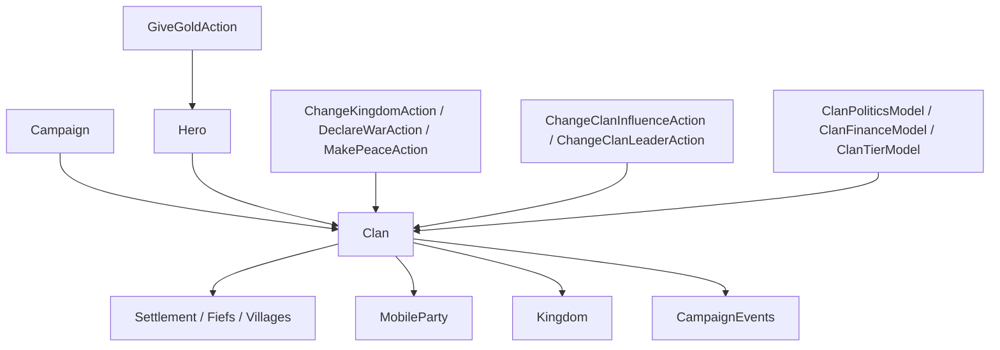

# Clan

**命名空间:** `TaleWorlds.CampaignSystem`  
**模块:** `TaleWorlds.CampaignSystem`  
**类型:** `public sealed class Clan : MBObjectBase, IFaction`  
**基类:** [MBObjectBase](../../core/MBObjectBase)  
**实现接口:** `IFaction`  
**源文件:** `bin/TaleWorlds.CampaignSystem/TaleWorlds.CampaignSystem/Clan.cs`

## 一句话职责

`Clan` 是战役里把一群 `Hero`（领袖、贵族、同伴）、领地、军队和政治资源打包在一起的最小政治单元：它可以是玩家家族、某个领主家族，也可以是土匪、叛军之类的小型派系，还可以加入一个 `Kingdom` 成为其封臣。它主要用来**读取**一个家族的成员、领地、经济与外交状态；要改变王国归属、领袖、金币或影响力时，应走对应的 Action，让对象图、事件和 Model 一起更新，而不是只改一个属性。

## 心智模型

把 `Clan` 想成「家族账本 + 政治边界」，不要把它当成单个领主的别名。`Leader` 是当前家族领袖，`Heroes` / `Companions` 是成员，`Settlements` / `Fiefs` / `Villages` 是直接持有的领地，`Kingdom` 是它加入的王国。家族的 `Influence`、`Renown`、`Tier`、`DebtToKingdom`、`TributeWallet` 和 `CurrentTotalStrength` 会被决策、战争、募兵和财政流程持续使用。

`Clan.PlayerClan` 和 `Clan.All` 都从当前 [Campaign](../Campaign) 读取（分别是 `Campaign.Current.PlayerDefaultFaction` 和 `Campaign.Current.Clans`），它们不是跨存档稳定的静态缓存。家族与英雄、王国、领地互相持有引用，所以改一个 setter 往往只是局部动作，并不等于完成一次政治操作。

### 谁创建 / 谁持有

- **创建 / 注册：** `Clan.CreateClan(stringID)` 生成唯一 ID 并交给 `Campaign.Current.CampaignObjectManager.AddClan`，原生数据（叛军、同伴领主、王国创建流程）会继续补齐领袖、领地、事件与阵营关系。
- **运行中对象图：** `Hero.Clan`、`Settlement.OwnerClan`、`Kingdom.Clans`、`MobileParty.ActualClan` 共同把家族连进整个战役网络。成员或领地变化会通过内部缓存（`_heroesCache`、`_fiefsCache` 等）同步。
- **归属变化：** `Clan.Kingdom` 的 setter 会维护旧 / 新王国的成员缓存、英雄、领地与队伍，但宣誓效忠、叛变、离开王国、佣兵服务必须走 [ChangeKingdomAction](../../campaign-ext/ChangeKingdomAction)，否则战争、贡金、地图图标与外交姿态不会级联更新。
- **销毁：** 领袖死亡会触发继承或换领袖；家族被消灭（`DeactivateClan` / `DestroyClanAction`）会连带处理英雄与派对。不要把 `SetLeader` 当成完整的换领袖 API。

### 它属于哪一层

纯战役层（`TaleWorlds.CampaignSystem`），不依赖 Mission / 地图渲染。任何读 `Clan` 的代码都必须在 Campaign 已启动之后运行——`Clan.PlayerClan`、`Clan.All`、`Clan.NonBanditFactions` / `Clan.BanditFactions` 都从 `Campaign.Current` 取数。

## 何时用 / 何时不要用

- **用：** 查询玩家家族、领袖、成员、领地、王国、影响力、声望、等级与战争关系；根据家族上下文做决策或排序展示。
- **用：** 通过已注册对象获取：`Clan.PlayerClan`、`Clan.All`、`Hero.Clan`、`Settlement.OwnerClan`、`Kingdom.Clans`。
- **不要用 `Clan.Gold = ...`：** `Gold` 只是 `Leader?.Gold ?? 0` 的派生只读值（源码明确如此），不能直接赋值，也不能只改 `Leader.Gold` 了事。改变家族金币要经 [GiveGoldAction](../../campaign-ext/GiveGoldAction) 走正规转移（例如 `ApplyBetweenCharacters` / `ApplyForCharacterToSettlement`）。
- **不要用 `clan.Kingdom = ...` 代替政治操作：** 改王国归属用 [ChangeKingdomAction](../../campaign-ext/ChangeKingdomAction)（`ApplyByJoinToKingdom` / `ApplyByLeaveKingdom` / `ApplyByLeaveWithRebellionAgainstKingdom` / `ApplyByJoinFactionAsMercenary`）；宣战 / 议和用 [DeclareWarAction](../../campaign-ext/DeclareWarAction) / [MakePeaceAction](../../campaign-ext/MakePeaceAction)，而不是只改 `IsAtWarWith` 的查询结果。
- **不要直接写 `Influence` 伪造交易：** `Influence` setter 不会发出标准影响力事件，应调用 [ChangeClanInfluenceAction](../../campaign-ext/ChangeClanInfluenceAction)` .Apply(clan, amount)`。
- **不要直接写 `Leader` / `Heroes`：** 换领袖走 [ChangeClanLeaderAction](../../campaign-ext/ChangeClanLeaderAction)` .ApplyWithSelectedNewLeader`；转移领地走 [ChangeOwnerOfSettlementAction](../../campaign-ext/ChangeOwnerOfSettlementAction)。`SetLeader` 只同步 `_leader` 与 `leader.Clan`，不处理金币、总督、关系和事件。
- **不要把 `Clan` 当 `Kingdom`：** 家族可以没有王国（`Kingdom == null` 是合法状态），也可以是佣兵、土匪或叛军；操作前先检查 `Kingdom`、`IsBanditFaction`、`IsRebelClan`、`IsEliminated`。

## 依赖



### 上游

- [Campaign](../Campaign) 提供 `Clans` 集合、模型与当前时间；`Clan.PlayerClan` / `Clan.All` 必须在 Campaign 启动后读取。
- [Hero](../Hero) 提供家族领袖与成员（`Hero.Clan` 反向指回）；[Settlement](../Settlement) 通过 `OwnerClan` 维护领地关系；[MobileParty](../MobileParty) 与 [PartyBase](../PartyBase) 通过 `ActualClan` 与家族相连。
- [Kingdom](../Kingdom) 维护成员列表、统治家族、战争与政策；`Clan.Kingdom` 是家族到王国的反向引用。
- [Banner](../../core-extra/Banner) 是家族纹章（王国统治家族会改用王国纹章）；[CultureObject](../CultureObject) 决定文化、基础兵种与默认队伍模板。

### 下游 / 边界

- [CampaignEvents](../CampaignEvents)（事件分发器）会发布领袖、归属、影响力、领地、等级与王国变化事件；行为应订阅事件而非每帧轮询。
- [ClanPoliticsModel](../ClanPoliticsModel)、[ClanFinanceModel](../ClanFinanceModel)、[ClanTierModel](../ClanTierModel) 计算影响力变化、财政与等级阈值；Model 只给规则结果，不提交状态。
- [ChangeKingdomAction](../../campaign-ext/ChangeKingdomAction)、[GiveGoldAction](../../campaign-ext/GiveGoldAction)、[ChangeClanInfluenceAction](../../campaign-ext/ChangeClanInfluenceAction)、[ChangeClanLeaderAction](../../campaign-ext/ChangeClanLeaderAction)、[ChangeOwnerOfSettlementAction](../../campaign-ext/ChangeOwnerOfSettlementAction)、[DeclareWarAction](../../campaign-ext/DeclareWarAction)、[MakePeaceAction](../../campaign-ext/MakePeaceAction) 是有副作用的状态变更入口。
- [CampaignBehaviorBase](../CampaignBehaviorBase) 是多数消费 `Clan` 的 Behavior 基类。

## 关键成员与调用时机

### 身份与外观

| 成员 | 用途、副作用与时机 |
| --- | --- |
| `Name` / `InformalName` | 家族全称与简称（`TextObject`）。改名用 `ChangeClanName`，不要直接赋值。 |
| `Culture` | 文化对象，决定 `BasicTroop` 与 `DefaultPartyTemplate`。读即可，赋值会改写兵种来源。 |
| `StringId` / `ToString()` | 稳定标识；自定义 Behavior 应保存 `StringId`，读档后用 `Clan.All` / `FindFirst` / `FindAll` 重新取对象。 |
| `IsNoble` / `Color` / `Color2` | 是否为贵族家族、阵营主 / 辅色（用于地图与 UI）。 |
| `Banner` / `ClanOriginalBanner` | 当前纹章；若家族是王国统治家族，`Banner` 返回王国纹章，否则返回自有纹章。`ClanOriginalBanner` 始终是家族原始纹章。改纹章颜色用 `UpdateBannerColor`。 |

### 领袖与成员

| 成员 | 用途、副作用与时机 |
| --- | --- |
| `Leader` | 当前领袖（`Hero`）。可能为 `null`、死者、囚犯或正在移动；发放金币、组建军队、换领袖前必须判空并检查状态。 |
| `Heroes` / `Companions` / `AliveLords` / `DeadLords` / `SupporterNotables` | 成员、同伴、在世 / 已故领主、支持者名流（`MBReadOnlyList`）。英雄状态会变化，遍历后执行 Action 前应重新检查 `IsAlive` / `IsPrisoner` / `IsEliminated`。 |
| `GetHeirApparents()` | 返回 `Dictionary<Hero, int>` 继承人候选及其得分；只在需要继承 UI / 决策时调用，代价不低。 |
| `SetLeader(Hero)` | 同步 `_leader` 与 `leader.Clan`。注意它**不**处理金币、总督、关系和事件，正式换领袖请用 `ChangeClanLeaderAction`。 |

### 经济

| 成员 | 用途、副作用与时机 |
| --- | --- |
| `Gold` | **派生只读**：`Leader?.Gold ?? 0`。不能直接赋值，改变金币走 [GiveGoldAction](../../campaign-ext/GiveGoldAction)。 |
| `Influence` / `InfluenceChangeExplained` | 当前影响力储备 / 由 `ClanPoliticsModel` 解释的变化来源。读值直接用；改值调用 `ChangeClanInfluenceAction.Apply`。 |
| `Renown` / `Tier` / `RenownRequirementForNextTier` | 声望与等级；`Tier` setter 受 `ClanTierModel` 的上下限钳制。`AddRenown` 会在声望足够时自动升阶并触发 `OnClanTierChanged`。 |
| `DebtToKingdom` / `TributeWallet` | 对王国的债务与贡金状态；加入 / 离开王国时由 Action 结算或重置。 |
| `DailyCrimeRatingChange` / `MainHeroCrimeRating` | 犯罪评级日变化（经 `CrimeModel`）与主角的家族犯罪值。 |
| `CurrentTotalStrength` | 由 `UpdateCurrentStrength` 据成员派对与城防估算；适合排序 / 展示，不是可持久化的手工战力字段。 |

### 政治与王国

| 成员 | 用途、副作用与时机 |
| --- | --- |
| `Kingdom` / `MapFaction` | 所属王国；`Kingdom == null` 时 `MapFaction` 返回自身（`IsMapFaction` 为 `true`）。改归属用 `ChangeKingdomAction`。 |
| `IsUnderMercenaryService` / `ShouldStayInKingdomUntil` | 佣兵状态与最短效忠期限；开始 / 结束佣兵服务由 `ChangeKingdomAction` 的佣兵重载处理。 |
| `FactionsAtWarWith` / `IsAtWarWith(IFaction)` / `GetStanceWith(IFaction)` | 交战列表与查询（底层走 `FactionManager`）。宣战 / 议和走 [DeclareWarAction](../../campaign-ext/DeclareWarAction) / [MakePeaceAction](../../campaign-ext/MakePeaceAction)。 |
| `GetRelationWithClan(Clan)` | 两家族领袖间的个人关系值（`Leader.GetRelation`）。 |
| `LastFactionChangeTime` / `FactionMidSettlement` | 上次阵营变化时间与家族领地几何中心（地图用）。 |

### 领地

| 成员 | 用途、副作用与时机 |
| --- | --- |
| `Settlements` / `Fiefs` / `Villages` | 家族持有的全部聚落 / 城镇 / 村庄（`MBReadOnlyList`）。这些是缓存视图，不要当作可写 roster；转移领地用 `ChangeOwnerOfSettlementAction`。 |
| `HomeSettlement` / `InitialHomeSettlement` | 逻辑家园与初始家园；`ConsiderAndUpdateHomeSettlement` 会按 `SettlementValueModel` 重新选址并同步成员家园。 |

### 分类标志（使用前先过滤）

| 成员 | 含义 |
| --- | --- |
| `IsMinorFaction` | 小型派系（土匪文化、商行会等），多为非封臣。 |
| `IsBanditFaction` | 土匪派系；`Clan.BanditFactions` 专门枚举。 |
| `IsRebelClan` | 叛军家族（由 `CreateSettlementRebelClan` 生成）。 |
| `IsEliminated` | 是否已被消灭（`DeactivateClan`）；消灭后多数操作无意义。 |
| `IsOutlaw` / `IsNomad` / `IsMafia` / `IsSect` / `IsClanTypeMercenary` | 各种特殊家族类型，影响可用 Action 与 UI。 |

### 获取与查询（静态入口）

| 成员 | 用途、时机 |
| --- | --- |
| `Clan.PlayerClan` | 玩家家族（`Campaign.Current.PlayerDefaultFaction`）。 |
| `Clan.All` | 所有已注册家族（`Campaign.Current.Clans`）。 |
| `Clan.NonBanditFactions` / `Clan.BanditFactions` | 过滤后的枚举，便于遍历非土匪 / 仅土匪家族。 |
| `Clan.CreateClan(stringID)` | 新建并注册一个家族（内部调用 `FindNextUniqueStringId`）。 |
| `Clan.FindFirst(Predicate<Clan>)` / `Clan.FindAll(Predicate<Clan>)` | 在 `All` 上按谓词查找。 |

## 风险边界

- **直接改 `Kingdom`：** setter 只做部分缓存同步（`SetKingdomInternal` → `EnterKingdomInternal` / `LeaveKingdomInternal`），不替代 `ChangeKingdomAction` 的战争、佣兵、领地、队伍图标与 `OnClanChangedKingdom` 事件级联，可能留下地图与外交不一致。
- **直接改 `Gold` / `Leader.Gold`：** `Gold` 是派生只读值，无法直接赋值；即便改了领袖的金币，也绕过了 [GiveGoldAction](../../campaign-ext/GiveGoldAction) 的通知与约束，会让财政与 UI 看到错误状态。
- **直接改 `Influence`：** 数值会变，但监听器收不到标准影响力事件；需要修改世界状态时必须用 `ChangeClanInfluenceAction`。
- **空归属与生命周期：** 家族没有 `Kingdom`、没有 `Leader`，或正在被销毁时，访问 `Kingdom.Clans`、`Leader.Gold`、`Settlements` 前必须判空；领袖可能是死者、囚犯或正在移动的英雄。
- **缓存与存档：** 英雄、领地、王国引用在读档后会重建。自定义 Behavior 应保存稳定的 `StringId`，读档完成后再用 `Clan.All` / `FindFirst` / `FindAll` 重新获取对象，不要保存缓存实例。
- **事件时机：** `OnClanChangedKingdom` 等回调可能伴随领地、战争、队伍状态变化；回调中不要假定旧王国与新王国都非空。

## 最小真实示例

### 读取玩家家族及其领地

```csharp
using TaleWorlds.CampaignSystem;

Clan playerClan = Clan.PlayerClan;
if (playerClan != null && !playerClan.IsEliminated)
{
    Kingdom kingdom = playerClan.Kingdom;          // 可能为 null（独立家族）
    int fiefCount = playerClan.Settlements.Count;   // 缓存视图，勿当作可写集合
    Hero leader = playerClan.Leader;                // 访问前判空并检查状态
}
```

这些对象来自当前 Campaign 的注册集合；`Kingdom` 可能为 `null`，领袖与领地也会在事件或读档阶段变化。

### 通过 Action 改变影响力（而非直接赋值）

```csharp
using TaleWorlds.CampaignSystem.Actions;

Clan clan = Clan.PlayerClan;
if (clan != null && !clan.IsEliminated)
{
    ChangeClanInfluenceAction.Apply(clan, 10f);
}
```

`Apply` 会同步更新值并发布影响力事件；这与直接 `clan.Influence += 10f` 的结果不同。若改的是王国归属、领袖、领地或金币，应换用对应 Action（见「何时用 / 何时不要用」）。

### 改变家族金币需走 GiveGoldAction

```csharp
using TaleWorlds.CampaignSystem.Actions;

Clan clan = Clan.PlayerClan;
if (clan != null && clan.Leader != null && !clan.Leader.IsDead)
{
    // Clan.Gold 是 Leader.Gold 的派生只读值，不能直接赋值。
    // 通过 GiveGoldAction 转移金币，Clan.Gold 会随之变化。
    GiveGoldAction.ApplyBetweenCharacters(Hero.MainHero, clan.Leader, 500);
}
```

## 版本注记

本页以 v1.4.5 的 `TaleWorlds.CampaignSystem/Clan.cs` 及对应 `Actions`、`Models` 源码为准。跨版本使用时重新确认 `ChangeKingdomAction` 的原因枚举（含佣兵与叛变重载）、`Clan.Gold` 的派生语义，以及 `Clan` 集合类型（`MBReadOnlyList<Clan>`）；不要把旧版本 setter 的副作用当作稳定契约。

## 导航

- ↑ 父级：[战役 API 索引](../)
- ↔ 同级：[Hero](../Hero) · [Kingdom](../Kingdom) · [Settlement](../Settlement) · [MobileParty](../MobileParty) · [PartyBase](../PartyBase) · [Campaign](../Campaign) · [CultureObject](../CultureObject)
- 相关模型：[ClanPoliticsModel](../ClanPoliticsModel) · [ClanFinanceModel](../ClanFinanceModel) · [ClanTierModel](../ClanTierModel) · [Banner](../../core-extra/Banner)
- 相关 Action：[ChangeKingdomAction](../../campaign-ext/ChangeKingdomAction) · [GiveGoldAction](../../campaign-ext/GiveGoldAction) · [ChangeClanInfluenceAction](../../campaign-ext/ChangeClanInfluenceAction) · [ChangeClanLeaderAction](../../campaign-ext/ChangeClanLeaderAction) · [ChangeOwnerOfSettlementAction](../../campaign-ext/ChangeOwnerOfSettlementAction) · [DeclareWarAction](../../campaign-ext/DeclareWarAction) · [MakePeaceAction](../../campaign-ext/MakePeaceAction)
- 事件 / 基类：[CampaignEvents](../CampaignEvents) · [CampaignBehaviorBase](../CampaignBehaviorBase) · [MBObjectBase](../../core/MBObjectBase)
