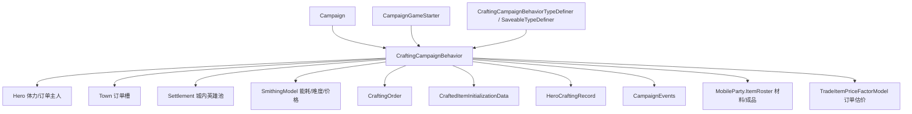

# CraftingCampaignBehavior

**命名空间：** `TaleWorlds.CampaignSystem.CampaignBehaviors`  
**模块：** `TaleWorlds.CampaignSystem`  
**类型：** `public class CraftingCampaignBehavior : CampaignBehaviorBase, ICraftingCampaignBehavior, ICampaignBehavior, INonReadyObjectHandler`  
**基类：** `CampaignBehaviorBase`  
**源文件：** `bin/TaleWorlds.CampaignSystem/TaleWorlds.CampaignSystem.CampaignBehaviors/CraftingCampaignBehavior.cs`

## 概述

`CraftingCampaignBehavior` 是战役层锻造（Smithing）系统的**状态与流程中枢**，它把“谁锻造了什么、还剩多少锻造体力、城镇挂着哪些锻造订单、哪些部件已经解锁、最近锻了哪些设计”等全部跨会话状态集中在一个行为里。它订阅 `OnNewItemCrafted`、小时 tick、每日 tick、英雄阵亡等战役事件来驱动精炼/熔炼/打磨与订单的产生、替换与结算，并通过 `SaveableTypeDefiner` 把内部字典整体随战役存档序列化。modder 想读取或修改英雄锻造体力、发起城镇/自定义订单、结算订单奖励，都应经由它的 `ICraftingCampaignBehavior` 公开入口，而不是去改 `Hero` 或 `ItemObject` 的字段。

## 心智模型

把它想成**地图战役里的“铁匠行会后台”**：它不参与具体挥锤的动画或战斗逻辑（那发生在 `CraftingState` 这一独立游戏状态里，属于地图交互而非 Mission），只负责长期记账与流程编排。行为实例随战役启动加入 Campaign 的 Behavior 列表（与 modder 用 `CampaignGameStarter.AddBehavior` 注册自定义 Behavior 同一机制）；同文件内嵌的 `CraftingCampaignBehaviorTypeDefiner`（`SaveableTypeDefiner`，type id 150000）则负责把 `CraftedItemInitializationData` / `HeroCraftingRecord` / `CraftingOrderSlots` 登记为可序列化类型，使这些内部数据能随档读写。驱动方式是事件而非主动轮询：`RegisterEvents` 订阅 `HourlyTick`（按技能与 Athletics 专长给停留在据点的英雄回满锻造体力）、`DailyTickSettlement` 与 `DailyTick`（按概率生成/替换城镇订单）、`OnNewItemCrafted`（登记新锻武器的设计快照）、`HeroKilled`（清理阵亡英雄的未完成订单）、`OnGameLoaded` 与 `INonReadyObjectHandler.OnBeforeNonReadyObjectsDeleted`（读档后重建/校验部件与订单）。它写出的状态主要是三张字典——`_craftedItemDictionary`（成品设计快照）、`_heroCraftingRecords`（英雄体力）、`_craftingOrders`（按城镇挂的订单槽）——外加解锁部件表与最近 10 件设计历史；这些都在 `SyncData` 中序列化，跨版本迁移（e1.8.0、v1.3.2）也在其中完成。关键边界：**Behavior 管状态与流程，`SmithingModel` 管数值决策**——体力消耗、武器难度、研究点、材料换算与订单价格都由 `Campaign.Current.Models.SmithingModel` 计算，行为只消费这些结果。

## 何时使用 / 何时不要使用

- **用：** 读取某英雄当前/上限锻造体力（`GetHeroCraftingStamina` / `GetMaxHeroCraftingStamina`）；发起或结算锻造（精炼 `DoRefinement`、熔炼 `DoSmelting`、自由/订单模式打造 `CreateCraftedWeaponInFreeBuildMode` / `CreateCraftedWeaponInCraftingOrderMode`）；创建城镇/自定义订单（`CreateTownOrder` / `CreateCustomOrderForHero`）并结算奖励（`CompleteOrder` / `GetOrderResult`）。
- **用：** 经 `Campaign.Current.GetCampaignBehavior<CraftingCampaignBehavior>()`（或 `ICraftingCampaignBehavior`）拿到实例，再调用上面的方法——这是唯一被支持、会触发体力夹值与存档同步的入口。
- **不要直接改 `Hero` 或 `ItemObject` 字段：** 1.4.5 中锻造体力不挂在 `Hero` 上，而挂在行为私有的 `_heroCraftingRecords` 字典里；直接改 `Hero` 字段不会改变可消费的世界状态，也不会被存档。
- **不要 `new` 内部类型（`CraftedItemInitializationData` / `HeroCraftingRecord`）或读私有字典：** 它们是 `internal`、嵌套且私有持有；只有经公开方法产生的数据才会进入存档并随事件触发副作用。
- **不要在 Mission / 场景逻辑里访问它：** 体力回满只在 `HourlyTick` 且 `Hero.CurrentSettlement != null` 时发生；在战斗场景里读锻造状态会拿到陈旧或全满的初值。
- **不要假设事件已触发：** 订阅必须在 `RegisterEvents` 内用 `AddNonSerializedListener` 登记；若你的自定义 Behavior 没登记事件，回调永远不会被调用。
- **不要在战役未启动时取 Behavior：** `Campaign.Current.GetCampaignBehavior<...>()` 在战役未初始化时返回 null，应先判空。

## 依赖图



### 上游与注册方

- [Campaign](../Campaign)：提供 `GetCampaignBehavior<CraftingCampaignBehavior>()` 入口与 `Campaign.Current.Models.SmithingModel`、`Campaign.Current.AllTowns` 等数据源；行为实例随战役启动加入。
- [CampaignGameStarter](../CampaignGameStarter)：战役初始化时加入各 CampaignBehavior 的同一机制；modder 的自定义锻造扩展也在此 `AddBehavior`。
- [SmithingModel](../SmithingModel)：全部数值决策的来源——`GetEnergyCostFor*`、`CalculateWeaponDesignDifficulty`、`GetPartResearchGainFor*`、`GetSmithingCostsForWeaponDesign`、`GetSmeltingOutputForItem` 等。
- [CraftingCampaignBehaviorTypeDefiner（同文件内嵌）](../CraftingCampaignBehavior)：把 `CraftedItemInitializationData`(10) / `HeroCraftingRecord`(20) / `CraftingOrderSlots`(30) 登记为存档类型，并构造对应容器定义。

### 下游与消费方

- [Hero](../Hero)：每个英雄一份体力记录（`_heroCraftingRecords`），且是城镇订单的主人；只有 `CurrentSettlement != null` 的英雄才会被小时 tick 回满体力。
- [Town](../Town)：每张城镇地图挂一个 `CraftingOrderSlots`（6 个槽 + 自定义订单），由 `_craftingOrders` 字典以 `Town` 为键持有。
- [Settlement](../Settlement)：每日 tick 从据点的 `HeroesWithoutParty` 与驻留队伍的 `LeaderHero` 中抽签生成城镇订单。
- [Workshop](../Workshop) 与 [Clan](../Clan)：城镇经济与家族/领地语境间接参与订单的产生与结算奖励。
- [CraftingOrder](../CraftingOrder)：行为创建、替换、取消与结算的订单对象，订单内携带预锻武器设计与主人。
- [CraftedItemInitializationData](../CraftedItemInitializationData)：成品设计快照，以 `ItemObject` 为键挂在 `_craftedItemDictionary` 中，供读档重建武器。
- [HeroCraftingRecord](../HeroCraftingRecord)：按英雄跟踪的锻造体力载体，与体力扣减/回满同处锻造流程。
- [CampaignEvents](../CampaignEvents)：`OnNewItemCraftedEvent` / `HourlyTickEvent` / `DailyTickEvent` / `DailyTickSettlementEvent` / `HeroKilledEvent` / `OnGameLoadedEvent` / `OnNewGameCreatedPartialFollowUpEndEvent` 是行为的驱动源；结算时行为又经 `CampaignEventDispatcher` 派发 `OnCraftingOrderCompleted` / `OnItemsRefined` / `OnEquipmentSmeltedByHero`。
- [MobileParty](../MobileParty)：精炼/熔炼/自由打造都直接操作 `MobileParty.MainParty.ItemRoster` 增减材料与成品。
- [TradeItemPriceFactorModel](../TradeItemPriceFactorModel)：`CalculateOrderPriceDifference` 用 `GetTheoreticalMaxItemMarketValue` 评估成品相对订单预期的价差，决定最终报酬。
- [CultureObject](../CultureObject)：成品初始化数据记录所属文化，影响命名与外观；[DefaultPerks](../DefaultPerks)（Athletics.Stamina、Crafting.SteelMaker3、Crafting.ExperiencedSmith）影响体力恢复与订单关系。

## 风险

- **注册/生命周期时机：** 事件必须在 `RegisterEvents` 内登记，否则 `OnNewItemCrafted` / `HourlyTick` 等回调不触发，体力不会回满、订单不会生成。`SyncData` 与 `OnBeforeNonReadyObjectsDeleted` / `OnGameLoaded` 必须配合：前者写档失败或后者重建遗漏都会让读档后的订单/成品处于损坏态。
- **体力等状态直接改 vs 走 Behavior 方法：** `_heroCraftingRecords` 是私有字典，外部拿不到记录引用；自行 `new HeroCraftingRecord(...)` 或缓存副本只是改了个临时对象，不进存档、不触发夹值。`SetHeroCraftingStamina` 会 `MathF.Max(0, value)` 夹下限，小时 tick 夹上限——直接写字段会绕过这些约束，下一 tick 被纠正或越过上限。
- **Mission 层访问 Campaign Behavior：** 锻造体力、订单、成品快照都是 Campaign 经济状态；在 Mission / 场景逻辑里读写会绕过小时 tick 与据点停留假设，可能读到陈旧值，且 `GetCampaignBehavior` 在战斗上下文里不一定有可用 Campaign。
- **坏档风险：** `SyncData` 用固定键（`_heroCraftingRecordsNew`、`_craftedItemDictionary`、`_craftingOrders` 等）序列化；自定义 Behavior 复用同名键会冲突。跨版本读档走 e1.8.0 / v1.3.2 迁移分支，若你的 Mod 改过这些字典结构却不处理迁移，旧档会解析失败或产生悬空 `ItemObject` 引用。
- **订单主人/据点前置：** `CreateTownOrder` 要求 `orderOwner.CurrentSettlement` 非空且为城镇，否则会在日志打印但不抛异常，订单仍可能被创建到错误 `Town`；`CompleteOrder` 内部按 `IsLordOrder` 走不同奖励路径（贵族订单换装备/给兵、平民订单加 `Power` 与关系），顺序或参数错配会让奖励结算异常。
- **成品重名/ID 冲突：** 自由打造用 `GetNextCraftedItemId` 生成 `crafted_item_N` 作为 `StringId`；同一会话内重复锻造若未正确递增计数，可能造成 `MBObjectManager` 注册冲突。

## 成员说明

### 生命周期钩子（由 Campaign 系统调用）

| 成员 | 真正管理 / 计算什么 | 调用时机 |
| --- | --- | --- |
| `RegisterEvents()`（override） | 把行为接到战役事件总线：订阅 `OnNewGameCreatedPartialFollowUpEnd`（初始化列表+生成初始城镇订单）、`OnSessionLaunched`、`OnNewItemCrafted`（登记成品快照）、`HourlyTick`（体力回满）、`DailyTickSettlement` + `DailyTick`（订单生成/替换）、`HeroKilled`（清理阵亡者订单）、`OnGameLoaded`。没有它，行为等于“睡着”。 | 战役初始化阶段由 Campaign 系统调用一次。 |
| `SyncData(IDataStore)`（override） | 把三张核心字典、解锁部件表、设计历史与计数器序列化/反序列化；并包含 e1.8.0（旧 `_openedParts` 升级为按模板的字典）与 v1.3.2（重建失效成品、迁移旧 `_craftingHistory`）的跨版本迁移。 | 存档与读档时由保存系统调用。 |
| `OnSessionLaunched(CampaignGameStarter)` | 调用 `AddDialogs` 注册铁匠对话线（玩家对 `Occupation.Blacksmith` 说“我要用你的 forge”→打开锻造台），是地图交互进入锻造的入口。 | 会话启动（进入战役地图）时。 |
| `OnBeforeNonReadyObjectsDeleted()`（INonReadyObjectHandler） | 在所有非就绪对象被删除前，用已保存数据重建成品（`InitializeCraftedItemData`），并遍历各城镇订单槽、移除 `IsPreCraftedWeaponDesignValid()` 为 false 的订单、对有效订单调用 `InitializeCraftingOrderOnLoad`；清理历史中指向 `DefaultItems.Trash` 的条目。 | 读档重建阶段，对象就绪前。 |

### 公开查询与锻造动作（modder 主入口）

| 成员 | 真正管理 / 计算什么 | 调用时机 |
| --- | --- | --- |
| `GetHeroCraftingStamina(Hero)` / `SetHeroCraftingStamina(Hero, int)` | 读取 / 写入某英雄当前锻造体力；`Set` 经 `MathF.Max(0, value)` 夹下限后写回 `_heroCraftingRecords` 中该英雄的记录（不存在则懒开户以满体力写入）。 | 任何需要显示体力条、或按 `SmithingModel` 能耗扣减时。 |
| `GetMaxHeroCraftingStamina(Hero)` | 返回体力上限 `100 + round(锻造技能 × 0.5)`，每次实时按技能重算，不持久化。 | 配合 `GetHeroCraftingStamina` 判断能否锻造。 |
| `DoRefinement(Hero, Crafting.RefiningFormula)` | 按配方从 `MobileParty.MainParty.ItemRoster` 扣输入材料、加输出材料，给英雄加锻造经验，按 `SmithingModel.GetEnergyCostForRefining` 扣体力，并派发 `OnItemsRefined`。 | 玩家在熔炼台执行精炼配方时。 |
| `DoSmelting(Hero, EquipmentElement)` | 把装备按 `SmithingModel.GetSmeltingOutputForItem` 拆回材料加入 roster、移除装备、加锻造经验、扣体力，并按 `GetPartResearchGainForSmeltingItem` 累积解锁新部件的研究点，派发 `OnEquipmentSmeltedByHero`。 | 玩家熔炼一件装备时。 |
| `CreateCraftedWeaponInFreeBuildMode(Hero, WeaponDesign, ItemModifier?)` | 自由模式打造：扣材料、`MBObjectManager.RegisterObject` 注册成品、加入主队伍 roster、派发 `OnNewItemCrafted`、扣体力、累积研究点、把设计加入最近历史（上限 10 件）。返回新 `ItemObject`。 | 玩家在锻造台自由设计打造时。 |
| `CreateCraftedWeaponInCraftingOrderMode(Hero, CraftingOrder, WeaponDesign)` | 订单模式打造：除自由模式的副作用外，经验还叠加订单报酬 `GetOrderExperience`。 | 玩家为某个城镇/自定义订单打造时。 |
| `SetCraftedWeaponName(ItemObject, TextObject)` | 替换 `_craftedItemDictionary` 中该成品初始化数据的显示名（重建一份 `CraftedItemInitializationData`）。 | 玩家给成品命名/改名时。 |
| `GetCraftingDifficulty(WeaponDesign)` | 委托 `SmithingModel.CalculateWeaponDesignDifficulty` 计算设计难度。 | 估算或展示武器难度时。 |
| `IsOpened(CraftingPiece, CraftingTemplate)` | 判断某部件是否已解锁：`IsGivenByDefault` 为真恒 true，否则查 `_openedPartsDictionary[模板]` 是否含该部件。 | UI 展示部件可用性、决定能否用于设计。 |
| `GetActiveCraftingHero()` / `SetActiveCraftingHero(Hero)` | 读写当前正在锻造的英雄（`_activeCraftingHero`），用于对话/界面上下文。 | 打开锻造台/完成时设置。 |
| `GetCurrentItemModifier()` / `SetCurrentItemModifier(ItemModifier)` | 读写本次锻造使用的物品修饰符（`_currentItemModifier`），订单结算 `GetOrderResult` / `CheckForBonusesAndPenalties` 会参考它。 | 进入锻造前由界面对齐。 |
| `CraftingHistory`（只读集合） | 返回最近最多 10 件设计的 `WeaponDesign` 拷贝（`_cratingItemsHistory`）。 | 展示“最近锻造”记录。 |
| `CraftingOrders`（只读字典） | 返回 `Town -> CraftingOrderSlots` 的只读视图，供查询城镇订单槽与自定义订单。 | 查询某城镇当前挂单。 |

### 订单管理

| 成员 | 真正管理 / 计算什么 | 调用时机 |
| --- | --- | --- |
| `CreateTownOrder(Hero, int)` | 为某英雄在其当前城镇的指定难度槽（0–5）生成一个 `CraftingOrder`：难度由槽位映射（40–80 / 80–120 / … / 主英雄锻造技能值）加城镇繁荣度，并随机选模板与部件。 | 新游戏初始化与每日 tick（5% 概率替换旧单）时。 |
| `CreateCustomOrderForHero(Hero, float, WeaponDesign?, CraftingTemplate?)` | 为英雄生成一个“自定义订单”（挂 `_customOrders`，非城镇槽），难度/模板/设计均可缺省随机。返回新 `CraftingOrder`。 | 玩家或非英雄 NPC 发起自定义请求时。 |
| `GetOrderResult(CraftingOrder, ItemObject, out bool, out TextObject, out TextObject, out int)` | 计算订单结算结果：用 `CalculateOrderPriceDifference` 得最终报酬，调用订单 `CheckForBonusesAndPenalties` 判断属性是否达标、刺/挥伤害类型是否满足，输出成败、客户评语与结果文本。 | 结算前预览或 `CompleteOrder` 内。 |
| `CompleteOrder(Town, CraftingOrder, ItemObject, Hero)` | 真正结算：给主英雄发钱（`GiveGoldAction`）、从对应槽/自定义列表移除订单、贵族订单还替换其更好的武器并可能给兵/加关系、平民订单加 `Power` 与关系，最后派发 `OnCraftingOrderCompleted`。 | 玩家交付订单武器时。 |
| `CancelCustomOrder(Town, CraftingOrder)` | 从 `_customOrders` 移除自定义订单；若订单不在列表则 `Debug.FailedAssert`。 | 取消一个自定义请求时。 |

### 订阅的事件（来自 `RegisterEvents`）

行为通过 `AddNonSerializedListener` 监听以下真实事件（事件名即源码中的 `CampaignEvents.*`）：`OnNewGameCreatedPartialFollowUpEndEvent`、`OnSessionLaunchedEvent`、`OnNewItemCraftedEvent`、`HourlyTickEvent`、`DailyTickSettlementEvent`、`DailyTickEvent`、`HeroKilledEvent`、`OnGameLoadedEvent`。其中 `HourlyTickEvent` 驱动体力回满，`DailyTick*Event` 驱动订单生成/替换，`OnNewItemCraftedEvent` 驱动成品快照登记，`HeroKilledEvent` 清理阵亡者订单。

## 示例

### 1. 取得 Behavior 并读取/扣减英雄锻造体力

```csharp
using TaleWorlds.CampaignSystem;
using TaleWorlds.CampaignSystem.CampaignBehaviors;

// 唯一正确入口：经 Campaign 取锻造 Behavior（战役未启动时为 null，先判空）
CraftingCampaignBehavior crafting = Campaign.Current.GetCampaignBehavior<CraftingCampaignBehavior>();
if (crafting == null) return;

Hero hero = Hero.MainHero;
int stamina = crafting.GetHeroCraftingStamina(hero);        // 当前余额
int max = crafting.GetMaxHeroCraftingStamina(hero);         // 100 + 锻造技能 * 0.5

// 按 SmithingModel 的真实能耗扣体力（等价于游戏内 DoRefinement/DoSmelting 内部做法）
int cost = Campaign.Current.Models.SmithingModel.GetEnergyCostForSmelting(item, hero);
crafting.SetHeroCraftingStamina(hero, stamina - cost);     // Set 会夹到 0
```

`GetHeroCraftingStamina` / `SetHeroCraftingStamina` 内部都走 `GetRecordForCompanion`，因此即便该英雄从未锻造过，也会自动以满体力开户后再读/写。

### 2. 真实熔炼一件装备并累积研究点

```csharp
using TaleWorlds.CampaignSystem;
using TaleWorlds.CampaignSystem.CampaignBehaviors;
using TaleWorlds.CampaignSystem.Roster;

// crafting 同示例 1 取得；equipmentElement 为要熔的装备槽位元素
EquipmentElement equipmentElement = Hero.MainHero.GetEquipmentFromSlot(EquipmentIndex.WeaponItemBeginSlot);
crafting.DoSmelting(Hero.MainHero, equipmentElement);
// 内部：拆材料入 MobileParty.MainParty.ItemRoster、加锻造经验、扣体力、累积解锁新部件的研究点
```

### 3. 自定义 Behavior 在战役启动时注册（modder 扩展点）

```csharp
using TaleWorlds.CampaignSystem;
using TaleWorlds.CampaignSystem.CampaignBehaviors;

// 内置 CraftingCampaignBehavior 由同文件 TypeDefiner 自动登记存档类型；
// 你自己的扩展 Behavior 则在战役初始化时加入：
protected override void OnCampaignStart(Game game, CampaignGameStarter starter)
{
    starter.AddBehavior(new MyCraftingExtensionBehavior());
}
```

注意：自定义 Behavior 必须自己实现 `RegisterEvents` 并订阅所需事件，否则回调不会触发；且不要复用 `SyncData` 中已占用的键名（如 `_heroCraftingRecordsNew`、`_craftingOrders`）以免与内置行为冲突。

## 参见

- ↑ 父级：[战役 API 索引](../)
- ↔ 相关：[SmithingModel](../SmithingModel)（锻造数值决策：能耗/难度/材料/价格）
- ↔ 相关：[CraftingOrder](../CraftingOrder)（行为创建、替换、结算的订单对象）
- ↔ 相关：[CraftedItemInitializationData](../CraftedItemInitializationData)（成品设计快照，随档重建武器）
- ↔ 相关：[HeroCraftingRecord](../HeroCraftingRecord)（按英雄的锻造体力记录）
- ↔ 相关：[Hero](../Hero)（体力载体与订单主人）
- ↔ 相关：[Town](../Town)（城镇订单槽的挂载点）
- ↔ 相关：[Settlement](../Settlement)（订单生成的据点英雄池）
- ↔ 相关：[CampaignEvents](../CampaignEvents)（驱动行为的事件源）
- ↔ 相关：[Campaign](../Campaign)（取 Behavior 与 Models 的入口）
