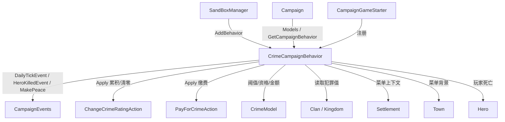

# CrimeCampaignBehavior

**命名空间：** `TaleWorlds.CampaignSystem.CampaignBehaviors`  
**模块：** `TaleWorlds.CampaignSystem`  
**类型：** `public class CrimeCampaignBehavior : CampaignBehaviorBase`  
**源文件：** `bin/TaleWorlds.CampaignSystem/TaleWorlds.CampaignSystem.CampaignBehaviors/CrimeCampaignBehavior.cs`

## 概述

`CrimeCampaignBehavior` 是战役层驱动「玩家犯罪」整套流程的 Behavior：它在每个战役日按家族与王国各自的 `DailyCrimeRatingChange` 累积犯罪值（经 `ChangeCrimeRatingAction` 写入 `Clan.MainHeroCrimeRating` / `Kingdom.MainHeroCrimeRating`）；当玩家在城镇被卫兵擒获时注入审判菜单，并提供用金币、影响力、体罚或处决结清罪责的入口；并在玩家死亡或与其他阵营缔结和约时按规则削减或清零玩家在该阵营的犯罪记录。它本身不持有犯罪状态——所有数值都活在阵营对象上，由本 Behavior 统一驱动与编排。

## 心智模型

`CrimeCampaignBehavior` 运行在 Campaign 层（绝非 Mission 或 UI），是整个玩家犯罪系统的状态机外壳。它不通过专属 `*TypeDefiner` 注册，而是由战役启动流程中的 `SandBoxManager` 调用 `gameStarter.AddBehavior(new CrimeCampaignBehavior())` 直接挂到 `CampaignGameStarter` 上。注册后引擎调用一次 `RegisterEvents`，它在内部订阅 `DailyTickEvent`、`OnGameLoadedEvent`、`OnNewGameCreatedEvent`、`HeroKilledEvent` 与 `MakePeace` 五个 `CampaignEvents`；随后每 tick / 事件回调推动犯罪值的累积、菜单注入与重置。关键：本 Behavior 的 `SyncData` 为空，它**不序列化任何字段**——犯罪状态是 `Clan.MainHeroCrimeRating` / `Kingdom.MainHeroCrimeRating` 以及各自的 `DailyCrimeRatingChange` 这些写在阵营对象上的字段，随阵营一起存档；Behavior 只是这些字段的驱动者与消费者。犯罪金额、可否缴费、体罚是否致死等「判罚决策」数值来自 `Campaign.Current.Models.CrimeModel`，缴费动作来自 `PayForCrimeAction`，二者与 Behavior 分工明确：Model/Action 算与改，Behavior 编排流程。

## 何时使用 / 何时不要使用

- **想读**玩家在某阵营的犯罪值：直接读 `Clan.MainHeroCrimeRating` / `Kingdom.MainHeroCrimeRating`（或先 `GetCampaignBehavior<CrimeCampaignBehavior>()` 拿引用，但数值本身在阵营上）。
- **想改**犯罪值：走 `ChangeCrimeRatingAction.Apply(faction, delta, showNotification)`，不要直接给 `MainHeroCrimeRating` 字段赋值。
- **想结清罪责**：用 `PayForCrimeAction.Apply(faction, CrimeModel.PaymentMethod)`，金额与资格由 `CrimeModel` 计算与判定。
- **想观察**犯罪变化：订阅 `CampaignEvents`（`DailyTickEvent` / `HeroKilledEvent` / `MakePeace`），不要依赖 Behavior 暴露的私有回调。
- **不要**从 Mission 层访问此 Campaign Behavior：`GetCampaignBehavior<CrimeCampaignBehavior>()` 在非战役上下文返回 `null`。
- **不要**在自定义 Behavior 里重复注册同名据点菜单（`town_inside_criminal` / `town_discuss_criminal_surrender` 已由它注册，重复会冲突）。

## 依赖图



### 上游（注册方与枢纽）

- [SandBoxManager](../CampaignGameStarter) 在战役启动时通过 `AddBehavior(new CrimeCampaignBehavior())` 把它挂到 [CampaignGameStarter](../CampaignGameStarter) 上；[Campaign](../Campaign) 提供 `Models` 与 `GetCampaignBehavior<T>()` 入口。
- [CampaignEvents](../CampaignEvents) 是它订阅的五个事件的来源：`DailyTickEvent`、`OnGameLoadedEvent`、`OnNewGameCreatedEvent`、`HeroKilledEvent`、`MakePeace`。

### 下游（它写入 / 读取的真实对象）

- [Clan](../Clan) 与 [Kingdom](../Kingdom)：犯罪状态实际存储在 `MainHeroCrimeRating` 与 `DailyCrimeRatingChange` 上，由 `ChangeCrimeRatingAction` 写入。
- [Settlement](../Settlement)（经 `Settlement.CurrentSettlement.MapFaction`）与 [Town](../Town)（`WaitMeshName` 背景）提供审判菜单所需的据点上下文。
- [Hero](../Hero)（`Hero.MainHero` / `Hero.MainHero.Gold` / `DeathMark`）决定玩家身份、能否付金与是否因体罚死亡。
- [CrimeModel](../CrimeModel) 提供 `DeclareWarCrimeRatingThreshold`、`IsPlayerCrimeRatingModerate`、`IsPlayerCrimeRatingSevere` 与 `PaymentMethod` 枚举。
- [ChangeCrimeRatingAction](../../campaign-ext/ChangeCrimeRatingAction) 与 [PayForCrimeAction](../../campaign-ext/PayForCrimeAction) 是它调用的两个 Action，分别负责改犯罪值与结清罪责。

## 风险

- **注册时机**：它由 `SandBoxManager` 在战役启动时 `AddBehavior`；你自己的 Behavior 必须在 `OnCampaignStart` 的 `CampaignGameStarter` 上 `AddBehavior`，太晚（如读档后）不会生效。
- **`SyncData` 为空**：本 Behavior 不保存自身任何字段，因此读档后你额外加的成员变量不会被恢复——若扩展它，必须自己配对 `SyncData`。
- **直接改阵营字段绕过 Behavior**：犯罪值是阵营级（`Clan/Kingdom.MainHeroCrimeRating`），不是 `Town.Security`；直接写该字段会跳过 `ChangeCrimeRatingAction` 的通知与连带逻辑，造成状态不一致或坏档。
- **Mission 层访问**：`GetCampaignBehavior<CrimeCampaignBehavior>()` 在战役未启时返回 `null`；菜单回调依赖 `Settlement.CurrentSettlement`，仅在据点菜单上下文有效，菜单外访问这些静态入口可能为 `null`。
- **事件订阅须在 `RegisterEvents` 内登记**：漏登记则对应回调永不触发。
- **缴费菜单依赖上下文**：`CanPayCriminalRatingValueWith` 依据 `Settlement.CurrentSettlement.MapFaction` 与 `CrimeModel` 判定资格；在据点外调用会得到错误/空结果。

## 成员说明

### 生命周期钩子

| 成员 | 真实职责、副作用与时机 |
| --- | --- |
| `RegisterEvents()` | 在战役启动时由引擎调用一次，向 `CampaignEvents` 订阅 `DailyTickEvent`、`OnGameLoadedEvent`、`OnNewGameCreatedEvent`、`HeroKilledEvent`、`MakePeace`。只有在此登记过的回调才会触发。 |
| `SyncData(IDataStore)` | 空实现——本 Behavior **不序列化任何状态**。犯罪状态随 `Clan`/`Kingdom` 一起存档，读档后由阵营对象恢复，Behavior 自身无需读写。 |
| `OnDailyTick()`（私有，`DailyTickEvent`） | 每战役日遍历 `Clan.NonBanditFactions` 与 `Kingdom.All`，对每个未消灭且 `DailyCrimeRatingChange` 非零的阵营，调用 `ChangeCrimeRatingAction.Apply(faction, dailyCrimeRatingChange, showNotification: false)` 累积犯罪值。 |
| `OnAfterGameCreated(CampaignGameStarter)`（私有，`OnGameLoadedEvent`/`OnNewGameCreatedEvent`） | 新游戏或读档完成后调用 `AddGameMenus`，注册 `town_inside_criminal` 与 `town_discuss_criminal_surrender` 两个审判/投降菜单及其选项。 |
| `OnHeroDeath(Hero, Hero, KillCharacterActionDetail, bool)`（私有，`HeroKilledEvent`） | 当受害者是 `Hero.MainHero` 时，把每个未消灭阵营的 `MainHeroCrimeRating` 清零（用 `ChangeCrimeRatingAction.Apply(faction, -MainHeroCrimeRating)`）——玩家死亡后其犯罪记录归零。 |
| `OnMakePeace(IFaction, IFaction, MakePeaceDetail)`（私有，`MakePeace`） | 若缔约方之一是玩家 `MapFaction`，且对方阵营 `MainHeroCrimeRating` 超过 `CrimeModel.DeclareWarCrimeRatingThreshold * 0.5`，则将其削减到该阈值——和约后降罪。 |

### 犯罪判定与缴费菜单（静态回调，供据点菜单调用）

| 成员 | 真实职责、副作用与时机 |
| --- | --- |
| `CanPayCriminalRatingValueWith(IFaction, CrimeModel.PaymentMethod)`（私有静态） | 依据 `CrimeModel.IsPlayerCrimeRatingModerate/Severe(Settlement.CurrentSettlement.MapFaction)` 与 `IsCriminalPlayerInSameKingdomOf`，判断当前犯罪等级下是否允许用金币 / 影响力 / 体罚 / 处决结清；还会比对 `PayForCrimeAction.GetClearCrimeCost` 与玩家金币决定是否「只能处决」。 |
| `IsCriminalPlayerInSameKingdomOf(IFaction)`（私有静态） | 判定玩家所在 `Clan`/`Kingdom` 是否与目标阵营同属一国，影响「忽略指控」与部分缴费方式是否可用。 |
| `criminal_inside_menu_*_on_condition` / `town_discuss_criminal_surrender_*_on_condition`（公开静态） | 各缴费选项的条件回调：设置 `optionLeaveType`、填入 `FINE` 金额、在金币/影响力不足时 `IsEnabled = false`，并用 `CanPayCriminalRatingValueWith` 决定该选项是否出现。 |
| `criminal_inside_menu_*_on_consequence`（公开静态） | 各选项的后果回调：调用 `PayForCrimeAction.Apply(Settlement.CurrentSettlement.MapFaction, PaymentMethod)` 实际结清罪责，再根据 `IsCastle` 切回 `town_outside`/`castle_outside` 或 `PlayerEncounter.Finish()`。体罚/处决路径还会检查 `Hero.MainHero.DeathMark` 是否已致死。 |
| `game_menu_town_criminal_on_init(MenuCallbackArgs)`（带 `[GameMenuInitializationHandler]` 的公开静态） | 为 `town_inside_criminal` / `town_discuss_criminal_surrender` 设置菜单背景网格 `Settlement.CurrentSettlement.Town.WaitMeshName`。 |

### modder 应走的公开查询与治安入口（不在本 Behavior 上）

| 入口 | 用途、副作用与时机 |
| --- | --- |
| `Clan.MainHeroCrimeRating` / `Kingdom.MainHeroCrimeRating` | **读取**玩家在该阵营的当前犯罪值（本 Behavior 的累积/清零结果就写在这里）。 |
| `Clan.DailyCrimeRatingChange` / `Kingdom.DailyCrimeRatingChange` | 决定每战役日犯罪值的自然增减幅度，`OnDailyTick` 直接读取它。 |
| `ChangeCrimeRatingAction.Apply(IFaction, float, bool)` | **修改**犯罪值的标准入口（带通知开关与连带逻辑），不要直接写字段。 |
| `PayForCrimeAction.Apply(IFaction, CrimeModel.PaymentMethod)` | 结清罪责；`PaymentMethod` 为 `Gold`/`Influence`/`Punishment`/`Execution` 标志组合。 |
| `PayForCrimeAction.GetClearCrimeCost(IFaction, CrimeModel.PaymentMethod)` | 计算结清所需金额，用于菜单显示与「金币是否足够」判定。 |
| `Campaign.Current.Models.CrimeModel` | 犯罪等级阈值与资格判定（`DeclareWarCrimeRatingThreshold`、`IsPlayerCrimeRatingModerate`、`IsPlayerCrimeRatingSevere`）。 |

## 示例

### 取得 Behavior 并读取 / 改变犯罪值

```csharp
using TaleWorlds.CampaignSystem;
using TaleWorlds.CampaignSystem.Actions;
using TaleWorlds.CampaignSystem.CampaignBehaviors;

// 在活动战役内取本 Behavior 引用（战役未启动时返回 null）
CrimeCampaignBehavior crime = Campaign.Current.GetCampaignBehavior<CrimeCampaignBehavior>();

// 犯罪值实际活在阵营对象上，直接读取
IFaction playerFaction = Clan.PlayerClan.MapFaction;
float rating = playerFaction.MainHeroCrimeRating;

// 改变犯罪值必须走 Action，不要直接写 MainHeroCrimeRating 字段
ChangeCrimeRatingAction.Apply(playerFaction, 5f, showNotification: true);
```

### 订阅真实事件（镜像本 Behavior 的注册方式）

```csharp
using TaleWorlds.CampaignSystem;
using TaleWorlds.CampaignSystem.CampaignBehaviors;
using TaleWorlds.CampaignSystem.Events;
using TaleWorlds.Library;
using TaleWorlds.SaveSystem;

public class MyCrimeWatcher : CampaignBehaviorBase
{
    public override void RegisterEvents()
    {
        // 订阅源码中真实存在的事件；只有在此登记才会触发
        CampaignEvents.DailyTickEvent.AddNonSerializedListener(this, OnDailyTick);
        CampaignEvents.HeroKilledEvent.AddNonSerializedListener(this, OnHeroKilled);
    }

    public override void SyncData(IDataStore dataStore)
    {
        // 本 Behavior 自身无状态；若扩展需在此配对读写
    }

    private void OnDailyTick()
    {
        // 每战役日读取阵营犯罪值，做你自己的观察逻辑
        float rating = Clan.PlayerClan.MapFaction.MainHeroCrimeRating;
    }

    private void OnHeroKilled(Hero victim, Hero killer,
        KillCharacterAction.KillCharacterActionDetail detail, bool showNotification)
    {
        if (victim == Hero.MainHero)
        {
            // 玩家死亡会触发 CrimeCampaignBehavior 清零犯罪记录
        }
    }
}
```

### 在 SubModule 注册自定义 Behavior

```csharp
using TaleWorlds.CampaignSystem;
using TaleWorlds.CampaignSystem.CampaignBehaviors;
using TaleWorlds.MountAndBlade;

public partial class MySubModule : MBSubModuleBase
{
    protected override void OnCampaignStart(Game game)
    {
        base.OnCampaignStart(game);
        // CrimeCampaignBehavior 本身由 SandBoxManager 通过
        //   gameStarter.AddBehavior(new CrimeCampaignBehavior());
        // 自动注册；自定义 Behavior 需在你的 SubModule 里添加：
        CampaignGameStarter starter = (CampaignGameStarter)game.GameStarter;
        starter.AddBehavior(new MyCrimeWatcher());
    }
}
```

## 参见

- ↑ 父级：[Campaign API 索引](../)
- ↔ 相关：[CampaignGameStarter](../CampaignGameStarter) · [CampaignEvents](../CampaignEvents) · [Clan](../Clan) · [Kingdom](../Kingdom) · [Settlement](../Settlement) · [Town](../Town) · [Hero](../Hero) · [CrimeModel](../CrimeModel) · [ChangeCrimeRatingAction](../../campaign-ext/ChangeCrimeRatingAction) · [PayForCrimeAction](../../campaign-ext/PayForCrimeAction) · [Campaign](../Campaign) · [CampaignBehaviorBase](../CampaignBehaviorBase)
