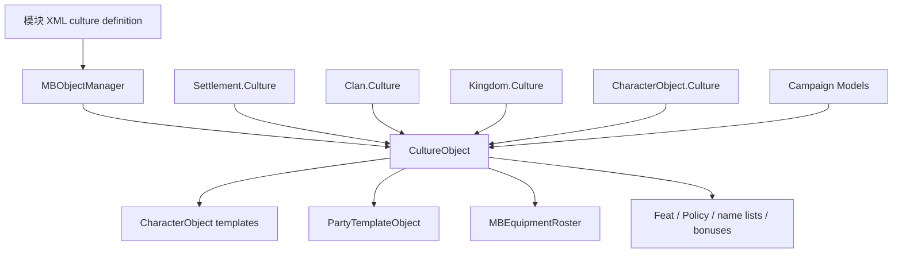

# CultureObject

**命名空间：** `TaleWorlds.CampaignSystem`  
**模块：** `TaleWorlds.CampaignSystem`  
**类型：** `public sealed class CultureObject : BasicCultureObject`  
**基类：** [BasicCultureObject](../../core-extra/BasicCultureObject)  
**源文件：** `bin/TaleWorlds.CampaignSystem/TaleWorlds.CampaignSystem/CultureObject.cs`  
**对象角色：** 由 XML 和 `MBObjectManager` 注册的稳定定义对象；`Settlement`、`Clan`、`Kingdom`、`Hero`、`CharacterObject` 引用它作为文化输入。

## 一句话职责与心智模型

`CultureObject` 是“一个文化的注册定义及其默认资源集合”，不是一个会自己推进的战役行为，也不是王国或据点所有权。它继承 `BasicCultureObject` 的名称和 `StringId`，再把该文化的基础兵种、民兵/商队/守卫模板、默认装备、名称池、政策、文化特性、船体和模型加成连接起来。

对象的创建和引用解析发生在对象管理器读取 XML 时。`CultureObject.Deserialize` 通过 `MBObjectManager` 解析 `CharacterObject`、`PartyTemplateObject`、`ItemObject`、`PolicyObject`、`FeatObject` 等引用；随后 `Settlement.Culture`、`Clan.Culture`、`Kingdom.Culture` 或 `CharacterObject.Culture` 从已注册对象进入它。mod 的常规职责是读取这些定义并在模块初始化阶段注册自己的 XML 内容，而不是在战役中 `new CultureObject()` 或替换一个正在被实体引用的文化。

## 对象图与依赖



| 关联对象 | 实际边界 |
| --- | --- |
| [MBObjectManager](../../campaign-ext/MBObjectManager) 与 [MBObjectBase](../../core/MBObjectBase) | `CultureObject` 以 `StringId` 注册和查找；重复 ID、错误引用或过早查找会让 XML 解析得到空对象或错误的资源图。 |
| [BasicCultureObject](../../core-extra/BasicCultureObject) | 提供名称、文化 ID 等基础对象语义；`CultureObject` 在其上补充战役专用模板和规则输入。 |
| [Settlement](../Settlement) | 据点 XML 读取 `culture` 引用；据点文化用于忠诚、繁荣、生产、民兵和场景资源等模型输入。 |
| [Clan](../Clan) / [Kingdom](../Kingdom) | 家族与王国持有文化引用；它影响基础部队、船体能力、名称和部分政治/经济规则，但不自动改变王国所有权。 |
| [Hero](../Hero) / [CharacterObject](../CharacterObject) | 英雄可以在一条创建路径中从 `CharacterObject.Culture` 初始化；`DefaultHeroCreationModel` 也会按上下文选择主角、父母或原始角色文化。文化的默认装备和角色模板会参与英雄生成与兜底装备。 |
| [Campaign](../Campaign) 与 Models | `Campaign.Current.Models` 消费文化属性计算忠诚、繁荣、民兵、生产、战斗、命名等结果；`CultureObject` 本身不运行这些模型。 |
| [SaveManager](../../save-system/SaveManager) | 实体对文化的引用会进入存档图；文化定义本身来自模块数据。改 ID 或删除已被存档引用的 XML 定义会造成加载失败或错误映射。 |

## 读取哪些成员

文化属性数量很大，但可以按责任分组理解，而不是把每个默认角色名当成独立 API：

| 分组 | 代表成员 | 使用时机与副作用 |
| --- | --- | --- |
| 基础身份 | `StringId`、`Name`、`EncyclopediaText`、`StartingPoint` | 识别和显示文化；不要把显示名当稳定 ID。 |
| 文化规则 | `Traits`、`CultureFeats`、`DefaultPolicyList`、`MilitiaBonus`、`ProsperityBonus`、`NavalFactor`、`BoardGame` | 供 Model、政策、场景和 UI 查询；读取不会直接加忠诚或繁荣。公开的加成 setter 也不等于安全的运行时改规则入口。 |
| 兵种与角色模板 | `BasicTroop`、`EliteBasicTroop`、民兵、守卫、村民、商队、铁匠、竞技场等 `CharacterObject` 引用 | 生成角色、驻军、村民和场景角色；引用对象必须已注册且 `IsReady` 状态正确。 |
| 队伍与装备 | `DefaultPartyTemplate`、村民/民兵/叛军/商队模板、`DefaultBattleEquipmentRoster`、Civilian/Stealth 装备 | 新建 Party、英雄装备兜底和场景生成；不要在读取阶段改列表来替换全局模板。 |
| 名称和清单 | `MaleNameList`、`FemaleNameList`、`ClanNameList`、`NotableTemplates`、`LordTemplates`、`BasicMercenaryTroops`、`VassalRewardItems` | 命名、生成和奖励筛选；这些列表由 XML 反序列化建成。 |

`HasTrait`、`HasFeat` 和 `GetCulturalFeats` 是查询入口：前者在 `Traits` 中查找，后两者读取 `_cultureFeats`。`ToString` 和 `GetName` 返回基础对象名称。`Deserialize` 是对象管理器的加载实现，不是给 mod 在运行中重新解析文化 XML 的通用入口。

## 何时使用，何时不要使用

### 适合使用

- 在 Campaign 逻辑中根据 `Settlement.Culture` 或 `Hero.Culture` 读取文化特性、默认兵种或默认装备。
- 在已完成模块加载后通过 `MBObjectManager` 按稳定 ID 查找一个已注册的文化定义。
- 在自定义模型中把文化当作输入，计算自己的结果，再由模型替换机制提供规则扩展。
- 在添加全新文化时，为所有被引用的角色、队伍、物品、政策和特性安排正确的 XML 加载顺序与唯一 ID。

### 不要这样使用

- 不要用文化 ID 代替王国、Clan 或 Settlement 的所有权；改政治关系和领地必须走相应的 `*Action`。
- 不要在 Campaign 运行中通过 `new CultureObject()` 拼接对象，也不要直接改 `BasicTroop`、`CultureFeats` 等私有 set 的关系。
- 不要在对象管理器尚未读取完文化 XML 时访问默认模板。空引用可能一路传到 Party、Agent、装备或 UI 生成。
- 不要仅改变 `Settlement.Culture` 就假设已有派系、民兵、市场和存档关系会被完整重建。文化是多个模型的输入，运行时替换会留下旧缓存和不一致的派系语义。

## 真实获取与安全示例

最稳定的获取方式是从当前已存在的战役实体读取文化。下面示例不猜测文化 ID，也不修改注册对象：

```csharp
using System.Linq;
using TaleWorlds.CampaignSystem;
using TaleWorlds.CampaignSystem.Settlements;

public static class CultureInspection
{
    public static string GetPlayerSettlementCultureId()
    {
        Settlement settlement = Settlement.All.FirstOrDefault(
            candidate => candidate.OwnerClan == Clan.PlayerClan);
        CultureObject culture = settlement?.Culture;

        return culture?.StringId ?? string.Empty;
    }

    public static bool PlayerSettlementUsesCultureTrait(CultureTrait trait)
    {
        Settlement settlement = Settlement.All.FirstOrDefault(
            candidate => candidate.OwnerClan == Clan.PlayerClan);

        return settlement?.Culture?.HasTrait(trait) == true;
    }
}
```

需要按 ID 查找时，应在对象管理器和模块 XML 已完成加载的初始化阶段或 Campaign 生命周期内执行，并明确处理查找失败：

```csharp
using TaleWorlds.CampaignSystem;
using TaleWorlds.Core;
using TaleWorlds.ObjectSystem;

public static class RegisteredCultureLookup
{
    public static CultureObject FindRegisteredCulture(string cultureId)
    {
        return Game.Current.ObjectManager.GetObject<CultureObject>(cultureId);
    }
}
```

这个入口只适合查找已注册对象；它不会创建缺失的文化。把不存在的 ID、重复的 XML ID 或未加载的依赖传入加载链，会导致 `null` 文化，进而在 `Culture.BasicTroop`、Party 模板或 Model 计算处失败。

## 加载、版本与存档风险

- **注册顺序：** `Deserialize` 会立即解析大量 `CharacterObject`、`PartyTemplateObject`、`ItemObject`、`PolicyObject` 和 `FeatObject` 引用。任一依赖缺失时，文化看似存在，但其默认队伍、装备或特性列表可能不完整。
- **ID 是契约：** 已保存实体引用的是对象身份，不是显示名称。改变文化的 `StringId`、重复一个原有 ID 或删除旧定义会让新旧存档映射错误；为新文化使用稳定且唯一的 ID。
- **定义与运行态分离：** 文化 XML 是定义层，`Settlement`、`Clan`、`Kingdom` 和 `Hero` 是运行态实体。不要把文化字段当作改派系的快捷方式，也不要在实体枚举期间替换文化引用。
- **缓存与模型：** 忠诚、繁荣、民兵、生产、命名、装备和场景系统可能已经从文化生成缓存或派生对象。运行中替换文化不能自动刷新这些下游对象。
- **读档一致性：** 读档后先从当前 `Campaign` 实体重新取得 `CultureObject`；不要持有旧 Culture、旧模板列表或旧装备 roster 的跨读档引用。
- **版本差异：** 1.4.5 的文化定义包含海军模板、`NavalFactor` 和更多巡逻/船体引用；不要把 1.3.x XML 的字段集合当作 1.4.5 的完整契约，缺失字段应回到对应版本源码确认。

## 导航

- ↑ Parent: [Campaign API](../)
- ↔ Siblings: [CharacterObject](../CharacterObject) · [Hero](../Hero) · [Clan](../Clan) · [Kingdom](../Kingdom) · [Settlement](../Settlement)
- Related: [BasicCultureObject](../../core-extra/BasicCultureObject) · [MBObjectManager](../../campaign-ext/MBObjectManager) · [Campaign](../Campaign) · [SaveManager](../../save-system/SaveManager)
