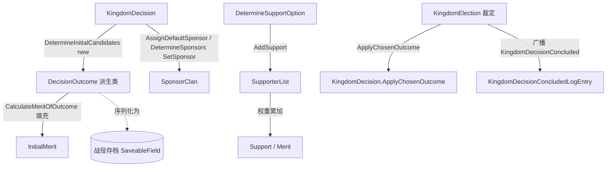

# DecisionOutcome

**命名空间：** `TaleWorlds.CampaignSystem.Election`  
**模块：** `TaleWorlds.CampaignSystem`  
**类型：** `public abstract class DecisionOutcome`  
**源文件：** `TaleWorlds.CampaignSystem/Election/DecisionOutcome.cs`

## 概述

`DecisionOutcome` 是王国议会决策框架下**每一个候选结果**的抽象基类——宣战/议和/结盟/政策/罢黜家族/推举新王等所有具体决议，都各自定义一组继承自它的结果类（如 `DeclareWarDecisionOutcome`、`PolicyDecisionOutcome`）。它不负责改变世界，只负责把一个候选「是什么、值多少分、谁支持、谁赞助」这些选举状态稳定地承载下来：基类据此算出 `Support` 与 `Merit`，决定候选如何排序与呈现；裁定选中后，该实例被原样交给 `KingdomDecision.ApplyChosenOutcome(DecisionOutcome)` 变成真实世界变更，并被 `KingdomDecisionConcludedLogEntry` 记录进日志。它自身没有 `Apply` 方法——落地逻辑在决策的 `ApplyChosenOutcome` 里。

## 心智模型

把 `DecisionOutcome` 想成贴在某张议会提案表（[KingdomDecision](../KingdomDecision)）上的一张「候选便签」：便签上写着这个候选的标题、说明、初始分数（`InitialMerit`）、已经有哪些家族在上面签字支持（`SupporterList`），以及谁在背后赞助它（`SponsorClan`）。它完全活在战役（Campaign）层，由具体 `*Decision.DetermineInitialCandidates()` 在流程初始化时 `new` 出来；基类先调用子类的 `CalculateMeritOfOutcome` 把每个候选的 `InitialMerit` 填好，再用 `SortDecisionOutcomes` 降序排序、用 `NarrowDownCandidates` 截断到最多 3 个供玩家/AI 选择。随后每个非佣兵家族经 `DetermineSupportOption` 表态，结果被 `AddSupport` 累加到对应候选的 `SupporterList`，`Support` 按权重累加、`Merit = InitialMerit * (1 + Support)` 被算出。裁定阶段由 `KingdomElection` 选定一个 `DecisionOutcome` 实例，转交 `KingdomDecision.ApplyChosenOutcome(chosenOutcome)` 落地，并随 `CampaignEvents.KingdomDecisionConcluded` 事件被 `DefaultLogsCampaignBehavior` 包进 `KingdomDecisionConcludedLogEntry(decision, chosenOutcome, isPlayerInvolved)`。作为 `[SaveableField]` 标注的对象，候选结果随战役存档序列化（`InitialMerit`/`SupporterList`/`_sponsorClan`），读档后由 `AutoGeneratedInstanceCollectObjects` 恢复支持者列表与赞助家族。

## 何时使用 / 何时不要使用

- **用**：当你要新增一种王国决议（继承 [KingdomDecision](../KingdomDecision)）时，几乎必然要同时定义一个继承 `DecisionOutcome` 的结果类，持有该决议需要的业务数据并实现四个展示方法。
- **用**：在 `ApplyChosenOutcome` 或 `CampaignEvents.KingdomDecisionConcluded` 订阅里，通过 `is PolicyDecisionOutcome policyOutcome` 这类类型判断读取选中结果的字段。
- **不要**：把 `DecisionOutcome` 当成「世界变更入口」去直接改 `Kingdom`/`Clan` 字段——它只是结果的载体；真正落地必须由决策的 `ApplyChosenOutcome` 转交 `*Action` / `*Behavior`。
- **不要**：在构造结果后手动重写 `InitialMerit`/`Support`/`Merit` 来「操纵」选举——这些由流程计算，手写覆盖会在下次排序/重算时被覆盖或造成不一致。
- **不要**：在战役未启动（`Campaign.Current == null`）或地图/王国状态未建立时创建或读取候选结果；它们依赖所属王国与参议家族。

## 依赖图



- 上游（谁产出 / 谁持有）：[KingdomDecision](../KingdomDecision) 通过抽象 `DetermineInitialCandidates()` 产出候选结果并用 `NarrowDownCandidates`/`SortDecisionOutcomes` 收敛排序；[KingdomDecisionProposalBehavior](../KingdomDecisionProposalBehavior) 驱动每 tick 推进；[Supporter](../Supporter) 表示单个家族的表态及权重；[Clan](../Clan) 是赞助方与表态方；[Campaign](../Campaign) 提供整体生命周期。
- 下游（结果作用于谁）：具体结果类由对应决策落地——[DeclareWarDecision](../DeclareWarDecision)/`DeclareWarDecisionOutcome`、[MakePeaceKingdomDecision](../MakePeaceKingdomDecision)/`MakePeaceDecisionOutcome`、[KingdomPolicyDecision](../KingdomPolicyDecision)/`PolicyDecisionOutcome`、[ExpelClanFromKingdomDecision](../ExpelClanFromKingdomDecision)/`ExpelClanDecisionOutcome`、[StartAllianceDecision](../StartAllianceDecision)/`StartAllianceDecisionOutcome`、[KingSelectionKingdomDecision](../KingSelectionKingdomDecision)/`KingSelectionDecisionOutcome`、[TradeAgreementDecision](../TradeAgreementDecision)/`TradeAgreementDecisionOutcome`、[SettlementClaimantDecision](../SettlementClaimantDecision)/`ClanAsDecisionOutcome` 等。
- 结算与记录：[KingdomElection](../KingdomElection) 选定结果并调 `ApplyChosenOutcome`；[CampaignEvents](../CampaignEvents) 的 `KingdomDecisionConcluded` 广播；[KingdomDecisionConcludedLogEntry](../KingdomDecisionConcludedLogEntry) 与 [KingdomDecisionMapNotification](../KingdomDecisionMapNotification) 把选中结果写入日志与地图通知。

## 风险

1. **没有 `Apply`**：`DecisionOutcome` 本身**不**改变世界。把选中结果当作「已经生效」去读 `Kingdom` 状态会读到旧值；真正生效发生在 `ApplyChosenOutcome`（之后某次 tick）。
2. **直接改王国字段绕过流程**：在自定义结果里图省事直接 `kingdom.AddPolicy(...)` / 改 `Clan` 关系，会绕过事件、`KingdomDecisionConcludedLogEntry` 与通知链，造成坏档或日志缺失。应让 `ApplyChosenOutcome` 统一转交 `*Action` / `*Behavior`。
3. **手动覆盖评分字段**：`InitialMerit`/`Support`/`Merit` 由流程在候选初始化与表态阶段计算；构造后手改会在下次 `NarrowDownCandidates`/`SortDecisionOutcomes` 重算时被覆盖或污染排序，导致玩家/AI 看到错误候选。
4. **序列化契约**：`InitialMerit`、`SupporterList`、`_sponsorClan` 是 `[SaveableField]`，派生类新增字段必须用 `SaveableField(>=100)` 标注才能随存档恢复；否则读档后字段为默认值，支持者/赞助信息丢失。
5. **`SponsorClan` 为 private 字段**：只能通过 `SetSponsor(Clan)` 写入，没有公开 setter；若从未调用 `SetSponsor`/`DetermineSponsors`，`SponsorClan` 为 null，部分 `GetChosenOutcomeText` 与关系效果计算会走空分支。
6. **`Support` 依赖 `SupporterList` 权重**：`Support` 在遍历 `SupporterList` 时按 `SupportWeights` 累加；若某家族被 `ResetSupport` 移除或从未 `AddSupport`，它不计入声量，这会影响 `Merit` 与最终显示胜率（`WinChance` 由结算流程填充，不要手填）。

## 成员说明

### 序列化与核心评分状态

- **`float InitialMerit`**（`[SaveableField(0)]`，公开可写）  
  **用途：** 该候选的「基础 merit」分数。基类在候选初始化阶段调用子类 `CalculateMeritOfOutcome(candidate)` 把结果写进这里；`Merit` 与 `SortDecisionOutcomes`/`NarrowDownCandidates` 都基于它排序候选（降序、截断到前 3）。  
  **副作用：** 改变它直接改变候选排序与玩家/AI 可见的选项。  
  **调用时机：** 流程初始化候选时写入；排序与 UI 展示时读取。

- **`List<Supporter> SupporterList`**（`[SaveableField(1)]`，公开可写）  
  **用途：** 已为该候选结果签字支持的家族支持者集合。`AddSupport`/`ResetSupport` 维护它，`Support` 遍历它按权重累加。随存档序列化。  
  **副作用：** 增删元素会即时改变 `Support` 与 `Merit`。  
  **调用时机：** 表态阶段由 `DetermineSupportOption` 间接填充；结算与日志读取。

- **`Clan SponsorClan`**（`=> _sponsorClan`，`[SaveableField(2)]`，私有）  
  **用途：** 赞助该结果的家族，通常经基类 `AssignDefaultSponsor` 或在子类 `DetermineSponsors` 中 `SetSponsor` 指定（例如宣战结果的赞助方=提案方）。影响结论文本措辞与关系效果计算。随存档序列化。  
  **副作用：** 只读属性；写入只能通过 `SetSponsor`。  
  **调用时机：** 结论文本生成与关系效果评估时读取。

- **`float InitialSupport` / `Likelihood` / `TotalSupportPoints` / `WinChance`**（`{ get; internal set; }`）  
  **用途：** 由结算流程与决议 UI/VM 填充的「展示与预测」数据——如各候选的总支持点数、被选中概率、初始支持度。`internal set`，外部只应读取。  
  **副作用：** 写入于结算阶段；不要手动赋值。  
  **调用时机：** 决议界面与 `KingdomDecisionConcludedLogEntry` 文本生成时读取。

### 声量计算（派生只读）

- **`float Support`**（只读 `get`）  
  **用途：** 由 `SupporterList` 中每个支持者的 `Supporter.SupportWeights` 加权累加：`SlightlyFavor=0.2`、`StronglyFavor=0.4`、`FullyPush=1.0`。它代表该候选的「实际声量」，与 `InitialMerit` 共同决定 `Merit`。  
  **副作用：** 无（纯计算）。  
  **调用时机：** 每次读取 `Merit`、排序与 UI 展示时实时计算。

- **`float Merit`**（只读 `get`）  
  **用途：** 综合评分 `InitialMerit * (1f + Support)`。它是候选排序、截断（最多 3）与胜率展示的根依据。  
  **副作用：** 无（派生自上述两项）。  
  **调用时机：** `SortDecisionOutcomes`/`NarrowDownCandidates` 与决议界面读取。

### 赞助与表态维护方法

- **`void AddSupport(Supporter supporter)`**  
  **用途：** 把一个家族支持者加入 `SupporterList`。流程为某候选收集签字时调用；派生结果也可在定制逻辑中调用。  
  **副作用：** 改变后续 `Support` 计算。  
  **调用时机：** 表态收集阶段，或子类 `DetermineSponsors` 内。

- **`void ResetSupport(Supporter supporter)`**  
  **用途：** 若 `SupporterList` 已含该支持者则移除——用于重算前清空某家族对该候选的表态。  
  **副作用：** 改变 `Support`。  
  **调用时机：** 重算支持者前。

- **`void SetSponsor(Clan sponsorClan)`**  
  **用途：** 设置 `_sponsorClan`（即公开 `SponsorClan`）。派生结果在构造后或 `DetermineSponsors` 中调用，指定赞助家族。  
  **副作用：** 影响 `SponsorClan` 与 `GetChosenOutcomeText` 文案/关系效果。  
  **调用时机：** 候选收敛阶段。

### 展示契约（必须由派生类实现）

- **`abstract TextObject GetDecisionTitle()`**  
  **用途：** 返回该候选在决议 UI 上的标题（如「宣战 / 不宣战」）。  
  **调用时机：** 决议界面、[KingdomDecisionMapNotification](../KingdomDecisionMapNotification) 与日志呈现。

- **`abstract TextObject GetDecisionDescription()`**  
  **用途：** 返回该候选的说明文本，通常注入 `{KINGDOM_NAME}`/`{POLICY_NAME}` 等变量与外交理由。  
  **调用时机：** 决议 UI 与通知说明。

- **`abstract string GetDecisionLink()`**  
  **用途：** 返回该候选关联的音频/链接标识（如 `"event:/ui/notification/policy"`），可返回 `null`。  
  **调用时机：** 通知播放与 UI 跳转。

- **`abstract ImageIdentifier GetDecisionImageIdentifier()`**  
  **用途：** 返回该候选在 UI 上展示的图标标识，可返回 `null` 或 `new EmptyImageIdentifier()`。  
  **调用时机：** 决议选项图标渲染。

## 示例

### 示例 1：派生一个自定义决议结果（源自 `DeclareWarDecisionOutcome` 的模式）

```csharp
using TaleWorlds.CampaignSystem;
using TaleWorlds.CampaignSystem.Election;
using TaleWorlds.Core.ImageIdentifiers;
using TaleWorlds.Localization;

// 自定义决议结果：承接一个 PolicyObject，并标记该候选是否为「通过」
public class MyCustomPolicyOutcome : DecisionOutcome
{
    [SaveableField(100)]
    public readonly bool ShouldBeEnforced;

    [SaveableField(110)]
    public readonly PolicyObject Policy;

    public MyCustomPolicyOutcome(bool shouldBeEnforced, PolicyObject policy)
    {
        ShouldBeEnforced = shouldBeEnforced;
        Policy = policy;
    }

    public override TextObject GetDecisionTitle()
    {
        TextObject title = new TextObject("{=my_pol_title}{?FORCE}通过 {POLICY_NAME}{?}否决 {POLICY_NAME}{\\?}");
        title.SetTextVariable("FORCE", ShouldBeEnforced ? 1 : 0);
        title.SetTextVariable("POLICY_NAME", Policy.Name);
        return title;
    }

    public override TextObject GetDecisionDescription()
    {
        TextObject desc = new TextObject("{=my_pol_desc}王国议会将就 {POLICY_NAME} 进行表决。");
        desc.SetTextVariable("POLICY_NAME", Policy.Name);
        return desc;
    }

    public override string GetDecisionLink() => "event:/ui/notification/policy";

    public override ImageIdentifier GetDecisionImageIdentifier() => new EmptyImageIdentifier();
}
```

该结果类随后由你的 `KingdomDecision` 子类在 `DetermineInitialCandidates()` 中 `new` 出来（通常成对构造「通过/否决」两个候选），基类会为它算 `InitialMerit`、收集支持者、计算 `Merit`，裁定选中的那个实例再被传给 `ApplyChosenOutcome`。

### 示例 2：订阅「决议落定」事件读取选中的结果

```csharp
using TaleWorlds.CampaignSystem;
using TaleWorlds.CampaignSystem.Election;

// 在某 CampaignBehavior 或子模块里，监听决议被裁定选中的结果
CampaignEvents.KingdomDecisionConcluded.AddNonSerializedListener(this,
    (KingdomDecision decision, DecisionOutcome chosenOutcome, bool isPlayerInvolved) =>
    {
        // chosenOutcome 即被裁定选中的候选结果实例
        if (chosenOutcome is PolicyDecisionOutcome policyOutcome)
        {
            PolicyObject decidedPolicy = policyOutcome.Policy;
            bool enforced = policyOutcome.ShouldBeEnforced;
            // 在此做你的后处理（记录、触发自定义效果等）
        }
    });
```

`KingdomDecisionConcluded` 是 `IMbEvent<KingdomDecision, DecisionOutcome, bool>`：当 `KingdomElection` 完成裁定，`DefaultLogsCampaignBehavior.OnKingdomDecisionConcluded` 会构造 `KingdomDecisionConcludedLogEntry(decision, chosenOutcome, isPlayerInvolved)` 并广播该事件。订阅时务必用 `AddNonSerializedListener` 并传入稳定的 `owner`，避免跨战役重载后引用到已销毁对象。

## 参见

- ↑ 父级：[战役 API 索引](../)
- ↔ 同级（选举契约）：[KingdomDecision](../KingdomDecision) · [KingdomElection](../KingdomElection) · [KingdomDecisionProposalBehavior](../KingdomDecisionProposalBehavior) · [Supporter](../Supporter) · [KingdomDecisionConcludedLogEntry](../KingdomDecisionConcludedLogEntry) · [KingdomDecisionAddedLogEntry](../KingdomDecisionAddedLogEntry) · [KingdomDecisionMapNotification](../KingdomDecisionMapNotification)
- ↔ 派生结果（部分）：[DeclareWarDecision](../DeclareWarDecision) · [MakePeaceKingdomDecision](../MakePeaceKingdomDecision) · [KingdomPolicyDecision](../KingdomPolicyDecision) · [ExpelClanFromKingdomDecision](../ExpelClanFromKingdomDecision) · [StartAllianceDecision](../StartAllianceDecision) · [KingSelectionKingdomDecision](../KingSelectionKingdomDecision) · [TradeAgreementDecision](../TradeAgreementDecision) · [SettlementClaimantDecision](../SettlementClaimantDecision) · [SettlementClaimantPreliminaryDecision](../SettlementClaimantPreliminaryDecision)
- 相关（王国与族 / 事件）：[Kingdom](../Kingdom) · [Clan](../Clan) · [Campaign](../Campaign) · [CampaignEvents](../CampaignEvents) · [PolicyObject](../PolicyObject)
