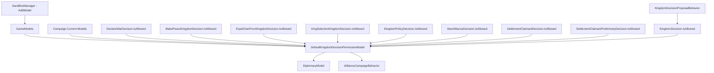

# DefaultKingdomDecisionPermissionModel

**命名空间：** TaleWorlds.CampaignSystem.GameComponents
**模块：** TaleWorlds.CampaignSystem
**类型：** `public class DefaultKingdomDecisionPermissionModel : KingdomDecisionPermissionModel`
**基类：** [KingdomDecisionPermissionModel](../KingdomDecisionPermissionModel)
**源文件：** `bin/TaleWorlds.CampaignSystem/TaleWorlds.CampaignSystem.GameComponents/DefaultKingdomDecisionPermissionModel.cs`

## 概述

`DefaultKingdomDecisionPermissionModel` 是 [KingdomDecisionPermissionModel](../KingdomDecisionPermissionModel) 接口的默认实现，也是原版王国决议系统的“提案许可闸门”。当 [KingdomDecisionProposalBehavior](../KingdomDecisionProposalBehavior) 在战役中尝试把某条决议（宣战、媾和、立政策、驱逐家族、选王、吞并、结盟）推上议会投票前，各 `*Decision` 子类会在自己的 `IsAllowed()` 里调用本模型，由本模型根据两个阵营之间的关系、外交状态与“参战号召”协定裁决该决议当前是否允许发起。默认实现几乎对各类决议一律放行，唯独对“媾和”施加了真实约束（常战状态、参战号召协定、对方是否愿意议和）；要收紧或放开某类决议的提案资格，就提供派生类并在 [GameModels](../GameModels) 中替换本实现。

## 心智模型

把 `DefaultKingdomDecisionPermissionModel` 想成议会提案的**准入审查员**，而不是状态容器。它处于 Campaign 层的纯规则裁决位置：`SandBoxManager` 在战役启动时通过 `gameStarter.AddModel(new DefaultKingdomDecisionPermissionModel())` 把它注册进 `GameModels`，[GameModels](../GameModels) 在 `Initialize` 阶段用 `GetGameModel<KingdomDecisionPermissionModel>()` 解析并缓存到 `Models.KingdomDecisionPermissionModel`，运行时统一用 `Campaign.Current.Models.KingdomDecisionPermissionModel` 取得。它本身**不持有任何世界状态、不含 `[SaveableField]`**，也不会被写进存档——每次裁决都是即时基于 [DiplomacyModel](../DiplomacyModel)、[IAllianceCampaignBehavior](../IAllianceCampaignBehavior) 与传入的阵营/家族/定居点当前状态重新计算。生命周期为：领主在议会提出决议 → [`KingdomDecision.IsAllowed()`](../KingdomDecision)（由各 `*Decision` 子类实现）回调本模型 → 模型返回 `true`/`false` 并可选地通过 `out TextObject reason` 给出被拒理由 → [KingdomDecisionProposalBehavior](../KingdomDecisionProposalBehavior) 据此决定是否把决议排入待投票队列。要改规则就派生新类覆盖 7 个判定方法并通过 `Game.Current.ReplaceModel` 替换；要读结果就走 `Campaign.Current.Models.KingdomDecisionPermissionModel`。

## 何时使用 / 何时不要使用

- **使用：** 想按你的 mod 逻辑收紧或放开某类王国决议的提案资格（例如禁止 AI 向玩家阵营宣战、强制盟友之间无法媾和）时，派生 `KingdomDecisionPermissionModel` 覆盖对应方法，并在子模块的 `OnGameStart` 里用 `Game.Current.ReplaceModel<KingdomDecisionPermissionModel>(new MyPermissionModel())` 替换默认实现。
- **使用：** 想查询“此刻某条决议是否被允许”，直接读 `Campaign.Current.Models.KingdomDecisionPermissionModel.IsXxxAllowed(...)` 的返回值与 `out reason`。
- **不要使用：** 不要把本模型当状态容器来“记住”某次裁决结果——它无状态、不序列化。要在世界层真正改变“能否宣战/媾和”的前置条件，应改 [DiplomacyModel](../DiplomacyModel) 的常战/议和适宜判定或 [IAllianceCampaignBehavior](../IAllianceCampaignBehavior) 的参战号召协定，而不是给模型加可变字段指望其随存档恢复。
- **不要使用：** 不要绕过 `KingdomDecision.IsAllowed()` 与 [KingdomDecisionProposalBehavior](../KingdomDecisionProposalBehavior) 直接修改 [Kingdom](../Kingdom)/[Clan](../Clan) 的外交字段来“假装”决议已生效——那样会跳过投票、影响与日志链（[KingdomDecisionConcludedLogEntry](../KingdomDecisionConcludedLogEntry)、[KingdomDecisionMapNotification](../KingdomDecisionMapNotification)），造成阵营状态与议会记录不一致。

## 依赖图



上游系统（谁创建 / 持有 / 驱动）：

- [GameModels](../GameModels) —— 在 `Initialize` 中通过 `GetGameModel<KingdomDecisionPermissionModel>()` 解析并缓存实例到 `Models.KingdomDecisionPermissionModel`；其默认实例由 `SandBoxManager` 在战役初始化时 `AddModel(new DefaultKingdomDecisionPermissionModel())` 注册（核心模块注册入口，无独立页）。
- [GameModels](../GameModels) —— 在 `Initialize` 中通过 `GetGameModel<KingdomDecisionPermissionModel>()` 解析并缓存实例到 `Models.KingdomDecisionPermissionModel`。
- [Campaign](../Campaign) —— 运行时获取模型的入口：`Campaign.Current.Models.KingdomDecisionPermissionModel`。
- [KingdomDecisionPermissionModel](../KingdomDecisionPermissionModel) —— 本类实现的抽象契约（7 个 `IsXxxAllowed` 判定）。
- [KingdomDecision](../KingdomDecision) —— 基类 `IsAllowed()` 由各 `*Decision` 子类覆写并回调本模型。
- [KingdomDecisionProposalBehavior](../KingdomDecisionProposalBehavior) —— 维护待决议队列，在提案入队前驱动 `KingdomDecision.IsAllowed()`。

下游真实消费方（各 `*Decision` 子类的 `IsAllowed()` 调用点，全部已存在页）：

- [DeclareWarDecision](../DeclareWarDecision) —— 调 `IsWarDecisionAllowedBetweenKingdoms`。
- [MakePeaceKingdomDecision](../MakePeaceKingdomDecision) —— 调 `IsPeaceDecisionAllowedBetweenKingdoms`（默认实现唯一施加真实约束之处）。
- [ExpelClanFromKingdomDecision](../ExpelClanFromKingdomDecision) —— 调 `IsExpulsionDecisionAllowed`。
- [KingSelectionKingdomDecision](../KingSelectionKingdomDecision) —— 调 `IsKingSelectionDecisionAllowed`。
- [KingdomPolicyDecision](../KingdomPolicyDecision) —— 调 `IsPolicyDecisionAllowed`。
- [StartAllianceDecision](../StartAllianceDecision) —— 调 `IsStartAllianceDecisionAllowedBetweenKingdoms`。
- [SettlementClaimantDecision](../SettlementClaimantDecision) 与 [SettlementClaimantPreliminaryDecision](../SettlementClaimantPreliminaryDecision) —— 调 `IsAnnexationDecisionAllowed`。

裁决所依赖的世界状态来源：

- [DiplomacyModel](../DiplomacyModel) —— 默认实现用其 `IsAtConstantWar`（常战状态）与 `IsPeaceSuitable`（对方是否愿议和）决定媾和是否被拒。
- [IAllianceCampaignBehavior](../IAllianceCampaignBehavior) —— 默认实现用其 `IsAtWarByCallToWarAgreement` 检查参战号召协定是否锁死媾和。
- [Kingdom](../Kingdom) / [Clan](../Clan) / [Settlement](../Settlement) / [PolicyObject](../PolicyObject) —— 传入判定方法的阵营、家族、定居点与政策对象。

## 风险

- **覆盖默认实现时遗漏某些决议类型：** 你派生 `KingdomDecisionPermissionModel` 时若只重写了部分方法而忘记覆盖其余，未覆盖的方法会沿用父类抽象约定或由你的基类决定默认返回值。务必逐一核对 7 个 `IsXxxAllowed` 的语义，避免“想禁宣战却漏了媾和”或反之，导致议会提案资格判定与你的预期不一致。
- **默认媾和约束依赖其他系统：** `IsPeaceDecisionAllowedBetweenKingdoms` 的真实拒绝逻辑来自 [DiplomacyModel](../DiplomacyModel) 的 `IsAtConstantWar`/`IsPeaceSuitable` 与 [IAllianceCampaignBehavior](../IAllianceCampaignBehavior) 的参战号召协定。如果这两个系统被替换、或在战役早期（行为尚未注册完成）被查询，可能拿到 `null` 行为引用——源码已用 `if (allianceCampaignBehavior != null)` 守卫，但你的派生实现若直接解引用 `AllianceCampaignBehavior` 而不判空，会空引用崩溃。
- **跨战役重载缓存实例：** `Campaign.Current.Models.KingdomDecisionPermissionModel` 在每次新战役/读档时由 [GameModels](../GameModels) 重新解析。把实例（或本模型内部缓存的 `IAllianceCampaignBehavior` 引用）缓存进静态字段或长生命周期对象，会在重载后指向旧战役的已销毁对象，调用即崩溃或读到陈旧规则。每次需要时都重新走 `Campaign.Current.Models` 获取。
- **战役开始前访问：** `Campaign.Current` 或 `Campaign.Current.Models` 在战役未启动时（`MainMenu`、子模块加载早期、编辑器上下文）为 `null`，调用任一 `IsXxxAllowed` 会直接空引用。
- **误判状态层：** 该模型是无状态纯裁决，没有需要持久化的字段，也不含 `[SaveableField]`（`_allianceCampaignBehavior` 只是懒加载的行为引用，不会被序列化）。若你新增的派生类里加了可变字段并期望它随存档恢复，会发现这些值永远不会被序列化，从而产生隐蔽的规则漂移。
- **直接改外交字段绕过提案：** 想“让某决议立刻生效”而直接改 [Kingdom](../Kingdom)/[Clan](../Clan) 关系字段，会跳过 `IsAllowed()` 审查与 [KingdomDecisionProposalBehavior](../KingdomDecisionProposalBehavior) 的投票流程，导致影响、通知与日志链（[KingdomDecisionConcludedLogEntry](../KingdomDecisionConcludedLogEntry)、[KingdomDecisionMapNotification](../KingdomDecisionMapNotification)）缺失，阵营状态与议会记录不一致。

## 成员说明

本类没有公开字段，成员全部为 `override` 的判定方法与一个私有辅助方法。每个判定方法都返回 `bool`（是否允许发起该决议），涉及两个阵营的方法通过 `out TextObject reason` 在拒绝时给出可显示的原因文本。

### 各类决议的准入判定（override）

- **`IsPolicyDecisionAllowed(PolicyObject policy)`**
  - 用途：判定某条王国政策（[PolicyObject](../PolicyObject)）当前是否可被提交议会表决。默认实现**无条件返回 `true`**——任何政策都可以被提案，真正能否通过由投票与影响点决定，不在准入环节拦截。
  - 副作用：无；仅返回 `bool`，不写世界状态。
  - 调用时机：[KingdomPolicyDecision](../KingdomPolicyDecision) 在 `IsAllowed()` 中调用，由 [KingdomDecisionProposalBehavior](../KingdomDecisionProposalBehavior) 在提案入队前触发。

- **`IsWarDecisionAllowedBetweenKingdoms(Kingdom kingdom1, Kingdom kingdom2, out TextObject reason)`**
  - 用途：判定 `kingdom1` 是否可以向 `kingdom2` 发起宣战决议。默认实现**无条件返回 `true`**（`reason` 置 `null`）——原版不在此拦截宣战，由 AI 与玩家自行决定。
  - 副作用：仅写入 `out reason`（默认 `null`），不改动世界状态。
  - 调用时机：[DeclareWarDecision](../DeclareWarDecision) 在 `IsAllowed()` 中调用，`kingdom2` 来自 `FactionToDeclareWarOn as Kingdom`。

- **`IsPeaceDecisionAllowedBetweenKingdoms(Kingdom kingdom1, Kingdom kingdom2, out TextObject reason)`**
  - 用途：判定 `kingdom1` 与 `kingdom2` 之间是否可以发起媾和决议。**这是默认实现中唯一施加真实约束的方法**，依次检查：① 经 [DiplomacyModel](../DiplomacyModel).`IsAtConstantWar` 若两阵营处于常战状态则拒绝（提示“这些王国此刻无法宣布和平”）；② 经 [IAllianceCampaignBehavior](../IAllianceCampaignBehavior).`IsAtWarByCallToWarAgreement` 若一方因“参战号召协定”被盟主拖在战争中，则拒绝并用 `GetExplanationForPeaceOfferWithCallToWar` 生成针对玩家/相关阵营的原因文本；③ 经 [DiplomacyModel](../DiplomacyModel).`IsPeaceSuitable` 若对方无意议和则拒绝（提示“敌人不愿谈判”）。全部通过才返回 `true`。
  - 副作用：仅写入 `out reason`（允许时为 `null`，拒绝时为对应 `TextObject`），不改动世界状态；内部懒加载并缓存 `IAllianceCampaignBehavior` 引用。
  - 调用时机：[MakePeaceKingdomDecision](../MakePeaceKingdomDecision) 在 `IsAllowed()` 中调用，`kingdom2` 来自 `FactionToMakePeaceWith as Kingdom`。

- **`IsAnnexationDecisionAllowed(Settlement annexedSettlement)`**
  - 用途：判定某定居点（[Settlement](../Settlement)）是否可作为吞并/归属主张决议的目标。默认实现**无条件返回 `true`**。
  - 副作用：无。
  - 调用时机：[SettlementClaimantDecision](../SettlementClaimantDecision) 与 [SettlementClaimantPreliminaryDecision](../SettlementClaimantPreliminaryDecision) 在 `IsAllowed()` 中调用。

- **`IsExpulsionDecisionAllowed(Clan expelledClan)`**
  - 用途：判定某家族（[Clan](../Clan)）是否可被议会投票驱逐出王国。默认实现**无条件返回 `true`**。
  - 副作用：无。
  - 调用时机：[ExpelClanFromKingdomDecision](../ExpelClanFromKingdomDecision) 在 `IsAllowed()` 中调用，`expelledClan` 来自 `ClanToExpel`。

- **`IsKingSelectionDecisionAllowed(Kingdom kingdom)`**
  - 用途：判定某王国（[Kingdom](../Kingdom)）当前是否可以发起推选新国王的决议。默认实现**无条件返回 `true`**。
  - 副作用：无。
  - 调用时机：[KingSelectionKingdomDecision](../KingSelectionKingdomDecision) 在 `IsAllowed()` 中调用。

- **`IsStartAllianceDecisionAllowedBetweenKingdoms(Kingdom kingdom1, Kingdom kingdom2, out TextObject reason)`**
  - 用途：判定 `kingdom1` 与 `kingdom2` 之间是否可以发起缔结同盟决议。默认实现**无条件返回 `true`**（`reason` 置 `null`）。
  - 副作用：仅写入 `out reason`（默认 `null`）。
  - 调用时机：[StartAllianceDecision](../StartAllianceDecision) 在 `IsAllowed()` 中调用。

### 私有辅助

- **`GetExplanationForPeaceOfferWithCallToWar(Kingdom callingKingdom, Kingdom calledKingdom, Kingdom kingdomToCallToWarAgainst)`**
  - 用途：当媾和被“参战号召协定”锁死时，生成面向玩家/相关阵营的可读原因文本。根据哪一方是玩家阵营（[Clan.PlayerClan.Kingdom](../Clan)）分三种措辞：玩家阵营被禁止与某王国议和、对方阵营因参战号召协定受禁、或第三方王国受限，均填入 `CALLING_KINGDOM` / `CALLED_KINGDOM` / `KINGDOM_TO_CALL_TO_WAR_AGAINST` 文本变量。
  - 副作用：无；纯文本构造，只在 `IsPeaceDecisionAllowedBetweenKingdoms` 拒绝分支被调用。

## 示例

派生默认权限模型，按你的规则收紧某些决议的提案资格，并在战役启动时替换默认实现：

```csharp
using TaleWorlds.CampaignSystem;
using TaleWorlds.CampaignSystem.GameComponents;
using TaleWorlds.CampaignSystem.ComponentInterfaces;
using TaleWorlds.CampaignSystem.Settlements;
using TaleWorlds.Localization;

// 仅放开“政策/选王/吞并/结盟”，禁止任何方向对玩家阵营宣战、并禁止与常战方媾和
public class MyKingdomDecisionPermissionModel : DefaultKingdomDecisionPermissionModel
{
    public override bool IsWarDecisionAllowedBetweenKingdoms(Kingdom kingdom1, Kingdom kingdom2, out TextObject reason)
    {
        reason = null;
        // 不允许任何阵营向玩家所在王国宣战
        Kingdom playerKingdom = Clan.PlayerClan.Kingdom;
        if ((kingdom1 == playerKingdom || kingdom2 == playerKingdom)
            && kingdom1 != kingdom2)
        {
            reason = new TextObject("{=MY_WAR}You may not declare war on the player's realm.");
            return false;
        }
        return base.IsWarDecisionAllowedBetweenKingdoms(kingdom1, kingdom2, out reason);
    }
}
```

在子模块的 `OnGameStart` 中用 `ReplaceModel` 替换默认注册（与 `SandBoxManager.AddModel` 注册的默认实现二选一生效，后注册者优先）：

```csharp
protected override void OnGameStart(Game game, IGameStarter gameStarter)
{
    // CampaignGameStarter 提供 ReplaceModel；在战役初始化阶段调用
    gameStarter.AddModel(new MyKingdomDecisionPermissionModel());
}
```

运行时读取某条决议当前是否被允许（例如在 UI 或行为里预判提案资格）：

```csharp
KingdomDecisionPermissionModel permission = Campaign.Current.Models.KingdomDecisionPermissionModel;

bool canMakePeace = permission.IsPeaceDecisionAllowedBetweenKingdoms(
    Clan.PlayerClan.Kingdom,
    enemyKingdom,
    out TextObject rejectReason);

if (!canMakePeace && rejectReason != null)
{
    // 显示被拒原因（例如参战号召协定锁死）
    InformationManager.DisplayMessage(rejectReason);
}
```

## 参见

- ↑ 父级：[战役 API 索引](../)
- ↔ 相关：[KingdomDecisionPermissionModel](../KingdomDecisionPermissionModel) · [KingdomDecision](../KingdomDecision) · [KingdomDecisionProposalBehavior](../KingdomDecisionProposalBehavior) · [GameModels](../GameModels) · [Campaign](../Campaign) · [DiplomacyModel](../DiplomacyModel) · [IAllianceCampaignBehavior](../IAllianceCampaignBehavior) · [DeclareWarDecision](../DeclareWarDecision) · [MakePeaceKingdomDecision](../MakePeaceKingdomDecision) · [ExpelClanFromKingdomDecision](../ExpelClanFromKingdomDecision) · [KingSelectionKingdomDecision](../KingSelectionKingdomDecision) · [KingdomPolicyDecision](../KingdomPolicyDecision) · [StartAllianceDecision](../StartAllianceDecision) · [SettlementClaimantDecision](../SettlementClaimantDecision) · [SettlementClaimantPreliminaryDecision](../SettlementClaimantPreliminaryDecision) · [Clan](../Clan) · [Kingdom](../Kingdom) · [Settlement](../Settlement) · [PolicyObject](../PolicyObject)
