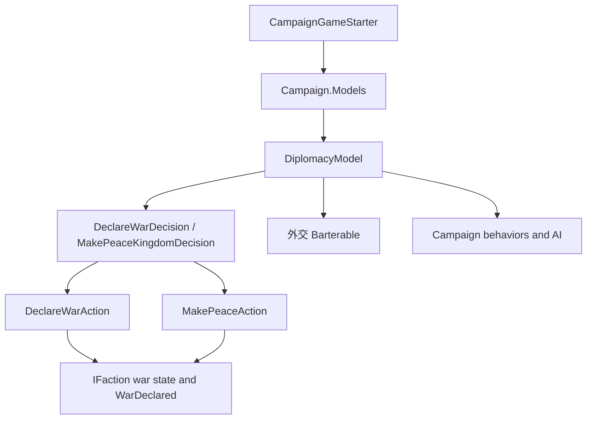

# DiplomacyModel

**命名空间：** `TaleWorlds.CampaignSystem.ComponentInterfaces`  
**模块：** `TaleWorlds.CampaignSystem`  
**类型：** `public abstract class DiplomacyModel : MBGameModel<DiplomacyModel>`  
**基类：** `MBGameModel<DiplomacyModel>`  
**源文件：** `bin/TaleWorlds.CampaignSystem/TaleWorlds.CampaignSystem.ComponentInterfaces/DiplomacyModel.cs`

## 一句话职责

`DiplomacyModel` 为战役系统提供外交决策所需的规则结果，例如战争/和平评分、战争进度、关系上限、影响力成本、贡金和外交姿态；它不会自己宣布战争、缔结和平或写入派系状态。

## 心智模型：规则计算，不是外交事务

把它放在战役模型链的中间层理解：



- **谁创建和持有：** `SandBoxManager` 在战役启动阶段把 `DefaultDiplomacyModel` 加入 `CampaignGameStarter`；`Campaign` 随后把模型集合构造成 `GameModels`，运行期通过 `Campaign.Current.Models.DiplomacyModel` 暴露当前实现。
- **什么时候使用：** 战役已经完成模型组装后，用它读取当前规则或在决策、对话、Barterable、AI 和行为中计算候选结果。战争评分、和平评分和 `GetWarProgressScore` 的参数方向必须与调用者一致。
- **什么时候不要使用：** 不要用它直接修改 `IFaction` 的战争关系、Hero 关系、Clan 影响力或贡金。已经决定要改变世界状态时，应转到 [DeclareWarAction](../../campaign-ext/DeclareWarAction)、[MakePeaceAction](../../campaign-ext/MakePeaceAction) 或对应的关系/影响力 Action。
- **如何扩展：** 在 `InitializeGameStarter` 阶段通过 [CampaignGameStarter](../CampaignGameStarter) 加入一个 `DiplomacyModel` 实现。`AddModel` 的后加入模型会遮蔽前一个同类型模型，因此替换应在 `GameModels` 创建前完成。

## 依赖关系与调用边界

**上游**

- [Campaign](../Campaign) 创建战役并在初始化期间组装模型门面。
- [CampaignGameStarter](../CampaignGameStarter) 收集默认模型和 mod 的替换模型。
- [GameModels](../GameModels) 通过强类型属性提供运行期 `DiplomacyModel`。
- `Hero`、`Clan`、`Kingdom`、`Settlement`、`MobileParty` 和 `IFaction` 提供模型计算所需的当前战役状态。

**下游**

- [DeclareWarDecision](../DeclareWarDecision) 和 `MakePeaceKingdomDecision` 用评分、阈值和影响力成本决定是否提出或通过王国决议。
- Barterable 与 `DiplomaticBartersBehavior` 用派系加入/离开、宣战/和平评分和 [BarterGroup](../BarterGroup) 组织谈判选项。
- `KingdomDecisionProposalBehavior`、`FactionHelper`、联盟行为和派系 AI 用姿态、战争进度、恒定战争及实力结果筛选行为。
- [CampaignEvents](../CampaignEvents) 和 Behavior 接收状态 Action 产生的事件；它们不是模型的写入通道。

**Model 与 Action 的硬边界**

| 需求 | 正确入口 | 这里发生什么 |
| --- | --- | --- |
| 评估是否值得宣战 | `GetScoreOfDeclaringWar`、`GetDecisionMakingThreshold` | 返回规则结果和可选的 `TextObject` 原因，不改变关系。 |
| 评估是否适合和平 | `IsPeaceSuitable`、`GetScoreOfDeclaringPeace` | 返回判断或评分，不支付贡金，也不结束战争。 |
| 读取战争进度 | `GetWarProgressScore` | 返回 `ExplainedNumber`，可能带解释项；不更新战役战争记录。 |
| 实际开始战争 | `DeclareWarAction.ApplyByKingdomDecision`、`ApplyByDefault`、`ApplyByPlayerHostility`、`ApplyByRebellion`、`ApplyByCrimeRatingChange`、`ApplyByKingdomCreation`、`ApplyByClaimOnThrone` 或 `ApplyByCallToWarAgreement` | 更新派系关系、相关政治状态并派发 `WarDeclared`。 |
| 实际结束战争 | `MakePeaceAction.Apply` 或 `ApplyByKingdomDecision` | 更新派系关系并执行和平相关事件/贡金流程。 |
| 直接给派系影响力或改英雄关系 | 对应的 `*Action` | 负责事件级联和合法状态变更；不要把 Model 的返回值当作写入 API。 |

## 真实获取路径

运行中的 mod 不应 `new DefaultDiplomacyModel()` 来查询当前规则，也不要缓存 starter。应从当前 Campaign 的模型门面重新取得对象：

```csharp
using TaleWorlds.CampaignSystem;
using TaleWorlds.CampaignSystem.ComponentInterfaces;

public static float ReadWarScore(IFaction declaringFaction, IFaction targetFaction, Clan evaluatingClan)
{
    Campaign campaign = Campaign.Current;
    if (campaign == null || campaign.Models == null ||
        declaringFaction == null || targetFaction == null || evaluatingClan == null)
    {
        return 0f;
    }

    DiplomacyModel model = campaign.Models.DiplomacyModel;
    if (model == null)
    {
        return 0f;
    }

    TextObject reason;
    return model.GetScoreOfDeclaringWar(
        declaringFaction, targetFaction, evaluatingClan, out reason, true);
}
```

这个例子只读取评分。评分的正负含义和阈值由当前实现决定，不能在 mod 中假定所有版本都有相同数值。需要真正开战时，应在调用者完成派系有效性、重复战争和游戏阶段检查后，根据来源选择上述具体的 `DeclareWarAction` 方法，而不是根据评分方法名猜测一个写入入口。

### 在启动阶段替换规则模型

`CampaignGameStarter` 的实际注册形状如下。`MyDiplomacyModel` 必须实现 `DiplomacyModel` 的全部抽象成员，并保持返回值的单位、参数方向和生命周期契约；它不是可以只覆写一个方法的接口。

```csharp
using TaleWorlds.CampaignSystem;
using TaleWorlds.Core;
using TaleWorlds.MountAndBlade;

public sealed class DiplomacySubModule : MBSubModuleBase
{
    protected override void InitializeGameStarter(
        Game game, IGameStarter gameStarterObject)
    {
        if (gameStarterObject is CampaignGameStarter starter)
        {
            starter.AddModel(new MyDiplomacyModel());
        }
    }
}
```

源码中的默认注册是 `gameStarter.AddModel(new DefaultDiplomacyModel())`。`CampaignGameStarter.AddModel(GameModel)` 把新对象追加到列表，而 `GameModelsManager.GetGameModel<T>()` 从列表尾部向前找，因此该替换必须发生在 Campaign 创建 `GameModels` 之前。若需要包装默认实现，则继承 `MBGameModel<DiplomacyModel>`，并在 `Initialize` 收到 `BaseModel` 后处理它可能为 `null` 的情况。

## 公共成员按任务理解

下面覆盖 1.4.5 `DiplomacyModel.cs` 的全部公共抽象属性、枚举和方法。表格描述的是调用时机和影响面，不是把签名重新排列成字典。

### 常量规则与外交姿态

| 成员 | 用途、调用时机和影响 |
| --- | --- |
| `DiplomacyStance.Neutral` / `War` | `GetShallowDiplomaticStance` 和 `GetDefaultDiplomaticStance` 使用的两种姿态；`null` 表示浅层查询没有可用的显式判断，不能当成 Neutral。 |
| `MaxRelationLimit` / `MinRelationLimit` | 关系值的全局上、下限；关系 Action、对话和 Persuasion 会用它们限制或解释结果。 |
| `MaxNeutralRelationLimit` / `MinNeutralRelationLimit` | 非战争中性关系的边界；不要把它们当作所有关系值的上下限。 |
| `MinimumRelationWithConversationCharacterToJoinKingdom` | 对话或派系加入流程判断领袖关系是否达到门槛；它只提供门槛，不替代加入 Kingdom 的事务流程。 |
| `GiftingTownRelationshipBonus` / `GiftingCastleRelationshipBonus` | 赠送城镇或城堡时的关系加成输入；真正的所有权、赠送和关系变更由相应 Action/决议完成。 |
| `WarDeclarationScorePenaltyAgainstTradePartners` | 默认外交评分对贸易伙伴宣战的惩罚因子；替换它会影响战争决策和谈判，不会自动撤销贸易协议。 |
| `GetShallowDiplomaticStance(IFaction, IFaction)` | 读取当前派系对的浅层战争/中立判断，可能返回 `null`；用于快速筛选，不应作为完整关系写入。 |
| `GetDefaultDiplomaticStance(IFaction, IFaction)` | 为派系对返回默认姿态，`IsAtConstantWar` 等规则会参与判断；它是规则结果，不是设置姿态的 setter。 |
| `IsAtConstantWar(IFaction, IFaction)` | 判断双方是否处于规则上不可通过普通和平流程解除的恒定战争；Barter、加入王国和行为筛选会调用它。 |

### 关系和英雄影响

| 成员 | 用途、调用时机和影响 |
| --- | --- |
| `GetRelationIncreaseFactor(Hero, Hero, float)` | 根据两个 Hero 和拟议的关系变化计算缩放因子；用于关系增长，不直接写双方关系。 |
| `GetEffectiveRelation(Hero, Hero)` | 返回考虑有效关系代理后的关系值；决策和 UI 应在需要外交语义时优先使用它，而不是擅自读取一个原始字段。 |
| `GetBaseRelation(Hero, Hero)` | 返回不叠加有效关系修正的基础关系；适合诊断和比较，不能当作最终关系。 |
| `GetHeroesForEffectiveRelation(Hero, Hero, out Hero, out Hero)` | 为有效关系计算选出实际参与比较的两个 Hero；调用者必须使用输出对象，不要继续假定输入 Hero 是最终双方。 |
| `GetRelationChangeAfterClanLeaderIsDead(Hero, Hero)` | 计算 Clan 领袖死亡后另一位 Hero 的关系变化；死亡 Action/行为负责应用变化和事件。 |
| `GetRelationChangeAfterVotingInSettlementOwnerPreliminaryDecision(Hero, bool)` | 计算聚落所有权初步决议投票后的关系变化；决议随后使用关系 Action 应用结果。 |
| `GetCharmExperienceFromRelationGain(Hero, float, ChangeRelationAction.ChangeRelationDetail)` | 把关系增长和变更原因转换为魅力经验；不直接给 Hero 加经验。 |

### 影响力、贡金和决策成本

| 成员 | 用途、调用时机和影响 |
| --- | --- |
| `GetInfluenceAwardForSettlementCapturer(Settlement)` | 计算攻占聚落者得到的影响力；战斗/聚落结算负责应用奖励。 |
| `GetHourlyInfluenceAwardForRaidingEnemyVillage(MobileParty)` | 计算正在袭击敌方村庄的党派每小时影响力；由地图/战役 tick 消费，不能在读取时重复发奖。 |
| `GetHourlyInfluenceAwardForBesiegingEnemyFortification(MobileParty)` | 计算围攻敌方堡垒的每小时影响力；依赖当前 Siege/党派状态，结束围攻后不要缓存结果继续使用。 |
| `GetHourlyInfluenceAwardForBeingArmyMember(MobileParty)` | 计算军团成员每小时影响力；它不是给 `MobileParty` 直接写入影响力的 Action。 |
| `GetRelationCostOfExpellingClanFromKingdom()` | 返回驱逐 Clan 的关系代价；驱逐决议和关系 Action 负责应用。 |
| `GetInfluenceCostOfSupportingClan()` | 返回支持 Clan 决议所需的影响力成本；只提供成本。 |
| `GetInfluenceCostOfExpellingClan(Clan)` | 结合提案 Clan 计算驱逐成本；需要使用提出者的真实 Clan。 |
| `GetInfluenceCostOfProposingPeace(Clan)` / `GetInfluenceCostOfProposingWar(Clan)` | 计算提出和平或战争决议的成本；决议成功后才由决议流程扣除影响力。 |
| `GetInfluenceValueOfSupportingClan()` / `GetRelationValueOfSupportingClan()` | 提供支持 Clan 的影响力/关系收益；投票系统按当前规则使用，不代表调用即支持。 |
| `GetInfluenceCostOfAnnexation(Clan)` | 计算吞并聚落提案成本；`SettlementClaimantDecision` 使用它，不能拿它当作自动吞并入口。 |
| `GetInfluenceCostOfChangingLeaderOfArmy()` / `GetInfluenceCostOfDisbandingArmy()` | 返回军团换领袖/解散军团的固定影响力成本；行为负责检查余额并扣除。 |
| `GetRelationCostOfDisbandingArmy(bool)` | 按是否为军团领袖返回解散军团的关系代价；不要只用影响力成本模拟完整后果。 |
| `GetInfluenceCostOfPolicyProposalAndDisavowal(Clan)` | 计算提出或废除政策的成本；政策决议负责应用。 |
| `GetInfluenceCostOfAbandoningArmy()` | 返回离开军团的影响力成本；原生行为会在确认选项后用 Action 扣除。 |
| `GetDailyTributeToPay(Clan, Clan, out int)` | 计算两个 Clan 关系下的每日贡金并输出持续天数；它读取双方当前派系/战争进度，不能直接改金币或贡金协议。 |
| `GetDecisionMakingThreshold(IFaction)` | 返回派系进行决策时使用的阈值；必须和同一模型实现返回的评分一起解释。 |
| `DenarsToInfluence()` | 提供金币到影响力的换算系数；常用于决议 merit 计算，不是把 denar 自动转换到账户的操作。 |

### 王国、Clan 与外交评分

| 成员 | 用途、调用时机和影响 |
| --- | --- |
| `GetStrengthThresholdForNonMutualWarsToBeIgnoredToJoinKingdom(Kingdom)` | 判断加入王国时可忽略的非互相战争实力阈值；`FactionHelper` 用它筛选加入条件。 |
| `GetScoreOfClanToJoinKingdom(Clan, Kingdom)` / `GetScoreOfClanToLeaveKingdom(Clan, Kingdom)` | 计算 Clan 加入或离开 Kingdom 的谈判/决策评分；不执行 ChangeKingdom。 |
| `GetScoreOfKingdomToGetClan(Kingdom, Clan)` / `GetScoreOfKingdomToSackClan(Kingdom, Clan)` | 从 Kingdom 角度评估接纳或驱逐 Clan；方向很重要，不能交换参数后沿用同一解释。 |
| `GetScoreOfMercenaryToJoinKingdom(Clan, Kingdom)` / `GetScoreOfMercenaryToLeaveKingdom(Clan, Kingdom)` | 计算佣兵 Clan 加入/离开的评分；佣兵状态和 Kingdom 所属关系仍由 Barter/Action 流程处理。 |
| `GetScoreOfKingdomToHireMercenary(Kingdom, Clan)` / `GetScoreOfKingdomToSackMercenary(Kingdom, Clan)` | 从雇佣方角度计算雇佣或解雇佣兵的评分；不直接更改 `IsUnderMercenaryService`。 |
| `GetScoreOfDeclaringWar(IFaction, IFaction, Clan, out TextObject, bool)` | 以宣战方、被宣战方和评估 Clan 计算宣战评分；`includeReason` 为真时填充原因文本。它不调用 `DeclareWarAction`。 |
| `GetScoreOfDeclaringPeace(IFaction, IFaction)` | 计算双方结束战争的基础和平评分；不发起 `MakePeaceAction`。 |
| `GetScoreOfDeclaringPeaceForClan(IFaction, IFaction, Clan, out TextObject, bool)` | 从具体 Clan 立场评估和平并可输出原因；决议/Barterable 用它决定是否支持。 |
| `IsPeaceSuitable(IFaction, IFaction)` | 判断当前双方是否适合和平；这是资格/规则判断，不是和平事务。 |
| `GetWarProgressScore(IFaction, IFaction, bool)` | 返回包含可选解释项的战争进度 `ExplainedNumber`；战争进度方向按宣战方/被宣战方传入，反转会改变贡金和和平判断。 |
| `GetScoreOfLettingPartyGo(MobileParty, MobileParty)` | 评估放走某个党派的外交/战术价值；它不释放俘虏、不结束地图事件。 |
| `GetValueOfHeroForFaction(Hero, IFaction, bool)` | 计算派系看待某 Hero 的价值，可区分婚姻场景；不执行婚姻或派系变更。 |
| `GetValueOfSettlementsForFaction(IFaction)` | 估算派系拥有的聚落价值，用于战争/和平和联盟评分；不是给 Settlement 设置价值字段。 |
| `CanSettlementBeGifted(Settlement)` | 读取当前规则是否允许赠送聚落；真正的转让仍需对应决议或 Action。 |
| `IsClanEligibleToBecomeRuler(Clan)` | 判断 Clan 是否符合成为统治者的规则；王位选举流程负责使用结果。 |
| `GetClanStrength(Clan)` | 计算 Clan 的综合实力；王位选择、加入王国和外交评分会调用，不能把它等同于某一支部队人数。 |
| `GetHeroCommandingStrengthForClan(Hero)` / `GetHeroGoverningStrengthForClan(Hero)` | 分别计算 Hero 的领军/治理实力贡献；用于 Clan 变量和决策模型，不直接改变 Hero 或 Clan 的实力字段。 |

### 其他规则入口

| 成员 | 用途、调用时机和影响 |
| --- | --- |
| `GetNotificationColor(ChatNotificationType)` | 返回外交/聊天通知使用的颜色值；只影响通知表现，不改变外交状态。 |
| `GetBarterGroups()` | 返回当前外交 Barter 分组；Barter 初始化会枚举它们。不要在运行中返回带有已销毁派系引用的缓存集合。 |

## 何时用、何时不要用

### 适合使用

- 在 Campaign 行为、决议或 Barterable 中，从 `Campaign.Current.Models.DiplomacyModel` 读取与当前版本匹配的评分、阈值或成本。
- 需要实现新的外交规则时，在启动阶段替换 `DiplomacyModel`，并完整保留其它抽象入口的语义，而不是只改一个战争分数方法后返回默认值或零。
- 需要解释玩家看到的外交结果时，使用带 `out TextObject reason` 的评分方法和 `ExplainedNumber`，让 UI/日志保留当前模型提供的解释。

### 不要这样使用

- 不要用 `GetScoreOfDeclaringWar` 的正值直接调用 `DeclareWarAction`，除非调用者还完成了决议/谈判的来源、资格和重复状态检查。
- 不要在模型里修改 `Hero`, `Clan`, `Kingdom`, `Settlement` 或 `MobileParty`；模型在读取期间写状态会让同一计算被重复调用时产生不可预测副作用。
- 不要缓存跨读档、跨战役的模型、Faction、Clan 或 `BarterGroup` 引用。读档后从当前 `Campaign` 对象图重新获取。
- 不要在 Campaign 模型管理器创建前或战役结束后的 Mission/UI 回调中解引用 `Campaign.Current.Models`。

## 风险与崩溃/坏档边界

- **模型尚未组装：** `Campaign.Current`、`Models` 或具体 `DiplomacyModel` 可能为空。启动阶段注册模型，运行期读取模型；不要在静态初始化中提前访问。
- **替换顺序错误：** `AddModel` 使用列表尾部优先。包装模型如果在默认模型之前加入，可能拿到 `null`；在 `GameModels` 已创建后加入则不会更新现有门面。
- **把计算当成事务：** 评分、成本、阈值和姿态都只返回结果。直接改关系/金币/影响力会跳过 `*Action` 的事件级联、政治状态和存档语义，可能让 UI、AI 和存档互相不一致。
- **参数方向颠倒：** `GetScoreOfDeclaringWar(factionDeclaresWar, factionDeclaredWar, evaluatingClan, out reason, includeReason)`、`GetWarProgressScore(factionDeclaresWar, factionDeclaredWar, includeDescriptions)` 和贡金方法都依赖参数方向；交换双方会产生看似合法但政治含义相反的结果。
- **原因输出被忽略：** `includeReason` 为真时才保证评分原因被填充；不要复用未初始化的 `TextObject`，也不要把原因文本当稳定 ID 存档。
- **重复或错误阶段 Action：** Model 不会替调用者防止重复宣战。派系、FactionManager、CampaignEventDispatcher 和相关对象必须仍处于有效战役生命周期；错误阶段执行 Action 会触发重复事件、空引用或不完整的存档状态。
- **读档与引用寿命：** 模型实例和派系状态属于当前 Campaign 组装。读档或结束战役后继续用旧引用，可能把旧规则应用到新对象图。
- **契约漂移：** `DiplomacyModel` 的抽象成员、默认实现和默认注册属于版本契约。1.3.x mod 跨到 1.4.5 时必须重新编译/核对全部抽象成员，不能只按同名方法反射。

## 版本注记

本页按 1.4.5 的 `TaleWorlds.CampaignSystem.ComponentInterfaces.DiplomacyModel` 和 `DefaultDiplomacyModel` 编写。1.3.x 的模型成员、默认分数和模块注册顺序可能不同；跨版本代码应以目标版本的抽象契约重新实现和测试。`DefaultDiplomacyModel` 是原版实现，不是稳定的 mod 扩展 API，需把“替换规则”与“读取规则”分别对待。

## 导航

- ↑ 父级：[Campaign API](../)
- ↔ 同级：[Campaign](../Campaign) · [CampaignGameStarter](../CampaignGameStarter) · [GameModels](../GameModels) · [DefaultDiplomacyModel](../DefaultDiplomacyModel)
- 相关 Action：[DeclareWarAction](../../campaign-ext/DeclareWarAction) · [MakePeaceAction](../../campaign-ext/MakePeaceAction) · [ChangeRelationAction](../../campaign-ext/ChangeRelationAction)
- 相关系统：[CampaignEvents](../CampaignEvents) · [DeclareWarDecision](../DeclareWarDecision) · [CampaignBehaviorBase](../CampaignBehaviorBase)
- 架构边界：[GameModelsManager](../../core-extra/GameModelsManager) · [MBGameModel](../../core-extra/MBGameModel) · [崩溃边界](../../../architecture/crash-boundary) · [文档契约](../../../architecture/doc-contract)
