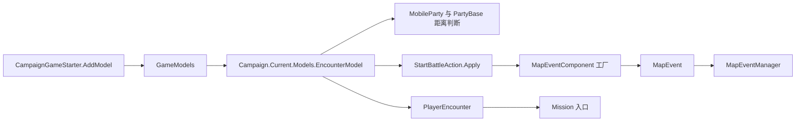

# EncounterModel

**命名空间：** `TaleWorlds.CampaignSystem.ComponentInterfaces`  
**模块：** `TaleWorlds.CampaignSystem`  
**类型：** `public abstract class EncounterModel : MBGameModel<EncounterModel>`  
**基类：** `MBGameModel<EncounterModel>`  
**源码：** `bin/TaleWorlds.CampaignSystem/TaleWorlds.CampaignSystem.ComponentInterfaces/EncounterModel.cs`

## 一句话职责

`EncounterModel` 是战役层的规则契约：它计算部队如何相遇、谁代表并防守遭遇的一方、使用哪种 `MapEventComponent`，以及投降、会面、加入、逃跑和战后重新定位如何判断。

## 心智模型

把它理解为战役层的规则提供者，而不是遭遇本身。`Campaign.Current.Models.EncounterModel` 是当前战役实际使用的模型，移动部队、遭遇菜单、[`StartBattleAction`](../../campaign-ext/StartBattleAction)、`MapEvent` 和战役行为都会查询它。战役运行期间同一规则可能被重复查询。它通常返回数值或选择，不负责直接执行战斗变更、不负责派发 `OnStartBattle`，也不负责打开 3D `Mission`。

真正重要的边界是：

1. `EncounterModel` 提供阈值和规则选择。
2. [`StartBattleAction`](../../campaign-ext/StartBattleAction) 执行遭遇变更并派发战斗事件；防守方尚未加入地图事件时，它会调用 `CreateMapEventComponentForEncounter`。
3. [`MapEventManager`](../MapEventManager) 负责管理器创建的围城和突围事件，推进活动地图事件，并移除已完成的事件。
4. [`PlayerEncounter`](../PlayerEncounter) 把玩家遭遇接到菜单、模拟战斗和 Mission 入口。模型调用不能替代这个状态机。

模型在战役启动阶段通过 [`CampaignGameStarter`](../CampaignGameStarter) 注册；之后由 `GameModels` 组装，并从 `Campaign.Current.Models.EncounterModel` 暴露出来。不要缓存启动时的临时对象，也不要把 `Game.Current.ReplaceModel` 当作 1.4.5 的安装接口。

## 何时使用，何时不要使用

当战役行为或遭遇 UI 需要当前版本的相遇距离、会面资格、首领、防守方、投降、贿赂、加入部队或战后传送规则时，读取活动模型。只有在模组确实要改动这些战役规则时，才安装完整的 `EncounterModel` 替换实现。

不要用它移动部队、开始战斗、改变领地所有权、结算伤亡或派发战役事件。需要改变状态时使用对应的 Action 或管理器路径，尤其是 `StartBattleAction.Apply`、`MapEventManager` 和事件组件工厂。不要在 `Campaign.Current.Models` 尚未组装时、战役结束后，或拿已经脱离当前战役的部队/事件对象来调用它。

## 依赖



请结合 [`MapEvent`](../MapEvent)、它内部的 [`MapEvent.BattleTypes`](../BattleTypes) 和 [`MapEventManager`](../MapEventManager) 阅读生命周期。模型返回的组件必须和战斗类型、事件注册方式以及当前战役流程相容。

## 规则分组和调用时机

### 距离与半径阈值

这些属性会被移动和遭遇选择代码读取，所以修改它们会改变部队何时能够互动，而不只是改变菜单显示。

| 成员 | 含义与调用时机 |
| --- | --- |
| `NeededMaximumLandDistanceForEncounteringMobileParty` | 普通陆地遭遇的最大距离；`PartyBase` 和部队 AI 用它做陆地接近判断。 |
| `NeededMaximumNavalDistanceForEncounteringMobileParty` | 普通海上遭遇的最大距离；1.4.5 默认值是 `0f`，不能从陆地值推断海上行为。 |
| `MaximumAllowedLandDistanceForEncounteringMobilePartyInArmy` | 军团情境下允许的扩大陆地距离。 |
| `MaximumAllowedNavalDistanceForEncounteringMobilePartyInArmy` | 军团海上距离对应值；默认是 `0f`。 |
| `NeededMaximumDistanceForEncounteringTown` | 与城镇发生遭遇所需的距离阈值。 |
| `NeededMaximumDistanceForEncounteringBlockade` | 封锁互动和附近加入部队搜索使用的距离。 |
| `NeededMaximumDistanceForEncounteringVillage` | 村庄遭遇距离阈值。 |
| `GetEncounterJoiningRadius` | 搜索可能加入遭遇的未附属部队的半径。 |
| `GetSettlementBeingNearFieldBattleRadius` | 判断野战是否靠近定居点的半径。 |
| `PlayerParleyDistance` | 默认实现检查主角请求与定居点会面时使用的距离。 |
| `MinimumNumberOfMenForAttackingVillageViaScene` | 进入村庄攻击场景，而不是采用其他遭遇流程时的最低人数。 |

这些都是只读规则契约。它们不会把部队移动到范围内，不会把部队附加到 `MapEvent`，也不会创建 Mission。

### 敌对、会面、首领和防守方

`IsEncounterExemptFromHostileActions(PartyBase side1, PartyBase side2)` 判断是否应抑制敌对互动。`CanMainHeroDoParleyWithParty(PartyBase partyBase, out TextObject explanation)` 同时返回能否会面以及失败时的本地化说明。默认实现会检查战役状态、主部队可用性、派系敌对关系、叛军限制、定居点检查/访问状态和距离。

`GetLeaderOfSiegeEvent(SiegeEvent siegeEvent, BattleSideEnum side)` 与 `GetLeaderOfMapEvent(MapEvent mapEvent, BattleSideEnum side)` 选择代表一方的 Hero。默认规则会优先考虑事件派系，并综合王国领袖、军团领袖、氏族地位、军团规模和健康部队人数。参与方没有领主 Hero 时，结果可能是 `null`。

`GetCharacterSergeantScore(Hero hero)` 为这个排序提供分数，但它不是把 Hero 分配到 `Hero.PartyBelongedTo` 的操作。

`GetDefenderPartiesOfSettlement(Settlement settlement, MapEvent.BattleTypes mapEventType)` 按城镇、村庄或藏身处返回合适的防守方。`GetNextDefenderPartyOfSettlement(Settlement settlement, ref int partyIndex, MapEvent.BattleTypes mapEventType)` 是调用方自己维护索引时使用的增量版本。返回的列表和索引只是遭遇选择数据，不会创建驻军，也不会结算伤亡。

### 组件和遭遇后果

`CreateMapEventComponentForEncounter(PartyBase attackerParty, PartyBase defenderParty, MapEvent.BattleTypes battleType)` 是选择组件或转交管理器的入口。这是契约中唯一明显会通过所选工厂/管理器路径参与创建副作用的方法。调用方必须传入真实部队，以及和定居点/围城上下文匹配的战斗类型。

`GetSurrenderChance` 返回概率。`GetBribeChance` 返回 `ExplainedNumber`，把规则解释保留给 UI 和对话。`GetMapEventSideRunAwayChance` 为活动 `MapEventSide` 计算逃跑概率。这些方法只计算结果；投降、贿赂或逃跑后的状态变更由调用方负责。

`FindNonAttachedNpcPartiesWhoWillJoinPlayerEncounter` 会把符合条件的附近部队追加到调用方提供的两个列表中。它不是一个纯粹的新列表工厂：会修改输入列表，并过滤已有地图事件、定居点、围城、附属关系、海陆兼容性、派系关系、部队角色和 `ShouldBeIgnored`。

`CanPlayerForceBanditsToJoin(out TextObject explanation)` 检查主角当前特长并返回本地化说明。`IsPartyUnderPlayerCommand(PartyBase party)` 判断玩家指挥权规则。`GetPartiesToTeleportOnMapEventFinalize(MapEvent mapEvent)` 返回战斗结束后默认流程可能重新定位的活动移动部队。

## 真实获取和安装示例

在活动战役中读取当前模型：

```csharp
using TaleWorlds.CampaignSystem;
using TaleWorlds.CampaignSystem.ComponentInterfaces;

EncounterModel encounterModel = Campaign.Current.Models.EncounterModel;
float landRange = encounterModel.NeededMaximumLandDistanceForEncounteringMobileParty;
float joiningRadius = encounterModel.GetEncounterJoiningRadius;
```

如果模组确实要改变规则，应在战役启动阶段添加完整模型。`CampaignGameStarter.AddModel` 会把模型加入启动列表，随后 `GameModels` 组装并暴露活动模型：

```csharp
using TaleWorlds.CampaignSystem;
using TaleWorlds.Core;

public sealed class WiderEncounterModel : TaleWorlds.CampaignSystem.GameComponents.DefaultEncounterModel
{
    public override float GetEncounterJoiningRadius => 4f;
}

public void OnGameStart(Game game, IGameStarter gameStarterObject)
{
    if (gameStarterObject is CampaignGameStarter campaignStarter)
    {
        campaignStarter.AddModel(new WiderEncounterModel());
    }
}
```

这个例子只改变一个真实规则，其余抽象入口继续继承源码中的默认实现。这里没有使用 `Game.Current.ReplaceModel`，因为它不是本文所依据的 1.4.5 安装 API。

开始战斗时，应调用真正拥有变更权的 Action，而不是直接调用模型：

```csharp
using TaleWorlds.CampaignSystem.Actions;
using TaleWorlds.CampaignSystem.Party;

StartBattleAction.Apply(attackerParty, defenderParty);
```

该 Action 会选择 `MapEvent.BattleTypes`，在需要时向活动模型请求组件，然后派发 `OnStartBattle`。它不会创建 3D Mission；玩家遭遇流程稍后才会打开对应 Mission。

## 风险与崩溃/存档边界

- **层级用错：** 在模型中修改 `PartyBase`、`MobileParty`、`Settlement` 或 `MapEvent`，可能在一次计算中被重复执行，并绕过事件、编组和存档清理。模型应返回规则结果，让 Action 或管理器修改状态。
- **战役状态缺失：** `Campaign.Current`、`Campaign.Current.Models`、`MobileParty.MainParty` 和 `PlayerEncounter` 都受生命周期约束。静态初始化或战役结束后的回调可能拿到空或陈旧对象。
- **战斗类型错误：** 组件工厂结果必须匹配 `MapEvent.BattleTypes`。把围城或突围强行走成野战路径，会跳过 `MapEventManager` 的设置，可能留下没有预期事件的部队。
- **部队/事件引用失效：** 首领、投降、逃跑、加入和传送查询都会访问活动部队与 side。不要跨越事件结束保存这些返回对象；`MapEventManager` 会移除已完成事件。
- **输出列表被修改：** 加入部队查询会向调用方列表追加元素。应传入当前遭遇拥有的列表，不能假设调用前为空或调用后保持不变。
- **错误接管结算：** 默认传送候选来自失败方或玩家对立方，并排除了 inactive、空部队、驻军和部分附属部队。事件结束后不要自行把所有参与方强行传送。
- **存档兼容：** 模型本身是启动配置，而 `MapEvent`、`PlayerEncounter` 和战役部队属于存档图。不要保存临时模型实例，也不要把已结束遭遇返回的对象引用写进自己的持久化数据。

## 版本说明

本文依据 v1.4.5 源码树。距离阈值、战斗类型路由、部队筛选和模型启动顺序可能随 Bannerlord 版本改变；迁移到其他版本前，应重新核对对应的 `EncounterModel`、`DefaultEncounterModel`、`StartBattleAction` 和 `GameModels` 源码。

## 导航

- **父级：** [Campaign API](./)
- **同级：** [DefaultEncounterModel](../DefaultEncounterModel) · [GameModels](../GameModels) · [MapEvent](../MapEvent) · [MapEventManager](../MapEventManager)
- **相关：** [PlayerEncounter](../PlayerEncounter) · [MapEvent.BattleTypes](../BattleTypes) · [CampaignGameStarter](../CampaignGameStarter) · [StartBattleAction](../../campaign-ext/StartBattleAction)
- **英文页面：** [English page](../../../../en/api/campaign/EncounterModel)
