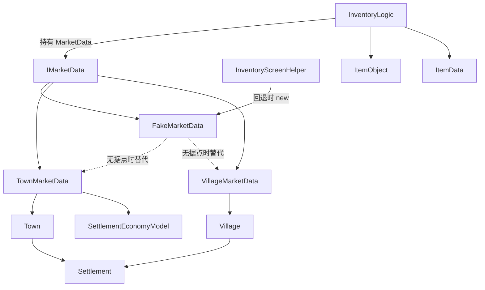

# FakeMarketData

**命名空间:** `TaleWorlds.CampaignSystem.Settlements`  
**模块:** `TaleWorlds.CampaignSystem`  
**类型:** `internal class FakeMarketData : IMarketData`  
**源文件:** `bin/TaleWorlds.CampaignSystem/TaleWorlds.CampaignSystem.Settlements/FakeMarketData.cs`

## 概述

`FakeMarketData` 是 `IMarketData` 接口的“退化 / 回退”实现，本身不持有任何市场状态。当玩家在没有任何真实据点经济上下文（例如不在城镇或村庄、或在战斗缴获 / 战利品界面）打开库存界面时，引擎用它替代真正的 `TownMarketData` / `VillageMarketData`，让库存 UI 仍能拿到一个永远可用、不含市场波动的价格来源。它的 `GetPrice` 不做任何供需与交易方计算，直接返回物品的固有基准价 `Item.Value`，因此代表的不是某个定居点的实时行情，而是“无市场”时的固定底价。

## 心智模型

把 `FakeMarketData` 当作 **null-object（空对象）回退** 来理解：它和 `TownMarketData` / `VillageMarketData` 实现同一个 `IMarketData` 契约，但**故意什么都不算**——只把物品自己的 `Value` / `ItemValue` 交回去。它不归任何 `Settlement` 或 `Town` 持有，也不参与据点经济模拟的供需累积；它由 `InventoryScreenHelper.GetCurrentMarketDataForPlayer()` 在“找不到有效据点（或被俘、或在非战役模式）”时 `new FakeMarketData()` 临时造出来，并作为 `InventoryLogic.MarketData` 在一场库存会话期间被持有。它**没有字段、也没有 `[SaveableField]`**，所以虽然被登记进 `SaveableCampaignTypeDefiner`（id 68）参与存档类型表，序列化实际上是个空操作——它不在存档里持久化任何经济状态。正确理解：它是库存定价链的“安全兜底”，不是市场模拟数据；当你手上有据点时应当读 `Settlement.Town.MarketData` / `Settlement.Village.MarketData`，修改世界行情应走对应 `CampaignBehavior` / `Action`，绝不要自己 `new` 一个 `FakeMarketData` 去“假装”市场。

## 何时使用 / 何时不要使用

- **用**：理解库存界面在无据点上下文时的价格来源；阅读 `IMarketData` 契约，明白 `GetPrice` 的两种可能实现（真实模拟 vs. 退化回退）之间行为差异。
- **不要用**：不要在 mod 代码里 `new FakeMarketData()`——它是 `internal`，且只返回基准价，会丢失全部供需、买卖方向与交易方修正；用它估算交易盈亏会与实际市场价严重偏离。
- **不要用它“模拟”市场**：真实行情来自 `TownMarketData` / `VillageMarketData`，由 `TradeCampaignBehavior` 等每 tick 经 `UpdateStores` / `AddDemand` / `AddSupply` 维护；改经济状态应走对应 Behavior / Action，而不是写这些载体字段。
- **有据点时直接用真数据**：`settlement.Town.MarketData` / `settlement.Village.MarketData` 才是带供需的真实 `IMarketData`。

## 依赖图



### 上游（创建方 / 持有方）

- [InventoryScreenHelper](../InventoryLogic) 的 `GetCurrentMarketDataForPlayer()` 是引擎中唯一会 `new FakeMarketData()` 的地方——仅当 `Campaign.Current.GameMode` 非战役、或 `MobileParty.MainParty.CurrentSettlement` 为 `null` 且找不到最近城镇时，用它作兜底。
- `IMarketData`（同命名空间接口）定义了 `GetPrice` 两个重载；`FakeMarketData` 与 `TownMarketData` / `VillageMarketData` 共同实现它，`InventoryLogic` 的 `MarketData` 属性以该接口类型持有当前会话的市场数据。

### 下游（替代 / 真实对照）

- [Settlement](../Settlement) 提供据点外壳；其 `Town` / `Village` 组件才挂真正的市场数据。
- [Town](../Town) 的 `MarketData => _marketData`（`TownMarketData`）与 [Village](../Village) 的 `MarketData => _marketData`（`VillageMarketData`）是 `FakeMarketData` 在有据点时的真实替代；二者持有 `[SaveableField]` 供需字典。
- [InventoryLogic](../InventoryLogic) 把市场数据存进 `MarketData` 属性，库存交易询价最终都走 `MarketData.GetPrice(...)`；无据点上下文时这份引用就是 `FakeMarketData`。
- [ItemObject](../../core-extra/ItemObject) 的 `Value` 是 `FakeMarketData.GetPrice` 直接返回的基准价；[ItemData](../ItemData) 才是真实市场里承载 `Supply` / `Demand` / `InStore` / `InStoreValue` 的结构。
- [SettlementEconomyModel](../SettlementEconomyModel) 与 `TradeItemPriceFactorModel` 驱动真实 `GetPrice` 的供需修正——`FakeMarketData` 完全绕过了它们。

## 风险

- **`internal` 且不可持久化市场状态**：它是 `internal`，mod 无法直接构造；更关键的是它**没有 `[SaveableField]`**，即便被登记进存档类型表（id 68），序列化也是空操作。把它当成“市场快照”缓存会丢失全部供需信息。
- **返回恒定的基准价**：两个 `GetPrice` 重载都忽略 `isSelling`、`tradingParty`、`merchantParty`，永远返回 `item.Value` / `ItemValue`。若用它估算买卖盈亏、补给成本或 AI 价格评分，会与实际行情产生系统性偏差。
- **战役 / 任务层边界**：它属于 Campaign 层概念；在 `Mission` 或战斗逻辑里无法取得真实据点市场，引擎会回退到它。在战斗层做计价时应意识到拿到的是底价而非市场价。
- **不要直接改这些载体**：真实市场状态由 `TownMarketData` / `VillageMarketData` 经 `[SaveableField]` 持有，并由 `TradeCampaignBehavior`（`UpdateStores`、`AddDemand`、`AddSupply`）每 tick 更新。改世界行情必须走对应 Behavior / Action，手动写字段既不会被序列化，也不会触发价格因子重算。
- **跨战役重载缓存**：即便你拿到的是 `InventoryLogic.MarketData` 引用，它只在当前库存会话有效；不要把它缓存进静态字段或长生命周期对象，重载战役后指向的仍是旧会话的回退实例。

## 成员说明

### 价格查询（IMarketData 契约实现）

- **`GetPrice(ItemObject item, MobileParty tradingParty, bool isSelling, PartyBase merchantParty)`**
  - 用途：返回 `item.Value`，即该物品在游戏数据里的固有基准价。它**不读取任何供需、不区分买 / 卖、也不考虑交易方与商人派对**——这正是“退化实现”的本质：等价于“这个物品没有市场”时的固定底价。
  - 副作用：无；纯读 `ItemObject.Value`。
  - 调用时机：库存界面在缺少真实据点市场（引擎已回退到 `FakeMarketData`）时，所有交易询价都走它；结果与 `TownMarketData.GetPrice` 在有供需时的结果通常不同。

- **`GetPrice(EquipmentElement itemRosterElement, MobileParty tradingParty, bool isSelling, PartyBase merchantParty)`**
  - 用途：返回 `itemRosterElement.ItemValue`，即该装备元素所引用物品的固有基准价。与上一重载行为一致——忽略全部市场参数，恒返回物品的固有价值。
  - 副作用：无。
  - 调用时机：库存 / 物品菜单对 `EquipmentElement` 询价时的回退路径；`InventoryLogic` 内部即以此重载算价。

### 序列化收集（无业务状态）

- **`AutoGeneratedStaticCollectObjectsFakeMarketData` / `AutoGeneratedInstanceCollectObjects`**
  - 用途：仅供存档系统收集该类型引用的对象。因为类**没有任何字段**，实例收集是空操作；它仅通过 `SaveableCampaignTypeDefiner`（id 68）登记类型标识，使 `FakeMarketData` 在存档类型表里“有名无实”。
  - 副作用：无业务副作用。
  - 调用时机：存档序列化阶段由 `AutoGeneratedSaveManager` 通过委托调用，运行时逻辑不应触碰。

## 示例

### 取据点的真实市场数据并询价（FakeMarketData 的对照面）

```csharp
using TaleWorlds.CampaignSystem;
using TaleWorlds.CampaignSystem.Settlements;
using TaleWorlds.Core;

// 取玩家当前据点的真实市场数据：TownMarketData / VillageMarketData 都是 IMarketData
Settlement here = MobileParty.MainParty.CurrentSettlement;
if (here != null && here.IsTown && here.Town != null)
{
    IMarketData market = here.Town.MarketData;
    // 真实实现按供需 + 交易方算价；FakeMarketData 这一退化实现则恒返回 item.Value
    int grainPrice = market.GetPrice(DefaultItems.Grain, MobileParty.MainParty, isSelling: false, PartyBase.MainParty);
}
```

### 引擎如何回退到 FakeMarketData（等价于 InventoryScreenHelper 的解析逻辑）

```csharp
using TaleWorlds.CampaignSystem;
using TaleWorlds.CampaignSystem.Settlements;
using TaleWorlds.Core;

// 引擎打开玩家库存界面时解析市场数据：有城镇 / 村庄据点用真实模拟数据，否则以 FakeMarketData 回退
Settlement settlement = MobileParty.MainParty.CurrentSettlement
    ?? SettlementHelper.FindNearestTownToMobileParty(MobileParty.MainParty, MobileParty.NavigationType.All)?.Settlement;
IMarketData md = settlement == null ? null
    : settlement.IsVillage ? (IMarketData)settlement.Village.MarketData
    : settlement.IsTown ? (IMarketData)settlement.Town.MarketData
    : null;
// 若 md 仍为 null，引擎内部会 new FakeMarketData()；其 GetPrice 忽略全部参数，恒等于物品基准价
if (md != null)
{
    int baseQuote = md.GetPrice(DefaultItems.Grain, null, false, null);
}
```

上面的 `baseQuote` 在真实据点下由供需修正得到，而在 `FakeMarketData` 回退下恒等于 `DefaultItems.Grain.Value`——这正是它“无市场”语义的体现。

## 版本注记

本页以 v1.4.5 `TaleWorlds.CampaignSystem.Settlements/FakeMarketData.cs`、`IMarketData.cs`、`TownMarketData.cs`、`VillageMarketData.cs`，以及 `Helpers/InventoryScreenHelper.cs`（`GetCurrentMarketDataForPlayer`）、`Inventory/InventoryLogic.cs`、`SaveableCampaignTypeDefiner.cs`（id 68）源码为准。跨版本使用时重新确认 `FakeMarketData` 是否仍为 `internal`、以及库存界面回退逻辑是否变化。

## 导航

- ↑ 父级：[战役 API 索引](../)
- ↔ 相关：[Settlement](../Settlement) · [Town](../Town) · [Village](../Village) · [InventoryLogic](../InventoryLogic) · [ItemObject](../../core-extra/ItemObject) · [ItemData](../ItemData) · [SettlementEconomyModel](../SettlementEconomyModel)
