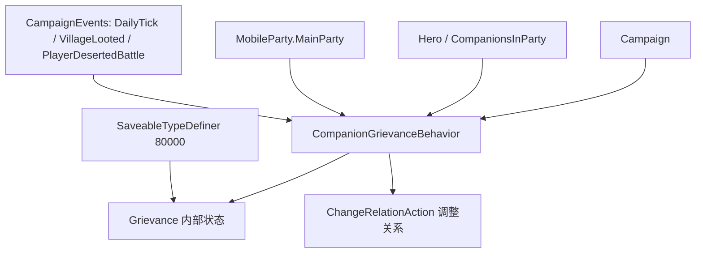

# Grievance

**命名空间：** `TaleWorlds.CampaignSystem.CampaignBehaviors`  
**模块：** `TaleWorlds.CampaignSystem`  
**类型：** `internal class Grievance`（嵌套于 `CompanionGrievanceBehavior` 内，非对外公开类型）  
**源文件：** `bin/TaleWorlds.CampaignSystem/TaleWorlds.CampaignSystem.CampaignBehaviors/CompanionGrievanceBehavior.cs`

## 一句话职责

`Grievance` 是 `CompanionGrievanceBehavior` 为每个「对主角不满的同伴」保存的一条状态记录：它标记抱怨的同伴是谁、因哪一类事件（欠饷 / 饥饿 / 劫掠村庄 / 临阵脱逃）不满、已经向主角抱怨过几次、以及下一次还能再开口抱怨的时间；玩家在对话中的回应会据此改变该同伴与主角的关系。

## 概述

`Grievance` 不是独立对外暴露的公开 API，而是 `CompanionGrievanceBehavior` 的**内部状态载体**，被该行为用 `_heroGrievances`（`Dictionary<Hero, Grievance>`）按同伴 `Hero` 索引持有。它把「某同伴为何不满、抱怨了多少次、下次何时能再抱怨」这几项临时状态集中保存，并随战役推进被创建、累加、被对话消费、过 56 天后作废。它的存在意义是支撑同伴忠诚度叙事：当主角队伍长期欠饷、挨饿、劫掠村庄或临阵脱逃时，具备相应特性（Generosity / Mercy / Valor）的同伴会累积怨气，最终通过对话关系惩罚侵蚀忠诚，进而威胁同伴去留。

## 心智模型

把 `Grievance` 想成 `CompanionGrievanceBehavior` 给「某个正在生主角气的同伴」贴的一张**临时工单**，而不是一份可以随便读写的配置。它只活在战役运行状态层、且完全由该行为私有管理：行为在每日 tick 与各类事件（村庄被劫掠、临阵脱逃、欠饷、饥饿）里调用 `DecideCompanionGrievances` 创建或累加工单，在 `OnHourlyTick` 里检查 `HaveGrievance` 并把当前工单交给对话系统去「开口抱怨」，在玩家回应后通过 `ChangeRelationAction` 调整关系并在对话结束后清空 `HaveGrievance`、把 `NextGrievanceTime` 推后 4~7 天。工单本身被 `[SaveableField]` 标注、随战役存档经 `SaveableTypeDefiner`（id 80000）序列化，因此任何对字段值的直接篡改都绕过了「56 天作废」「同类事件冷却」「对话触发」这套完整生命周期，会污染存档与运行态。不要在 mod 里 `new Grievance` 或直接改它的字段——要影响同伴怨气，应继承/扩展 `CompanionGrievanceBehavior` 或观察它依赖的 `CampaignEvents` 与 `Hero` 状态。

## 何时使用 / 何时不要使用

**用（间接、只读理解）：**
- 读源码时理解同伴抱怨体系的内部数据结构：某同伴为何不满、抱怨次数、下次可抱怨时间都集中在这一个对象上。
- 通过 `Hero.MainHero.CompanionsInParty`、`Hero.GetTraitLevel(DefaultTraits.*)`、`MobileParty.MainParty.IsStarving` / `HasUnpaidWages` 等**公开**状态，预判哪些同伴会产生何种怨气（判定逻辑见下文成员说明与示例）。
- 通过 `CampaignEvents`（如 `DailyTickEvent`、`VillageLooted`、`PlayerDesertedBattleEvent`）观察会触发怨气的事件，或在子类中覆盖行为。

**不要用（优先替代）：**
- 不要 `new Grievance(...)` 自己塞进字典——创建由 `DecideCompanionGrievances` 统一负责（设定下次抱怨时间、按同伴特性选类型），手动构造会绕过 `_nextGrievableTimeForComplaintType` 的同类冷却、产生孤儿工单。
- 不要直接改 `Count` / `HaveGrievance` / `HasBeenSettled` / `NextGrievanceTime`——它们由对话与每日 tick 协同维护；直接写会让同伴永远/从不抱怨，或破坏 56 天作废逻辑。
- 不要假设有公开入口查询「某同伴当前怨气」——`Grievance` 与字典都是私有的；如需读取，应扩展 `CompanionGrievanceBehavior`（如新增 `internal`/`public` 查询方法）而非反射或缓存引用。

## 依赖图



### 上游 / 持有者
- [Campaign](../Campaign) 提供战役时间、事件系统与存档框架；`Grievance` 的状态随时间推进（每日 tick、每小时 tick）而被维护，不是静态配置。
- [Hero](../Hero) 是工单的核心键与字段：`GrievingHero` 指向抱怨的同伴，`Hero.MainHero.CompanionsInParty` 是行为遍历产生怨气的来源，同伴特性（`DefaultTraits.Valor/Generosity/Mercy`）决定会产生哪类怨气。
- [MobileParty](../MobileParty)（`MobileParty.MainParty`）的状态 `IsStarving` / `HasUnpaidWages` 与是否在海上，是 `OnDailyTick` / `OnHourlyTick` 判定能否产生、能否开口抱怨的前提。
- [CampaignEvents](../CampaignEvents) 的 `DailyTickEvent`、`VillageLooted`、`PlayerDesertedBattleEvent`、`OnSessionLaunchedEvent`、`HourlyTickEvent` 是 `CompanionGrievanceBehavior.RegisterEvents` 订阅的真实触发点。

### 下游 / 变更入口
- [CompanionGrievanceBehavior](../CompanionGrievanceBehavior) 是 `Grievance` 唯一的生产者、消费者与序列化者；要改动该体系应扩展此行为而非 `Grievance` 本身。
- [ChangeRelationAction](../../campaign-ext/ChangeRelationAction)（经 `ApplyRelationChangeBetweenHeroes`）在玩家回应怨气对话后调整同伴与主角关系（+10 接受；-5/-2 敷衍；-15 拒绝/驱赶），是怨气侵蚀忠诚的实际落点。
- 存档系统经 `SaveableTypeDefiner`（id 80000，`Grievance` 类定义 id 10、`GrievanceType` 枚举 id 1、`Dictionary<Hero, Grievance>` 容器）读写本对象。

## 风险

- **绕过生命周期直接改字段**：手动置 `HaveGrievance = true` 或清零 `Count` / `HasBeenSettled`，会跳过「对话触发后再推后 `NextGrievanceTime`」「56 天作废重置」逻辑，导致同伴反复无端抱怨或永不抱怨，且 `NextGrievanceTime` 不再更新使 `OnDailyTick` 的作废判定永远不触发。
- **引用已死 Hero**：`GrievingHero` 同时作为字典的键与对象字段。`OnHourlyTick` 会检查 `GrievingHero.PartyBelongedTo == MobileParty.MainParty` 并打开对话；若该同伴已死亡却仍被写进工单，可能在对话阶段访问死亡英雄的 `CharacterObject` / 队伍关系而崩溃。删除同伴必须走对应 Action，不要只清空字典。
- **改存档定义破坏反序列化**：`Grievance` 与 `GrievanceType` 通过固定 `SaveableTypeDefiner` 编号注册。mod 若增删 `[SaveableField]`、改动 `GrievanceType` 枚举成员又不提升 typedefiner id，会让旧存档反序列化字段错位，轻则数据错乱重则坏档。
- **`GrievingHero` 反序列化依赖注册**：该字段是 `Hero` 引用，必须在 `MBObjectManager` 中已注册才能从存档恢复；自定义引入未注册的 `Hero` 会让 `AutoGeneratedInstanceCollectObjects` / 反序列化失败。
- **手动 `new` 绕过冷却与去重**：`DecideCompanionGrievances` 用 `_nextGrievableTimeForComplaintType[(int)eventType].IsFuture` 防止同类怨气短时间重复产生；手动 `new Grievance` 加入字典会突破该冷却，产生重复工单并污染计数。
- **读档阶段访问**：加载期间 `_heroGrievances` 正在重建，旧 `Grievance` / `Hero` 引用不可作为永久句柄；自定义行为应依赖稳定 `StringId` 与事件通知，而非缓存工单实例。

## 成员说明

`Grievance` 字段全部为 `internal`，由 `CompanionGrievanceBehavior` 在生命周期内读写；下表描述每个字段**真正持有/计算什么、改它有什么后果、何时被触碰**。

### 主体与归属

| 成员 | 用途、副作用与时机 |
| --- | --- |
| `GrievingHero`（`Hero`，`SaveableField(1)`） | 持有怨气的同伴英雄，同时是 `_heroGrievances` 字典的键。构造时赋值，运行期不再变更。它被 `OnHourlyTick` 用来判断该同伴是否在主角队伍、并作为对话对象；若此英雄已死亡却被保留，会在对话阶段引发空引用/状态异常。 |

### 类型与分类

| 成员 | 用途、副作用与时机 |
| --- | --- |
| `TypeOfGrievance`（`GrievanceType`，`SaveableField(3)`） | 怨气类别：`Invalid` / `NoWage`（欠饷）/ `Starvation`（饥饿）/ `VillageRaided`（劫掠村庄）/ `DesertedBattle`（临阵脱逃）。由 `GetGrievanceTypeForCompanion` 依据同伴特性选定：Valor→DesertedBattle，Generosity→Starvation 或 NoWage，Mercy→VillageRaided，否则 `Invalid`（不产生工单）。它决定对话分支与关系变化幅度，是 4 条对话条件（`companion_grievance_*_condition`）的判断依据。 |
| `GrievanceType` 枚举（外层 `internal enum`） | 与 `Grievance` 一同通过 `SaveableTypeDefiner` 注册（枚举 id 1）。增删枚举成员会破坏旧存档反序列化，必须同步提升 typedefiner 版本。 |

### 时序与生命周期

| 成员 | 用途、副作用与时机 |
| --- | --- |
| `NextGrievanceTime`（`CampaignTime`，`SaveableField(2)`） | 下一次该同伴可再次「开口抱怨」的最早时间。创建时取 `CampaignTime.Now`；每次对话结束后置为 `CampaignTime.DaysFromNow(4 + MBRandom.RandomInt(4))`（4~7 天）；每次同类型累加也刷新同类全局冷却为 4 天。`OnDailyTick` 用 `ElapsedDaysUntilNow >= 56f` 判定作废。直接改它会打乱对话节奏与作废计时。 |
| `HaveGrievance`（`bool`，`SaveableProperty(4)`，get;set） | 该同伴当前是否「有待倾诉的怨气」。`DecideCompanionGrievances` 在创建或冷却过后置 `true`；`OnHourlyTick` 打开对话后置 `false` 并推后 `NextGrievanceTime`。它是每小时对话循环的触发开关——`true` 且同伴在主角队伍才会弹出抱怨对话。 |
| `Count`（`int`，`SaveableField(6)`） | 同一同伴对同一类事件的抱怨累计次数；构造时置 1，冷却过后再次触发时 `++`。它驱动关系变化幅度：玩家**接受**且 `Count <= 1` → 关系 +10；**敷衍**且 `Count > 1` → 已结清 -5 / 未结清 -2；**拒绝/驱赶**则固定 -15（与 Count 无关）。56 天作废时清零。 |
| `HasBeenSettled`（`bool`，`SaveableField(5)`） | 该怨气是否已被玩家「接受」平息。接受后果里置 `true`；`Count > 1` 的敷衍后果据此区分 -5 / -2。56 天作废时重置为 `false`、并 `Count = 0`，使工单彻底归零重来。 |

## 示例

`Grievance` 与 `_heroGrievances` 均为 `CompanionGrievanceBehavior` 的私有/内部成员，没有公开查询入口；下方示例用**真实公开 API** 重现其判定依据，并演示如何在不触碰内部字段的前提下预判与观察怨气。

### 示例 1：预判哪些同伴会在劫掠村庄后产生怨气

怨气类别的真实判定来自 `GetGrievanceTypeForCompanion`：只有具备对应特性的同伴才会产生该类怨气。可直接读同伴特性与关系做预判。

```csharp
using TaleWorlds.CampaignSystem;
using TaleWorlds.Core;

// 遍历主角队伍中的同伴，找出会对「劫掠村庄」心怀不满者。
// 真实依据：GrievanceType.VillageRaided 仅当同伴 GetTraitLevel(DefaultTraits.Mercy) > 0 时产生。
foreach (Hero companion in Hero.MainHero.CompanionsInParty)
{
    int mercy = companion.GetTraitLevel(DefaultTraits.Mercy);
    if (mercy > 0)
    {
        // 该同伴会因此类事件产生 GrievanceType.VillageRaided 怨气；
        // 实际创建/累加与对话触发都在 CompanionGrievanceBehavior 内部，无公开读取入口。
        int currentRelation = companion.GetRelation(Hero.MainHero);
        // 关系越低，积怨对忠诚的侵蚀风险越大——可用作前瞻提示。
    }
}
```

### 示例 2：监测会触发怨气的实时队伍状态

源中 `OnDailyTick` 用以下公开状态决定是否调用 `DecideCompanionGrievances`；这些状态本身可读，可用于预判怨气积累。

```csharp
using TaleWorlds.CampaignSystem;
using TaleWorlds.CampaignSystem.Party;

// 监控主角队伍中会引发同伴怨气的两类状态。
MobileParty main = MobileParty.MainParty;
if (main != null && main.CurrentSettlement == null)
{
    bool starving = main.IsStarving;            // 触发 GrievanceType.Starvation
    bool unpaidWages = main.HasUnpaidWages > 0f; // 触发 GrievanceType.NoWage
    // 真正写入 _heroGrievances、打开对话、调用 ChangeRelationAction 调整关系，
    // 全部发生在 CompanionGrievanceBehavior 内部；mod 应观察 CampaignEvents
    // 或扩展该行为，而非直接读写 Grievance 字段。
}
```

> 若需在 mod 中实际读取/干预某同伴的怨气，正确做法是继承 `CompanionGrievanceBehavior` 暴露查询方法，或订阅 [CampaignEvents](../CampaignEvents) 并利用 [Hero](../Hero) / [MobileParty](../MobileParty) 的公开状态，不要反射或缓存 `Grievance` 实例。

## 参见

- ↑ 父级：[战役 API 索引](../)
- ↔ 同级：[CompanionGrievanceBehavior](../CompanionGrievanceBehavior)（唯一生产者/消费者/序列化者）· [Hero](../Hero)（怨气主体与特性判定）· [Campaign](../Campaign)（时间与事件框架）· [MobileParty](../MobileParty)（欠饷/饥饿状态来源）· [Settlement](../Settlement)（被劫掠村庄）· [CampaignEvents](../CampaignEvents)（怨气触发事件）· [Clan](../Clan)
- 关系变更落点：[ChangeRelationAction](../../campaign-ext/ChangeRelationAction)（接受 +10 / 敷衍 -2~-5 / 拒绝 -15）
