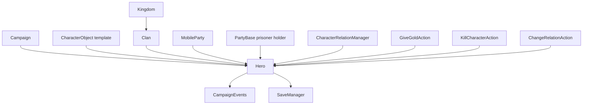

# Hero

**命名空间：** `TaleWorlds.CampaignSystem`  
**模块：** `TaleWorlds.CampaignSystem`  
**类型：** `public sealed class Hero : MBObjectBase, ITrackableCampaignObject, ITrackableBase, IRandomOwner`  
**源文件：** `bin/TaleWorlds.CampaignSystem/TaleWorlds.CampaignSystem/Hero.cs`  
**持久化角色：** Campaign 对象；由 Campaign 的对象管理器保存、重建和分类。

## 概述

`Hero` 是某一位已注册战役人物的持久化身份层。它把 CharacterObject 模板关联到家族、派对、关系、金币、生命、囚禁和死亡等会随战役存档变化的状态；读取可以直接从 Hero 进入，改变世界必须选择有完整副作用的 Action。

## 心智模型

`Hero` 是战役世界中的“这个人”，而不是一份兵种定义，也不是场景里的角色实例。它把身份、年龄、家族、个人财富、关系、装备、健康、囚禁和死亡放在同一个可存档对象上。`CharacterObject` 描述可复用的角色模板；`Hero` 为该模板承载一段具体战役人生。

这一区分决定了使用边界：

- 用 `Hero` 查询或改变一位已进入当前战役的贵族、同伴、要人或玩家角色的长期状态。
- 用 [CharacterObject](../CharacterObject/) 查询模板、职业、文化和基础角色数据；不要把它当成某一位英雄的关系或金币容器。
- 用 [MobileParty](../MobileParty/) 表示地图上移动的队伍；`Hero.PartyBelongedTo` 只说明英雄当前所属队伍，不等于队伍本身。
- 用 [PartyBase](../PartyBase/) 访问派对的底层实体和囚犯容器；囚犯英雄在 `PartyBelongedToAsPrisoner` 中，而非正常成员关系中。
- Mission 内的 `Agent` 是临时战斗/场景实例。它可能对应一个 Hero，却会在进入、离开或重建 Mission 时失效；不要把 Agent 缓存当作 Hero 的替代品。

**取得时机。**

在已启动的 Campaign Behavior、对话回调或战役事件中，从 `Hero.MainHero` 取得玩家，或从 `Campaign.Current.AliveHeroes`、`Clan.Heroes`、`Hero.Find` 取得已注册对象。`MainHero` 实际来自 `CharacterObject.PlayerCharacter.HeroObject`；`AllAliveHeroes` 是 `Campaign.Current.AliveHeroes` 的视图。因此在主菜单、`OnSubModuleLoad`、战役销毁后或读档尚未完成时，都不能假设这些静态入口可用。

不要在活动 Campaign 外 `new Hero(...)`。带参数构造函数会依赖 `Campaign.Current.CampaignObjectManager` 分配唯一 StringId、绑定 CharacterObject 并立即注册。创建英雄应经由 [HeroCreator](../HeroCreator/) 或原生工作流；它们会完成模板、出生日期、装备和注册所需的初始化。

## 依赖与世界变更图



| 关系 | 实际职责 |
| --- | --- |
| [Campaign](../Campaign/) | 持有 `CampaignObjectManager`、`AliveHeroes`、`DeadOrDisabledHeroes` 和 `CharacterRelationManager`；Hero 的静态集合依赖它。 |
| [CharacterObject](../CharacterObject/) | `Hero.CharacterObject` 是这个人的角色定义；Hero 的技能、生命上限和装备初始化会使用它。 |
| [Clan](../Clan/) 与 [Kingdom](../Kingdom/) | `Clan` setter 会从旧 Clan 移除、向新 Clan 加入并发送英雄改族通知；`MapFaction` 优先经 Clan 解析到 Kingdom。 |
| [MobileParty](../MobileParty/) 与 [PartyBase](../PartyBase/) | 正常成员/领袖关系与囚犯关系分开保存。`CurrentSettlement` 会由所属队伍、囚犯持有者或停留据点即时计算。 |
| [CharacterRelationManager](../CharacterRelationManager/) | 储存无向的基础个人关系。`SetPersonalRelation` 会先按 DiplomacyModel 的上下限裁剪，再写入该管理器。 |
| [GiveGoldAction](../../campaign-ext/GiveGoldAction/) | 在扣款前限制付款方可支付金额，变更 Hero/派对/据点财富后发送交易事件。 |
| [KillCharacterAction](../../campaign-ext/KillCharacterAction/) | 处理死亡前事件、继承、队伍/囚禁、配偶、同伴、据点角色和死亡后清理。 |
| [ChangeRelationAction](../../campaign-ext/ChangeRelationAction/) | 按外交模型计算有效对象与增减系数，裁剪后写关系并发出关系变化事件。 |
| [CampaignEvents](../CampaignEvents/) | Behavior 的公共订阅入口；Hero 的原生状态变更由内部 dispatcher 传递到相关接收者。 |
| [SaveManager](../../save-system/SaveManager/) | Hero 及其引用是 Campaign 存档图的一部分；自定义持久化必须遵守保存边界。 |

## 生命周期、位置与所有权

**注册与枚举。**

`Hero.MainHero` 适用于玩家专属逻辑；`Hero.AllAliveHeroes` 与 `Hero.DeadOrDisabledHeroes` 是当前 Campaign 的只读集合。遍历它们时不要立即执行会改变集合归类的死亡、放逐或派对 Action；先建立候选列表，再逐个执行变更。

`Hero.Find(stringId)` 从当前 CampaignObjectManager 查找已注册英雄；找不到会返回 `null`。`FindFirst` 和 `FindAll` 在 `Campaign.Current.Characters` 中过滤 `IsHero` 的 CharacterObject。它们均不是跨存档的对象句柄：读档后应以 StringId 再查找，不能保存旧实例供下一局或下一次加载使用。

**Clan、Kingdom 与队伍。**

`Clan` 是英雄的政治归属。赋值时 Hero 会保存首个归属为 `OriginClan`、让旧 Clan 执行移除、让新 Clan 执行加入，并通知 dispatcher。因此读取 `Clan`、`IsClanLeader`、`IsKingdomLeader` 或 `MapFaction` 是安全的；改族、换领袖、进入/离开王国应使用其对应的原生 Action/流程，而非只改一个属性。

`PartyBelongedTo` 由队伍 roster 流程维护且只有私有 setter。英雄作为囚犯时，`PartyBelongedToAsPrisoner` 会设置并清除普通派对归属。`CurrentSettlement` 是派对位置、囚犯持有者或 `StayingInSettlement` 的派生结果，适合显示与即时判定，不适合作为永久位置键。

**健康、状态与死亡。**

`HeroState` 区分 `Active`、`Prisoner`、`Fugitive`、`Traveling`、`Disabled` 和 `Dead` 等战役状态；`IsAlive` 只表示并非 `Dead`。`ChangeState` 会更新 Clan 的状态缓存、通知 CampaignObjectManager，并对 Traveling/Active 发送 dispatcher 通知。它不是通用的“杀死/释放/移动”按钮。

`HitPoints` 的变化跨越受伤阈值时会更新成员 roster 或囚犯 roster 的英雄健康状态。`MakeWounded` 只标记死亡原因/凶手并把生命设为 1，不会完成死亡。真实死亡应使用 [KillCharacterAction](../../campaign-ext/KillCharacterAction/)；它先调用 `CanDie`，对地图战斗中的英雄可留下延后处理的 death mark，随后处理领袖继承、军团/队伍、囚禁、配偶、同伴与据点角色，最后发送死亡事件并清理非玩家 Hero 的运行时数据。

## 关键成员：按副作用选择入口

| 目标 | 读取入口 | 变更边界 |
| --- | --- | --- |
| 身份与模板 | `CharacterObject`、`Name`、`Age`、`Occupation`、`IsAlive` | 不要复制 Hero 替换已注册对象；创建走 HeroCreator。 |
| 政治归属 | `Clan`、`MapFaction`、`IsClanLeader`、`IsKingdomLeader` | Clan setter 确实有通知，但改派系仍应走具体 Action，以保持王国、选举和派对状态一致。 |
| 地图存在位置 | `PartyBelongedTo`、`PartyBelongedToAsPrisoner`、`StayingInSettlement`、`CurrentSettlement` | 不要把 `CurrentSettlement` 当存档键或用反射改队伍关系。 |
| 家谱 | `Father`、`Mother`、`Spouse`、`Children`、`Siblings` | 父母和配偶 setter 会维护双向列表；婚姻及内容工作流仍应使用对应 Action。 |
| 财富 | `Gold` | 多方转账使用 GiveGoldAction；`ChangeHeroGold` 只做非负/上限处理，不发布交易事件。 |
| 关系 | `GetRelation`、`GetBaseHeroRelation`、`IsFriend`、`IsEnemy` | 世界叙事或玩家反馈的增减使用 ChangeRelationAction；不要绕过事件直接写管理器。 |
| 能力 | `GetSkillValue`、`GetTraitLevel`、`GetPerkValue`、`Power` | 这些是长寿命发展数据；变更后不要假定派对统计、UI 或事件会自动刷新。 |

## 安全示例

以下代码应放在已经启动的 Campaign Behavior 或 Campaign 事件回调中。它使用真实的玩家和 Clan 集合取得路径，并让两项世界变更经过 Action：

```csharp
using System.Linq;
using TaleWorlds.CampaignSystem;
using TaleWorlds.CampaignSystem.Actions;

public static class CompanionReward
{
    public static void RewardFirstAvailableCompanion()
    {
        Hero player = Hero.MainHero;
        Hero companion = Clan.PlayerClan.Companions
            .FirstOrDefault(hero => hero.IsAlive && !hero.IsPrisoner);

        if (player == null || companion == null)
        {
            return;
        }

        if (player.Gold >= 100)
        {
            GiveGoldAction.ApplyBetweenCharacters(
                player, companion, 100, disableNotification: true);
        }

        ChangeRelationAction.ApplyRelationChangeBetweenHeroes(
            player, companion, 2, showQuickNotification: false);
    }
}
```

死亡同样必须交给 Action，并把它视为会使之前的队伍、装备和开发者假设失效的世界级操作：

```csharp
using TaleWorlds.CampaignSystem;
using TaleWorlds.CampaignSystem.Actions;

public static class HeroRemoval
{
    public static void RemoveFromCampaign(Hero target)
    {
        if (target != null && target.IsAlive)
        {
            KillCharacterAction.ApplyByRemove(target, showNotification: false);
        }
    }
}
```

`ApplyByRemove` 是强制的“Lost”路径；只有在你确实要从战役世界移除该 Hero 时才使用。一般战斗、处决或自然死亡应选用语义相符的 `ApplyByBattle`、`ApplyByExecution` 或 `ApplyByOldAge`。

## 崩溃与存档边界

- **未注册或已移除：** 不要保存裸 Hero 引用作为跨局缓存。自定义 Behavior 保存 StringId 或自己稳定的数据，并在读档后的适当回调重新 `Hero.Find`；不要在 Campaign 不存在时访问静态集合。
- **死亡和派对过渡：** 死亡可改领袖、解散队伍、结束囚禁并清理 Hero 内部运行时数据。Action 前缓存的 `PartyBelongedTo`、`CurrentSettlement`、装备或 `HeroDeveloper` 不能在 Action 后继续假定有效。
- **Mission/Agent 混淆：** Agent 生命周期属于 Mission。离开 Mission 或重开场景后，重新从当前 Hero/战役状态取得所需信息，不要把旧 Agent 引用写进 Campaign 数据。
- **直接字段/属性变更：** 直接调 `ChangeHeroGold`、`SetPersonalRelation` 或 `ChangeState` 只覆盖各自局部职责；交易、关系叙事、死亡、派对和派系变更应优先走 Action，避免漏事件和坏档式不一致。
- **存档时对象引用：** Hero 的亲属、Clan、派对和据点引用已在 Campaign 图内。你的 Behavior 只能通过 `SyncData(IDataStore)` 保存已注册、可序列化的状态；不要持久化 Mission 对象、临时 LINQ 视图或上一次加载留下的静态缓存。

## v1.3.15 与 v1.4.5

核心使用边界在两版中相同：`MainHero`/集合从 Campaign 取得，关系经 DiplomacyModel 与 CharacterRelationManager，金币和死亡应走 Action。1.4.5 源码明确包含 `OriginClan`，并在加载早于 v1.4.0 的存档时从父亲或当前 Clan 回填它；这是旧存档迁移逻辑，不是需要由模组主动调用的新工作流。不要依据未验证的签名差异编写版本分支。

## 导航

- ↑ Parent: [Campaign API](../)
- ↔ Siblings: [Campaign](../Campaign/) · [Clan](../Clan/) · [Kingdom](../Kingdom/) · [CharacterObject](../CharacterObject/) · [MobileParty](../MobileParty/) · [PartyBase](../PartyBase/)
- Children / acquisition: [HeroCreator](../HeroCreator/)
- Related: [CharacterRelationManager](../CharacterRelationManager/) · [CampaignEvents](../CampaignEvents/) · [GiveGoldAction](../../campaign-ext/GiveGoldAction/) · [KillCharacterAction](../../campaign-ext/KillCharacterAction/) · [ChangeRelationAction](../../campaign-ext/ChangeRelationAction/) · [SaveManager](../../save-system/SaveManager/)
