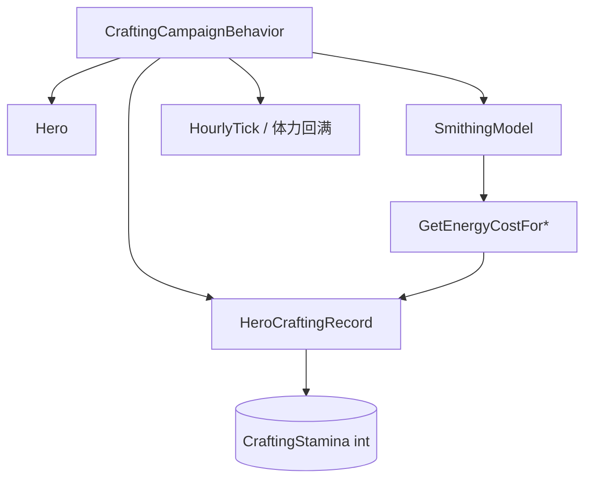

# HeroCraftingRecord

**命名空间:** `TaleWorlds.CampaignSystem.CampaignBehaviors`  
**模块:** `TaleWorlds.CampaignSystem`  
**类型:** `internal class HeroCraftingRecord`（嵌套定义于 `CraftingCampaignBehavior` 内部，非 `MBObjectBase` 派生）  
**基类:** 无  
**源文件:** `bin/TaleWorlds.CampaignSystem/TaleWorlds.CampaignSystem.CampaignBehaviors/CraftingCampaignBehavior.cs`

## 概述

`HeroCraftingRecord` 是锻造系统为**单个英雄**维护的极简数据载体，它只承载一个 `int` 字段 `CraftingStamina`，即英雄当前可用的“锻造体力”。当你在铁匠铺精炼材料、熔炼装备或自由打造武器时，游戏按 `SmithingModel` 给出的能量消耗从该字段扣减；英雄待在据点内时，`CraftingCampaignBehavior` 的小时 tick 又按锻造技能与 Athletics 专长征用速率把它回满。它本身不计算任何规则，只是挂在 `CraftingCampaignBehavior` 私有字典 `_heroCraftingRecords` 上的“每个英雄一份”的可序列化状态。

## 心智模型

把它想成**英雄锻造能量的个人账户**：账户本身不会算账，只存一个余额 `CraftingStamina`。账户由 `CraftingCampaignBehavior` 在第一次读取/写入某英雄体力时才懒创建（`GetRecordForCompanion`：字典里没有就 `new HeroCraftingRecord(GetMaxHeroCraftingStamina(hero))`，并以满体力开户），随后一直由该 Behavior 持有，并不挂在 `Hero` 身上，也不对 mod 直接公开——外部只能经 `CraftingCampaignBehavior` 的 `GetHeroCraftingStamina` / `SetHeroCraftingStamina` / `GetMaxHeroCraftingStamina` 间接读写。上限不是存在记录里，而是每次按 `100 + 锻造技能*0.5` 实时重算；回满与扣减都夹在 `[0, max]` 之间（`SetHeroCraftingStamina` 向下夹到 0，小时 tick 向上夹到 max）。记录整体随战役存档序列化（`SyncData("_heroCraftingRecordsNew", ...)`，字段本身标 `[SaveableField(10)]`），因此读档后英雄的体力会原样恢复。它属于 Campaign 层经济状态，不是 Model 决策、也不是 Behavior 逻辑本身；想改世界状态（扣体力、结算锻造）应走 `CraftingCampaignBehavior` 的锻造入口，而非直接改这条记录。

## 何时使用 / 何时不要使用

- **用：** 通过 `CraftingCampaignBehavior` 查询或设定某英雄的当前锻造体力，例如 UI 显示体力条、或自定义锻造结算时按 `SmithingModel` 的能耗调 `SetHeroCraftingStamina`。
- **用：** 只读理解“英雄还能锻几把”——`GetHeroCraftingStamina(hero)` 与 `GetMaxHeroCraftingStamina(hero)` 配合即可。
- **不要直接 new / 改这个对象：** 它是 `internal` 且由 Behavior 私有的字典持有；自己 `new HeroCraftingRecord(...)` 或改 `CraftingStamina` 字段不会进入存档字典，也不会触发体力上限与回满逻辑。
- **不要把它当 Hero 属性访问：** 1.4.5 中体力不挂在 `Hero` 上，必须经 `CraftingCampaignBehavior` 取。
- **不要在 Mission 层持久保存体力：** 体力是 Campaign 经济状态，战场/场景层不应读写它；且小时 tick 只在英雄 `CurrentSettlement != null` 时回满。

## 依赖图



### 上游与持有者

- [CraftingCampaignBehavior](../CraftingCampaignBehavior)：唯一持有 `_heroCraftingRecords` 字典的 Behavior，负责开户、扣减、回满与序列化。
- [Hero](../Hero)：记录的 key；只有 `CurrentSettlement != null`（待在据点）的英雄才会被小时 tick 回满体力。
- [Campaign](../Campaign)：提供 `Campaign.Current.GetCampaignBehavior<CraftingCampaignBehavior>()` 与 `Campaign.Current.Models.SmithingModel`，是获取记录的入口与能耗来源。
- [MBObjectBase](../../core/MBObjectBase)：本类型虽非其派生，但同文件登记了它的存档定义（`AddClassDefinition(typeof(HeroCraftingRecord), 20)`）。

### 下游与变更入口

- [SmithingModel](../SmithingModel)：`GetEnergyCostForRefining` / `GetEnergyCostForSmelting` / `GetEnergyCostForSmithing` 决定每次锻造动作扣多少体力。
- [Crafting](../Crafting)：精炼公式等锻造类型，配合 Behavior 的 `DoRefinement` / `DoSmelting` / `CreateCraftedWeapon*` 消费体力。
- [CraftingOrder](../CraftingOrder) 与 [CraftedItemInitializationData](../CraftedItemInitializationData)：同文件的订单与成品初始化数据，与体力扣除同处锻造流程。

## 风险

- **内部私有、懒开户：** 记录由 `GetRecordForCompanion` 懒创建；在英雄第一次被读写体力前，`_heroCraftingRecords` 里没有它的条目。自行缓存 `HeroCraftingRecord` 引用无意义——它只在 Behavior 字典内有效。
- **上限实时计算、不持久化：** `CraftingStamina` 字段本身不设上限，max 由 `GetMaxHeroCraftingStamina` 每次按技能重算。直接把字段写到超过 max 的值虽不会被立刻纠正，但下一小时 tick 会被夹回 max。
- **手工改字段不进存档字典：** 因为 `_heroCraftingRecords` 是私有的，你拿不到记录引用；唯一受支持的写入是 `SetHeroCraftingStamina`，它通过 `MathF.Max(0, value)` 夹下限并写回字典内实例。误用 `new` 出来的副本只是改了个临时对象。
- **Mission 层访问 Campaign 状态：** 体力是 Campaign 经济数据；在 Mission / 场景逻辑里读写它既绕过了小时 tick，也无对应英雄据点上下文，可能读到陈旧或全满的初值。
- **回满依赖据点停留：** `HourlyTick` 仅当 `hero.CurrentSettlement != null` 才回血。随军移动、被俘或不在据点的英雄体力不会自然恢复，UI 与平衡逻辑要预期这点。
- **存档键是 `_heroCraftingRecordsNew`：** 序列化键名为 `_heroCraftingRecordsNew`（非字段名），跨版本读档迁移逻辑会按此键处理；自定义 Behavior 不要复用同名键以免冲突。

## 成员说明

### 状态字段

| 成员 | 用途、副作用与时机 |
| --- | --- |
| `CraftingStamina`（`public int`，`[SaveableField(10)]`） | 英雄**当前**的锻造体力余额——锻造系统唯一持久化的字段。它是精炼/熔炼/打造的“燃料”：每次此类动作消耗 `SmithingModel` 给出的能量成本，英雄待在据点时按小时回满。下限 0、上限由 `GetMaxHeroCraftingStamina` 实时计算（100 + 锻造技能×0.5），字段本身不夹上限，夹值由 `SetHeroCraftingStamina` 与小时 tick 负责。 |

### 构造与内部

| 成员 | 用途、副作用与时机 |
| --- | --- |
| `HeroCraftingRecord(int maxStamina)` | 构造函数，把 `CraftingStamina` 直接初始化为传入的 `maxStamina`（通常来自 `GetMaxHeroCraftingStamina(hero)`）。因此 `GetRecordForCompanion` 懒开户时，记录以**满体力**进入字典。对 mod 不可直接调用（类型 `internal`）。 |
| `AutoGeneratedGetMemberValueCraftingStamina` / `AutoGeneratedStaticCollectObjectsHeroCraftingRecord` | 自动生成的存档反射辅助方法，供 `SaveableField` 序列化读取字段值、收集引用对象；不应在游戏逻辑中调用。 |

> 注意：记录对外没有公开方法。所有读写都经由 `CraftingCampaignBehavior`：
> - `GetHeroCraftingStamina(Hero)` → 返回 `GetRecordForCompanion(hero).CraftingStamina`（懒开户后读余额）。
> - `SetHeroCraftingStamina(Hero, int)` → 写 `MathF.Max(0, value)`，向下夹到 0。
> - `GetMaxHeroCraftingStamina(Hero)` → 返回 `100 + round(锻造技能×0.5)`，即体力上限。

## 真实示例

### 读取某英雄的当前体力与上限

```csharp
using TaleWorlds.CampaignSystem;
using TaleWorlds.CampaignSystem.CampaignBehaviors;

// 经 Campaign 拿到锻造 Behavior（唯一正确入口）
CraftingCampaignBehavior crafting = Campaign.Current.GetCampaignBehavior<CraftingCampaignBehavior>();

Hero hero = Hero.MainHero; // 任意可锻造英雄
int stamina = crafting.GetHeroCraftingStamina(hero);   // 当前余额
int max = crafting.GetMaxHeroCraftingStamina(hero);    // 100 + 锻造技能 * 0.5

// 体力不足时禁止锻造，避免扣到负数（SetHeroCraftingStamina 会夹到 0）
bool canForge = stamina >= max * 0.1f;
```

### 自定义锻造结算时按能耗扣减体力

```csharp
using TaleWorlds.CampaignSystem;
using TaleWorlds.CampaignSystem.CampaignBehaviors;

CraftingCampaignBehavior crafting = Campaign.Current.GetCampaignBehavior<CraftingCampaignBehavior>();
Hero hero = Hero.MainHero;

// 取得本次精炼/熔炼/打造的真实能耗（来自 SmithingModel，游戏内同名方法亦如此扣减）
int cost = Campaign.Current.Models.SmithingModel.GetEnergyCostForRefining(ref refineFormula, hero);

// 等价游戏内 DoRefinement 内部的做法：用支持夹下限的入口写回
crafting.SetHeroCraftingStamina(hero, crafting.GetHeroCraftingStamina(hero) - cost);
```

`GetHeroCraftingStamina` / `SetHeroCraftingStamina` 内部都走 `GetRecordForCompanion`，因此即便该英雄此前从未锻造过，也会自动以满体力开户后再读/写，调用方无需关心记录是否存在。

## 版本注记

本页以 v1.4.5 `bin/TaleWorlds.CampaignSystem/TaleWorlds.CampaignSystem.CampaignBehaviors/CraftingCampaignBehavior.cs` 中 `HeroCraftingRecord` 及其周边（`_heroCraftingRecords` 字典、`HourlyTick`、`GetRecordForCompanion`、`Get/SetHeroCraftingStamina`、`SyncData`）源码为准。跨版本使用时重新确认：体力上限公式、小时回满是否仍要求 `CurrentSettlement != null`、以及存档键名 `_heroCraftingRecordsNew`。

## 导航

- ↑ 父级：[Campaign API](../)
- ↔ 同级/相关：[CraftingCampaignBehavior](../CraftingCampaignBehavior) · [SmithingModel](../SmithingModel) · [Hero](../Hero) · [Crafting](../Crafting) · [CraftingOrder](../CraftingOrder) · [CraftedItemInitializationData](../CraftedItemInitializationData) · [Settlement](../Settlement) · [Campaign](../Campaign)
- 跨层：[MBObjectBase](../../core/MBObjectBase)
