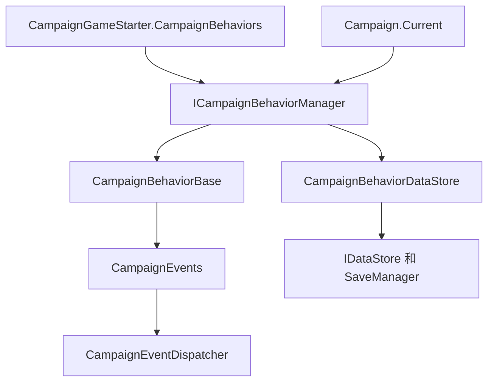

# ICampaignBehaviorManager

**Namespace:** `TaleWorlds.CampaignSystem`
**Module:** `TaleWorlds.CampaignSystem`
**Type:** `public interface ICampaignBehaviorManager`
**Base:** 无
**File:** `bin/TaleWorlds.CampaignSystem/TaleWorlds.CampaignSystem/ICampaignBehaviorManager.cs`

## 一句话职责

`ICampaignBehaviorManager` 暴露活动的 Campaign 行为集合：查找行为、控制运行时增删，并提供读档和注册事件所需的生命周期入口。

它还把行为查找、监听器注册、运行时清理和 `SyncData` 数据恢复连接到 `Campaign.Current`，但不替代 `CampaignGameStarter` 的长期注册职责，也不应脱离当前 Campaign 实例单独缓存。

## 概述

这个接口把 Campaign 持有的行为列表投影给 mod：调用者可以从 `Campaign.Current` 查找行为，或在明确的运行时边界增删行为；真正的创建、读档、事件注册和存档前收集由 `Campaign` 与默认 `CampaignBehaviorManager` 编排。长期行为仍应通过 `CampaignGameStarter` 进入 starter 集合，避免只在当前实例存在而在下一次读档时消失。

它提供的是运行时操作面，不是替代 `CampaignGameStarter` 的全局注册表。读取、增加和移除都必须发生在 Campaign 已经初始化且仍由当前游戏持有的阶段；持久行为的类型、行为 ID、事件注册和 `SyncData` 字段必须在每次新战役与读档时保持一致。

## 心智模型

把它理解为 **`Campaign` 与 `CampaignBehaviorBase` 之间的运行时桥**，而不是正常的启动注册点。[`Campaign`](../Campaign) 通过 `Campaign.Current.CampaignBehaviorManager` 持有它；默认实现是 [`CampaignBehaviorManager`](../CampaignBehaviorManager)，内部保存 `CampaignBehaviorBase` 列表和行为存档数据仓库。

新战役中，`Campaign` 用 [`CampaignGameStarter.CampaignBehaviors`](../CampaignGameStarter) 创建 manager。读档中，manager 先替换行为列表，再调用 `LoadBehaviorData()`，最后调用 `RegisterEvents()`。顺序不可调换：监听器第一次收到事件时必须已经看到还原的字段。运行时新增行为会立即注册事件，但不会自动经历历史存档数据的加载阶段。

## 何时用，何时不用

**适合使用：**

- 从活动战役查找行为，而不绑定到具体 manager 实现。
- 安装一个临时的运行时 `CampaignBehaviorBase`，或移除一个必须解除监听器的行为。
- 理解有持久状态的行为为何必须遵守“先加载、后注册”的边界。

**不适合使用：**

- 注册要长期存在的 mod 行为时。使用 [`CampaignGameStarter.AddBehavior`](../CampaignGameStarter)，让新战役和读档的 starter 都带上它。
- 把生命周期方法当作手动刷新入口。`InitializeCampaignBehaviors`、`LoadBehaviorData` 和 `RegisterEvents` 由 `Campaign` 按顺序调用。
- 把 `ClearBehaviors()` 当作普通卸载。它只清列表，不会让 dispatcher 逐个移除行为监听器；单个运行时功能应使用 `RemoveBehavior<T>()`。

## 接口成员与调用时机

### 注册与读档

- `RegisterEvents()` 调用当前每个行为的 `RegisterEvents()`。读档时由 `Campaign` 在行为数据加载之后调用；`AddBehavior` 也会立刻调用新行为的方法。
- `InitializeCampaignBehaviors(IEnumerable<CampaignBehaviorBase> inputComponents)` 用 starter 集合替换 manager 的行为列表，并重新挂接存档前监听器。这是战役读档/重初始化边界，不是任意修改列表的扩展点。
- `LoadBehaviorData()` 让 manager 的 [`CampaignBehaviorDataStore`](../CampaignBehaviorDataStore) 对每个行为调用 `SyncData(IDataStore)`，完成后清理临时记录。

### 查找

- `GetBehavior<T>()` 返回第一个可赋给 `T` 的行为；找不到时返回 `default(T)`，引用类型必须检查 `null`。
- `GetBehaviors<T>()` 返回当前集合中所有可赋给 `T` 的行为。可能存在多个实现时使用它；不要把返回顺序当成公开优先级契约。

### 运行时变更

- `AddBehavior(CampaignBehaviorBase campaignBehavior)` 追加行为并立刻调用它的 `RegisterEvents()`。适合明确的临时运行时功能；不会把旧存档数据自动加载到新实例。
- `RemoveBehavior<T>()` 移除一个匹配的行为，并要求 `CampaignEventDispatcher` 移除该行为的监听器，是单个功能的正常清理路径。
- `ClearBehaviors()` 只清空内部集合。默认实现不会为每个行为解除监听，因此只适合引擎控制的重建/清理边界，不适合作为普通 mod 功能关闭操作。

## 依赖关系与存档边界



- **持有者：** [`Campaign`](../Campaign) 创建、暴露并编排 manager 生命周期。
- **输入：** [`CampaignGameStarter`](../CampaignGameStarter) 为新战役和读档提供稳定的行为集合。
- **行为契约：** [`CampaignBehaviorBase`](../CampaignBehaviorBase) 提供 `RegisterEvents`、`StringId` 和 `SyncData`；接口本身不增加存档字段。
- **事件链：** [`CampaignEvents`](../CampaignEvents) 与 [`CampaignEventDispatcher`](../CampaignEventDispatcher) 接收和移除行为拥有的监听器。
- **存档链：** [`CampaignBehaviorDataStore`](../CampaignBehaviorDataStore) 在 manager 的存档回调中通过 `SyncData(IDataStore)` 序列化行为数据；[`SaveManager`](../../save-system/SaveManager) 负责更大的存档对象图。

## 真实获取与运行时示例

从活动 Campaign 获取接口，并显式处理行为不存在的情况：

```csharp
using TaleWorlds.CampaignSystem;

ICampaignBehaviorManager manager = Campaign.Current.CampaignBehaviorManager;
ModCampaignBehavior behavior = manager.GetBehavior<ModCampaignBehavior>();
if (behavior != null)
{
    behavior.RecordObservation();
}
```

对于明确的临时功能，使用 manager 的运行时变更契约，并在条件结束时按类型移除：

```csharp
ICampaignBehaviorManager manager = Campaign.Current.CampaignBehaviorManager;
var temporaryBehavior = new TemporaryCampaignBehavior();
manager.AddBehavior(temporaryBehavior);

// 功能条件结束后：
manager.RemoveBehavior<TemporaryCampaignBehavior>();
```

长期行为仍应通过 `CampaignGameStarter` 加入；运行时 `AddBehavior` 会立即注册事件，但不会把旧的 `SyncData` 记录重新加载到新实例。

## 风险与崩溃/坏档边界

- Campaign 初始化前、菜单中或 Campaign teardown 后，`Campaign.Current` 和 manager 都不可用。不要跨 Campaign 实例缓存这个接口。
- 调换 `LoadBehaviorData()` 与 `RegisterEvents()` 顺序，会让回调先看到默认字段，在存档状态恢复前重复执行世界变更。
- 手动调用 `RegisterEvents()`，或重复添加同一实例，会让监听器重复注册，使每日或定居点回调执行多次。
- `AddBehavior` 只接受 `CampaignBehaviorBase`；没有稳定 `StringId`/`SyncData` 的运行时行为不适合作为持久功能。需要跨存档存在时，应从 starter 安装并保持 schema 稳定。
- 默认实现的 `ClearBehaviors()` 不会移除 dispatcher 监听器，旧回调仍可能对 manager 已不再持有的对象执行。
- `GetBehavior<T>()` 可能返回 `null`；战役切换阶段直接解引用是常见空引用边界。允许多个实现时应使用 `GetBehaviors<T>()`。

## 导航

- ↑ 父级：[Campaign API](./)
- ↔ 同级：[CampaignBehaviorBase](../CampaignBehaviorBase) · [CampaignBehaviorManager](../CampaignBehaviorManager) · [CampaignGameStarter](../CampaignGameStarter)
- 相关：[Campaign](../Campaign) · [ICampaignBehavior](../ICampaignBehavior) · [CampaignEvents](../CampaignEvents) · [CampaignBehaviorDataStore](../CampaignBehaviorDataStore) · [SaveManager](../../save-system/SaveManager)
- 中文/English：[ICampaignBehaviorManager](../../../../en/api/campaign/ICampaignBehaviorManager)
