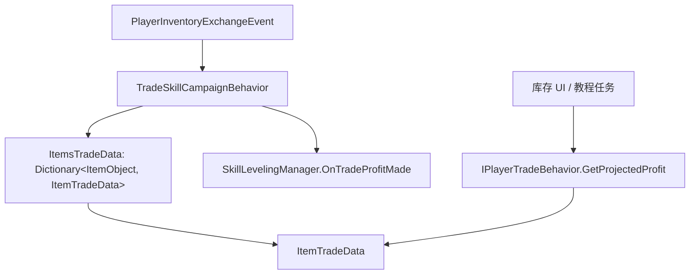

# ItemTradeData

**命名空间：** `TaleWorlds.CampaignSystem.CampaignBehaviors`
**模块：** `TaleWorlds.CampaignSystem`
**类型：** `internal struct ItemTradeData`
**源文件：** `bin/TaleWorlds.CampaignSystem/TaleWorlds.CampaignSystem.CampaignBehaviors/TradeSkillCampaignBehavior.cs`

## 概述

`ItemTradeData` 是 `TradeSkillCampaignBehavior` 为玩家逐物品（以 `ItemObject` 为键、忽略 `ItemModifier`）维护的一张“买入账本”。每条记录保存该物品历史上买入时累加得到的滚动均价（`AveragePrice`）以及玩家当前仍持有、尚未卖出的累计数量（`NumItemsPurchased`）。它不是市场物价，而是玩家个人的持仓成本账：买得更便宜时均价被拉低，卖出时按“卖价 − 均价”估算交易利润，进而驱动交易技能经验结算与 `OnPlayerTradeProfit` 事件。

## 心智模型

把 `ItemTradeData` 当作 `TradeSkillCampaignBehavior` 私有字典 `Dictionary<ItemObject, ItemTradeData>`（`ItemsTradeData`）里的一条【持仓成本】记录。它由 Behavior 在收到 `CampaignEvents.PlayerInventoryExchangeEvent`（玩家买卖）时，通过 `RecordPurchases` / `RecordSales` 新建 `ItemTradeData(滚动均价, 剩余数量)` 整体替换旧条目来更新——两个字段都是 `readonly`，所以不存在“就地改一个字段”的写法，只能以新结构体替换。它本身不计算规则、不参与买卖决策，只是 Campaign 层的状态载体，随战役通过 `[SaveableField]` 标签与 `SyncData("ItemsTradeData", ...)` 持久化；读档后由 `TradeSkillCampaignBehaviorTypeDefiner`（`SaveableTypeDefiner`，id 150794）负责重建结构体与字典容器。需要交易利润预测或交易经验时，应走 `IPlayerTradeBehavior.GetProjectedProfit`（它内部读取 `AveragePrice`），而绝不要自己 new 一份 `ItemTradeData` 当作世界状态来写。

## 何时使用 / 何时不要使用

- **用：** 想知道玩家持有某物品的加权买入成本、估算“现在卖出能赚多少”、或统计某物品尚未售出的持仓量。
- **用：** 通过 `GetProjectedProfit(itemRosterElement, itemCost)` 给买卖建议、库存 UI 着色与教程提示——游戏内置的库存界面与教程任务都走这条公开接口。
- **不要当行情：** 它只反映玩家自己的买入历史，不是 `Town` / `Settlement` 的市场物价，也不含带 `ItemModifier` 的物品（这类在 `ProcessPurchases` / `ProcessSales` 中被跳过）。
- **不要直接改：** `AveragePrice` / `NumItemsPurchased` 是只读字段，且 `ItemTradeData` 是值类型；更新只能由 Behavior 在交易事件中替换字典条目，外部拿到的副本与字典内条目互不影响。
- **不要进 Mission：** 这是 Campaign 层经济数据，买卖事件只在地图交易时派发；在 Mission 层访问活动 Campaign 未建立时可能拿不到行为实例。

## 依赖图



### 上游与持有者

- [TradeSkillCampaignBehavior](../TradeSkillCampaignBehavior) 是唯一创建与持有 `ItemsTradeData` 的地方：在战役开始时 `new` 出空字典，并在玩家买卖事件中读写其中每条 `ItemTradeData`。
- [CampaignEvents](../CampaignEvents) 的 `PlayerInventoryExchangeEvent` 是触发账本更新的入口；`PlayerInventoryUpdated` 监听它，分别调用 `ProcessPurchases` / `ProcessSales`。
- [MobileParty](../MobileParty)（`MobileParty.MainParty`）的物品栏在非交易性出售时用来核对玩家是否仍持有该物品，从而决定扣减还是移除账本条目。

### 下游与消费方

- [ItemRoster](../ItemRoster) 提供 `ItemRosterElement`，其 `EquipmentElement.Item`（`ItemObject`）正是字典的键；账本只对无 `ItemModifier` 的元素记账。
- [SkillLevelingManager](../SkillLevelingManager) 接收 `OnTradeProfitMade(PartyBase.MainParty, profit)`，把账本算出的交易利润转成交易技能经验；同时 `CampaignEventDispatcher.Instance.OnPlayerTradeProfit` 对外广播。
- 库存 UI 与教程任务通过 `IPlayerTradeBehavior.GetProjectedProfit` 读取 `AveragePrice` 估算盈利，是 `ItemTradeData` 在玩法层最主要的“只读”消费者。

## 风险

- **创建 / 持有时机：** `ItemsTradeData` 由 Behavior 在战役启动时初始化为空字典；首次见到某物品前 `TryGetValue` 失败，按 `default(ItemTradeData)`（均价 0、数量 0）处理。意味着没有买入记录时 `GetProjectedProfit` 直接返回 0。
- **只读值类型：** `AveragePrice` / `NumItemsPurchased` 均带 `readonly`，且结构体是值类型。任何“更新”都是 `new ItemTradeData(...)` 替换字典条目，写入后旧副本不变；不要在拿到结构体后试图修改其字段。
- **存档与加载顺序：** 字段经 `[SaveableField(10)]` / `[SaveableField(20)]` 序列化，字典经 `SyncData("ItemsTradeData", ref ItemsTradeData)` 持久化，并由 `TradeSkillCampaignBehaviorTypeDefiner`（`SaveableTypeDefiner`，id 150794）注册结构体与 `Dictionary<ItemObject, ItemTradeData>` 容器定义。跨版本改动字段编号或容器会破坏旧档。
- **Campaign 层 vs Mission 层：** 这是地图经济状态，买卖事件只在 Campaign 交易时派发；Mission 内没有活动 Campaign 或行为实例时调用 `GetProjectedProfit` 会得到 null 行为或 0 结果。
- **别把它当世界状态写：** 真要改变所有权、物价或技能结算，应走对应的 Action / Behavior（如 `ChangeOwnerOfSettlementAction`、各 Settlement Model），而不是 new 一个 `ItemTradeData` 当作可写状态。
- **键忽略修饰：** 字典以 `EquipmentElement.Item`（`ItemObject`）为键，带 `ItemModifier` 的物品在 `ProcessPurchases` / `ProcessSales` 中被跳过，永远不会进入账本。

## 成员说明

### 数据字段

| 成员 | 用途、副作用与时机 |
| --- | --- |
| `AveragePrice` | 玩家历史买入该物品的【滚动加权均价】（单位价格）。新买入时按 `(旧均价 × 旧数量 + 本批总价) / (旧数量 + 本批数量)` 更新；它是 `GetProjectedProfit` 估算“现在卖出能赚多少”的成本基准，也是交易利润 `卖价 − 均价` 的减数。 |
| `NumItemsPurchased` | 玩家仍持有、尚未售出的累计买入数量。卖出时按售出量扣减，归零即把该物品从 `ItemsTradeData` 移除；它是“还有多少持仓可计入交易利润”的计数器，决定 `RecordSales` 中可结算利润的数量上限。 |

### 构造与序列化

| 成员 | 用途、副作用与时机 |
| --- | --- |
| `ItemTradeData(float averagePrice, int numItemsPurchased)` | 唯一构造入口；两个字段 `readonly`，所以更新账本只能新建结构体替换字典条目，而不能就地改值。负值或 0 数量由调用方（如 `RecordSales`）处理为移除或扣减。 |
| `AutoGeneratedStaticCollectObjectsItemTradeData` / `AutoGeneratedInstanceCollectObjects` | 由 `[SaveableField]` 自动生成的存档反射脚手架：把结构体纳入 `SaveManager` 的对象图以便序列化。它们不是游戏逻辑 API，运行时不要调用。 |
| `AutoGeneratedGetMemberValueAveragePrice` / `AutoGeneratedGetMemberValueNumItemsPurchased` | 自动生成的字段读取器，供存档系统读回 `AveragePrice` / `NumItemsPurchased`。同样属于序列化基础设施，不是玩法接口。 |

## 示例

### 通过公开接口读取某物品的预估买入均价（库存 UI 做法）

```csharp
using TaleWorlds.CampaignSystem;
using TaleWorlds.CampaignSystem.Inventory;

// 库存 UI 通过 IPlayerTradeBehavior 读取该物品预估买入均价，估算卖出利润
IPlayerTradeBehavior tradeBehavior = Campaign.Current.GetCampaignBehavior<IPlayerTradeBehavior>();
if (tradeBehavior != null)
{
    // itemRosterElement 来自当前交易栏；itemCost 为本次要卖的单价成本
    int projectedProfit = tradeBehavior.GetProjectedProfit(itemRosterElement, itemCost);
    // projectedProfit > 0 表示预估可盈利；内部取 ItemsTradeData[item].AveragePrice 作为成本基准
}
```

`GetProjectedProfit` 的内部逻辑是 `itemCost - MathF.Round(AveragePrice)`：只有当玩家账本里存在该物品（且不含 `ItemModifier`）时才返回正值，否则返回 0。不要绕过接口直接 new 结构体。

### 玩家买入后账本的滚动更新（源码等价逻辑）

```csharp
// 玩家买入后，TradeSkillCampaignBehavior 用滚动均价刷新该物品的 ItemTradeData
//（ItemsTradeData 为 Behavior 私有字典，下列为其等价处理）
if (!ItemsTradeData.TryGetValue(itemRosterElement.EquipmentElement.Item, out var prior))
    prior = default(ItemTradeData);            // AveragePrice = 0, NumItemsPurchased = 0

int totalCount = prior.NumItemsPurchased + itemRosterElement.Amount;
float avg = (prior.AveragePrice * prior.NumItemsPurchased + totalPrice)
            / MathF.Max(0.0001f, (float)totalCount);

// 字段只读：只能以新结构体替换字典中的条目
ItemsTradeData[itemRosterElement.EquipmentElement.Item] = new ItemTradeData(avg, totalCount);
```

注意 `EquipmentElement.Item` 是字典键（忽略 `ItemModifier`），且 `default(ItemTradeData)` 只在首次见到该物品时作为零值起点；真实代码还会在卖出时按 `NumItemsPurchased` 扣减或移除条目。

## 参见

- ↑ 父级：[Campaign API 索引](../)
- ↔ 相关：[TradeSkillCampaignBehavior](../TradeSkillCampaignBehavior) · [CampaignEvents](../CampaignEvents) · [MobileParty](../MobileParty) · [ItemRoster](../ItemRoster) · [SkillLevelingManager](../SkillLevelingManager) · [Settlement](../Settlement) · [Town](../Town) · [PartyBase](../PartyBase)
