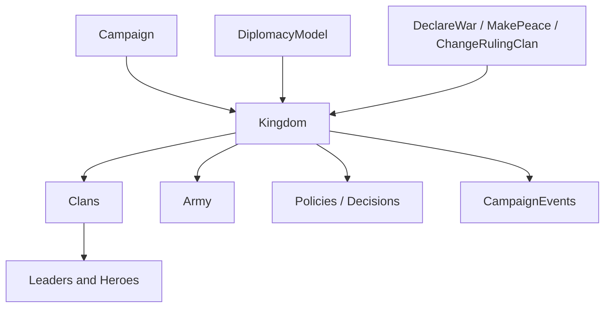

# Kingdom

**命名空间:** `TaleWorlds.CampaignSystem`  
**模块:** `TaleWorlds.CampaignSystem`  
**类型:** `public sealed class Kingdom : MBObjectBase, IFaction`  
**基类:** [MBObjectBase](../../core/MBObjectBase)  
**源文件:** `bin/TaleWorlds.CampaignSystem/TaleWorlds.CampaignSystem/Kingdom.cs`

## 一句话职责

`Kingdom` 是组织多个 `Clan` 的战略政治容器，持有统治家族、政策、军队和待决议案，并作为外交关系的阵营节点。它适合用来读取国家级政治状态和外交关系；创建、换统治家族、宣战、议和或解散王国时，必须使用相应的管理器或 Action，让成员、战争关系和事件级联保持一致。

## 心智模型

### 它是什么

王国不是一个“更大的 Clan”字段，而是一个拥有成员家族和制度状态的 IFaction。`Clans` 是成员家族，`RulingClan` 是统治者，`Armies` 是临时组织的军队，`ActivePolicies` 与 `UnresolvedDecisions` 是政治流程的输入/输出。王国的 `Settlements`、`Heroes` 和 `WarParties` 多由其家族和派对关系派生，不应自己维护第二份列表。

`Kingdom.All` 从当前 [Campaign](../Campaign) 返回全部王国。初始化由 [KingdomManager](../KingdomManager) 和 `InitializeKingdom` 完成；它不是让 mod 直接 `new Kingdom()` 后写几个属性就能得到的完整世界对象。

### 生命周期与持有关系

- **创建/加入：** `KingdomManager.CreateKingdom` 负责创建、注册、初始化文本/旗帜/政策，并通过 `ChangeKingdomAction` 接收创始家族。
- **运行中：** 王国持有 `Clan`、军队、政策和决策；`Clan.Kingdom`、`Hero.MapFaction`、`Settlement.MapFaction` 与 `MobileParty.MapFaction` 反向连接地图实体。
- **统治者变化：** `RulingClan` setter 只是局部赋值；换统治家族应使用 [ChangeRulingClanAction](../../campaign-ext/ChangeRulingClanAction)，让事件和相关缓存同步。
- **终结：** [DestroyKingdomAction](../../campaign-ext/DestroyKingdomAction) 会处理成员家族、战争关系和王国事件；不要遍历 `Clans` 自己逐个删掉来模拟王国毁灭。

### 何时用，何时不用

- **使用：** 读取一个家族的政治容器、成员家族、统治者、政策、军队、决策和外交状态。
- **使用：** 通过 `Kingdom.All` 或 `Clan.PlayerClan.Kingdom` 获取已注册王国；访问玩家家族前先检查 `Clan.PlayerClan` 和 `Kingdom`。
- **不要用 Kingdom 代替外交 Action：** 宣战用 [DeclareWarAction](../../campaign-ext/DeclareWarAction)，议和用 [MakePeaceAction](../../campaign-ext/MakePeaceAction)；Model 只计算评分，不提交关系。
- **不要直接写 `RulingClan`、`Clans` 或政策列表：** 这些集合和事件由专门流程维护，直接写会让 UI、家族、领地和外交缓存分叉。
- **不要在没有 Campaign 的模块加载阶段访问 `Kingdom.All`：** 静态集合依赖 `Campaign.Current`。

## 依赖图



### 上游

- [Campaign](../Campaign) 提供 `Kingdoms` 集合和当前模型；`Kingdom.All` 只能在运行中的 Campaign 使用。
- [Clan](../Clan) 是王国的成员单位，带来领袖、领地、军队和派对；家族可以合法地没有 Kingdom。
- [DiplomacyModel](../DiplomacyModel) 与 `GameModels` 提供外交评分和规则，王国本身不负责计算所有战争理由。

### 下游

- [CampaignEvents](../CampaignEvents) 发布王国创建、毁灭、统治家族、政策和决策事件；行为应订阅这些生命周期事件。
- [KingdomManager](../KingdomManager) 和 [KingdomDecision](../KingdomDecision) 负责组装和决策对象；[Army](../Army) 负责王国军队的临时派对集合。
- [DeclareWarAction](../../campaign-ext/DeclareWarAction)、[MakePeaceAction](../../campaign-ext/MakePeaceAction)、[ChangeRulingClanAction](../../campaign-ext/ChangeRulingClanAction) 和 [DestroyKingdomAction](../../campaign-ext/DestroyKingdomAction) 承担状态级联。

## 关键成员与调用时机

### 成员、领土和外交

| 成员 | 用途、副作用与时机 |
| --- | --- |
| `Clans`、`RulingClan` | 读取成员家族和统治家族。成员列表受加入/离开流程维护；`RulingClan` 变化必须由 Action 提交。 |
| `Armies` | 读取当前王国军队。军队可能在地图事件、解散或领袖死亡后消失，不要把它当作长期编制。 |
| `All` | 遍历当前 Campaign 的王国集合；枚举期间执行毁灭或加入操作前应先复制筛选结果。 |
| `FactionsAtWarWith`、`IsAtWarWith` | 查询外交状态。只读查询不广播变化，宣战/议和要用对应 Action。 |

### 政策、决策和创建

| 成员 | 用途、副作用与时机 |
| --- | --- |
| `ActivePolicies` | 读取已启用的政策。政策添加/移除应经过政策或决策流程，不能直接修改列表。 |
| `UnresolvedDecisions`、`AddDecision` | 读取和提交待决议案。`AddDecision` 通常会消耗支持家族的影响力并触发事件；只有在 Campaign 已完成初始化时调用。 |
| `CreateArmy` | 按领袖、目标据点和军队类型组织军队；源码要求领袖可用且拥有派对，调用前先检查 `Hero` 和 `MobileParty` 状态。 |
| `CreateKingdom`、`InitializeKingdom` | 低层创建/初始化入口。一般 mod 应使用 `KingdomManager` 或已有王国流程，不要只调用初始化方法后自行补副作用。 |

## Action、事件与 Model 边界

| 目标 | 正确入口 | 不能用什么替代 |
| --- | --- | --- |
| 宣战 | `DeclareWarAction.ApplyByDefault` 或匹配原因的 Apply | 不要直接改 faction stance 或 `FactionsAtWarWith`。 |
| 议和 | `MakePeaceAction.Apply` 的匹配入口 | 不要从集合中移除敌对阵营。 |
| 更换统治家族 | `ChangeRulingClanAction.Apply` | 不要只赋值 `RulingClan`，那不会完整发布统治家族事件。 |
| 创建/加入王国 | `KingdomManager.CreateKingdom`、`ChangeKingdomAction` | 不要把 `Kingdom.CreateKingdom` 当作完整加入流程。 |
| 计算战争评分 | `Campaign.Current.Models.DiplomacyModel` | Model 只返回分数/理由，不会宣战。 |

## 风险边界

- **空王国和空统治者：** 叛乱、销毁和读档中间态可能让 `Kingdom`、`RulingClan` 或某个 `Clan.Kingdom` 暂时为空；读取领袖或领地前判空。
- **直接改 `RulingClan`：** 只做局部 setter，不会替代领袖变化事件和继承逻辑，可能造成 UI 与外交状态不同步。
- **决策时机：** `AddDecision` 会影响影响力和事件队列；不要在存档 `SyncData`、对象尚未注册或正在销毁时添加决策。
- **军队是短命关系：** `Army`、`MobileParty` 和领袖状态会在地图事件或死亡后改变，回调中不要保存旧军队实例作为永久状态。
- **外交级联：** 宣战与议和会影响家族、领地、派对和可见地图对象；只能在正确 Campaign 阶段使用对应 Action。
- **存档加载：** 王国先重建集合，再回填家族和领地引用。自定义保存只保存稳定王国 StringId，并在加载完成后重新查找。

## 真实示例

### 从玩家家族取得王国并枚举成员

```csharp
using System.Linq;
using TaleWorlds.CampaignSystem;

Clan playerClan = Clan.PlayerClan;
Kingdom playerKingdom = playerClan?.Kingdom;

if (playerKingdom != null && !playerKingdom.IsEliminated)
{
    Clan strongestClan = playerKingdom.Clans
        .Where(clan => !clan.IsEliminated)
        .OrderByDescending(clan => clan.CurrentTotalStrength)
        .FirstOrDefault();
}
```

成员列表属于当前王国对象图，且 `playerKingdom` 可能在退盟或读档时变为 `null`；不要把结果保存成跨战役引用。

### 通过当前 Models 读取宣战评分

```csharp
using System.Linq;
using TaleWorlds.CampaignSystem;
using TaleWorlds.Localization;

if (Campaign.Current != null && Clan.PlayerClan?.Kingdom != null)
{
    Kingdom source = Clan.PlayerClan.Kingdom;
    Kingdom target = Kingdom.All.FirstOrDefault(
        kingdom => kingdom != source && !kingdom.IsEliminated);

    if (target != null)
    {
        TextObject reason;
        float score = Campaign.Current.Models.DiplomacyModel.GetScoreOfDeclaringWar(
            source, target, Clan.PlayerClan, out reason, includeReason: true);
    }
}
```

这段代码只读取当前装配的 `DiplomacyModel`；得到分数后仍须由游戏流程或相应 `DeclareWarAction` 提交世界变化。

## 版本注记

本页以 v1.4.5 的 `Kingdom.cs`、`KingdomManager.cs` 和外交/王国 Action 源码为准。跨版本 mod 应重新确认 `KingdomDecision`、军队创建参数和外交 Action 的原因枚举，不要把旧版本的直接 setter 行为当作完整 API。

## 导航

- ↑ 父级：[Campaign API](../)
- ↔ 同级：[Hero](../Hero) · [Clan](../Clan) · [Settlement](../Settlement) · [MobileParty](../MobileParty) · [PartyBase](../PartyBase)
- 子级/相关：[KingdomManager](../KingdomManager) · [KingdomDecision](../KingdomDecision) · [Army](../Army) · [CampaignEvents](../CampaignEvents) · [DiplomacyModel](../DiplomacyModel) · [DeclareWarAction](../../campaign-ext/DeclareWarAction) · [MakePeaceAction](../../campaign-ext/MakePeaceAction) · [ChangeRulingClanAction](../../campaign-ext/ChangeRulingClanAction)
