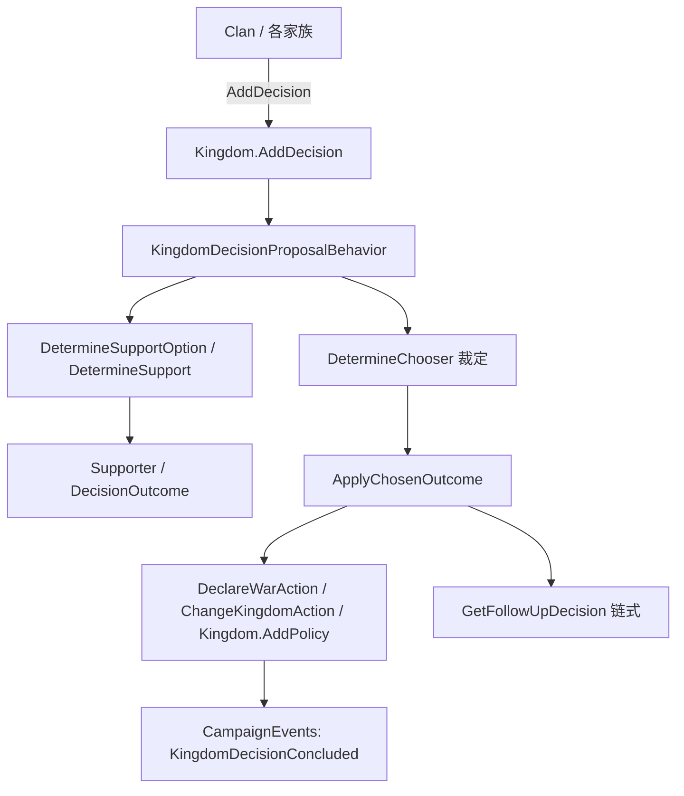

# KingdomDecision

**命名空间：** `TaleWorlds.CampaignSystem.Election`  
**模块：** `TaleWorlds.CampaignSystem`  
**类型：** `public abstract class KingdomDecision`  
**源文件：** `TaleWorlds.CampaignSystem/Election/KingdomDecision.cs`

## 概述

`KingdomDecision` 是王国（Kingdom）层面一切「议会决策」的抽象基类：宣战、议和、结盟、通过或废除政策、罢黜家族、推举新王、认领据点等全部走同一套选举流水线。它本身不持有业务数据，而是把一次决策需要回答的问题——谁能提、谁裁定、每个家族支持哪个结果、通过后要怎么改世界——抽象成一组必须由子类实现的虚/抽象成员；引擎在 `KingdomDecisionProposalBehavior` 的驱动下，按「提出 → 各家族表态（消耗影响力）→ 统治者/玩家裁定 → `ApplyChosenOutcome` 改世界 → 可能链式后续决策」的顺序推进。你通常不会 `new KingdomDecision` 本身，而是实现它的某个具体子类（如 [DeclareWarDecision](../../campaign-ext/DeclareWarDecision)、[KingdomPolicyDecision](../../campaign-ext/KingdomPolicyDecision)），再交给 `[Kingdom](../Kingdom).AddDecision` 进入流程。

## 心智模型

把 `KingdomDecision` 想成贴在王国议会门口的一张「提案表格」，而不是一个装着结果的盒子。它的生命周期完全由战役（Campaign）层托管：你构造一个子类实例（构造时只能传入发起家族 `proposerClan`，基类据此记录所属 `[Kingdom](../Kingdom)` 并设定 `TriggerTime = 现在 + HoursToWait` 默认 48 小时），然后 `kingdom.AddDecision(decision)` 把它挂进待决议列表；之后由 `[KingdomDecisionProposalBehavior](../../campaign-ext/KingdomDecisionProposalBehavior)` 在地图 tick 中推进——先广播 `KingdomDecisionAdded`，再让每个非佣兵家族通过 `DetermineSupportOption` 表态（基类据此扣影响力并记录 `Supporter.SupportWeights`），最后由 `DetermineChooser()` 指定的家族（通常是统治家族 `[Clan](../Clan)`）或玩家裁定。裁定落地时调用的是子类的 `ApplyChosenOutcome(chosenOutcome)`，而这个方法**永远不直接改字段**，而是转交 `*Action` / `*Behavior`（例如 `DeclareWarDecision` 调 `DeclareWarAction.ApplyByKingdomDecision`、`KingdomPolicyDecision` 调 `Kingdom.AddPolicy`），从而保证外交、事件与存档一致性。换言之：决策对象只「计算结果」，真正「改变世界」的是它委托出去的行动。

## 何时使用 / 何时不要使用

- **用**：当你需要让一个王国层面的状态变化走正式的公投/议会流程，并希望各家族按影响力加权表态、玩家作为统治者可参与裁定时。
- **用**：实现自定义王国机制时，继承 `KingdomDecision` 并实现抽象契约，然后调用 `Kingdom.AddDecision` 提案。
- **不要**：在 `ApplyChosenOutcome` 里直接改写 `[Kingdom](../Kingdom)`、`[Clan](../Clan)`、`[Settlement](../Settlement)` 等对象的字段——必须走对应的 `*Action` / `*Behavior`，否则会绕过事件与一致性检查。
- **不要**：期望 `AddDecision` 同步生效。`AddDecision` 只是把决策入队，真正的世界变更发生在之后某次 tick 的裁定环节。
- **不要**：在 `Mission` 战斗层构造或解析决策；它是纯 Campaign 层对象。

## 依赖图



- 上游（谁提出 / 谁持有）：[Kingdom](../Kingdom) 持有待决议列表；[Clan](../Clan) 即提案方与表态方；[Campaign](../Campaign) 与 [KingdomManager](../KingdomManager) 负责整体推进与自动提案。
- 下游（结果作用于谁）：具体子类把结果交给 [DeclareWarAction](../../campaign-ext/DeclareWarAction) / [MakePeaceAction](../../campaign-ext/MakePeaceAction) / [ChangeKingdomAction](../../campaign-ext/ChangeKingdomAction) 等行动，并广播到 [CampaignEvents](../../campaign-ext/CampaignEvents)。
- 相关对象（选举契约参与者）：[DecisionOutcome](../../campaign-ext/DecisionOutcome)（候选结果）、[Supporter](../../campaign-ext/Supporter)（家族表态及权重）、[PolicyObject](../PolicyObject)（政策决策的数据）、[KingdomDecisionProposalBehavior](../../campaign-ext/KingdomDecisionProposalBehavior)（流程驱动）。

## 风险

1. **`AddDecision` 不是立即生效**：决策入队后由 `KingdomDecisionProposalBehavior` 在后续 tick 推进；在 `AddDecision` 之后立刻读取「世界是否已改变」会得到旧状态。
2. **影响力门槛**：家族表态的权重受 `GetInfluenceCostOfSupport` 限制——影响力不足的家族即使强烈支持也只会 `StayNeutral`。提案方自身影响力不足时 `ShouldBeCancelled` 可能判定取消。
3. **自动取消**：`ShouldBeCancelled` 会在王国已覆灭、提案方已脱离王国、`IsAllowed()` 返回 false，或子类 `ShouldBeCancelledInternal()` 发现条件已失效（如 `DeclareWarDecision` 发现双方已处于战争状态）时把决策作废。
4. **`ApplyChosenOutcome` 的破坏性**：它是真正改变世界的地方，会触发外交/政策变更与事件。务必先确认 `IsAllowed()`，并保证幂等——决策一旦裁定，流程会自动移除它，不应再手动重放。
5. **`IsEnforced` 绕过玩家**：以 `ignoreInfluenceCost: true` 且由 AI 提出的决策会被标记 `IsEnforced`，玩家作为统治者也无法投票，直接由统治者裁定；玩家 UI 提案通常不带此标志。
6. **序列化与时机**：决策对象随战役存档（`[SaveableField]`）。不要在战役未初始化（`Campaign.Current == null`）时构造或访问；`NeedsPlayerResolution` 依赖 `TriggerTime` 是否已过期，读档后可能立即要求玩家裁定。

## 成员说明

### 归属与生命周期

- **`Kingdom Kingdom`**  
  **用途 / Purpose：** 返回该决策所针对的王国引用。若内部 `_kingdom` 为空，则回退到 `ProposerClan.Kingdom`，因此仅靠发起家族也能拿到正确王国。  
  **副作用：** 无。  
  **调用时机：** 任何需要知道「这次决策影响哪个王国」的代码（如 `IsAllowed`、文本生成）都会读它。

- **`Clan ProposerClan`**  
  **用途 / Purpose：** 记录发起本次决策的家族，由受保护构造函数设定，是计算所属王国、关系加成与赞助方的根依据。  
  **副作用：** 只读；构造时赋值。  
  **调用时机：** 基类与子类在 `DetermineSupport`、`CalculateRelationshipEffectWithSponsor` 中用来衡量与提案方领袖的关系。

- **`CampaignTime TriggerTime`**  
  **用途 / Purpose：** 决策「可被玩家裁定」的最早时间点，构造时取 `现在 + HoursToWait`（默认 48 小时）。它决定 `NeedsPlayerResolution` 何时从 false 翻转为 true。  
  **副作用：** 无。  
  **调用时机：** `NeedsPlayerResolution` getter 读取；流程推进时判断玩家是否该收到决议通知。

- **`SupportStatus SupportStatusOfFinalDecision`**  
  **用途 / Purpose：** 决策裁定后由流程填入最终结果的支持度级别（`Equal`/`Majority`/`Minority`），供 `GetChosenOutcomeText` 生成不同措辞的日志。  
  **副作用：** 写入于裁定完成。  
  **调用时机：** 生成决议结论文本与历史事件时读取。

- **`bool IsSingleClanDecision()`**  
  **用途 / Purpose：** 判断王国是否只剩一个家族——若如此，裁定无需议会、直接由该家族决定，且文本走「单人决定」分支。  
  **调用时机：** 文本生成与简化裁定逻辑。

### 提案与玩家参与

- **`bool IsEnforced`**  
  **用途 / Purpose：** 标记该决策是否被「强制执行」：为 true 时玩家不参与投票、直接由统治者裁定，且通常与 `ignoreInfluenceCost: true` 的 AI 提案一起出现。  
  **副作用：** 可写；影响 `NeedsPlayerResolution` 与 `NotifyPlayer`。  
  **调用时机：** 提案系统设置；流程用它跳过玩家决议界面。

- **`bool PlayerExamined` / `bool NotifyPlayer`**  
  **用途 / Purpose：** `PlayerExamined` 记录玩家是否已查看该决议；`NotifyPlayer` 决定是否需要向玩家弹通知（当 `_notifyPlayer` 为 false 时仅在 `IsEnforced` 下才通知）。  
  **调用时机：** 决议通知 UI 读取。

- **`bool IsPlayerParticipant`**  
  **用途 / Purpose：** 当且仅当玩家家族属于本决策所属王国且不是佣兵时返回 true，用于判断玩家是否应出现在参与者列表中。  
  **调用时机：** 决议界面与参与方计算。

- **`bool NeedsPlayerResolution`**  
  **用途 / Purpose：** 综合判断玩家是否必须亲自裁定：所属王国是玩家王国、未强制、且（`TriggerTime` 已过期且统治家族就是玩家家族，或已强制）。是决议流程决定是否等待玩家输入的核心开关。  
  **调用时机：** `KingdomDecisionProposalBehavior` 每 tick 检查。

- **`virtual bool IsKingsVoteAllowed` / `protected virtual int HoursToWait`**  
  **用途 / Purpose：** `IsKingsVoteAllowed` 默认 true，控制统治者个人票是否计入；`HoursToWait` 默认 48，决定 `TriggerTime` 的等待时长，子类可重写。  
  **调用时机：** 构造时计算 `TriggerTime`；裁定时计算统治者票。

### 选举核心契约（必须由子类实现）

- **`abstract bool IsAllowed()`**  
  **用途 / Purpose：** 声明「此刻该决策在规则上是否合法」。例如 `DeclareWarDecision` 调 `KingdomDecisionPermissionModel.IsWarDecisionAllowedBetweenKingdoms` 校验；`KingdomPolicyDecision` 调 `IsPolicyDecisionAllowed`。返回 false 会使 `ShouldBeCancelled` 作废决策。  
  **调用时机：** 每次流程推进与 `ShouldBeCancelled` 检查。

- **`abstract IEnumerable<DecisionOutcome> DetermineInitialCandidates()`**  
  **用途 / Purpose：** 给出本次决策的全部候选结果（通常是「是/否」两个 `[DecisionOutcome](../../campaign-ext/DecisionOutcome)`）。基类再用 `NarrowDownCandidates` 按 merit 截断到前 3。  
  **调用时机：** 流程初始化候选时。

- **`abstract Clan DetermineChooser()`**  
  **用途 / Purpose：** 指定「由哪个家族的领袖来最终裁定」。`DeclareWarDecision`/`KingdomPolicyDecision` 都返回 `Kingdom.RulingClan`；若玩家是该家族领袖，则等待玩家输入。  
  **调用时机：** 裁定阶段。

- **`abstract DecisionOutcome GetQueriedDecisionOutcome(...)`**  
  **用途 / Purpose：** 从候选中选出「被查询/期望」的那个结果（如宣战决策里的 `ShouldWarBeDeclared == true`），用于对比实际裁定结果以评估提案方是否达成意图。  
  **调用时机：** `ShouldBeCancelled` 与结论评估。

- **`abstract void ApplyChosenOutcome(DecisionOutcome chosenOutcome)`**  
  **用途 / Purpose：** 决策裁定后的「落地」方法——把选中的结果变成真实世界变更。**关键约束：它不直接改字段，而是调用 `*Action` / `*Behavior`**。`DeclareWarDecision` 在这里调 `DeclareWarAction.ApplyByKingdomDecision(kingdom, target)`；`KingdomPolicyDecision` 调 `Kingdom.AddPolicy(Policy)` 或 `Kingdom.RemovePolicy(Policy)`。  
  **副作用：** 触发外交/政策变更，并通过行动广播对应 `[CampaignEvents](../../campaign-ext/CampaignEvents)`。  
  **调用时机：** 裁定完成、流程收敛时，仅一次。

- **`abstract TextObject GetSecondaryEffects()` / `abstract void ApplySecondaryEffects(...)`**  
  **用途 / Purpose：** 描述并应用「主结果之外的附带效果」（如支持者之间关系变化）。`DeclareWarDecision`/`KingdomPolicyDecision` 的次级效果基本为空。  
  **调用时机：** 裁定后紧随 `ApplyChosenOutcome`。

- **六个文本方法**：`GetGeneralTitle` / `GetSupportTitle` / `GetChooseTitle` / `GetSupportDescription` / `GetChooseDescription` / `GetChosenOutcomeText`  
  **用途 / Purpose：** 分别为决议的「总标题、投票标题、裁定标题、拉票描述、裁定描述、最终结论文本」提供本地化 `TextObject`，并注入 `{KINGDOM_NAME}`、`{POLICY_NAME}` 等变量。它们让同一套流程能呈现任意子类的人话界面。  
  **调用时机：** 决议 UI 与日志生成。

- **`abstract int GetProposalInfluenceCost()`**  
  **用途 / Purpose：** 返回提出该决策本身需要的家族影响力成本（如宣战走 `DiplomacyModel.GetInfluenceCostOfProposingWar`，政策走 `GetInfluenceCostOfPolicyProposalAndDisavowal`）。  
  **调用时机：** `GetInfluenceCost(Clan)` 计算提案门槛。

### 支持度计算与影响消耗（基类驱动）

- **`abstract float DetermineSupport(Clan clan, DecisionOutcome possibleOutcome)`**  
  **用途 / Purpose：** 子类实现的核心评分函数：针对「某家族对某候选结果」返回一个浮点支持度。它综合军事/外交价值（如 `DeclareWarBarterable.GetValueForFaction` 折算成影响力）与家族领袖特质（`DefaultTraits.Valor`/`Mercy`/`Egalitarian` 等）。基类完全依赖它来排序家族立场。  
  **调用时机：** `DetermineSupportOption` 对每个候选调用一次。

- **`DecisionOutcome DetermineSupportOption(Supporter supporter, MBReadOnlyList<DecisionOutcome> possibleOutcomes, out Supporter.SupportWeights supportWeightOfSelectedOutcome, bool calculateRelationshipEffect)`**  
  **用途 / Purpose：** 基类把 `DetermineSupport` 的浮点分数与家族可用 `Influence` 一起，映射成具体表态权重 `SupportWeights`（`Choose`/`StayNeutral`/`SlightlyFavor`/`StronglyFavor`/`FullyPush`）。分数高且影响力充足则推向 `FullyPush`；影响力不足会被逐档下调，最终可能落到 `StayNeutral` 并返回 null。这是「支持度如何被影响力门槛截断」的关键。  
  **副作用：** 通过 `out` 写出该家族最终表态权重。  
  **调用时机：** 流程为每个非佣兵家族表态时。

- **`abstract void DetermineSponsors(MBReadOnlyList<DecisionOutcome> possibleOutcomes)`**  
  **用途 / Purpose：** 为每个候选结果指定「赞助家族」（`SetSponsor`）。`DeclareWarDecision` 把支持宣战的候选赞助方设为提案方，另一个用 `AssignDefaultSponsor` 取支持者中权重最高者。赞助方影响结论文本与关系效果。  
  **调用时机：** 候选收敛阶段。

- **`void AssignDefaultSponsor(DecisionOutcome outcome)`**  
  **用途 / Purpose：** 在 `SupporterList` 中挑出权重最高的支持者，把它设为该结果的赞助家族；供子类在无需特殊指定时复用。  
  **调用时机：** 子类 `DetermineSponsors` 内部。

- **`int GetInfluenceCostOfSupport(Clan clan, Supporter.SupportWeights supportWeight)` / `protected virtual int GetInfluenceCostOfSupportInternal(...)`**  
  **用途 / Purpose：** 把表态权重换算成实际影响力消耗：`SlightlyFavor=20`、`StronglyFavor=60`、`FullyPush=150`，`Choose`/`StayNeutral=0`；并叠加 `DefaultPerks.Charm.FlexibleEthics` 的折扣。`DetermineSupportOption` 用它来卡影响力门槛。  
  **调用时机：** 表态权重判定。

- **`MBList<DecisionOutcome> NarrowDownCandidates(...)` / `MBList<DecisionOutcome> SortDecisionOutcomes(...)` / `virtual float CalculateMeritOfOutcome(...)`**  
  **用途 / Purpose：** 先给每个候选算 `InitialMerit`（默认返回 1，子类可重写），再按 merit 降序排序并截断到最多 `maxCandidateCount`（流程传 3）个候选。决定玩家/AI 实际要在哪几个结果间选择。  
  **调用时机：** 候选初始化与 `ShouldBeCancelled` 评估。

- **`IEnumerable<Supporter> DetermineSupporters()`**  
  **用途 / Purpose：** 枚举本王国内所有「非佣兵」家族作为潜在表态者；佣兵家族不参与议会投票。  
  **调用时机：** 流程收集表态方。

- **`virtual bool CanMakeDecision(out TextObject reason, bool includeReason = false)` / `bool ShouldBeCancelled()` / `protected virtual bool ShouldBeCancelledInternal()`**  
  **用途 / Purpose：** `CanMakeDecision` 默认放行（子类可加前置条件）；`ShouldBeCancelled` 综合王国是否覆灭、提案方是否仍在王国、`IsAllowed()` 是否成立、`ShouldBeCancelledInternal()`（子类如「战争已打响」「政策已生效」则取消）以及提案方影响力是否足够，决定决策是否作废。  
  **调用时机：** 每 tick 推进前。

### 结算与后续

- **`virtual KingdomDecision GetFollowUpDecision()`**  
  **用途 / Purpose：** 允许一个决策裁定后链式抛出下一个决策。例如 `SettlementClaimantPreliminaryDecision` 裁定后，会 `ProposerClan.Kingdom.AddDecision(new SettlementClaimantDecision(...))` 进入正式认领流程；默认返回 null 表示无后续。  
  **调用时机：** 主决策 `ApplyChosenOutcome` 完成后。

- **`virtual bool OnShowDecision()`**  
  **用途 / Purpose：** 决议即将展示给玩家前最后一次「是否还要显示」的钩子，默认 true；返回 false 可跳过该决议界面。  
  **调用时机：** 展示决议 UI 前。

- **`virtual float CalculateRelationshipEffectWithSponsor(Clan clan)`**  
  **用途 / Purpose：** 估算某家族与提案方领袖的关系对支持度的影响系数（默认 `0.8 * 关系值`），被 `DetermineSupportOption` 在 `calculateRelationshipEffect=true` 时用于微调。  
  **调用时机：** 表态计算。

## 示例

### 示例 1：提出宣战决议（源自 `KingdomDiplomacyVM` 的提案流程）

```csharp
using TaleWorlds.CampaignSystem;
using TaleWorlds.CampaignSystem.Election;

if (Campaign.Current == null) return;

Kingdom playerKingdom = Clan.PlayerClan.Kingdom;
IFaction enemyKingdom = /* 你选定的敌对势力，通常为另一个 Kingdom */;
var declareWarDecision = new DeclareWarDecision(Clan.PlayerClan, enemyKingdom);
playerKingdom.AddDecision(declareWarDecision, ignoreInfluenceCost: false);
```

`AddDecision` 只是把决策入队；随后各家族按 `DetermineSupport` 评分、统治者（或玩家）裁定，`DeclareWarDecision.ApplyChosenOutcome` 才会调 `DeclareWarAction.ApplyByKingdomDecision` 真正开战。

### 示例 2：提出政策决议，并理解 `DetermineSupport`

```csharp
using TaleWorlds.CampaignSystem;
using TaleWorlds.CampaignSystem.Election;

// 提议一项王国政策（源自 KingdomPoliciesVM 的提案流程）
var policyDecision = new KingdomPolicyDecision(Clan.PlayerClan, DefaultPolicy.Lordship, isInvertedDecision: false);
Clan.PlayerClan.Kingdom.AddDecision(policyDecision);

// 基类在结算阶段会为每个非佣兵家族调用子类的 DetermineSupport 取得浮点支持度，
// 再结合该家族的 Influence 经 DetermineSupportOption 映射成 SupportWeights。
float score = policyDecision.DetermineSupport(
    someClan,
    new KingdomPolicyDecision.PolicyDecisionOutcome(shouldBeEnforced: true));
```

`DetermineSupport` 返回的 `score` 越高，家族越可能被归入 `SlightlyFavor`/`StronglyFavor`/`FullyPush`；但若该家族影响力低于 `GetInfluenceCostOfSupport` 对应档位，基类会逐档下调，最终可能落到 `StayNeutral`——这就是「支持度如何被影响力门槛截断」的机制。裁定通过后，`KingdomPolicyDecision.ApplyChosenOutcome` 调 `Kingdom.AddPolicy(Policy)` 落地，并广播 `KingdomDecisionConcluded`。

## 参见

- ↑ 父级：[战役 API 索引](../)
- ↔ 同级（选举契约）：[DecisionOutcome](../../campaign-ext/DecisionOutcome) · [Supporter](../../campaign-ext/Supporter) · [DeclareWarDecision](../../campaign-ext/DeclareWarDecision) · [KingdomPolicyDecision](../../campaign-ext/KingdomPolicyDecision)
- 相关（王国与族）：[Kingdom](../Kingdom) · [Clan](../Clan) · [KingdomManager](../KingdomManager) · [Campaign](../Campaign) · [PolicyObject](../PolicyObject)
- 相关（世界变更与事件）：[ChangeKingdomAction](../../campaign-ext/ChangeKingdomAction) · [DeclareWarAction](../../campaign-ext/DeclareWarAction) · [MakePeaceAction](../../campaign-ext/MakePeaceAction) · [CampaignEvents](../../campaign-ext/CampaignEvents) · [KingdomDecisionProposalBehavior](../../campaign-ext/KingdomDecisionProposalBehavior)
