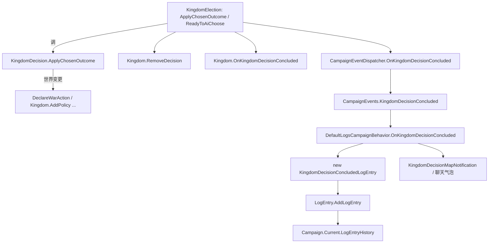

# KingdomDecisionConcludedLogEntry

**命名空间：** `TaleWorlds.CampaignSystem.LogEntries`  
**模块：** `TaleWorlds.CampaignSystem`  
**类型：** `public class KingdomDecisionConcludedLogEntry : LogEntry, IChatNotification`  
**基类：** [LogEntry](../LogEntry) · 实现 [IChatNotification](../IChatNotification)  
**源文件：** `bin/TaleWorlds.CampaignSystem/TaleWorlds.CampaignSystem.LogEntries/KingdomDecisionConcludedLogEntry.cs`

## 概述

`KingdomDecisionConcludedLogEntry` 是王国议会一次决议**落定之后**由战役日志系统自动写入的历史记录。它只携带三项不可变事实——「哪个王国、最终选中的 `DecisionOutcome` 候选结果、以及一条由 `GetChosenOutcomeText(..., isShortVersion:true)` 生成的短结论文本」——自身不做任何世界计算。它由 [DefaultLogsCampaignBehavior](../../campaign-ext/DefaultLogsCampaignBehavior) 订阅 `CampaignEvents.KingdomDecisionConcluded` 事件后构造，并调用 `LogEntry.AddLogEntry` 写入 `Campaign.Current.LogEntryHistory`，随后以政治类聊天气泡或地图通知呈现给玩家。

## 心智模型

把 `KingdomDecisionConcludedLogEntry` 想成王国议会门外的「结案公告」，而不是议案本身。真正的世界变更发生在更早的 [KingdomDecision](../KingdomDecision).`ApplyChosenOutcome`——它由 [KingdomElection](../../campaign-ext/KingdomElection) 在 AI 裁定（`ReadyToAiChoose`）或玩家投票后调用，转交各种 `*Action` / `*Behavior` 去改外交、政策与关系。当裁定完成，`KingdomElection` 先 `Kingdom.RemoveDecision` 把议案移出待决议队列、把 `Kingdom.LastKingdomDecisionConclusionDate` 置为 `CampaignTime.Now`，再通过 `CampaignEventDispatcher.Instance.OnKingdomDecisionConcluded` 广播事件；`DefaultLogsCampaignBehavior` 订阅该事件并 `new KingdomDecisionConcludedLogEntry(decision, chosenOutcome, isPlayerInvolved)` 写入日志。条目是**一次性冻结的快照**：构造时就把 `Kingdom`、`_isVisibleNotification`（= `!isPlayerInvolved`）、以及短结论文本写进 `[SaveableField]` 并随战役存档；7 天后由 `KeepInHistoryTime` 自动从 `LogEntryHistory` 清理。因此 modder 不应手动构造它，只需订阅事件来观察结论。

## 何时使用 / 何时不要使用

- **用**：当你想在决议落定时读取结论文本、识别涉及王国、或针对「玩家未参与」的结论弹自定义 UI 时，订阅 `CampaignEvents.KingdomDecisionConcluded`（签名 `(KingdomDecision, DecisionOutcome, bool)`，第三个参数即 `isPlayerInvolved`）。
- **用**：需要长期留存某条决议结果时，在事件回调里自行持久化，因为日志条目本身只保留 7 天。
- **不要**：手动 `new KingdomDecisionConcludedLogEntry(...)` 再 `LogEntry.AddLogEntry(...)`。引擎在裁定后通过事件自动写入一次；手动构造会产生重复或文本不一致的条目。
- **不要**：在裁定前（事件发出前）读取条目内容。`GetChosenOutcomeText` 的短文本在构造时才生成；事件之前的任何阶段都不存在该条目。
- **不要**：把 `Kingdom` 引用当作「当前王国状态」来用。条目里的 `Kingdom` 只是构造时刻指向的那个王国对象引用，用于通知着色与历史归类，不承载实时世界状态。

## 依赖图



- 上游（谁产生结论）：[KingdomElection](../../campaign-ext/KingdomElection) 驱动裁定；[KingdomDecision](../KingdomDecision) 提供 `ApplyChosenOutcome` 与世界落地、`GetChosenOutcomeText`、`SupportStatusOfFinalDecision`；[Kingdom](../Kingdom) 持有待决议队列与 `LastKingdomDecisionConclusionDate`；[DecisionOutcome](../../campaign-ext/DecisionOutcome) 是被选中的候选结果。
- 上游（事件枢纽）：[CampaignEvents](../../campaign-ext/CampaignEvents) 的 `KingdomDecisionConcluded` 事件（`IMbEvent<KingdomDecision, DecisionOutcome, bool>`）是日志写入的唯一触发点。
- 下游（谁消费）：[DefaultLogsCampaignBehavior](../../campaign-ext/DefaultLogsCampaignBehavior) 构造并 `AddLogEntry`；[KingdomDecisionMapNotification](../../campaign-ext/KingdomDecisionMapNotification) 复用其 `GetNotificationText()` 弹出地图通知；[LogEntry](../LogEntry) 基类负责 `Id` / `GameTime` 与历史修剪；它的兄弟条目 [KingdomDecisionAddedLogEntry](../KingdomDecisionAddedLogEntry) 记录的是「提出」而非「落定」。
- 序列化：由 `SaveableCampaignTypeDefiner` 注册（class 149），`SaveManager` 在存档时收集 `Kingdom`、`_isVisibleNotification`、`_notificationText`。

## 风险

1. **手动构造导致重复 / 不一致条目**：你**不应该**自己 `new KingdomDecisionConcludedLogEntry(...)` 并 `AddLogEntry`。引擎在 `KingdomDecisionConcluded` 事件后由 `DefaultLogsCampaignBehavior` 自动写一次；手动写会让同一结论出现两条、或因为 `SupportStatusOfFinalDecision` 取值时机不同而文本不一致。
2. **读取时机**：该条目在 `ApplyChosenOutcome` **之后**、`RemoveDecision` **之后**才生成。任何在裁定完成前尝试读 `_notificationText` 的代码都拿不到内容；需要结论请用事件回调而非轮询日志。
3. **快照不会随本地化刷新**：`_notificationText` 在构造时一次性由 `GetChosenOutcomeText(..., isShortVersion:true)` 冻结成 `TextObject` 并 `[SaveableField(4)]` 存档。读旧档时它仍是写入当时的文本——若后续修改了决议文案或数值，旧存档仍显示旧文本。
4. **`IsVisibleNotification` = `!isPlayerInvolved`**：当玩家本身参与了该决议（`isPlayerInvolved == true`）时，该条**不**作为聊天气泡显示，只会进历史。若你的 UI 以 `IsVisibleNotification` 判断是否提示玩家，会漏掉「玩家亲自参与」的那类结论。
5. **7 天清理**：`KeepInHistoryTime => CampaignTime.Days(7f)`。条目只保留 7 天战役时间；需要长期审计/记录应自行在事件里持久化，不要依赖日志历史。
6. **地图通知门槛**：引擎仅在 `decision.Kingdom == Hero.MainHero.MapFaction && decision.NotifyPlayer && !decision.IsEnforced && !isPlayerInvolved` 时才弹地图通知。AI 内部强制决议（`IsEnforced`）或玩家自己参与的决议，玩家收不到独立弹窗，只有历史条目。

## 成员说明

### 构造与不可变快照

- **构造函数 `KingdomDecisionConcludedLogEntry(KingdomDecision decision, DecisionOutcome chosenOutcome, bool isPlayerInvolved)`**  
  **用途：** 一次性冻结三条事实。`Kingdom = decision.Kingdom`；`_isVisibleNotification = !isPlayerInvolved`（玩家参与则不弹聊天气泡）；`_notificationText = decision.GetChosenOutcomeText(chosenOutcome, decision.SupportStatusOfFinalDecision, isShortVersion: true)`（用最终支持度级别生成短结论文本）。  
  **副作用：** 无副作用、不触发事件；只是纯数据快照。  
  **调用时机：** 仅由 `DefaultLogsCampaignBehavior.OnKingdomDecisionConcluded` 在事件回调里调用一次。modder 不应直接调用。

- **`public readonly Kingdom Kingdom`（`[SaveableField(1)]`）**  
  **用途：** 记录本次决议所涉及的王国引用，供通知着色（`PoliticalNotification`）与历史归类使用。它是构造时从 `decision.Kingdom` 拷贝的只读引用，不代表实时世界状态。  
  **副作用：** 无。  
  **调用时机：** `NotificationType` 与日志 UI 读取它来判定该结论是「玩家家族 / 玩家阵营 / 一般政治」哪一类。

- **`bool IsVisibleNotification`（`[SaveableField(3)]` 经 `_isVisibleNotification`）**  
  **用途：** 实现 `IChatNotification` 的成员，返回 `!isPlayerInvolved`。它决定该条目是否作为聊天气泡出现：玩家亲自参与的结论只进历史、不弹气泡。  
  **副作用：** 无。  
  **调用时机：** 聊天/通知系统判定是否展示该条目时读取。

- **`TextObject GetNotificationText()` / `private readonly TextObject _notificationText`（`[SaveableField(4)]`）**  
  **用途：** 返回构造时冻结的短结论文本；这是历史行与地图通知共用的展示字符串。`ToString()` 也直接返回它的 `ToString()`。  
  **副作用：** 无。  
  **调用时机：** `DefaultLogsCampaignBehavior` 与 [KingdomDecisionMapNotification](../../campaign-ext/KingdomDecisionMapNotification) 在弹出通知时调用；历史面板渲染时调用。

### 通知与历史呈现

- **`ChatNotificationType NotificationType`（override）**  
  **用途：** 返回 `PoliticalNotification(Kingdom)`——依 `Kingdom` 是否是玩家家族/玩家阵营，映射到 `PlayerClanPolitical` / `PlayerFactionPolitical` / `Political`，从而决定聊天气泡的着色与归类。  
  **调用时机：** 通知系统把条目塞进聊天栏时读取。

- **`CampaignTime KeepInHistoryTime`（override）**  
  **用途：** 返回 `CampaignTime.Days(7f)`，声明该条目在 `LogEntryHistory` 中保留 7 天战役时间后自动修剪。  
  **调用时机：** 日志历史清理（周期性 tick）时读取。

- **`string ToString()`（override）**  
  **用途：** 直接返回 `GetNotificationText().ToString()`，让日志条目能直接当作一行文本使用（如调试、控制台）。  
  **调用时机：** 任何把条目当字符串的地方（序列化诊断、日志打印）。

### 序列化

- **`[SaveableField(1)] Kingdom` / `[SaveableField(3)] _isVisibleNotification` / `[SaveableField(4)] _notificationText`**  
  **用途：** 三个字段参与战役存档；`AutoGeneratedInstanceCollectObjects` 把 `Kingdom` 与 `_notificationText` 加入收集列表，`SaveableCampaignTypeDefiner` 以 class 149 注册该类。读档时由 `SaveManager` 恢复引用与文本。  
  **注意：** `Kingdom` 是对象引用，读档后由 SaveManager 重新连接；`_notificationText` 是已冻结文本，不会随当前本地化重新生成。

## 示例

### 示例 1：订阅 KingdomDecisionConcluded 观察结论（modder 真实入口）

```csharp
using TaleWorlds.CampaignSystem;
using TaleWorlds.CampaignSystem.Election;
using TaleWorlds.CampaignSystem.LogEntries;
using TaleWorlds.Localization;

// 在你的自定义 CampaignBehavior 的 RegisterEvents 中订阅（与 DefaultLogsCampaignBehavior 同事件）
CampaignEvents.KingdomDecisionConcluded.AddNonSerializedListener(this, OnDecisionConcluded);

private void OnDecisionConcluded(KingdomDecision decision, DecisionOutcome chosenOutcome, bool isPlayerInvolved)
{
    // 引擎在 KingdomElection 裁定并 ApplyChosenOutcome 之后广播此事件；
    // DefaultLogsCampaignBehavior 会据此 new KingdomDecisionConcludedLogEntry(...) 并 AddLogEntry。
    TextObject conclusionText = decision.GetChosenOutcomeText(
        chosenOutcome,
        decision.SupportStatusOfFinalDecision,
        isShortVersion: true);

    // conclusionText 正是日志条目里 _notificationText 的内容；
    // isPlayerInvolved 为 true 时该条目不会作为聊天气泡出现（只进历史）。
    Kingdom affectedKingdom = decision.Kingdom;
}
```

订阅后你拿到的是与日志条目同源的结论文本，无需、也不应自己再构造 `KingdomDecisionConcludedLogEntry`。

### 示例 2：引擎侧的自动写入链（来自 DefaultLogsCampaignBehavior 源码）

```csharp
// DefaultLogsCampaignBehavior.OnKingdomDecisionConcluded —— 引擎在事件回调里写日志，modder 不调用
private void OnKingdomDecisionConcluded(KingdomDecision decision, DecisionOutcome chosenOutcome, bool isPlayerInvolved)
{
    KingdomDecisionConcludedLogEntry logEntry =
        new KingdomDecisionConcludedLogEntry(decision, chosenOutcome, isPlayerInvolved);
    LogEntry.AddLogEntry(logEntry);

    if (decision.Kingdom == Hero.MainHero.MapFaction
        && decision.NotifyPlayer
        && !decision.IsEnforced
        && !isPlayerInvolved)
    {
        Campaign.Current.CampaignInformationManager.NewMapNoticeAdded(
            new KingdomDecisionMapNotification(decision.Kingdom, decision, logEntry.GetNotificationText()));
    }
}
```

完整因果链是：`KingdomElection.ReadyToAiChoose()`（或玩家投票）设置 `_chosenOutcome` → `ApplyChosenOutcome()` 调 `_decision.ApplyChosenOutcome(_chosenOutcome)` 落地世界 → `Kingdom.RemoveDecision` + `Kingdom.OnKingdomDecisionConcluded` → `CampaignEventDispatcher.Instance.OnKingdomDecisionConcluded(...)` 广播 → 上面的处理器 `new KingdomDecisionConcludedLogEntry(...)` 入档。理解了这条链，就能明白为什么手动写日志会与引擎重复。

## 参见

- ↑ 父级：[战役 API 索引](../)
- ↔ 同级（日志条目）：[KingdomDecisionAddedLogEntry](../KingdomDecisionAddedLogEntry) · [LogEntry](../LogEntry) · [IChatNotification](../IChatNotification)
- 上游枢纽：[KingdomDecision](../KingdomDecision) · [KingdomElection](../../campaign-ext/KingdomElection) · [DecisionOutcome](../../campaign-ext/DecisionOutcome) · [Kingdom](../Kingdom) · [Clan](../Clan)
- 事件与驱动：[CampaignEvents](../../campaign-ext/CampaignEvents) · [DefaultLogsCampaignBehavior](../../campaign-ext/DefaultLogsCampaignBehavior) · [KingdomDecisionProposalBehavior](../../campaign-ext/KingdomDecisionProposalBehavior) · [KingdomDecisionMapNotification](../../campaign-ext/KingdomDecisionMapNotification) · [Supporter](../../campaign-ext/Supporter)
