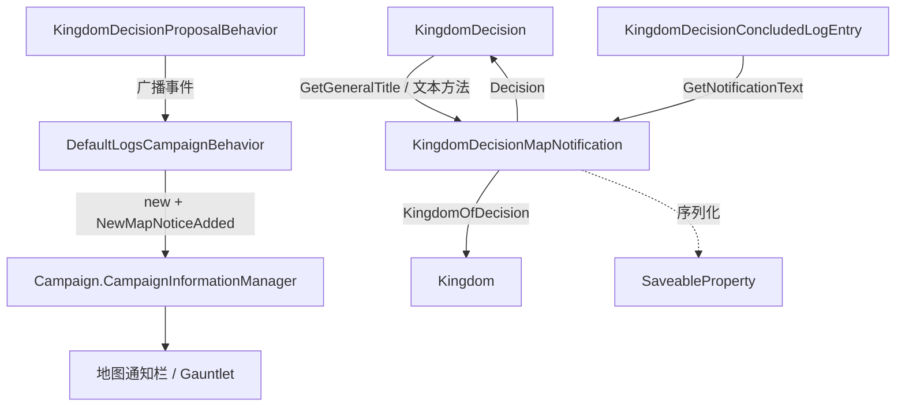

# KingdomDecisionMapNotification

**命名空间：** `TaleWorlds.CampaignSystem.MapNotificationTypes`  
**模块：** `TaleWorlds.CampaignSystem`  
**类型：** `public class KingdomDecisionMapNotification : InformationData`  
**基类：** [InformationData](../../core-extra/InformationData)  
**源文件：** `bin/TaleWorlds.CampaignSystem/TaleWorlds.CampaignSystem.MapNotificationTypes/KingdomDecisionMapNotification.cs`

## 一句话职责

`KingdomDecisionMapNotification` 是贴在战役地图上的「王国决议弹窗数据」：它不计算规则、不推进流程，只是把**某条 `KingdomDecision` 已经发生（被提出 / 已落定）**这件事连同所属 `[Kingdom](../Kingdom)` 一起打包成一个 `InformationData`，交给 `[Campaign](../../Campaign).CampaignInformationManager.NewMapNoticeAdded` 推到地图通知栏，等待玩家点击查看详情。

## 心智模型

把 `KingdomDecisionMapNotification` 想成议会门口贴出的一张**告示**，而不是议会本身。它的生命周期完全被动：真正的提案与裁定由 `[KingdomDecisionProposalBehavior](../../campaign-ext/KingdomDecisionProposalBehavior)` 驱动，当决议**被加入待决议列表**（`OnKingdomDecisionAdded`）或**裁定完成**（`OnKingdomDecisionConcluded`）时，由 `DefaultLogsCampaignBehavior` 在事件回调里 `new` 出来并塞进 `CampaignInformationManager`；只有「玩家参与、需要通知、且非强制（`!IsEnforced`）」的决议才会真正弹出。告示上写什么由 `[KingdomDecision](../../campaign-ext/KingdomDecision)` 的文本方法决定——标题走 `Decision.GetGeneralTitle()`，正文在提出时取 `GetChooseTitle()`/`GetSupportTitle()`、落定时取 `KingdomDecisionConcludedLogEntry.GetNotificationText()`；音效固定为 `event:/ui/notification/kingdom_decision`。对象只持有两个引用：`KingdomOfDecision` 与 `Decision`，都用 `[SaveableProperty]` 标记，因此会与战役存档一起序列化、加载时自动恢复，不存在则通知栏会缺失但不会坏档。换言之：它是决策系统最末端的「呈现数据」，改它不会改变任何世界状态，但不弹出它本身也不会影响决议推进。

## 何时使用 / 何时不要使用

- **用：** 想在自定义地图 UI / 行为里**读取**某条王国决议通知的上下文（哪个王国、哪条决策、标题与正文），或在自定义日志行为里仿照原版再推一条同类通知。
- **用：** 通过 `IsValid()` 判断该通知此刻是否仍应展示（例如政策尚未 `IsReady` 时应隐藏）。
- **不要：** 指望它去「发起」或「推进」决议——提案与裁定都走 `[KingdomDecisionProposalBehavior](../../campaign-ext/KingdomDecisionProposalBehavior)` 与 `[KingdomDecision](../../campaign-ext/KingdomDecision)`，通知只是结果呈现。
- **不要：** 直接 `new` 它却不经 `CampaignInformationManager.NewMapNoticeAdded` 推送——构造出来的实例若不入管理器，地图通知栏永远不会显示。
- **不要：** 在 `Campaign.Current == null` 或地图未加载时构造/推送，此时 `CampaignInformationManager` 不可用，调用会失败。
- **不要：** 在 `Mission`（战斗层）里读它；它是纯 Campaign 层对象。

## 依赖图



- 上游（谁驱动 / 谁构造）：[KingdomDecisionProposalBehavior](../../campaign-ext/KingdomDecisionProposalBehavior) 推进提案与裁定并广播 `KingdomDecisionAdded` / `KingdomDecisionConcluded`；[CampaignEvents](../CampaignEvents) 是这些事件的暴露点；[DefaultLogsCampaignBehavior](../../campaign-ext/DefaultLogsCampaignBehavior) 在回调里 `new` 出本通知；[KingdomDecision](../../campaign-ext/KingdomDecision) 提供标题与正文文本；[Campaign](../../Campaign) 持有 `CampaignInformationManager` 与存档上下文。
- 下游（谁消费 / 谁被呈现）：具体决议如 [KingdomPolicyDecision](../../campaign-ext/KingdomPolicyDecision) 的 `Policy.IsReady` 影响 `IsValid()`；[KingdomDecisionConcludedLogEntry](../../campaign-ext/KingdomDecisionConcludedLogEntry) 提供落定文本；[Kingdom](../Kingdom) 与 [Clan](../Clan) 决定玩家是否参与、是否该弹通知；[InformationData](../../core-extra/InformationData) 是基类、定义标题/描述/音效抽象契约。

## 风险

1. **构造不推送 = 不显示**：本类只是数据载体，必须调用 `Campaign.Current.CampaignInformationManager.NewMapNoticeAdded(notice)` 才会进地图通知栏；只 `new` 而不推送，玩家永远看不到。
2. **战役/地图未就绪时调用失败**：`Campaign.Current == null` 或 `CampaignInformationManager` 尚未初始化时调用会抛空引用。自定义行为应在事件回调内、确认 `Campaign.Current.GameStarted` 后再推送。
3. **`IsValid()` 过滤政策类通知**：当 `Decision` 是 `KingdomPolicyDecision` 且其 `Policy.IsReady == false` 时，`IsValid()` 返回 false，通知会被判定为无效而不展示。自定义政策通知若依赖未就绪的政策数据，可能静默消失。
4. **`!IsEnforced` 门控**：原版只在「玩家参与、`NotifyPlayer` 为真、且非强制」时才弹通知；AI 强制推进（`IsEnforced`）的决议不会打扰玩家。自定义推送若忽略此门控，会向玩家弹出本应由 AI 静默处理的决议。
5. **序列化只存引用**：`KingdomOfDecision` 与 `Decision` 经 `[SaveableProperty]` 序列化，读档时按对象图恢复；不要在自定义通知里塞未注册/瞬时的子类字段，否则存档回读会丢数据或解析失败。
6. **自定义决议未挂通知**：若你新增 `[KingdomDecision](../../campaign-ext/KingdomDecision)` 子类但没在自定义日志行为里订阅 `KingdomDecisionAdded`/`KingdomDecisionConcluded` 并推送本通知，玩家将没有任何地图提示，但决议仍会正常推进——这属于体验缺失而非崩溃。

## 成员说明

### 通知承载的决议上下文

- **`Kingdom KingdomOfDecision { get; private set; }`**（`[SaveableProperty(1)]`）  
  **用途 / Purpose：** 返回这条通知所针对的王国。它由构造函数从 `decision.Kingdom` 写入，是通知栏按王国分组、决定玩家是否参与的根依据。  
  **副作用：** 只读；构造时赋值，随存档序列化。  
  **调用时机：** 通知 UI 与 `IsValid()` 判定玩家是否该看到此告示时读取。

- **`KingdomDecision Decision { get; private set; }`**（`[SaveableProperty(2)]`）  
  **用途 / Purpose：** 返回这条通知背后的那条决议实例。所有标题、正文、是否有效的信息都转交它：标题来自 `Decision.GetGeneralTitle()`，落定正文来自关联日志条目对 `Decision` 的引用。  
  **副作用：** 只读；构造时赋值，随存档序列化。  
  **调用时机：** 渲染标题/正文、以及 `IsValid()` 中判断其是否为未就绪的政策决议时读取。

### 标题、音效与有效性（基类抽象成员的实现）

- **`override TextObject TitleText`**  
  **用途 / Purpose：** 提供通知标题，直接转发为 `Decision.GetGeneralTitle()`——即决议的「总标题」（如「宣战」「通过政策」），随具体 `[KingdomDecision](../../campaign-ext/KingdomDecision)` 子类不同而不同。  
  **调用时机：** 通知栏渲染标题时。

- **`override string SoundEventPath`**  
  **用途 / Purpose：** 返回固定音效路径 `"event:/ui/notification/kingdom_decision"`，所有王国决议通知共用同一提示音。  
  **调用时机：** 通知被加入管理器、弹出提示时播放。

- **`override bool IsValid()`**  
  **用途 / Purpose：** 判断该通知此刻是否仍应展示。逻辑为：若 `Decision` 是 `KingdomPolicyDecision` 且其 `Policy.IsReady == false`，返回 false（政策尚未就绪，隐藏告示）；否则返回 true。它**只做展示层过滤**，不影响决议本身的有效性。  
  **副作用：** 无。  
  **调用时机：** 通知管理器刷新/评估通知可见性时。

### 构造函数

- **`KingdomDecisionMapNotification(Kingdom kingdom, KingdomDecision decision, TextObject descriptionText)`**  
  **用途 / Purpose：** 唯一构造入口；把 `kingdom`、`decision` 写入两个 `[SaveableProperty]` 字段，并把 `descriptionText` 交给基类 `InformationData` 作为正文描述。原版调用点在 `DefaultLogsCampaignBehavior` 的 `OnKingdomDecisionAdded` 与 `OnKingdomDecisionConcluded`。  
  **副作用：** 无；仅初始化字段。  
  **调用时机：** 决议被提出或落定、且通过玩家参与/非强制门控后，由日志行为构造并推送。

## 真实示例

### 示例 1：决议被提出时推送通知（取自 `DefaultLogsCampaignBehavior.OnKingdomDecisionAdded`）

```csharp
using TaleWorlds.CampaignSystem;
using TaleWorlds.CampaignSystem.Election;
using TaleWorlds.CampaignSystem.MapNotificationTypes;
using TaleWorlds.Localization;

// 当 KingdomDecisionProposalBehavior 把决议挂上待决议列表并广播 KingdomDecisionAdded 时，
// 若玩家参与、需要通知、且非强制，引擎构造该通知推到地图信息管理器。
if (Campaign.Current != null && decision.NotifyPlayer && isPlayerInvolved && !decision.IsEnforced)
{
    TextObject descriptionText = decision.DetermineChooser().Leader.IsHumanPlayerCharacter
        ? decision.GetChooseTitle()
        : decision.GetSupportTitle();
    KingdomDecisionMapNotification notice = new KingdomDecisionMapNotification(
        decision.Kingdom, decision, descriptionText);
    Campaign.Current.CampaignInformationManager.NewMapNoticeAdded(notice);
}
```

### 示例 2：决议落定时再次推送（取自 `DefaultLogsCampaignBehavior.OnKingdomDecisionConcluded`）

```csharp
using TaleWorlds.CampaignSystem;
using TaleWorlds.CampaignSystem.Election;
using TaleWorlds.CampaignSystem.MapNotificationTypes;

// 裁定完成后，用落定日志条目的文本再弹一次通知；仅当玩家王国且非强制、且玩家未参与裁定时。
if (decision.Kingdom == Hero.MainHero.MapFaction && decision.NotifyPlayer && !decision.IsEnforced && !isPlayerInvolved)
{
    var logEntry = new KingdomDecisionConcludedLogEntry(decision, chosenOutcome, isPlayerInvolved);
    Campaign.Current.CampaignInformationManager.NewMapNoticeAdded(
        new KingdomDecisionMapNotification(decision.Kingdom, decision, logEntry.GetNotificationText()));
}
```

若你新增了自定义 `[KingdomDecision](../../campaign-ext/KingdomDecision)` 子类，想让玩家在地图上也收到提示，只需在自己的 `CampaignBehavior` 里订阅 `KingdomDecisionAdded` / `KingdomDecisionConcluded`（经 `[CampaignEvents](../CampaignEvents)`），按上面同样的门控与构造方式推送即可；跳过 `NewMapNoticeAdded` 则决议仍会推进，只是玩家无弹窗。

## 版本注记

本页以 v1.4.5 `TaleWorlds.CampaignSystem.MapNotificationTypes/KingdomDecisionMapNotification.cs` 及 `TaleWorlds.CampaignSystem.CampaignBehaviors/DefaultLogsCampaignBehavior.cs`、`TaleWorlds.Core/InformationData.cs` 源码为准。跨版本使用时重新确认 `TitleText`/`SoundEventPath` 的 override 与 `IsValid()` 对政策就绪的判断逻辑。

## 导航

- ↑ 父级：[战役 API 索引](../)
- ↔ 同级（决策框架）：[KingdomDecision](../../campaign-ext/KingdomDecision) · [KingdomDecisionProposalBehavior](../../campaign-ext/KingdomDecisionProposalBehavior) · [KingdomDecisionConcludedLogEntry](../../campaign-ext/KingdomDecisionConcludedLogEntry) · [KingdomPolicyDecision](../../campaign-ext/KingdomPolicyDecision) · [DefaultLogsCampaignBehavior](../../campaign-ext/DefaultLogsCampaignBehavior)
- 相关（王国与战役）：[Kingdom](../Kingdom) · [Clan](../Clan) · [Campaign](../../Campaign) · [CampaignEvents](../CampaignEvents) · [InformationData](../../core-extra/InformationData)
