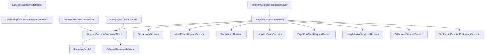

# KingdomDecisionPermissionModel

**命名空间：** `TaleWorlds.CampaignSystem.ComponentInterfaces`  
**模块：** `TaleWorlds.CampaignSystem`  
**类型：** `public abstract class KingdomDecisionPermissionModel : MBGameModel<KingdomDecisionPermissionModel>`  
**基类：** [MBGameModel](../../core-extra/MBGameModel)（位于 [core-extra](../../core-extra/MBGameModel)）  
**源文件：** `TaleWorlds.CampaignSystem/ComponentInterfaces/KingdomDecisionPermissionModel.cs`

## 概述

`KingdomDecisionPermissionModel` 是王国决策系统的「许可闸门」：它把「此刻某个王国能不能就某类议题发起正式决议」这一规则从具体的决策子类里抽出来，集中成 7 个抽象判定方法。每个具体决策（如宣战、议和、推举新王）在 `IsAllowed()` 里回调对应的模型方法，由模型回答「允许 / 不允许」；对于议和这类带前置约束的判定，模型还会通过 `out TextObject reason` 给出被拒绝的人话原因。它不持有任何世界状态，也不随存档序列化，是战役启动时由 `GameModels` 按类型解析、运行时统一经 `Campaign.Current.Models.KingdomDecisionPermissionModel` 取出的纯规则模型。

## 心智模型

把 `KingdomDecisionPermissionModel` 想成王国议会门口的「准入审查员」，而不是装结果的盒子。它本身没有任何字段、不含 `[SaveableField]`、不参与存档序列化——它只在内存里做即时裁决。它的生命周期完全由 Campaign 层托管：`SandBoxManager` 在启动战役时通过 `gameStarter.AddModel(new DefaultKingdomDecisionPermissionModel())` 把它注册进模型集合；随后 `GameModels` 用 `GetGameModel<KingdomDecisionPermissionModel>()` 解析出唯一实例缓存在 `Models.KingdomDecisionPermissionModel` 上，每次新战役/读档都会重新解析，不会沿用旧战役的实例。真正驱动它的是 `KingdomDecisionProposalBehavior`：每推进一个待决议时调用 `decision.IsAllowed()`，而各 `*Decision` 的 `IsAllowed()` 再去查 `Campaign.Current.Models.KingdomDecisionPermissionModel` 的对应方法。换言之，模型是「决策的合法性护栏」——决策流程负责「算结果、改世界」，模型只回答「此刻该决策还合不合法」。要改规则（比如禁止某王国宣战、限制只能推行特定政策）就提供派生类并替换默认实现；要读结果就走 `Campaign.Current.Models`。

## 何时使用 / 何时不要使用

- **使用**：想改变「哪些王国、在何种条件下可以就某类议题提案」的全局规则时，派生 `KingdomDecisionPermissionModel` 覆盖对应方法，在子模块 `OnGameStart` 阶段用 `gameStarter.AddModel(new MyPermissionModel())` 替换默认实现。
- **使用**：在自定义 `*Decision` 的 `IsAllowed()` 里，像原版那样委托给 `Campaign.Current.Models.KingdomDecisionPermissionModel` 的对应方法，让许可规则可统一被 mod 改写。
- **不要使用**：不要把许可结果当作「已发生」的状态去缓存——模型每次调用都即时重新裁决，它不记忆上次返回值。
- **不要使用**：不要给模型加可变字段并指望随存档恢复；模型无状态、无 `[SaveableField]`，读档后这些值不会被序列化。
- **不要使用**：不要绕过这套闸门直接在 `KingdomDecisionProposalBehavior` 外手动 `AddDecision` 并强行推进——`IsAllowed()` 返回 false 时流程会通过 `ShouldBeCancelled` 作废决策，绕过它等于绕过一致性检查，可能让本不该出现的决议进入裁定。
- **不要使用**：在 `Campaign.Current` 未初始化的上下文（主菜单、子模块加载早期）访问 `Campaign.Current.Models`，会得到空引用。

## 依赖图



- 上游（谁注册 / 谁持有 / 谁查询）：[Campaign](../Campaign) 持有 `Models` 集合，是运行时取得模型的入口；[GameModels](../GameModels) 在构造时解析并缓存实例；[KingdomDecisionProposalBehavior](../../campaign-ext/KingdomDecisionProposalBehavior) 的流程驱动对每个决策调用 `IsAllowed()`；具体 `*Decision` 是实现 `IsAllowed()` 并回调模型的子类。
- 下游（决策子类，每个都对应一个模型方法）：[DeclareWarDecision](../../campaign-ext/DeclareWarDecision)（→`IsWarDecisionAllowedBetweenKingdoms`）、[MakePeaceKingdomDecision](../../campaign-ext/MakePeaceKingdomDecision)（→`IsPeaceDecisionAllowedBetweenKingdoms`）、[StartAllianceDecision](../../campaign-ext/StartAllianceDecision)（→`IsStartAllianceDecisionAllowedBetweenKingdoms`）、[KingdomPolicyDecision](../../campaign-ext/KingdomPolicyDecision)（→`IsPolicyDecisionAllowed`）、[ExpelClanFromKingdomDecision](../../campaign-ext/ExpelClanFromKingdomDecision)（→`IsExpulsionDecisionAllowed`）、[KingSelectionKingdomDecision](../../campaign-ext/KingSelectionKingdomDecision)（→`IsKingSelectionDecisionAllowed`）、[SettlementClaimantDecision](../../campaign-ext/SettlementClaimantDecision) 与 [SettlementClaimantPreliminaryDecision](../../campaign-ext/SettlementClaimantPreliminaryDecision)（→`IsAnnexationDecisionAllowed`）。
- 默认实现与协同：[DefaultKingdomDecisionPermissionModel](../../campaign-ext/DefaultKingdomDecisionPermissionModel) 是引擎注册的默认实现；它读取 [DiplomacyModel](../DiplomacyModel) 的「永久战争 / 适议和」判定以及 [IAllianceCampaignBehavior](../../campaign-ext/IAllianceCampaignBehavior) 的「战争号召协定」状态来决定议和是否放行。
- 被裁决的对象类型：[Kingdom](../Kingdom)（宣战/议和/结盟/推王都涉及两个王国）、[Clan](../Clan)（被驱逐家族）、[Settlement](../Settlement)（被吞并据点）、[PolicyObject](../PolicyObject)（政策决议的数据）。

## 风险

1. **替换不完整导致闸门失效**：默认 `DefaultKingdomDecisionPermissionModel` 的多数方法直接 `return true`（只有议和带真实约束）。若某 mod 只覆盖了部分方法却用基类 `AddModel` 注册了自己的类，未覆盖的方法会按你派生类的实现走——若派生类忘了重写、默认又返回 false，则会把所有对应决议全部卡死；若你本想「只允许特定政策」却让其他判定返回 true，则闸门形同虚设。务必逐方法明确返回语义。
2. **绕过 `IsAllowed()` 直接提案**：在 `KingdomDecisionProposalBehavior` 之外手动 `Kingdom.AddDecision(...)` 并假设流程会照常推进，会跳过（或依赖）`ShouldBeCancelled` 对 `IsAllowed()` 的检查；一旦模型判定该决议非法，流程会中途作废，玩家/AI 看到的是「提案凭空消失」，且可能已消耗提案方影响力。
3. **跨战役实例缓存**：`Campaign.Current.Models.KingdomDecisionPermissionModel` 在每次新战役/读档时由 `GameModels` 重新解析。把实例缓存在静态字段或长生命周期对象里，会在重载后指向旧战役的已销毁实例，调用即崩溃或读到陈旧规则。每次需要时重新走 `Campaign.Current.Models` 获取。
4. **战役未启动即访问**：`Campaign.Current` 或 `Campaign.Current.Models` 在战役未启动时为 null；在主菜单、子模块加载早期或编辑器上下文里调用会直接空引用。
5. **忽略 `out reason` 的人话原因**：`IsWar/Peace/StartAllianceDecisionAllowedBetweenKingdoms` 通过 `out TextObject reason` 返回拒绝理由（当返回 false 时）。若调用方（你的 `IsAllowed()` 或自定义 UI）只读取 `bool` 而忽略 `reason`，玩家会看到「无法提案」却不知为何，体验上等同于黑箱拒绝。
6. **`IsPeaceDecisionAllowedBetweenKingdoms` 的协同依赖**：默认实现依赖 `Campaign.Current.Models.DiplomacyModel` 与 `IAllianceCampaignBehavior`。若你自定义该方法的实现，却在此之前访问 `DiplomacyModel` 或 `IAllianceCampaignBehavior` 且它们尚未就绪（例如行为未注册），会拿到 null 并可能抛空引用。

## 成员说明

模型定义了 7 个抽象判定方法，按它们所对应的决议议题分组。每个方法都是「纯查询」：仅返回 `bool`、对带 `out reason` 的重载写入拒绝原因，绝不改动任何世界状态，由具体 `*Decision.IsAllowed()` 在推进时调用。

### 政策与吞并

- **`abstract bool IsPolicyDecisionAllowed(PolicyObject policy)`**
  - 用途 / Purpose：判定该王国此刻能否就某条 `PolicyObject`（如贵族制、农奴制）发起政策决议。默认实现直接 `return true`，即任何政策都可被提案。
  - 副作用：无。仅返回布尔。
  - 调用时机：`KingdomPolicyDecision.IsAllowed()` 在 `KingdomDecisionProposalBehavior` 每推进该决策时调用；返回 false 会使决策的 `ShouldBeCancelled` 把它作废。

- **`abstract bool IsAnnexationDecisionAllowed(Settlement annexedSettlement)`**
  - 用途 / Purpose：判定指定 `Settlement`（被认领的城镇/城堡）能否作为「吞并据点」决议的标的。`SettlementClaimantDecision` 与 `SettlementClaimantPreliminaryDecision` 都用它来校验其认领目标是否仍可发起。默认实现返回 true。
  - 副作用：无。
  - 调用时机：两个据点认领决策的 `IsAllowed()` 各自回调；当据点已被正式认领或状态变化时返回 false 可让前置/正式决议作废。

### 外交：宣战 / 议和 / 结盟

- **`abstract bool IsWarDecisionAllowedBetweenKingdoms(Kingdom kingdom1, Kingdom kingdom2, out TextObject reason)`**
  - 用途 / Purpose：判定 `kingdom1`（决议所属王国）能否对同为王国阵营的 `kingdom2` 发起宣战决议；若不允许，经 `out reason` 写出拒绝的人话原因（TextObject），否则 `reason = null`。`DeclareWarDecision.IsAllowed()` 仅在 `FactionToDeclareWarOn.IsKingdomFaction` 为真时调用它，非王国阵营（如氏族）直接放行。
  - 副作用：仅写入 `out reason`。
  - 调用时机：宣战决议推进时由 `DeclareWarDecision.IsAllowed()` 回调。

- **`abstract bool IsPeaceDecisionAllowedBetweenKingdoms(Kingdom kingdom1, Kingdom kingdom2, out TextObject reason)`**
  - 用途 / Purpose：判定两王国间能否发起议和决议，**这是默认实现中唯一带真实约束的方法**。默认逻辑依次检查：`DiplomacyModel.IsAtConstantWar`（处于永久战争则拒绝并给「此时无法议和」）、`IAllianceCampaignBehavior.IsAtWarByCallToWarAgreement`（任一方因「战争号召协定」被迫与第三方交战则拒绝，并通过 `GetExplanationForPeaceOfferWithCallToWar` 生成区分玩家王国的提示文本）、`DiplomacyModel.IsPeaceSuitable`（对方是否愿意谈判，否则给「敌方不愿谈判」）。全部通过才返回 true。
  - 副作用：仅写入 `out reason`；内部通过 `Campaign.Current.Models.DiplomacyModel` 与 `IAllianceCampaignBehavior` 读取外交状态，不修改它们。
  - 调用时机：`MakePeaceKingdomDecision.IsAllowed()` 回调。

- **`abstract bool IsStartAllianceDecisionAllowedBetweenKingdoms(Kingdom kingdom1, Kingdom kingdom2, out TextObject reason)`**
  - 用途 / Purpose：判定两王国间能否发起结盟决议；默认实现直接 `return true`（`reason = null`）。
  - 副作用：仅写入 `out reason`。
  - 调用时机：`StartAllianceDecision.IsAllowed()` 回调，传入决议所属王国与拟结盟王国。

### 内部治理：驱逐家族 / 推举新王

- **`abstract bool IsExpulsionDecisionAllowed(Clan expelledClan)`**
  - 用途 / Purpose：判定指定 `Clan`（被提议逐出的家族）能否作为驱逐决议的标的。默认实现返回 true。`ExpelClanFromKingdomDecision` 用它校验待驱逐家族当前是否仍可被提案驱逐（例如家族已脱离王国则不再合法）。
  - 副作用：无。
  - 调用时机：`ExpelClanFromKingdomDecision.IsAllowed()` 回调。

- **`abstract bool IsKingSelectionDecisionAllowed(Kingdom kingdom)`**
  - 用途 / Purpose：判定该 `Kingdom` 当前能否发起推举新王的决议（例如旧王已死、需要重选统治者）。默认实现返回 true。`KingSelectionKingdomDecision` 用它校验推王流程此刻是否仍可发起。
  - 副作用：无。
  - 调用时机：`KingSelectionKingdomDecision.IsAllowed()` 回调，传入决议所属王国。

> 约定：上述 `out TextObject reason` 参数在「允许」时由默认实现置为 `null`；自定义实现若返回 false，应当构造一个有意义的 `TextObject` 说明原因，供提案方 UI 展示。

## 示例

### 示例 1：读取当前决议的许可判定（运行时查询）

在某个决策推进、你需要判断议和是否被允许时，走 `Campaign.Current.Models` 取模型并读取 `out reason`：

```csharp
using TaleWorlds.CampaignSystem;
using TaleWorlds.CampaignSystem.ComponentInterfaces;
using TaleWorlds.Localization;

if (Campaign.Current == null) return;

Kingdom playerKingdom = Clan.PlayerClan.Kingdom;
Kingdom enemyKingdom = /* 你想与之议和的敌对王国 */;

TextObject reason;
bool canMakePeace = Campaign.Current.Models
    .KingdomDecisionPermissionModel
    .IsPeaceDecisionAllowedBetweenKingdoms(playerKingdom, enemyKingdom, out reason);

if (!canMakePeace)
{
    // reason 已由模型填充（如「处于永久战争」「受战争号召协定限制」），可向玩家展示
    InformationManager.DisplayMessage(reason);
}
```

默认实现里只有议和会真正塞入 `reason` 文本；宣战/结盟在默认实现中直接返回 true（`reason` 为 null）。

### 示例 2：派生并替换模型，限制谁能提案

参考 `DefaultKingdomDecisionPermissionModel` 的结构，自定义一个只放行特定议题、禁止主动宣战的许可模型，并在子模块启动战役时注册替换：

```csharp
using TaleWorlds.CampaignSystem;
using TaleWorlds.CampaignSystem.ComponentInterfaces;
using TaleWorlds.CampaignSystem.Settlements;
using TaleWorlds.Localization;

public class RestrictedKingdomDecisionPermissionModel : KingdomDecisionPermissionModel
{
    public override bool IsPolicyDecisionAllowed(PolicyObject policy) => true;

    public override bool IsWarDecisionAllowedBetweenKingdoms(
        Kingdom kingdom1, Kingdom kingdom2, out TextObject reason)
    {
        // 禁止任何主动宣战决议（例如你的 mod 想走纯外交路线）
        reason = new TextObject("{=MY_WAR_BAN}This realm does not permit declaring war by council vote.");
        return false;
    }

    public override bool IsPeaceDecisionAllowedBetweenKingdoms(
        Kingdom kingdom1, Kingdom kingdom2, out TextObject reason)
    {
        reason = null;
        return true;
    }

    public override bool IsStartAllianceDecisionAllowedBetweenKingdoms(
        Kingdom kingdom1, Kingdom kingdom2, out TextObject reason)
    {
        reason = null;
        return true;
    }

    public override bool IsAnnexationDecisionAllowed(Settlement annexedSettlement) => true;

    public override bool IsExpulsionDecisionAllowed(Clan expelledClan) => true;

    public override bool IsKingSelectionDecisionAllowed(Kingdom kingdom) => true;
}
```

在子模块 `OnGameStart` 阶段用 `AddModel` 注册替换（与 `SandBoxManager` 注册 `DefaultKingdomDecisionPermissionModel` 同路径），新战役会改用你的实现推进所有 `*Decision.IsAllowed()`：

```csharp
protected override void OnGameStart(Game game, IGameStarter gameStarter)
{
    if (gameStarter is CampaignGameStarter campaignStarter)
    {
        campaignStarter.AddModel(new RestrictedKingdomDecisionPermissionModel());
    }
}
```

> 注意：注册发生在战役启动（`OnGameStart`）时；不要在 `Campaign.Current == null` 时访问 `Models` 来注册。替换后，所有具体决策（宣战、议和、推王等）的 `IsAllowed()` 都会改走你的实现，因此务必为每一个抽象方法给出明确语义，避免误把整类决议卡死或完全放开。

## 参见

- ↑ 父级：[战役 API 索引](../)
- ↔ 基类与入口：[MBGameModel](../../core-extra/MBGameModel) · [GameModels](../GameModels) · [Campaign](../Campaign)
- 相关（默认实现与协同）：[DefaultKingdomDecisionPermissionModel](../../campaign-ext/DefaultKingdomDecisionPermissionModel) · [DiplomacyModel](../DiplomacyModel) · [IAllianceCampaignBehavior](../../campaign-ext/IAllianceCampaignBehavior)
- 相关（流程与决策子类）：[KingdomDecision](../../campaign-ext/KingdomDecision) · [KingdomDecisionProposalBehavior](../../campaign-ext/KingdomDecisionProposalBehavior) · [DeclareWarDecision](../../campaign-ext/DeclareWarDecision) · [MakePeaceKingdomDecision](../../campaign-ext/MakePeaceKingdomDecision) · [StartAllianceDecision](../../campaign-ext/StartAllianceDecision) · [KingdomPolicyDecision](../../campaign-ext/KingdomPolicyDecision) · [ExpelClanFromKingdomDecision](../../campaign-ext/ExpelClanFromKingdomDecision) · [KingSelectionKingdomDecision](../../campaign-ext/KingSelectionKingdomDecision) · [SettlementClaimantDecision](../../campaign-ext/SettlementClaimantDecision) · [SettlementClaimantPreliminaryDecision](../../campaign-ext/SettlementClaimantPreliminaryDecision)
- 相关（被裁决对象）：[Kingdom](../Kingdom) · [Clan](../Clan) · [Settlement](../Settlement) · [PolicyObject](../PolicyObject)
