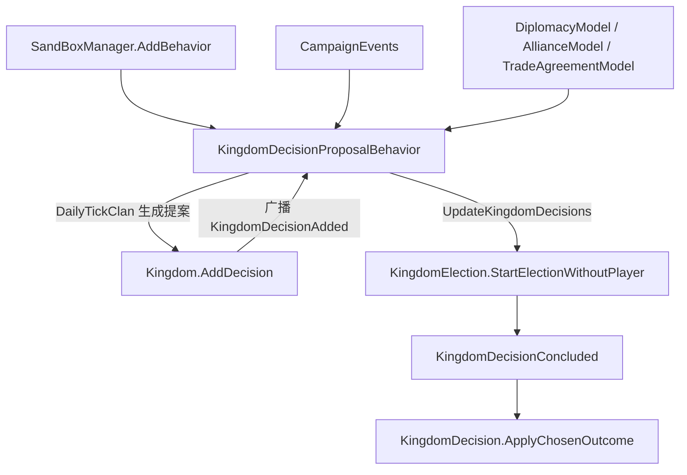

# KingdomDecisionProposalBehavior

**命名空间：** `TaleWorlds.CampaignSystem.CampaignBehaviors`  
**模块：** `TaleWorlds.CampaignSystem`  
**类型：** `public class KingdomDecisionProposalBehavior : CampaignBehaviorBase`  
**源文件：** `Bannerlord.Source/bin/TaleWorlds.CampaignSystem/TaleWorlds.CampaignSystem.CampaignBehaviors/KingdomDecisionProposalBehavior.cs`

## 概述

`KingdomDecisionProposalBehavior` 是王国决策系统的“提案引擎”：它自己不持有决议业务数据，而是在每个家族的日 tick（`DailyTickClan`）里为影响力足够的家族按概率自动生成宣战、议和、结盟、政策、贸易协定与吞并等 `KingdomDecision` 子类，并通过 `Kingdom.AddDecision` 把它们推进进流程。同时它监听和平达成、宣战、王国覆灭、家族易主与决议入队等战役事件，在外交状态或王国结构变动时调用 `UpdateKingdomDecisions` 取消已经失效的提案、并启动其余决议的无玩家选举。它的内部“近 5 天提案列表”在 `SyncData` 中随存档序列化，因此读档后能继续按时间做去重。你通常不会手动 `new` 它——它由 `SandBoxManager` 在战役启动时注册，modder 通过 `Campaign.Current.GetCampaignBehavior<KingdomDecisionProposalBehavior>()` 取得只读引用，真正发起决议仍走 `Kingdom.AddDecision`。

## 心智模型

把 `KingdomDecisionProposalBehavior` 想成王国议会的“提案日程表管理员”。它在战役启动时由 `SandBoxManager` 通过 `CampaignGameStarter.AddBehavior(new KingdomDecisionProposalBehavior())` 注册为一个普通 `CampaignBehaviorBase`，之后完全靠事件驱动，对外并不暴露“提出决议”的显式 API——提案的唯一入口在 `Kingdom.AddDecision`。当一个家族（或玩家）调用 `Kingdom.AddDecision` 时，`Kingdom` 会把决议放进自己的 `_unresolvedDecisions` 列表并向外广播 `KingdomDecisionAdded`；本行为订阅该事件，把决议追加进内部 `_kingdomDecisionsList`（这个列表只用于 5 天去重，不反映全部未结决议）。真正“长草”的提案来自 `DailyTickClan`：每个非玩家、非强盗、影响力 ≥100 的家族按随机数被挑选，依次尝试生成和平 / 战争 / 结盟 / 贸易 / 政策 / 吞并决议，生成成功后仍然走 `Kingdom.AddDecision`。提案进入王国后，由 `HourlyTick`（仅玩家王国）、`DailyTick`（清理过期内部记录）、`OnPeaceMade` / `OnWarDeclared`（交战双方王国）、`OnKingdomDestroyed`、`OnClanChangedKingdom`（旧王国）所触发的 `UpdateKingdomDecisions` 推进：对 `ShouldBeCancelled()` 为真的项调用 `Kingdom.RemoveDecision` 并广播 `KingdomDecisionCancelled`，对其余“已过触发时间或非玩家项”用 `new KingdomElection(item).StartElectionWithoutPlayer()` 直接开票；最终裁定由 `KingdomElection` 广播 `KingdomDecisionConcluded` 并调用 `KingdomDecision.ApplyChosenOutcome` 改变世界。整个过程本行为只“生成与推进”，从不直接改写 `Kingdom` / `Clan` 字段。其内部 `_kingdomDecisionsList` 在 `SyncData` 中手动序列化，但本类没有任何 `[SaveableField]` 特性；真正的决议业务状态由 `Kingdom` 以 `[SaveableField]` 承载并随档恢复。

## 何时使用 / 何时不要使用

- **用**：想强制重算某个王国的未结决议（调用 `UpdateKingdomDecisions(Kingdom)`）；想拿到贸易协定相关行为（`TradeAgreementsCampaignBehavior`）；想观察提案流转时订阅 `KingdomDecisionAdded` / `KingdomDecisionConcluded` / `KingdomDecisionCancelled`。
- **用**：想在 mod 中发起一次自定义王国决议——构造 `KingdomDecision` 的子类实例并调用 `Kingdom.AddDecision`（见示例），从而自然地进入提案→选举→裁定流程，而不是直接改王国字段。
- **不要**：直接调用 `DailyTickClan` 等私有 tick 方法，或依赖内部 `_kingdomDecisionsList` 做枚举——它只是去重缓存，全部未结决议在 `Kingdom.UnresolvedDecisions`。
- **不要**：在 `ApplyChosenOutcome` 或任何地方直接改写 `Kingdom` / `Clan` 的外交字段——必须转交 `*Action` / `*Behavior`，否则与提案流程脱节、坏档。
- **不要**：在战役未启动（`Campaign.Current == null`）时取本行为或读取 `Kingdom.UnresolvedDecisions`。

## 依赖图



- 上游（谁注册 / 谁驱动 / 谁提供规则）：[CampaignEvents](../CampaignEvents) 的 `KingdomDecisionAdded`、`MakePeace`、`WarDeclared`、`KingdomDestroyed`、`OnClanChangedKingdom`、`DailyTickClan`、`HourlyTick`、`DailyTick` 事件是本行为唯一的输入；[Campaign](../Campaign) 与 [CampaignBehaviorBase](../CampaignBehaviorBase) 提供行为注册与生命周期；[KingdomDecisionPermissionModel](../KingdomDecisionPermissionModel)（默认 [DefaultKingdomDecisionPermissionModel](../DefaultKingdomDecisionPermissionModel)）决定各子类 `IsAllowed`；[DiplomacyModel](../DiplomacyModel) / [AllianceModel](../AllianceModel) / [TradeAgreementModel](../TradeAgreementModel) 提供影响力成本与可行性阈值。
- 提案入口：所有决议（无论 AI 还是玩家）都先经过 [Kingdom](../Kingdom) 的 `AddDecision`，再由 [Clan](../Clan) 提供发起方与表态方。
- 下游（结果作用于谁）：本行为生成的都是 `KingdomDecision` 子类——[DeclareWarDecision](../DeclareWarDecision)、[MakePeaceKingdomDecision](../MakePeaceKingdomDecision)、[StartAllianceDecision](../StartAllianceDecision)、[KingdomPolicyDecision](../KingdomPolicyDecision)、[TradeAgreementDecision](../TradeAgreementDecision)、[SettlementClaimantPreliminaryDecision](../SettlementClaimantPreliminaryDecision)；推进时通过 [KingdomElection](../KingdomElection) 借助 [DecisionOutcome](../DecisionOutcome) 与 [Supporter](../Supporter) 完成选举，最终由 `ApplyChosenOutcome` 改变世界。

## 风险

1. **战役未启动取行为**：`Campaign.Current.GetCampaignBehavior<KingdomDecisionProposalBehavior>()` 要求 `Campaign.Current` 非空且本行为已注册；在子模块加载早期、主菜单或编辑器上下文调用会得到 null 或未注册行为，直接解引用即崩溃。
2. **绕过提案流程直接改王国字段**：直接改写 `Kingdom` / `Clan` 的外交状态（如战争、和平、政策、贸易协定相关字段）而不经过 `Kingdom.AddDecision` + `ApplyChosenOutcome`，会与 `UpdateKingdomDecisions` 的取消 / 去重逻辑脱节，出现“已被作废却仍生效”或“状态不一致”的坏档。
3. **错误阶段调用 `UpdateKingdomDecisions`**：该方法会立即对未结决议启动无玩家选举并可能落地世界变更；在战役初始化 / 读档中途、各家族尚未就绪时调用，会让 AI 决议被提前裁定，副作用不可预期。
4. **`_kingdomDecisionsList` 不是完整决议状态**：它只是“近 5 天提案去重缓存”，不包含全部未结决议。用它枚举会漏掉更早或更晚的决议；查询全部请用 `Kingdom.UnresolvedDecisions`。
5. **序列化边界**：`_kingdomDecisionsList` 经 `SyncData` 手动序列化，并对 <v1.3.0 旧档兜底为空列表；决议对象本身随 `Kingdom` 以 `[SaveableField]` 存档。不要在本行为里额外缓存 `KingdomDecision` 引用指望跨档恢复——只缓存稳定 id，需要时从 `Kingdom.UnresolvedDecisions` 重新取。
6. **替换提案逻辑不完整**：若在自定义行为里也订阅 `DailyTickClan` 生成决议，必须仍走 `Kingdom.AddDecision`，否则不触发 `KingdomDecisionAdded` 与后续选举；若替换 `KingdomDecisionPermissionModel`，必须保证 `IsAllowed` 系列对所有子类一致，否则 `ShouldBeCancelled` 会误作废或误放行。

## 成员说明

### 生命周期与注册

- **`CampaignBehaviorBase` 基类与注册**  
  **用途 / Purpose：** 本行为由 `SandBoxManager` 在战役启动时 `gameStarter.AddBehavior(new KingdomDecisionProposalBehavior())` 注册，不提供可替换的“提案 API”。`RegisterEvents`（基类钩子）订阅八类事件：`DailyTickClan`、`HourlyTick`、`DailyTick`、`MakePeace`、`WarDeclared`、`KingdomDestroyed`、`OnClanChangedKingdom`、`KingdomDecisionAdded`。  
  **副作用：** 注册后即开始监听战役事件，按 tick 自动生成并推进决议。  
  **调用时机：** 战役初始化由引擎调用一次；modder 不应手动调用 `RegisterEvents`。

### 公开成员

- **`public ITradeAgreementsCampaignBehavior TradeAgreementsCampaignBehavior { get; }`**  
  **用途 / Purpose：** 惰性返回贸易协定行为：首次访问时通过 `Campaign.Current.GetCampaignBehavior<ITradeAgreementsCampaignBehavior>()` 取回并缓存到 `_tradeAgreementsBehavior`。它只在生成贸易协定提案（`GetRandomTradeAgreementDecision` / `ConsiderTradeAgreement`）时用来判断协定可行性与双方意愿。  
  **副作用：** 首次访问可能触发一次行为查找；若该行为未注册则返回 null（调用方已做 null 判空）。  
  **调用时机：** 引擎内部在贸易协定提案分支读取；modder 可只读使用。

- **`public override void UpdateKingdomDecisions(Kingdom kingdom)`**  
  **用途 / Purpose：** 推进某王国未结决议的唯一公开入口。它遍历 `kingdom.UnresolvedDecisions`：对 `ShouldBeCancelled()` 为真的决议调用 `kingdom.RemoveDecision` 并广播 `KingdomDecisionCancelled`（由 `DefaultLogsCampaignBehavior` 写日志）；对其余“非玩家项，或触发时间已过且不需要玩家裁定”的决议，用 `new KingdomElection(item).StartElectionWithoutPlayer()` 直接开票。玩家作为统治者时通常等待玩家裁定，不会走这条无玩家路径。  
  **副作用：** 可能通过选举落地真正改变王国外交 / 政策世界状态。  
  **调用时机：** 由 `HourlyTick`（玩家王国）、`OnPeaceMade` / `OnWarDeclared`（交战双方王国）、`OnKingdomDestroyed`、`OnClanChangedKingdom`（旧王国）触发；modder 也可主动调用以强制重算。

- **`public override void SyncData(IDataStore dataStore)`**  
  **用途 / Purpose：** 序列化入口，把内部 `_kingdomDecisionsList` 与存档同步；读档且旧版本低于 v1.3.0 且该列表为 null 时兜底为空列表。本类无任何 `[SaveableField]` 特性，是手写 `SyncData` 同步。  
  **副作用：** 读档时重建内部去重缓存；写档时把缓存写入存档。  
  **调用时机：** 存 / 读档时由存档系统调用；modder 不应手动调用。

### 私有 tick 与事件处理（不对外）

- **`DailyTickClan(Clan clan)`**  
  **用途 / Purpose：** 提案发动机。跳过玩家 / 已消灭 / 强盗 / 影响力 <100 的家族，按 `DiplomacyModel` 等给出的概率依次尝试生成和平、战争、结盟或贸易、政策、吞并决议；对宣战 / 议和还会额外检查双方是否已有同类未结提案以避免重复。生成成功后统一调用 `clan.Kingdom.AddDecision(kingdomDecision)`。  
  **副作用：** 向王国插入新决议，间接触发 `KingdomDecisionAdded` 与后续选举。  
  **调用时机：** 每个家族的日 tick；频率由引擎决定，modder 不应直接调用。

- **`HourlyTick()` / `DailyTick()`**  
  **用途 / Purpose：** `HourlyTick` 仅对玩家王国每时调用 `UpdateKingdomDecisions`；`DailyTick` 清理 `_kingdomDecisionsList` 中超过 5 天（`DaysBetweenSameProposal`）的内部提案记录，仅维护去重窗口。  
  **调用时机：** 每小时 / 每日 tick；纯内部维护。

- **`OnPeaceMade` / `OnWarDeclared` → `HandleDiplomaticChangeBetweenFactions`**  
  **用途 / Purpose：** 外交状态翻转时，对参战的两个 `Kingdom` 各调用一次 `UpdateKingdomDecisions`，使因和平 / 战争而失效的决议被及时作废或推进。  
  **调用时机：** 对应 `CampaignEvents.MakePeace` / `WarDeclared` 事件。

- **`OnKingdomDestroyed(Kingdom)` / `OnClanChangedKingdom(...)`**  
  **用途 / Purpose：** 王国覆灭或玩家家族易主时，对受影响王国（旧王国）调用 `UpdateKingdomDecisions`，清理悬空决议。  
  **调用时机：** 对应 `CampaignEvents.KingdomDestroyedEvent` / `OnClanChangedKingdomEvent`。

- **`OnKingdomDecisionAdded(KingdomDecision, bool)`**  
  **用途 / Purpose：** 订阅 `KingdomDecisionAdded`：每当任意决议经 `Kingdom.AddDecision` 入队，就把它追加进 `_kingdomDecisionsList`，作为后续 `DailyTickClan` 去重的依据。  
  **调用时机：** `Kingdom.AddDecision` 广播时自动触发；这是本行为与提案入口之间的桥梁。

## 示例

### 示例 1：取得行为、强制重算并订阅结论事件

```csharp
using TaleWorlds.CampaignSystem;
using TaleWorlds.CampaignSystem.CampaignBehaviors;
using TaleWorlds.CampaignSystem.Election;

if (Campaign.Current == null) return;

// 取得已注册的行为引用（只读使用，不要缓存到静态字段跨战役持有）
var proposal = Campaign.Current.GetCampaignBehavior<KingdomDecisionProposalBehavior>();

// 外交剧变后强制重算某个王国的未结决议
proposal.UpdateKingdomDecisions(Clan.PlayerClan.Kingdom);

// 观察提案流转：订阅结论事件
CampaignEvents.KingdomDecisionConcluded.AddNonSerializedListener(this, (decision, chosenOutcome, isPlayerInvolved) =>
{
    // decision 是裁定完成的 KingdomDecision，chosenOutcome 是选中的 DecisionOutcome
    InformationManager.DisplayMessage(new TextObject("{=}决议已裁定：{DECISION}", null));
});
```

### 示例 2：发起一次自定义王国决议（真实入口是 `Kingdom.AddDecision`）

```csharp
using TaleWorlds.CampaignSystem;
using TaleWorlds.CampaignSystem.Election;

if (Campaign.Current == null) return;

Kingdom playerKingdom = Clan.PlayerClan.Kingdom;
IFaction enemyKingdom = /* 你选定的敌对势力，通常为另一个 Kingdom */;

// 构造具体决议子类，再交给王国入队；提案引擎会监听 KingdomDecisionAdded 并推进
var declareWarDecision = new DeclareWarDecision(Clan.PlayerClan, enemyKingdom);
playerKingdom.AddDecision(declareWarDecision, ignoreInfluenceCost: false);
```

`AddDecision` 只是把决议入队并广播 `KingdomDecisionAdded`；随后 `KingdomDecisionProposalBehavior` 在 tick 中推进，`KingdomElection` 完成选举，`DeclareWarDecision.ApplyChosenOutcome` 才会调 `DeclareWarAction` 真正开战——绝不要跳过这一步直接改王国字段。

### 示例 3：在自定义子模块中注册一个替换提案逻辑的行为

```csharp
using TaleWorlds.CampaignSystem;
using TaleWorlds.CampaignSystem.CampaignBehaviors;
using TaleWorlds.MountAndBlade;

public class MySubModule : MBSubModuleBase
{
    protected override void InitializeGameStarter(CampaignGameStarter starter)
    {
        // 引擎已注册默认的 KingdomDecisionProposalBehavior；
        // 若你想叠加自定义提案逻辑，再 AddBehavior 一个派生行为即可
        starter.AddBehavior(new MyProposalBehavior());
    }
}
```

注意：自定义行为里生成决议仍必须走 `Kingdom.AddDecision`，否则不会触发 `KingdomDecisionAdded` 与后续选举。

## 参见

- ↑ 父级：[战役 API 索引](../)
- ↔ 同级（选举契约与提案）：[KingdomDecision](../KingdomDecision) · [DecisionOutcome](../DecisionOutcome) · [Supporter](../Supporter) · [KingdomElection](../KingdomElection) · [CampaignBehaviorBase](../CampaignBehaviorBase) · [CampaignEvents](../CampaignEvents)
- 下游（具体决议）：[DeclareWarDecision](../DeclareWarDecision) · [MakePeaceKingdomDecision](../MakePeaceKingdomDecision) · [StartAllianceDecision](../StartAllianceDecision) · [KingdomPolicyDecision](../KingdomPolicyDecision) · [TradeAgreementDecision](../TradeAgreementDecision) · [SettlementClaimantPreliminaryDecision](../SettlementClaimantPreliminaryDecision)
- 上游（规则与实体）：[Kingdom](../Kingdom) · [Clan](../Clan) · [Campaign](../Campaign) · [DiplomacyModel](../DiplomacyModel) · [AllianceModel](../AllianceModel) · [TradeAgreementModel](../TradeAgreementModel) · [PolicyObject](../PolicyObject) · [KingdomDecisionPermissionModel](../KingdomDecisionPermissionModel) · [DefaultKingdomDecisionPermissionModel](../DefaultKingdomDecisionPermissionModel)
