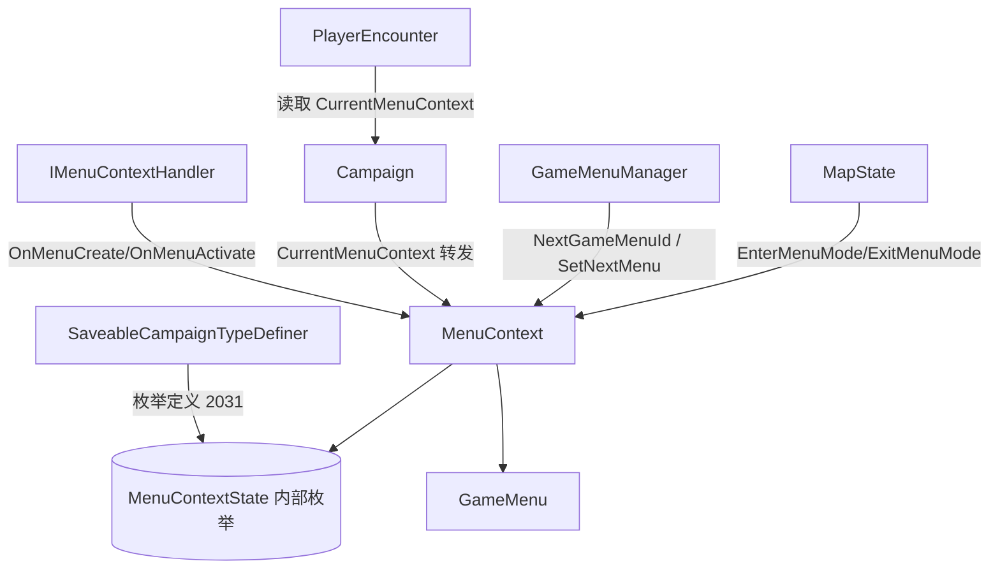

# MenuContextState

**命名空间:** `TaleWorlds.CampaignSystem.GameState`  
**模块:** `TaleWorlds.CampaignSystem`  
**类型:** `internal enum MenuContext.MenuContextState`（嵌套于 `class MenuContext` 内部，非公开类型）  
**源文件:** `bin/TaleWorlds.CampaignSystem/TaleWorlds.CampaignSystem.GameState/MenuContext.cs`（定义于 `MenuContext` 类体内）

## 概述

`MenuContextState` 是 `MenuContext` 内部的私有状态机枚举，描述一个战役地图菜单“游戏状态”当前处在创建流程的哪个阶段：尚未初始化、需要（重新）构建 `GameMenu`、刚刚构建完毕即将激活、还是已经被销毁出栈。它不对外公开，也不代表“玩家此刻在看哪个菜单”——后者由 `MenuContext.GameMenu.StringId` 表达。引擎通过这一枚举在 `Refresh` / `SwitchToMenu` / `HandleStates` / `Destroy` 之间推进菜单的加载、初始化与关闭，并把当前值以 `[SaveableField(102)]` 序列化进存档，由 `SaveableCampaignTypeDefiner` 以枚举定义号 `2031` 注册反序列化。

## 心智模型

把 `MenuContextState` 想成贴在每个地图菜单“游戏状态”背面的**工序进度条**，而不是给 mod 读取的开关：它只服务于引擎内部的菜单构建流水线。

- **它处在哪一层**：纯 Campaign / GameState 层，挂在 `MenuContext` 实例上（每个打开的地图菜单对应一个 `MenuContext`），与 `MapState` / `TutorialState` 的活跃游戏状态绑定。`Campaign.Current.CurrentMenuContext` 只是这两个状态的 `MenuContext` 属性的转发，并不是把枚举暴露出来。
- **生命周期与谁创建/转移**：菜单由 `MapState.EnterMenuMode()` 用 `MBObjectManager.CreateObject<MenuContext>()` 创建，随即 `Refresh()` 把 `_currentState` 置为 `RequiresCreation` 并跑 `HandleStates()`；菜单切换用 `SwitchToMenu(menuId)`（设置 `GameMenuManager.NextGameMenuId` 后再 `HandleStates`）；关闭由 `MapState.ExitMenuMode()` 调 `Destroy()` 置为 `Finalized`，随后 `UnregisterObject` 并把 `MapState.MenuContext` 置空。整个状态流转都在引擎内部，mod 没有公开 setter 可改它。
- **它和 Campaign / 据点 / 队伍的关系**：`MenuContext` 所服务的菜单，通常是因为玩家在 `Settlement` 中、与 `MobileParty` 遭遇、被 `PlayerEncounter` 接管或进入等待/围城而打开的。引擎借 `MenuContextState` 决定“菜单是否还在搭建中”“是否可以触发 `OnMenuCreate`/`OnMenuActivate`”。对 mod 而言，有意义的信号是「`CurrentMenuContext` 是否为 null」「`GameMenu.StringId` 是什么」「`IMenuContextHandler` 的 `OnMenuCreate`/`OnMenuActivate`/`OnMenuRefresh` 是否被回调」，而不是枚举本身。
- **何时读 / 何时不要动**：如果你想判断“当前有没有地图菜单开着 / 是否处于某菜单”，读 `Campaign.Current.CurrentMenuContext`（配合判空与 `GameMenu.StringId`），或订阅 `IMenuContextHandler`。不要试图保存 `MenuContextState` 的引用、也不要在菜单出栈后还拿着旧的 `MenuContext` 当有效句柄——枚举与实例都已随 `ExitMenuMode` 失效。它根本不是给 mod 写入或比较的入口。

## 何时使用 / 何时不要使用

- **用（引擎内部）**：`MenuContext.Refresh()` / `SwitchToMenu()` / `Destroy()` 在菜单开合、切换、刷新时推进这个枚举；`SaveableCampaignTypeDefiner` 用枚举定义号 `2031` 把它登记进存档类型表，使 `_currentState` 能被读档还原。
- **用（mod 观察菜单生命周期的正确方式）**：读 `Campaign.Current.CurrentMenuContext != null` 判断是否有菜单；读 `menuContext.GameMenu.StringId` 判断是哪一个菜单；实现 `IMenuContextHandler` 以在 `OnMenuCreate` / `OnMenuActivate` / `OnMenuRefresh` 中挂接逻辑。
- **不要用**：不要假设 `MenuContextState` 是 `public` 并去比较它——它是 `internal enum`，mod 程序集无法引用；不要保存跨存档的 `MenuContext` / `MenuContextState` 引用（读档后实例被重建）；不要在 `Destroy()` 之后对同一个 `MenuContext` 调 `Refresh()` / `InvokeConsequence`，此时状态已是 `Finalized`，`HandleStates` 会直接 return，等于空操作。

## 依赖图



- 上游 / 持有者：
  - [MenuContext](../MenuContext) 持有一份 `_currentState`（`[SaveableField(102)]`）并驱动状态机；本枚举就定义在它体内。
  - [MapState](../MapState) 真正创建 / 销毁 `MenuContext`（`EnterMenuMode` 用 `MBObjectManager.CreateObject<MenuContext>()`，`ExitMenuMode` 调 `Destroy()` 后 `UnregisterObject` 并置空）；[Campaign](../Campaign) 的 `CurrentMenuContext` 只是前两者 `MenuContext` 的转发。
  - [GameMenuManager](../GameMenuManager) 的 `NextGameMenuId` / `SetNextMenu` / `NextMenu` 决定 `HandleStates` 是否进入 `RequiresCreation` 并重新构建 `GameMenu`。
- 下游 / 触发入口：
  - [GameMenu](../GameMenu) 在 `RequiresCreation` 阶段被 `PreInit` / `RunOnInit` / `AfterInit`，其 `StringId` 是 mod 判断“当前是哪个菜单”的公开信号。
  - [IMenuContextHandler](../IMenuContextHandler) 的 `OnMenuCreate` / `OnMenuActivate` 在状态从 `RequiresInitialization` 转入 `None` 时被调用——这是 mod 感知“菜单已就绪”的官方钩子。
  - [PlayerEncounter](../PlayerEncounter) 等多个系统在逻辑前用 `Campaign.Current.CurrentMenuContext != null`（并比对 `GameMenu.StringId`，如 `"join_encounter"`）来决定是否执行菜单相关分支。
  - `SaveableCampaignTypeDefiner`（`TaleWorlds.CampaignSystem` 程序集内）以 `AddEnumDefinition(typeof(MenuContext.MenuContextState), 2031)` 注册本枚举，使 `_currentState` 可随菜单上下文序列化 / 反序列化。

## 风险

- **出栈后持有失效引用**：`MapState.ExitMenuMode()` 会把 `_currentState` 置为 `Finalized`、从 `MBObjectManager` 注销并把 `MenuContext` 置 `null`。此后 `Campaign.Current.CurrentMenuContext` 返回 `null`；若 mod 之前缓存了 `MenuContext` 或它的 `GameMenu` 引用，再用其 `InvokeConsequence` / `Refresh` 会作用于一个已被销毁的实例——`HandleStates` 在 `Finalized` 时直接 return，等于什么都没做，而依赖“菜单已处理”的后续逻辑会静默失效。
- **把内部枚举当公开开关**：`MenuContextState` 是 `internal enum`，mod 程序集无法引用，更没有公开的 `MenuContext.State` 属性。任何直接比较该枚举的代码都无法编译；判断“菜单是否开着”应改用 `Campaign.Current.CurrentMenuContext != null` 与 `GameMenu.StringId`。
- **菜单仍在搭建中就行动**：`Refresh()` 进入 `RequiresCreation` 后会重新 `PreInit` / `RunOnInit` 并可能 `RunConsequenceOfVirtualMenuOption(0)`（当 `GameMenu.AutoSelectFirst`）。如果在 `OnMenuCreate` / `OnMenuActivate` 之前（即状态还是 `RequiresCreation` / `RequiresInitialization`）就去读“当前选项”或触发后果，可能拿到尚未初始化完的菜单，或重复触发自动首选项。
- **跨存档引用失效**：`_currentState` 随 `MenuContext` 序列化（字段号 102）。读档时 `MapState` 重新 `CreateObject<MenuContext>()` 并 `Refresh()`，产生一个全新的 `MenuContext` 实例；旧引用不会更新到新实例。自定义 `CampaignBehavior` 若要记住“玩家正在哪个菜单”，应保存 `GameMenu.StringId` 这类稳定标识，加载完成后再从 `Campaign.Current.CurrentMenuContext` 取回，而不是直接持有 `MenuContext` 对象。
- **`Destroy` 后误触发**：`Finalized` 是终态。`PlayerCaptivity` 等逻辑在离开菜单时调 `GameMenu.ExitToLast()`，但若菜单已经 `ExitMenuMode` 过一次，`menuContext.Destroy()` 再跑也无副作用，只是重复置 `Finalized`；真正危险的是在 `Destroy` 后还调 `OnConsequence` / `SwitchToMenu`，此时 `GameMenu` 可能仍指向旧菜单但状态机已死，后果不可预期。

## 成员说明（枚举值）

| 值 | 含义 | 谁设置它 | 引发的行为 |
| --- | --- | --- | --- |
| `None` | 菜单已完全构建并激活，处于“运行中”的稳定态。 | `HandleStates()` 在 `RequiresInitialization` 分支把 `_currentState` 置为 `None`（紧接着触发 `OnMenuCreate` / `OnMenuActivate`）。 | 这是玩家正常看到、可交互菜单的常态。此时 `GameMenu` 已 `AfterInit`，`Handler` 已收到创建与激活回调；`Refresh()` 仍可再次把它打回 `RequiresCreation`。 |
| `RequiresCreation` | 需要从 `GameMenuManager.NextGameMenuId` 重新取出 `GameMenu` 并初始化。 | `Refresh()` 直接置为它；`HandleStates()` 在发现 `NextGameMenuId` 非空时也置为它。 | 进入 `while (RequiresCreation)` 循环：取 `NextMenu`、写 `mapState.GameMenuId`、`GameMenu.PreInit`、若 `AutoSelectFirst` 则 `RunConsequenceOfVirtualMenuOption(0)`、`GameMenu.RunOnInit`；当没有下一个菜单且未 `Finalized` 时转入 `RequiresInitialization`。 |
| `RequiresInitialization` | 菜单 `GameMenu` 已就绪，即将向 `Handler` 与回调系统广播“菜单已创建 / 已激活”。 | `HandleStates()` 在 `RequiresCreation` 循环结束后、确认无后续菜单时设置。 | 把 `_currentState` 置为 `None`，随后依次调用 `Handler.OnMenuCreate()`、`GameMenuCallbackManager.InitializeState(...)`、`GameMenu.AfterInit(this)`、`Handler.OnMenuActivate()`。 |
| `Finalized` | 菜单已被销毁、出栈，不再可用。 | `Destroy()`（由 `MapState.ExitMenuMode` 调用）设置。 | 终态。`HandleStates()` 开头即 `if (_currentState == Finalized) return;`，任何后续 `Refresh` / `SwitchToMenu` 都不再推进；随后 `MBObjectManager.UnregisterObject` 且 `MapState.MenuContext = null`。 |

> 引擎内部访问的是 `MenuContext` 上的私有字段 `_currentState`（`MenuContextState` 类型，标记 `[SaveableField(102)]`），并没有公开的 `State` 属性。因此成员说明描述的是枚举“代表什么、由谁推动、结果如何”，而非 mod 可调用的成员。

## 示例

### 示例 1：在 Behavior 中判断当前是否处于某个地图菜单（公开且真实的做法）

```csharp
using TaleWorlds.CampaignSystem;
using TaleWorlds.CampaignSystem.GameState;

// 引擎内部状态机不可直接读；用公开的 CurrentMenuContext 判断是否开着菜单
MenuContext menuContext = Campaign.Current.CurrentMenuContext;
if (menuContext != null && menuContext.GameMenu.StringId == "town_wait_menus")
{
    // 此处 MenuContextState 已进入 None：菜单已激活、Handler 已收到 OnMenuActivate
    // 可安全读取 GameMenu / 触发依赖菜单已就绪的逻辑
    if (MobileParty.MainParty.CurrentSettlement != null)
    {
        // 与 Settlement 关联的事件分支……
    }
}
```

`Campaign.Current.CurrentMenuContext` 转发自 `MapState.MenuContext`（或 `TutorialState.MenuContext`），菜单关闭后返回 `null`；`GameMenu.StringId` 才是区分“是哪个菜单”的公开字段，与内部 `MenuContextState` 互不替代。

### 示例 2：在某遭遇/围城菜单中强制刷新（引擎既有用法）

```csharp
using TaleWorlds.CampaignSystem;

// 当玩家正停留在“围城策略”菜单时，刷新它（引擎内部会重新走 RequiresCreation -> None）
if (Campaign.Current.CurrentMenuContext != null &&
    Campaign.Current.Models.EncounterGameMenuModel.GetGenericStateMenu() == "menu_siege_strategies")
{
    Campaign.Current.CurrentMenuContext.Refresh();
}
```

此模式来自 `SiegeEventCampaignBehavior` 与 `BesiegerCamp`（对 `CurrentMenuContext?.Refresh()` 的调用）：刷新会把 `_currentState` 重置为 `RequiresCreation` 并重建 `GameMenu`，但前提是菜单尚未 `Destroy()`；若已在 `Finalized`，`Refresh` 不会重新打开菜单。

## 参见

- ↑ 父级：[Campaign API 索引](../)
- ↔ 容器与状态机：[MenuContext](../MenuContext)
- ↔ 持有 / 转发菜单上下文：[Campaign](../Campaign)（经 `CurrentMenuContext`）· [MapState](../MapState)（`EnterMenuMode` / `ExitMenuMode`）
- ↔ 菜单与切换驱动：[GameMenu](../GameMenu)（菜单内容，`StringId` 用于判类）· [GameMenuManager](../GameMenuManager)（`NextGameMenuId` / `SetNextMenu` 触发 `RequiresCreation`）
- ↔ 生命周期钩子：[IMenuContextHandler](../IMenuContextHandler)（`OnMenuCreate` / `OnMenuActivate` 在 `RequiresInitialization -> None` 时回调）
- ↔ 相关系统：[PlayerEncounter](../PlayerEncounter)（按 `CurrentMenuContext` 与 `"join_encounter"` 菜单分支）· [PlayerCaptivity](../PlayerCaptivity)（离开菜单时 `GameMenu.ExitToLast`）
