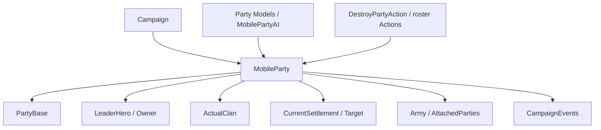

# MobileParty

**命名空间:** `TaleWorlds.CampaignSystem.Party`  
**模块:** `TaleWorlds.CampaignSystem`  
**类型:** `public sealed class MobileParty : CampaignObjectBase, ILocatable<MobileParty>, IMapPoint, ITrackableCampaignObject, ITrackableBase, IRandomOwner`  
**基类:** `CampaignObjectBase`  
**源文件:** `bin/TaleWorlds.CampaignSystem/TaleWorlds.CampaignSystem.Party/MobileParty.cs`

## 一句话职责

`MobileParty` 是战役地图上会移动、交易、战斗和加入军队的队伍实体；它把 `PartyBase` 的 roster 和战斗外壳接到领袖、派系、AI、路径和 Campaign 事件。

## 心智模型

### 它是什么

`MobileParty` 是移动行为的拥有者，`Party` 属性则是它用于遭遇、兵员和物品的 [PartyBase](../PartyBase) 外壳。`LeaderHero`、`Owner`、`ActualClan`、`CurrentSettlement`、`Army`、`AttachedTo` 和 `Ai` 共同描述队伍在世界中的位置与组织关系。`MemberRoster`、`PrisonRoster` 和 `ItemRoster` 通过 `Party` 暴露，不应脱离 PartyBase 单独维护。

`MobileParty.MainParty`、`MobileParty.All` 及分类集合都来自当前 [Campaign](../Campaign)。速度、工资、食物、士气和视野等值由 [GameModelsManager](../../core-extra/GameModelsManager/) 计算；它们是当前条件下的结果，不是 mod 应长期写入的配置字段。

### 生命周期与持有关系

- **创建/注册：** `MobileParty.CreateParty(stringID, PartyComponent)` 创建队伍、PartyBase 和组件，调用组件初始化并注册到 Campaign；随后需用 `InitializeMobilePartyAtPosition` 或相关初始化方法放入地图。
- **运行中：** 队伍连接 `Hero` 领袖、`Clan` 派系、`Settlement` 目标/当前位置、`Army`、附属队伍、地图事件和攻城事件。
- **移动/附属：** `SetMove*`、`SetTargetSettlement` 和 `AttachedTo` 会同步位置、路径、视觉状态、军队和海陆能力；不要只改 `Position` 或目标字段。
- **销毁/读档：** [DestroyPartyAction](../../campaign-ext/DestroyPartyAction) 最终会清空 roster、解除军队/围城/附属关系并从 Campaign 移除。读档会重建组件、路径和 AI，旧对象引用不能当永久句柄。

### 何时用，何时不用

- **使用：** 读取玩家队伍、队伍领袖、兵员/俘虏/物品、当前位置、目标、军队、派系、速度、食物和 AI 状态。
- **使用：** 通过 `MobileParty.MainParty`、`MobileParty.All`、分类集合或 `Settlement.Parties` 获得已注册队伍。
- **不要直接创建半成品：** 创建自定义队伍时走 `CreateParty` + 组件初始化路径，确保 PartyBase、事件和 Campaign 注册完成。
- **不要把计算属性当持久字段：** `TotalWage`、`Food`、`SeeingRange`、`Speed` 和 `Morale` 依赖当前 Model、Roster 和位置；要改规则请替换/扩展 Model，而不是每 tick 写结果。
- **不要直接销毁或拆解 PartyBase：** 用 `DestroyPartyAction`、队伍/俘虏/领袖相关 Action，保持 Hero、Roster、Army 和地图定位器一致。

## 依赖图



### 上游与持有者

- [Campaign](../Campaign) 提供队伍集合、模型、地图时间和 Campaign 事件；`MobileParty.All` 不是跨存档集合。
- [PartyBase](../PartyBase) 提供 `MemberRoster`、`PrisonRoster`、`ItemRoster`、`MapEventSide` 和战斗交互；[Hero](../Hero) 通过领袖/所属关系接入。
- [Clan](../Clan)、[Settlement](../Settlement) 和 [Kingdom](../Kingdom) 提供派系、驻地、领地和军队上下文。

### 下游与变更入口

- `CampaignEvents` 的 Party 创建/销毁、进入据点、地图事件和军队事件是长期 Behavior 的观察点。
- [PartySpeedModel](../PartySpeedModel)、[PartyWageModel](../PartyWageModel)、[PartyMoraleModel](../PartyMoraleModel)、[MobilePartyAi](../MobilePartyAi) 计算或驱动队伍结果；Model/AI 与 Action 职责不同。
- [DestroyPartyAction](../../campaign-ext/DestroyPartyAction)、[AddHeroToPartyAction](../../campaign-ext/AddHeroToPartyAction) 和 roster/captivity Actions 负责改变队伍关系。

## 关键成员与调用时机

### 队伍身份与 roster

| 成员 | 用途、副作用与时机 |
| --- | --- |
| `MainParty`、`All`、`AllLordParties`、`AllCaravanParties` | 获取当前 Campaign 的玩家队伍或分类集合。读取前确认 Campaign，遍历后执行销毁 Action 前先复制结果。 |
| `Party`、`MemberRoster`、`PrisonRoster`、`ItemRoster` | 读取/委托兵员、俘虏和物品状态。Roster 改变会回调 Hero 所属关系和战斗统计，不能只改 Hero 端。 |
| `PartyComponent`、`LordPartyComponent`、`CaravanPartyComponent`、`WarPartyComponent` | 读取队伍具体职责；组件创建/替换会重新建立旗帜、主人、AI 和分类标记，应使用初始化流程。 |
| `LeaderHero`、`Owner`、`ActualClan` | 读取队伍领袖、经济主人和实际家族。领袖死亡、换领袖或家族变更会影响工资、名称、军队和地图显示。 |

### 位置、目标与 AI

| 成员 | 用途、副作用与时机 |
| --- | --- |
| `CurrentSettlement`、`Position`、`IsCurrentlyAtSea` | 查询当前地图位置和海陆状态。setter 会同步 Settlement 的队伍缓存、附属队伍和视觉状态，不要把它当简单坐标赋值。 |
| `TargetParty`、`ShortTermTargetParty`、`ShortTermTargetSettlement` | 区分长期目标和 AI 短期目标；目标可能在下一个 tick 被 AI 重算。 |
| `Ai`、`Objective`、`ThinkParamsCache` | 读取 AI 当前决策上下文。要改变移动意图调用 `SetMoveGoToSettlement`、`SetMoveEngageParty` 等方法，不要改缓存对象。 |
| `Army`、`AttachedTo`、`AttachedParties` | 读取军队/附属关系。加入、分离、解散或围城期间会同步 MapEvent、Siege 和位置，不能只设置一侧。 |

### 计算结果

| 成员 | 用途、副作用与时机 |
| --- | --- |
| `TotalWage`、`PaymentLimit` | 根据 roster 和 `PartyWageModel` 得到当前工资/付款上限；适合经济判断，不是应写回的预算字段。 |
| `Food`、`BaseFoodChange`、`Morale`、`SeeingRange` | 由库存、时间、位置和 Campaign Models 计算，可能随 tick 改变。缓存结果必须有明确过期策略。 |
| `PartySizeRatio`、`TotalLandStrengthWithFollowers` | 读取容量和军事力量上下文；军队/附属队伍会改变结果，不能当作单个 party 的永久战力。 |

## Action、事件与 Model 边界

| 目标 | 正确入口 | 风险 |
| --- | --- | --- |
| 创建自定义队伍 | `MobileParty.CreateParty` + `InitializeMobileParty*` | 漏掉 PartyComponent、PartyBase 或注册会生成没有 roster/定位器的半成品。 |
| 移动到据点/目标 | `SetMoveGoToSettlement`、`SetTargetSettlement` | 直接写位置或目标跳过路径、海陆和视觉同步。 |
| 让英雄加入/离开队伍 | `AddHeroToPartyAction`、`LeavePartyAction` 等 | PartyBase roster 与 Hero `PartyBelongedTo` 必须同时更新。 |
| 销毁队伍 | `DestroyPartyAction.Apply` 的匹配入口 | 直接清空 roster 不会解除 Army、Siege、附属关系和 Campaign 注册。 |
| 改工资/速度规则 | `PartyWageModel`、`PartySpeedModel` | 这些 Model 计算结果，不是用来提交队伍变更的 Action。 |

## 风险边界

- **对象注册：** `CreateParty` 依赖当前 Campaign；在模块加载、主菜单或 Campaign 卸载阶段创建会缺少对象管理器和地图上下文。
- **双向同步：** `PartyBase`、Hero、Settlement、Army 和 `AttachedParties` 互相更新。只改 `CurrentSettlement`、roster 或 `Hero.PartyBelongedTo` 的一侧会产生“英雄在 roster 但不属于队伍”等坏状态。
- **销毁清理：** `DestroyPartyAction` 会清空兵员、俘虏、物品并解除军队/围城/附属关系；销毁后的 Party/PartyBase 缓存可能失效，不要在后续 tick 继续使用。
- **短命目标：** `TargetParty`、AI target、MapEvent 和 SiegeEvent 都可能在当前回调后变为 `null`；事件处理先判空并重新获取。
- **计算时机：** Food、wage、morale、speed、seeing range 依赖 Models 和当前地图状态；不要在每日 tick 外用旧结果覆盖新状态。
- **存档顺序：** 读档会重建组件、路径、Anchor 和 AI。自定义 Behavior 保存队伍 StringId，读档完成后再用 Campaign 集合查找，不保存 `PartyBase` 或 AI 缓存。

## 真实示例

### 读取玩家队伍并安全检查目标

```csharp
using TaleWorlds.CampaignSystem;

MobileParty party = MobileParty.MainParty;
if (party != null && party.LeaderHero != null && party.CurrentSettlement == null)
{
    Settlement target = party.ShortTermTargetSettlement;
    float food = party.Food;
    int wage = party.TotalWage;
}
```

这些值来自当前玩家队伍和 AI/Model 结果；`ShortTermTargetSettlement`、Food 和工资都可能在下一个 tick 变化。

### 用真实队伍入口设置移动目标

```csharp
using TaleWorlds.CampaignSystem;
using TaleWorlds.CampaignSystem.Party;

MobileParty party = MobileParty.MainParty;
Settlement target = Settlement.Find("town_1");
if (party != null && target != null && party.LeaderHero != null)
{
    party.SetMoveGoToSettlement(target, NavigationType.Default, isTargetingThePort: false);
}
```

移动方法会让 AI、路径和位置状态使用同一入口；它不是把队伍瞬移到据点。目标和队伍在执行时仍可能因遭遇、攻城或地图状态失效。

## 版本注记

本页以 v1.4.5 `TaleWorlds.CampaignSystem.Party/MobileParty.cs`、PartyBase、PartyComponent 和相关 Action/Model 源码为准。跨版本使用时重新检查 `CreateParty`、导航参数、海军属性和队伍组件集合。

## 导航

- ↑ 父级：[Campaign API](../)
- ↔ 同级：[Hero](../Hero) · [Clan](../Clan) · [Kingdom](../Kingdom) · [Settlement](../Settlement) · [PartyBase](../PartyBase)
- 子级/相关：[CampaignEvents](../CampaignEvents) · [PartyComponent](../PartyComponent) · [MobilePartyAi](../MobilePartyAi) · [PartySpeedModel](../PartySpeedModel) · [PartyWageModel](../PartyWageModel) · [AddHeroToPartyAction](../../campaign-ext/AddHeroToPartyAction) · [DestroyPartyAction](../../campaign-ext/DestroyPartyAction)
