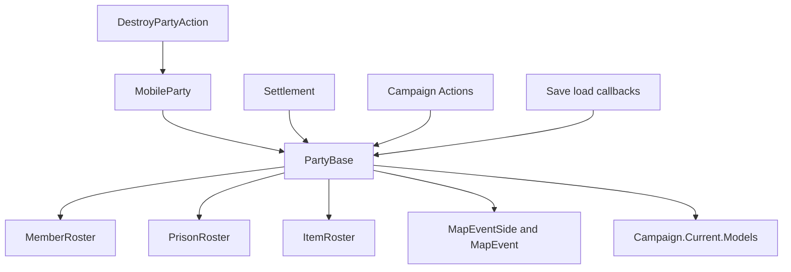

# PartyBase

**命名空间：** `TaleWorlds.CampaignSystem.Party`  
**模块：** `TaleWorlds.CampaignSystem`  
**类型：** `public sealed class PartyBase : IBattleCombatant, IRandomOwner, IInteractablePoint`  
**基类：** `System.Object`  
**源码：** `bin/TaleWorlds.CampaignSystem/TaleWorlds.CampaignSystem.Party/PartyBase.cs`

## 一句话职责

`PartyBase` 是战役地图上统一的“可交战、可交互、带名册的部队外壳”：它由一个 [MobileParty](../MobileParty) 或 [Settlement](../Settlement) 创建并持有，让遭遇、名册与 Model 可以用同一种参数处理移动队伍和据点。

## 心智模型：宿主的运行时边界，不是可自由创建的队伍

它不是独立世界对象，也不是让 modder 继承的抽象基类。移动部队构造时执行 `Party = new PartyBase(this)`；据点构造时同样执行 `Party = new PartyBase(this)`。随后宿主负责注册、位置、地图可见性、进入据点、销毁和存档恢复。`PartyBase` 只把这些宿主的地图身份与自己的成员、俘虏、物品名册放到同一个接口后面。

因此，取得它的正常入口是：

- 玩家队伍：`MobileParty.MainParty.Party`，或需要允许战役尚未存在时用 `PartyBase.MainParty`；后者在 `Campaign.Current` 为 `null` 时返回 `null`。
- 已有移动队伍：`mobileParty.Party`。
- 据点守军/据点交互方：`settlement.Party`。

不要 `new PartyBase(...)`，也不要把一个脱离宿主的实例塞进自己的长期状态。构造器会请求 `Campaign.Current.GeneratePartyId(this)` 并新建三份 roster，却不会替你注册移动队伍、建立据点组件、加入定位器或接上销毁事件。即使临时看起来能读取名册，也会成为没有地图生命周期的孤儿。

#### 生命周期

1. **宿主创建：** `MobileParty` 或 `Settlement` 的构造器创建并保存唯一的 `Party`；此时 `MemberRoster`、`PrisonRoster` 和 `ItemRoster` 已建立。
2. **地图运行：** `Position`、`IsVisible`、`IsActive`、`SiegeEvent`、`Banner` 和默认 owner 委托给宿主。移动队伍进入遭遇时，`MapEventSide` 把它接到 `MapEvent` 的一侧。
3. **遭遇结算：** `MapEventSide` 是短寿命关系。setter 会从旧侧移除、加入新侧；移动宿主在导航过渡时会取消过渡，并把所有 attached parties 同步到同一侧。
4. **读档修复：** 加载初始化会清空容量、马匹、兵种等级和预估战力缓存。`MobileParty.AfterLoad` 与 `Settlement.AfterLoad` 都调用 `Party.AfterLoad()`；版本迁移时它会修复玩家英雄/其他英雄的俘虏 roster 冲突、旧零计数和旧 caravan custom owner。
5. **销毁：** [DestroyPartyAction](../../campaign-ext/DestroyPartyAction) 只会移除非 `MobileParty.MainParty` 的移动队伍；它对主队伍命中保护分支，不调用 `RemoveParty()`。对确实会被销毁的队伍，Action 先派发移动队伍和地图交互物销毁事件，再移除宿主；任何先前缓存的 `MobileParty`/`PartyBase` 都不应再被当作可用的地图主体。

## 何时使用，何时不要使用

**适合：**

- 你的 Behavior、Model 或事件参数已经给出 `PartyBase`，需要不区分移动队伍和据点地读取名册、owner、位置、容量、战力或当前遭遇。
- 需要把 `MobileParty.Party` 和 `Settlement.Party` 一起放入同一套只读筛选或战斗规则。
- 需要为 UI 读取 `PartySizeLimitExplainer`、治疗解释或当前 roster 派生统计。

**不要：**

- 不要把 `PartyBase` 当成创建新部队的 API；创建/注册移动队伍应使用相应的 `MobileParty`/组件创建流程，据点应从 `Settlement.Party` 取得。
- 不要在没有先判 `IsMobile` 或 `IsSettlement` 时访问宿主专有成员；另一端引用必为 `null`。
- 不要用 `AddMember`、`AddPrisoner` 来替代英雄加入、英雄俘虏、转移或销毁的 Action。它们是 roster 计数封装；Hero 数量变化会触发 `PartyBase.OnHeroAdded`/`OnHeroRemoved`：移动宿主的成员 roster 回调更新 `PartyBelongedTo`，俘虏 roster 回调更新 `PartyBelongedToAsPrisoner`，而据点宿主的成员 roster 不会建立移动队伍成员关系。它们仍不会完成 Action 的全部职责，例如囚禁时间、玩家囚禁、停留据点、总督处理和完整事件级联。
- 不要手设 `MapEventSide` 来“拉人进战斗”；用 [StartBattleAction](../../campaign-ext/StartBattleAction) 或 Encounter 流程建立事件。

## 依赖图



#### 上游、下游与真实消费者

- [MobileParty](../MobileParty) 与 [Settlement](../Settlement) 是所有权边界；`PartyBase.MainParty` 只是 `Campaign.Current.MainParty.Party` 的便利访问，不是第二个玩家队伍。
- `MemberRoster`、`PrisonRoster` 和 `ItemRoster` 是保存的对象图成员；名册变更会递增 `VersionNo`，供容量和统计缓存失效使用。
- [SaveManager](../../save-system/SaveManager) 负责保存图的序列化与读档恢复；自定义 Behavior 应保存宿主稳定 ID，而不是把运行时 `PartyBase` 引用复制到自己的数据中。
- [EncounterModel](../EncounterModel) 用它判断玩家指挥关系、交互距离并创建遭遇；[StartBattleAction](../../campaign-ext/StartBattleAction) 以两份 `PartyBase` 作为攻击/防御方，并让 EncounterModel 创建 `MapEvent`。
- [PartySizeLimitModel](../PartySizeLimitModel)、[PartyHealingModel](../PartyHealingModel)、[MilitaryPowerModel](../MilitaryPowerModel) 和 [MapVisibilityModel](../MapVisibilityModel) 读取 PartyBase 及其宿主状态来计算规则。Model 是计算边界，不是把结果写回 PartyBase 的替代品。
- [TakePrisonerAction](../../campaign-ext/TakePrisonerAction)、[TransferPrisonerAction](../../campaign-ext/TransferPrisonerAction) 和 [AddHeroToPartyAction](../../campaign-ext/AddHeroToPartyAction) 才是英雄状态迁移的入口；[DestroyPartyAction](../../campaign-ext/DestroyPartyAction) 才是移动宿主的终结入口。

## 关键成员、调用时机与副作用

#### 宿主、身份和所有者

| 成员 | 语义与时机 |
| --- | --- |
| `IsMobile` / `IsSettlement` | 先用它们选择宿主分支。正常 PartyBase 应恰好对应一个宿主，代码仍应防御性地处理无宿主的异常/加载时刻。 |
| `MobileParty` / `Settlement` | 对应宿主；读取另一个形态的引用会得到 `null`。 |
| `MainParty` | `Campaign.Current` 缺失时为 `null`，否则等于玩家 `MobileParty.Party`。适合延迟初始化后的查询，不适合模块加载阶段的静态缓存。 |
| `Id` / `Index` / `IsValid` | `Id` 取移动队伍或据点的 `StringId`；`Index >= 0` 才有效。自定义存档应优先保存宿主稳定 ID，而不是 Index 或对象引用。 |
| `Owner` / `LeaderHero` | `Owner` 优先 `_customOwner`，再委托给据点 owner 或移动队伍 owner；`LeaderHero` 只来自移动宿主。custom owner 不会自动改变队伍领导者或政治归属。 |
| `MapFaction` / `Culture` | MapFaction 由宿主转发；`Culture` 直接读取 `MapFaction.Culture`，所以没有有效阵营的中间态不能无条件读取它。 |
| `Position` / `IsActive` / `IsVisible` / `SiegeEvent` | 均由宿主当前状态转发。特别是 `IsActive` 为 false 或销毁事件之后，不能把旧引用当作仍可交互的对象。 |

#### 名册、容量和缓存

| 成员 | 语义与时机 |
| --- | --- |
| `MemberRoster` / `PrisonRoster` / `ItemRoster` | 三者是 PartyBase 保存图的一部分。普通 troop 的短小、局部 roster 变更可通过封装完成；涉及 Hero 或世界移动时改走 Action。 |
| `PartySizeLimit` / `PrisonerSizeLimit` | 分别按对应 roster 的 `VersionNo` 缓存 `PartySizeLimitModel` 结果。读取要求 Campaign 与 Models 已准备好；不要把返回值当持久上限。 |
| `PartySizeLimitExplainer` / `PrisonerSizeLimitExplainer` | 每次向 Model 请求带描述的 `ExplainedNumber`，是 tooltip/诊断的正确读取入口。 |
| `NumberOfHealthyMembers` / `NumberOfAllMembers` / `NumberOfPrisoners` | roster 的派生统计；它们不等于可立即参战人数在所有 encounter context 下的最终结果。 |
| `NumberOfMenWithHorse` / `GetNumberOfHealthyMenOfTier` | 按 `MemberRoster.VersionNo` 缓存。直接替换 roster 或绕过计数 API 会让调用者对缓存更新作出错误假设。 |
| `EstimatedStrength` / `CalculateCurrentStrength()` | 前者按 roster、海上船只和当前战斗侧缓存“估计”值；后者用当前位置和 MapEvent context 计算当前值。都依赖 `MilitaryPowerModel`，不应用于存档字段或跨 tick 长期缓存。 |

#### 遭遇、视觉和名册封装

| 成员 | 语义与时机 |
| --- | --- |
| `MapEvent` / `MapEventSide` / `Side` | 只表示当前地图事件关系。`MapEventSide` setter 有移除、加入、取消导航与附属队同步副作用；只能由 encounter/Action 内部流程维护。 |
| `SetCustomName` / `SetCustomBanner` | 修改保存的自定义显示值并标记视觉为 dirty；据点名字还会重新绑定 settlement text properties。它们不改变宿主 ID、阵营或 owner。 |
| `OnVisibilityChanged` | 通知当前 MapEvent、CampaignEventDispatcher 并标记视觉 dirty；这是引擎地图可见性流的一部分，不是手动刷新 roster 的钩子。 |
| `AddMember` / `AddPrisoner` / `AddMembers` / `AddPrisoners` | `TroopRoster` 计数入口。Hero 数量变化会触发 `PartyBase.OnHeroAdded`/`OnHeroRemoved`：移动宿主的成员 roster 回调更新 `PartyBelongedTo`，俘虏 roster 回调更新 `PartyBelongedToAsPrisoner`，而据点宿主的成员 roster 不会建立移动队伍成员关系；这些 wrapper 仍不会替代 Action 的完整职责，如 `CaptivityStartTime`、玩家囚禁、停留据点、总督处理和完整事件级联。 |

## Action 边界

| 目标 | 正确入口 | 为什么不能只改 PartyBase |
| --- | --- | --- |
| 开始野战、劫掠、突围或攻城 | `StartBattleAction.ApplyStartBattle`、`ApplyStartRaid`、`ApplyStartSallyOut`、`ApplyStartAssaultAgainstWalls` | Action 通过 EncounterModel 创建/复用 MapEvent 并选择事件类型。 |
| 将英雄变为俘虏 | `TakePrisonerAction.Apply` | 移除旧成员关系，设置囚禁开始时间与英雄状态，处理玩家囚禁/船只，清理停留据点并派发事件。 |
| 转移一个普通英雄俘虏 | `TransferPrisonerAction.Apply` | 普通英雄会从原 roster 移除并加入新 roster；若 `prisonerTroop.HeroObject == Hero.MainHero`，Action 只更新 `PlayerCaptivity.CaptorParty` 后返回，不移动两边的 roster 项。 |
| 将英雄加入移动队伍 | `AddHeroToPartyAction.Apply` | 清除旧成员与停留据点，移除总督身份，加入成员 roster，并派发英雄加入事件。它的目标是 `MobileParty`，不是任意据点 PartyBase。 |
| 销毁非主移动队伍 | `DestroyPartyAction.Apply` 或 `ApplyForDisbanding` | Action 跳过 `MobileParty.MainParty`；对非主队伍派发销毁/解散事件，处理 caravan 保险，再由 `MobileParty.RemoveParty()` 移除地图对象。 |

## 真实示例

### 从玩家移动队伍和当前据点取得宿主 PartyBase

```csharp
using TaleWorlds.CampaignSystem;
using TaleWorlds.CampaignSystem.Party;
using TaleWorlds.CampaignSystem.Settlements;

PartyBase playerParty = MobileParty.MainParty.Party;
int healthyMembers = playerParty.NumberOfHealthyMembers;
int memberLimit = playerParty.PartySizeLimit;

Settlement settlement = MobileParty.MainParty.CurrentSettlement;
if (settlement != null)
{
    PartyBase settlementParty = settlement.Party;
    bool isSettlementHost = settlementParty.IsSettlement;
    int prisoners = settlementParty.NumberOfPrisoners;
}
```

两个入口都返回宿主已经注册的实例。示例只读查询；据点 party 不是可以替换成另一份 PartyBase 的容器。

### 从已有移动队伍安全读取，并用 Action 转移真正的俘虏

```csharp
using System.Linq;
using TaleWorlds.CampaignSystem;
using TaleWorlds.CampaignSystem.Actions;
using TaleWorlds.CampaignSystem.Party;

PartyBase source = MobileParty.MainParty.Party;
MobileParty recipientMobileParty = MobileParty.All.FirstOrDefault(
    party => party != MobileParty.MainParty && party.IsActive);
CharacterObject prisoner = source.PrisonerHeroes.FirstOrDefault(
    character => character.HeroObject != Hero.MainHero);

if (recipientMobileParty != null && prisoner != null && source.MapEvent == null)
{
    TransferPrisonerAction.Apply(prisoner, source, recipientMobileParty.Party);
}
```

`PrisonerHeroes` 来自 source roster，示例明确排除了 `Hero.MainHero`，因为 `TransferPrisonerAction` 对主英雄只更新 `PlayerCaptivity.CaptorParty` 而不会移动 roster。接收方来自现有、活跃的移动宿主；示例仍应由 mod 自己的玩法条件决定是否允许转移。

## 存档、缓存与销毁风险

1. **保存的是关系，缓存不是事实。** rosters、宿主引用、custom owner、map-event side、食物状态和船只在保存图中；容量、马匹/等级统计和预估战力带 `[CachedData]`，加载时会重置。不要存下 `PartySizeLimit`、`EstimatedStrength` 或 map-event 推导结果，再在读档后把旧值写回。
2. **旧存档修复会改 roster。** `PartyBase.AfterLoad()` 会在版本迁移时协调玩家与其他英雄的囚禁关系、移除不合法的英雄俘虏项并让英雄逃亡、清零旧 roster 项。自定义 Behavior 应保存宿主 `StringId`，在 Campaign 加载完成后重新获取并重新验证 roster。
3. **地图事件引用会过期。** `MapEvent` 和 `MapEventSide` 可以在结算、围城结束、转场或销毁后断开。事件回调外不要持有它们作为长期身份；保存队伍/据点 ID 后按需重新找宿主。
4. **销毁不是清空 roster。** `DestroyPartyAction` 接受 `MobileParty`，但会跳过 `MobileParty.MainParty`；对非主队伍才会在移除宿主前派发销毁事件。手动清空 roster、设置 inactive 或解除 `MapEventSide` 不能代替销毁流程，容易留下 locator、遭遇或监听者的悬挂关系。
5. **Campaign 相位要求。** `MainParty`、容量、治疗、战力、可见性和交互都读取 `Campaign.Current` 或 Models。主菜单、Campaign 构造/销毁以及尚未完成加载的阶段应延迟读取，并在使用处判空。

## 版本注记

本页以 v1.4.5 decompiled `PartyBase.cs`、`MobileParty.cs`、`Settlement.cs` 和五个 Action 的真实实现为准。该源码显示 `[SaveableProperty]` roster/宿主关系与 `[CachedData]` 计算结果并存；跨版本时应重新核对迁移分支、MapEvent side 行为和 Action 参数。

## 导航

- ↑ 父级：[Campaign API](../)
- ↔ 同级：[MobileParty](../MobileParty) · [Settlement](../Settlement) · [Hero](../Hero) · [CampaignEvents](../CampaignEvents)
- 相关：[Campaign](../Campaign) · [MapEvent](../MapEvent) · [SiegeEvent](../SiegeEvent) · [EncounterModel](../EncounterModel) · [PartySizeLimitModel](../PartySizeLimitModel) · [PartyHealingModel](../PartyHealingModel) · [StartBattleAction](../../campaign-ext/StartBattleAction) · [TakePrisonerAction](../../campaign-ext/TakePrisonerAction) · [TransferPrisonerAction](../../campaign-ext/TransferPrisonerAction) · [AddHeroToPartyAction](../../campaign-ext/AddHeroToPartyAction) · [DestroyPartyAction](../../campaign-ext/DestroyPartyAction) · [战役路线图](../../../architecture/roadmap)
