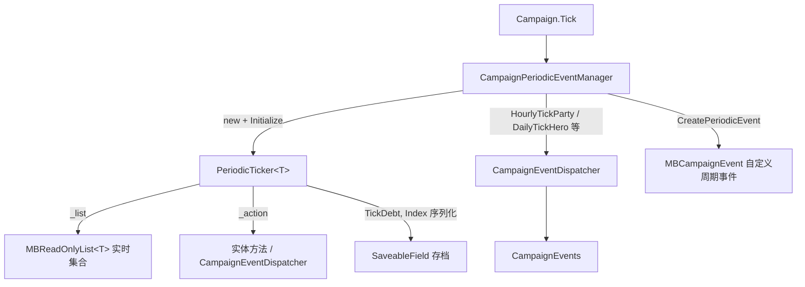

# PeriodicTicker

**命名空间：** `TaleWorlds.CampaignSystem`  
**模块：** `TaleWorlds.CampaignSystem`  
**类型：** `internal class CampaignPeriodicEventManager.PeriodicTicker<T>`（定义于 `CampaignPeriodicEventManager` 内部的嵌套泛型类型）  
**基类：** 无显式基类（直接继承 `System.Object`）  
**源文件：** `bin/TaleWorlds.CampaignSystem/TaleWorlds.CampaignSystem/CampaignPeriodicEventManager.cs`（嵌套在 `CampaignPeriodicEventManager` 类体内）

## 一句话职责

`PeriodicTicker<T>` 是 `CampaignPeriodicEventManager` 内部的一个泛型**轮转调度器**：它把对一整类战役对象（队伍、据点、城镇、英雄、家族）的逐实体周期 tick（每小时 / 每日 / 每四分之一日 / 部分小时 AI）摊平到游戏帧上，而不是在每个周期点一次性遍历全部对象。它持有一条实时集合游标 `Index` 与一个累积余额 `TickDebt`，按「经过时间 × 集合大小」逐步推进游标并逐个调用绑定的 `Action<T>`，从而让成千上万个实体被均匀、错峰地推进。

## 心智模型

把 `PeriodicTicker<T>` 想成**「一条在长列表上匀速爬行的指针」**，而不是一个你持有或配置的计时器：

- **它在哪一层、谁持有它**：它是 `internal` 嵌套类型，实例全部由 `CampaignPeriodicEventManager` 在其构造函数里 `new` 出来（如 `_mobilePartyHourlyTicker = new PeriodicTicker<MobileParty>()`），再由 `InitializeTickers()` 绑定到真实的 `MBReadOnlyList<T>` 与 `Action<T>`。它**完全属于引擎内部**——`TaleWorlds.CampaignSystem` 程序集之外的 mod 既不能 `new` 它，也拿不到这些私有字段的引用。你看到它，是因为它驱动了你关心的每小时 / 每日逻辑。
- **它解决什么问题**：如果每个阵营里的上千支队伍都在「整点」被同时 tick，会出现一帧内的巨量计算尖峰。轮转调度把工作打散：每帧只推进「这一帧时间该推进的那一小段」，整点附近整体上仍保证每个对象约每周期被 tick 一次，但分摊到了多个帧。
- **它真正持有/计算什么**：`PeriodicTickSome(double timeUnitsElapsed)` 是唯一的推进入口。它把 `timeUnitsElapsed * _list.Count` 累加到 `TickDebt`，然后只要 `TickDebt > 1` 就 `Index++`（到末尾回绕到 0）并对 `_list[Index]` 调用 `_action`，同时 `TickDebt -= 1`。也就是说，`TickDebt` 表示「还欠多少个实体的 tick 没做」，`Index` 表示「下一个该轮到列表里的第几个」。若 `doParallel` 为真，本帧要 tick 的实体先收集进 `_currentFrameToTickListFlattened`，再用 `TWParallel.For` 并行跑（注：v1.4.5 中所有 ticker 都以 `doParallel: false` 注册，故实际为串行）。
- **它与存档的关系**：`TickDebt` 与 `Index` 都标了 `[SaveableProperty(1)]` / `[SaveableProperty(2)]`，会随 `CampaignPeriodicEventManager` 一起序列化。这意味着轮转游标的位置会被**持久化**——读档后从离开时的位置继续，而不是从头把每个实体再 tick 一遍。
- **它何时读、何时绝不要直接改**：它的状态由 `Campaign.Tick` 经 `CampaignPeriodicEventManager` 的 `OnTick` / `MobilePartyHourlyTick` / `TickPeriodicEvents` / `TickPartialHourlyAi` 驱动，每帧调用 `PeriodicTickSome`。**不要**通过反射去读写 `TickDebt` / `Index` / `_list` / `_action`——这些字段一旦与真实集合或游标错位，就会让某些实体被跳过、被重复 tick，或与存档回放不一致。要介入战役周期，请走 [CampaignEvents](../../campaign-ext/CampaignEvents) 的对应周期事件，或用 `CampaignPeriodicEventManager.CreatePeriodicEvent` 登记自定义 `MBCampaignEvent`（见下）。

## 何时用 / 何时不要用

- **用（作为读者/理解者）**：当你想搞清楚「为什么某支队伍不是整点被 tick」「为什么每日逻辑会被摊到多帧」「为什么读档后周期逻辑不会从头重跑」时，理解 `PeriodicTicker<T>` 的轮转语义就够了。
- **用（作为 mod 开发者，正确的介入路径）**：订阅 [CampaignEvents](../CampaignEvents) 上对应的周期事件（如 `HourlyTickPartyEvent`、`DailyTickHeroEvent`、`DailyTickEvent`、`TickPartialHourlyAiEvent`）来观察/响应每个实体的周期 tick；或调用 `CampaignPeriodicEventManager.CreatePeriodicEvent(triggerPeriod, initialWait)` 把你的低频任务挂进战役周期队列。
- **不要用**：不要试图 `new PeriodicTicker<T>()` 或拿到 `CampaignPeriodicEventManager` 的私有 ticker 字段——它是 `internal` 且强依赖管理器的生命周期与序列化注册，脱离上下文构造出来的实例不会被 tick，也不会进存档。
- **不要用**：不要假设「到整点时所有队伍一定都 tick 过了」。轮转是错峰的，单个实体的 tick 时机取决于 `Index` 与 `TickDebt` 的相对进度；观察单个实体请用它在 `CampaignEvents` 上的逐实体事件，而不是全局「都 tick 完」的假设。
- **不要用**：不要在周期 tick 的回调里销毁/大规模改写被 tick 的集合（如销毁队伍、清空据点列表），否则 `_list` 的 `Count` 在 `PeriodicTickSome` 迭代中途变化，会让游标跳过或重处理实体。结构性变更应走对应的 `*Action`。

## 依赖图



### 上游 / 持有者

- [CampaignPeriodicEventManager](../CampaignPeriodicEventManager) 构造并持有全部 `PeriodicTicker<T>` 实例（约 20 个，按实体种类与周期区分），并在 `InitializeTickers()` 中完成绑定；它本身由 [Campaign](../Campaign) 持有（字段 `_campaignPeriodicEventManager`）。
- [Campaign](../Campaign) 在 `Tick` 中依次调用管理器的 `OnTick` / `MobilePartyHourlyTick` / `TickPeriodicEvents` / `TickPartialHourlyAi`，把帧时间增量喂给各 ticker。
- [MBReadOnlyList](../../core-extra/MBReadOnlyList) 是 `_list` 的真实类型：ticker 直接持有 `MobileParty.All`、`Settlement.All`（已洗牌）、`Town.AllTowns`、`Hero.AllAliveHeroes`、`Clan.All` 等**实时集合**的引用，而非快照。

### 下游 / 变更与驱动入口

- [CampaignEventDispatcher](../CampaignEventDispatcher) 是多数 ticker 的 `_action` 目标：例如小时队伍 ticker 调 `HourlyTickParty(x)`、每日英雄 ticker 调 `DailyTickHero(x)`，再由它广播到 [CampaignEvents](../CampaignEvents) 的逐实体事件（[MobileParty](../MobileParty) / [Hero](../Hero) / [Settlement](../Settlement) / [Clan](../Clan) / [Town](../Town) 据此被推进）。
- [CampaignEvents](../CampaignEvents) 的 `HourlyTickPartyEvent` / `DailyTickHeroEvent` / `DailyTickEvent` / `TickPartialHourlyAiEvent` 是 mod 观察周期逻辑的安全入口。
- [MBCampaignEvent](../MBCampaignEvent) 由 `CreatePeriodicEvent` 创建，是 mod 自定义低频周期任务的官方路径（与 `PeriodicTicker<T>` 是两套并行的机制）。
- [SaveableFieldAttribute](../../save-system/SaveableFieldAttribute) 的编号（`SaveableProperty(1)/(2)`）决定了 `TickDebt` / `Index` 在存档里的字段 ID，是版本迁移与读档重建正确性的关键。

## 风险边界

- **序列化字段 ID 错配 / ticker 为空**：`TickDebt`、`Index` 是 `SaveableProperty(1)/(2)`。若用不同版本或第三方工具读写存档，使某个 ticker 字段 ID 错位、或某 ticker 为 `null` 且 `OnLoad` 的版本迁移分支未覆盖它，游标会被重置——读档后可能从列表头把所有实体再 tick 一遍，造成一次性的「整点/每日逻辑爆发」（经济数值跳变、AI 重评估、甚至对已销毁实体的空引用）。`OnLoad` 已对 v1.3.0 之前的部分 ticker 与巡逻 ticker 做了补建，但自定义/外部存档管线不能忽略这些 ID。
- **tick 中途改写被绑定的集合**：`PeriodicTickSome` 用 `_list.Count` 实时计算回绕与推进。如果在 `_action` 里销毁队伍、移除据点或清空集合，使 `Count` 在迭代中途变化，`Index` 可能跳过或重处理实体，并可能让 `_action` 作用到一个已失效的对象上。结构性变更必须走 `*Action`，且最好在周期事件之外进行。
- **轮转不提供「全局同步完成」保证**：单个实体约每周期被 tick 一次，但时机取决于游标位置与 `TickDebt`，并不与整点严格对齐。依赖「到某时刻所有队伍都已 HourlyTick」的代码会出错；正确做法是用 `CampaignEvents` 的逐实体事件，在目标实体被处理时即时响应。
- **长暂停 / 大 dt 后的余额堆积**：若游戏在很长真实时间后被恢复、或快进产生很大的单帧 `dt`，`TickDebt` 会累积得很大，`while (TickDebt > 1)` 会在单帧内连续处理成千上万个实体，造成明显的卡顿甚至长时挂起。这是轮转采样的固有代价，mod 不应再往周期回调里塞重活。
- **并行路径的线程安全**：虽然 v1.4.5 实际以 `doParallel: false` 注册（串行执行 `_action`），但类型本身保留了 `TWParallel.For` 的分批路径。若未来某 ticker 启用并行，其 `_action`（以及经 [CampaignEventDispatcher](../CampaignEventDispatcher) 广播的整套监听）都必须是线程安全的；当前版本不必，但改动此处需谨慎。
- **内部/私有，不可反射滥用**：`PeriodicTicker<T>` 是 `internal` 嵌套类型，字段均为 `private`。通过反射读写 `TickDebt` / `Index` / `_list` / `_action` 会破坏轮转一致性、存档回放与版本迁移，且无法保证这些字段在后续补丁中保持同名同布局。要介入周期逻辑，请用 [CampaignEvents](../CampaignEvents) 或 `CreatePeriodicEvent`。

## 成员说明（按主题分组）

> 以下成员均来自 `CampaignPeriodicEventManager.cs` 内 `PeriodicTicker<T>` 的真实定义。它是引擎内部类型，字段为 `private`，外部只能观察其行为，不能安全直接改动。

### 序列化状态（驱动轮转、随存档持久化）

| 成员 | 用途、副作用与调用时机 |
| --- | --- |
| `TickDebt`（[SaveableProperty(1)]，类型 `double`） | 「还欠多少个实体没 tick」的累积余额。每次 `PeriodicTickSome` 时加上 `timeUnitsElapsed * 列表大小`；每处理一个实体就减 1；列表为空时清零。它决定单帧要推进多少实体，**随存档序列化**，保证读档后从断点续推而非重头。 |
| `Index`（[SaveableProperty(2)]，类型 `int`） | 当前轮转游标，指向 `_list` 中下一个要 tick 的位置；构造时置 `-1`（表示未开始），处理时 `Index++` 并在到达 `Count` 时回绕到 0。**随存档序列化**，是错峰推进的状态核心。 |

### 运行期绑定（由 `InitializeTickers` 一次性设置）

| 成员 | 用途、副作用与调用时机 |
| --- | --- |
| `_list`（`MBReadOnlyList<T>`） | 被 tick 的**实时集合**引用（如 `MobileParty.All`、`Settlement.All`、`Town.AllTowns`、`Hero.AllAliveHeroes`、`Clan.All`），不是快照；集合在 tick 中途变化会影响游标（见风险）。 |
| `_action`（`Action<T>`） | 每个被轮到的实体要执行的委托：要么是实体自身方法（如 `x.HourlyTick()` / `x.DailyTick()`），要么是 `CampaignEventDispatcher.Instance.HourlyTickParty(x)` 等，从而广播周期事件。 |
| `_doParallel`（`bool`） | 是否把本帧要 tick 的实体先收集进分批缓冲、再用 `TWParallel.For` 并行执行。v1.4.5 中所有 ticker 注册时均为 `false`（串行）。 |
| `_currentFrameToTickListFlattened`（`List<T>`） | 并行模式下的本帧待处理缓冲；串行模式下不会被填充。每帧末尾 `Clear()`。 |

### 生命周期与推进

| 成员 | 用途、副作用与调用时机 |
| --- | --- |
| `PeriodicTicker()`（`internal` 构造函数） | 置 `TickDebt = 0.0`、`Index = -1`。只由 `CampaignPeriodicEventManager` 的构造函数调用，外部不可达。 |
| `Initialize(MBReadOnlyList<T> list, Action<T> action, bool doParallel)`（`internal`） | 绑定 `_list` / `_action` / `_doParallel`，在管理器 `InitializeTickers()` 中对每个 ticker 调一次；调用后 ticker 才具备推进能力。 |
| `PeriodicTickSome(double timeUnitsElapsed)`（`internal`，核心入口） | 唯一推进方法：累加 `timeUnitsElapsed * _list.Count` 到 `TickDebt`；循环 `while (TickDebt > 1)` 推进 `Index`（回绕）、对每个实体执行 `_action`（或入并行缓冲）、`TickDebt -= 1`；列表为空则清零并直接返回；并行模式最后用 `TWParallel.For` 跑完缓冲并清空。由管理器的各 `Tick*` 方法每帧喂入帧时间增量。 |
| `ToString()`（`public override`） | 调试字符串，形如 `PeriodicTicker  @<当前实体>   (Index / Count)`，用于日志与断点，无副作用。 |
| `AutoGeneratedInstanceCollectObjects(List<object>)`（`protected virtual`） | 序列化收集钩子（对 `T` 为空实现）；真正的 ticker 收集由 `CampaignPeriodicEventManager.AutoGeneratedInstanceCollectObjects` 完成。 |

### 注册模式（引擎内部如何把 ticker 接到实体与事件上）

下面的片段来自 `InitializeTickers()`，说明一个 ticker 是怎么被「绑集合 + 绑动作」的——注意这是**引擎代码**，mod 不应照搬，而是理解它之后走 `CampaignEvents` / `CreatePeriodicEvent`：

```csharp
// 引擎内部：把 MobileParty.All 接到 HourlyTick，串行推进
_mobilePartyHourlyTicker.Initialize(MobileParty.All, delegate(MobileParty x)
{
    x.HourlyTick();
}, doParallel: false);

// 把洗牌后的 Settlement 列表接到 HourlyTickSettlement 事件
_hourlyTickSettlementTicker.Initialize(list, delegate(Settlement x)
{
    CampaignEventDispatcher.Instance.HourlyTickSettlement(x);
}, doParallel: false);

// 每日英雄 tick：每个存活英雄约每天被 tick 一次，错峰进行
_dailyTickHeroTicker.Initialize(Hero.AllAliveHeroes, delegate(Hero x)
{
    CampaignEventDispatcher.Instance.DailyTickHero(x);
}, doParallel: false);
```

## 真实示例（mod 的正确介入方式）

### 示例 1：订阅每日英雄 tick，响应每个英雄的日更逻辑

不要去碰 `PeriodicTicker`——直接挂 `CampaignEvents.DailyTickHeroEvent`，它正是在 `PeriodicTicker<Hero>` 轮转到该英雄时被广播的：

```csharp
using TaleWorlds.CampaignSystem;
using TaleWorlds.CampaignSystem.Events;

// 在你的 CampaignBehaviorBase 中注册监听（this 为 behavior 实例）
CampaignEvents.DailyTickHeroEvent.AddNonSerializedListener(this, OnDailyHeroTick);

private void OnDailyHeroTick(Hero hero)
{
    // hero 此时已被战役周期逻辑推进过一天；在这里读取/响应其状态
    if (hero.IsAlive && hero.PartyBelongedTo != null)
    {
        // 例如：基于英雄当前所在队伍做低频处理
        MobileParty party = hero.PartyBelongedTo;
    }
}
```

`DailyTickHeroEvent` / `HourlyTickPartyEvent` / `DailyTickEvent` / `TickPartialHourlyAiEvent` 都与源文件中 ticker 的 `_action` 一一对应，是安全、逐实体的观察点。

### 示例 2：登记自定义战役周期事件（替代自己造计时器）

需要「每 N 战役时间触发一次」的低频任务时，用 `CampaignPeriodicEventManager.CreatePeriodicEvent`，它把你的 `MBCampaignEvent` 加入 `Campaign.Current.CustomPeriodicCampaignEvents`，由管理器在 `SignalPeriodicEvents` 中统一推进——这正是 `Army.cs` / `Campaign.cs` 内部的用法：

```csharp
using TaleWorlds.CampaignSystem;
using TaleWorlds.Core;

// 每 6 小时触发一次，初始等待 1 小时
MBCampaignEvent myEvent = CampaignPeriodicEventManager.CreatePeriodicEvent(
    CampaignTime.Hours(6f),
    CampaignTime.Hours(1f));

myEvent.AddHandler(OnMyPeriodicTick);

private void OnMyPeriodicTick(MBCampaignEvent ev)
{
    // 你的低频逻辑；返回后由战役周期队列继续管理下次触发
}
```

这与 `PeriodicTicker<T>` 是两套并行的机制：`PeriodicTicker<T>` 负责按实体种类轮转推进引擎内置的每小时/每日逻辑；`CreatePeriodicEvent` 负责让你自己的低频任务搭上战役时间的顺风车。两者都不需要、也不应该由 mod 手动管理游标或 `TickDebt`。

## 版本注记

本页以 v1.4.5 `TaleWorlds.CampaignSystem/CampaignPeriodicEventManager.cs` 中 `PeriodicTicker<T>` 的真实定义为准，并交叉核对 `Campaign.cs`（`Tick` 驱动链）、`CampaignEventDispatcher.cs`（各 `HourlyTick*` / `DailyTick*` 广播）与 `Army.cs`（自定义周期事件用法）。跨版本使用时，重新核对：各 ticker 的 `SaveableProperty` 编号与 `OnLoad` 版本迁移分支（影响读档游标正确性）、`_doParallel` 的实际取值（决定 tick 是否并行）、以及 `CreatePeriodicEvent` 的参数语义。

## 导航

- ↑ 父级：[Campaign API 索引](../)
- ↔ 容器 / 驱动：[CampaignPeriodicEventManager](../CampaignPeriodicEventManager)（持有并驱动全部 ticker）
- ↔ 驱动链：[Campaign](../Campaign)（每帧 `Tick` → 管理器）· [CampaignEventDispatcher](../CampaignEventDispatcher)（ticker 的 `_action` 目标）· [CampaignEvents](../CampaignEvents)（逐实体周期事件，mod 介入点）
- ↔ 被轮转的实体类型：[MobileParty](../MobileParty) · [Settlement](../Settlement) · [Hero](../Hero) · [Clan](../Clan) · [Town](../Town)
- 集合与事件：[MBReadOnlyList](../../core-extra/MBReadOnlyList)（ticker 持有的实时集合类型）· [MBCampaignEvent](../MBCampaignEvent)（自定义周期事件）· [CampaignTime](../CampaignTime)（周期时长单位）
- 存档：[SaveableFieldAttribute](../../save-system/SaveableFieldAttribute)（`TickDebt` / `Index` 的序列化字段 ID）
