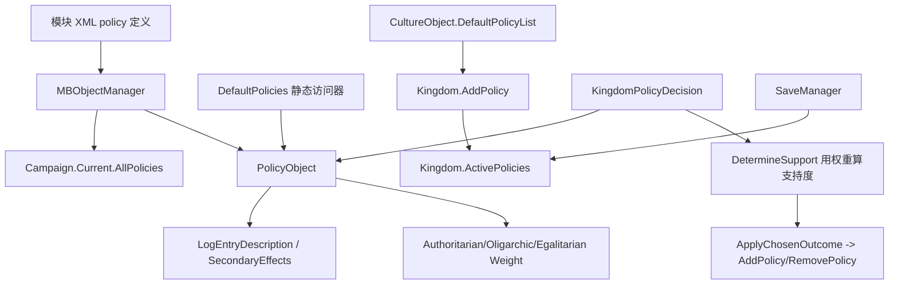

# PolicyObject

**命名空间：** `TaleWorlds.CampaignSystem`  
**模块：** `TaleWorlds.CampaignSystem`  
**类型：** `public sealed class PolicyObject : PropertyObject`  
**基类：** [PropertyObject](../../core-extra/PropertyObject) → [MBObjectBase](../../core/MBObjectBase)  
**源文件：** `bin/TaleWorlds.CampaignSystem/TaleWorlds.CampaignSystem/PolicyObject.cs`  
**对象角色：** 由 `MBObjectManager` 从模块 XML 注册的只读政策定义；`Kingdom` 持有它的引用列表 `ActivePolicies`，`KingdomPolicyDecision` 在议会投票后通过 `AddPolicy` / `RemovePolicy` 增删它。

## 概述

`PolicyObject` 是 Bannerlord 战役层里**一项王国政策的“定义卡”**：它装着政策自身的静态数据——显示名、写入编年史日志的描述（`LogEntryDescription`）、对王国运行的次级效果说明（`SecondaryEffects`），以及三个决定议会在投票时如何被不同治理倾向家族支持的权重（`AuthoritarianWeight` / `OligarchicWeight` / `EgalitarianWeight`）。它自己**不持有任何“是否生效”的状态**，生效与否完全取决于某个 `Kingdom` 是否把它放进自己的 `ActivePolicies` 列表；真正把政策「落地」的是王国决策（`KingdomPolicyDecision`）的投票结果，而非这份数据对象。

## 心智模型

把 `PolicyObject` 想成**“贴在王国议会墙上的政策铭牌”**，而不是会自己执行的规则引擎：

- 它继承 `PropertyObject`（再上溯到 `MBObjectBase`），由 `MBObjectManager` 在战役初始化时从模块 XML 注册进 `Campaign.Current.AllPolicies`（`AllPolicies = MBObjectManager.Instance.GetObjectTypeList<PolicyObject>()`）。你几乎永远**不要 `new PolicyObject("id")`** 自己造一张——构造器只把 `stringId` 交给基类，不含 XML 里的名称、权重与描述；应通过 `PolicyObject.All` 或 `DefaultPolicies.XxxPolicy` 取得已注册实例。
- **数据是只读的**：`SecondaryEffects`、`LogEntryDescription`、三个权重都是 `private set`，只能由 `Initialize(...)` 在加载阶段写入一次。运行中不要尝试改它们来“改变政策效果”，改的是引用它的 `Kingdom` 列表。
- **生效发生在 Kingdom 层**：一个新王国建立时会读取 `Culture.DefaultPolicyList` 并逐个 `AddPolicy`（见 `Kingdom.cs`）；玩家或 AI 提出的新政策走 `KingdomPolicyDecision`，投票通过后在 `ApplyChosenOutcome` 里调用 `Kingdom.AddPolicy(Policy)`（废除则 `RemovePolicy`）。
- **权重只影响投票，不直接影响数值**：三个权重在 `KingdomPolicyDecision.DetermineSupport` 里与各族的统治倾向特性（如 `DefaultTraits.Authoritarian`）相乘，决定议会支持力度；它们本身不修改经济或军事模型，模型在别处消费“政策是否激活”这一事实。
- **何时用**：读政策的描述/权重、判断某王国是否已激活某政策、遍历全部政策。`何时不用`：别把它当可变状态去改字段，别假设它自带“已生效”标记，别在 `MBObjectManager` 加载完成前去遍历 `PolicyObject.All`。

## 依赖图



| 关联对象 | 实际边界 |
| --- | --- |
| [MBObjectManager](../../campaign-ext/MBObjectManager) 与 [MBObjectBase](../../core/MBObjectBase) | `PolicyObject` 以 `StringId` 注册与查找（`PropertyObject : MBObjectBase`）。`PolicyObject.All` 即 `Campaign.Current.AllPolicies`，底层是 `MBObjectManager.Instance.GetObjectTypeList<PolicyObject>()`。加载顺序错乱或 ID 重复会让 `DefaultPolicies.XxxPolicy` 取到错误/空对象。 |
| [DefaultPolicies](../../campaign-ext/DefaultPolicies) | 游戏内置政策的静态访问器（如 `DefaultPolicies.RoyalGuard`、`DefaultPolicies.WarTax`、`DefaultPolicies.LandTax`）。mod 取内置政策应走这里，而非猜 `StringId`。 |
| [Kingdom](../../campaign/Kingdom) | `Kingdom.ActivePolicies`（`IList<PolicyObject>`）是政策“是否生效”的唯一真相来源；`AddPolicy` / `RemovePolicy` / `HasPolicy` 增删与查询。新王国建立时会按 `Culture.DefaultPolicyList` 批量 `AddPolicy`。 |
| [KingdomPolicyDecision](../../campaign-ext/KingdomPolicyDecision) | 提出/废除政策的议会决策。构造时持有 `Policy`；`DetermineSupport` 用 `Policy` 的三个权重乘族倾向算出支持度；`ApplyChosenOutcome` 在通过后调用 `Kingdom.AddPolicy(Policy)`（废除则 `RemovePolicy`）；`GetSecondaryEffects` 返回 `Policy.SecondaryEffects`。 |
| [CultureObject](../../campaign/CultureObject) | 文化的 `DefaultPolicyList`（`IEnumerable<PolicyObject>`）决定新王国创建时自动激活的默认政策集合。 |
| [Campaign](../../campaign/Campaign) | 持有 `AllPolicies`（`internal MBReadOnlyList<PolicyObject>`），由对象管理器填入；`PolicyObject.All` 直接转发它。 |
| [SaveManager](../../save-system/SaveManager) | 王国对政策的引用进入存档图；政策定义本身来自模块数据。`AutoGenerated*` 收集方法正是为序列化把 `Policy` 纳入存档对象图。 |

## 成员说明

`PolicyObject` 关键成员按责任分组：

| 成员 | 签名 | 它真正表示 / 计算什么 |
| --- | --- | --- |
| `All` | `static MBReadOnlyList<PolicyObject>` | 战役中**所有已注册政策**的只读列表，直接转发 `Campaign.Current.AllPolicies`。遍历/查找政策的入口，不要修改它。 |
| `SecondaryEffects` | `TextObject { get; private set; }` | 政策在议会界面展示的**次级效果说明文本**。`KingdomPolicyDecision.GetSecondaryEffects()` 直接返回它，用于决策卡的描述。 |
| `LogEntryDescription` | `TextObject { get; private set; }` | 政策**生效/废除后写入编年史日志的描述文本**。`KingdomPolicyDecision.GetChosenOutcomeText` 把它填进 `POLICY_DESCRIPTION` 变量，玩家在历史日志里看到的就是它。 |
| `AuthoritarianWeight` | `float { get; private set; }` | **威权倾向权重**：在 `DetermineSupport` 里与“支持威权的家族”系数相乘，权重越高，威权型家族越倾向通过该政策。 |
| `OligarchicWeight` | `float { get; private set; }` | **寡头倾向权重**：同上，作用于寡头型家族的支持度计算。 |
| `EgalitarianWeight` | `float { get; private set; }` | **平等倾向权重**：同上，作用于平等型家族的支持度计算。 |
| `Initialize(...)` | `void Initialize(TextObject name, TextObject description, TextObject logEntryDescription, TextObject secondaryEffects, float authoritarianWeight, float oligarchyWeight, float egalitarianWeight)` | 由对象管理器在加载阶段调用，**一次性写入**名称、描述、日志描述、次级效果与三个权重，随后触发 `AfterInitialized()`。这是填充数据的唯一正规入口，不是给 mod 在运行中重复调用的。 |
| `ToString()` | `override string` | 返回政策的显示名（`base.Name.ToString()`），用于日志、UI 与调试输出。 |
| `PolicyObject(string stringId)` | 构造器 | 仅把 `stringId` 交给基类 `PropertyObject`/`MBObjectBase`；不含任何 XML 数据。引擎内部注册用，mod 不应自行 `new`。 |

`AutoGeneratedStaticCollectObjectsPolicyObject` / `AutoGeneratedInstanceCollectObjects` 是序列化收集方法（把对象纳入存档图），不是给 mod 调用的 API，故不在示例中使用。

## 何时使用 / 何时不要使用

### 适合使用

- 通过 `PolicyObject.All` 遍历战役中全部政策，或经 `DefaultPolicies.RoyalGuard` 等静态访问器取得内置政策实例。
- 判断某王国是否已激活某政策：`kingdom.ActivePolicies.Contains(DefaultPolicies.WarTax)` 或 `kingdom.HasPolicy(...)`。
- 读取政策的 `LogEntryDescription` / `SecondaryEffects` 做自定义 UI、日志或平衡性调试。
- 提出新政策：构造 `KingdomPolicyDecision(proposerClan, policy)` 并经 `Kingdom.AddDecision` 提交，让议会按权重投票决定落地。

### 不要这样使用

- 不要 `new PolicyObject("my_policy")` 自己造定义——它不会有名称和权重，也不会被 `MBObjectManager` 注册，更不会出现在 `All` 中。
- 不要直接改 `AuthoritarianWeight` / `LogEntryDescription` 等 `private set` 字段来“改变政策效果”：它们是加载期一次性写入的只读数据；想改生效状态应增删 `Kingdom.ActivePolicies`。
- 不要把 `PolicyObject` 当成“已生效”标志：同一份政策定义可以被多个王国各自持有或都不持有，生效状态只在 `Kingdom` 一侧。
- 不要在 `MBObjectManager` 完成政策 XML 加载前遍历 `PolicyObject.All`，否则列表可能为空或不全。
- 不要假设三个权重会自动影响经济/军事模型：它们只参与议会支持度计算；真正消费“政策是否激活”的是各 `Campaign` 模型，逻辑在别处。

## 真实示例

### 示例 1：直接检查并加入一项政策（幂等）

`Kingdom.AddPolicy` 内部已用 `_activePolicies.Contains(policy)` 去重，下面的判空只是避免对无王国状态调用：

```csharp
using TaleWorlds.CampaignSystem;

// 直接把一项已注册政策加入玩家所在王国（已存在则不会重复加入）
Kingdom kingdom = Clan.PlayerClan.Kingdom;
if (kingdom != null && !kingdom.ActivePolicies.Contains(DefaultPolicies.RoyalGuard))
{
    kingdom.AddPolicy(DefaultPolicies.RoyalGuard);
}
```

### 示例 2：遍历全部政策并打印三种治理倾向权重

`PolicyObject.All` 即 `Campaign.Current.AllPolicies`，逐项读取权重用于平衡性分析：

```csharp
using TaleWorlds.CampaignSystem;
using TaleWorlds.Core;
using TaleWorlds.Localization;

// 遍历战役中所有已注册政策，按三种治理倾向权重做筛选与展示
foreach (PolicyObject policy in PolicyObject.All)
{
    float authoritarianPull = policy.AuthoritarianWeight;
    float oligarchicPull = policy.OligarchicWeight;
    float egalitarianPull = policy.EgalitarianWeight;
    InformationManager.DisplayMessage(new TextObject(
        $"{policy.Name}: A={authoritarianPull} O={oligarchicPull} E={egalitarianPull}"));
}
```

### 示例 3：通过王国决策提出一项政策

`KingdomPolicyDecision` 构造时持有 `Policy`；议会投票通过后，`ApplyChosenOutcome` 会调用 `Kingdom.AddPolicy(Policy)`（废除投票则 `RemovePolicy`）：

```csharp
using TaleWorlds.CampaignSystem;
using TaleWorlds.CampaignSystem.Election;

// 由玩家家族提出“战争税”政策，交议会按权重投票；通过后由引擎写入 Kingdom.ActivePolicies
Kingdom kingdom = Clan.PlayerClan.Kingdom;
KingdomPolicyDecision decision = new KingdomPolicyDecision(Clan.PlayerClan, DefaultPolicies.WarTax);
kingdom.AddDecision(decision, considerOwner: true);
```

## 加载、版本与存档风险

- **注册顺序**：`PolicyObject.All` 来自 `MBObjectManager.Instance.GetObjectTypeList<PolicyObject>()`，必须在模块政策 XML 加载完成后才完整。过早遍历会得到空/不全列表。
- **只读数据**：三个权重与两个 `TextObject` 都是 `private set`，只在 `Initialize` 中写入。运行中改它们不会影响议会计算，也破坏不了“数据定义”的契约；改生效状态应走 `Kingdom.AddPolicy` / `RemovePolicy`。
- **权重只影响投票**：`DetermineSupport` 把 `Policy.AuthoritarianWeight * 威权系数 + Policy.OligarchicWeight * 寡头系数 + Policy.EgalitarianWeight * 平等系数` 求和，再乘“是否通过”的基准分（通过 +60、反对 -100）。它不直接改经济/军事数值。
- **生效状态在 Kingdom 侧**：政策是否激活看 `Kingdom.ActivePolicies`，不在 `PolicyObject` 上。跨王国、跨读档都应以 `kingdom.ActivePolicies.Contains(policy)` / `kingdom.HasPolicy(policy)` 为准，不要缓存旧引用。
- **ID 是契约**：`DefaultPolicies.XxxPolicy` 与 `Culture.DefaultPolicyList` 都依赖稳定的 `StringId`。新增或重命名政策 XML 的 `id` 会影响已存档王国对政策的引用映射。
- **版本差异**：1.4.5 的内置政策集合（`DefaultPolicies`）与权重数值以本仓库该版本源码为准；不要把其他版本的权重或政策清单当作 1.4.5 的契约。

## 参见

- ↑ 父级：[战役 API 索引](../)
- ↔ 同级：
  - [Kingdom](../Kingdom) — 持有 `ActivePolicies`，`AddPolicy` / `RemovePolicy` / `HasPolicy` 增删与查询政策
  - [CultureObject](../CultureObject) — 通过 `DefaultPolicyList` 提供新王国自动激活的默认政策
  - [Campaign](../Campaign) — `AllPolicies` 即 `PolicyObject.All` 的数据源
- 相关：
  - [DefaultPolicies](../../campaign-ext/DefaultPolicies) — 内置政策的静态访问器（`RoyalGuard` / `WarTax` / `LandTax` …）
  - [KingdomPolicyDecision](../../campaign-ext/KingdomPolicyDecision) — 提出/废除政策的议会决策，消费 `PolicyObject` 的权重与描述
  - [MBObjectManager](../../campaign-ext/MBObjectManager) — 从 XML 注册政策并填充 `AllPolicies`
  - [PropertyObject](../../core-extra/PropertyObject) / [MBObjectBase](../../core/MBObjectBase) — `PolicyObject` 的基类，提供 `StringId` 身份
  - [SaveManager](../../save-system/SaveManager) — 王国对政策的引用进入存档图
